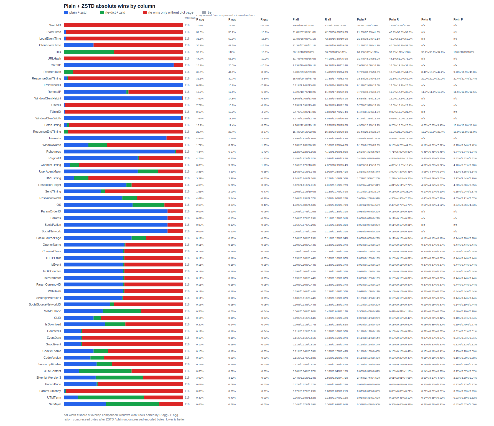
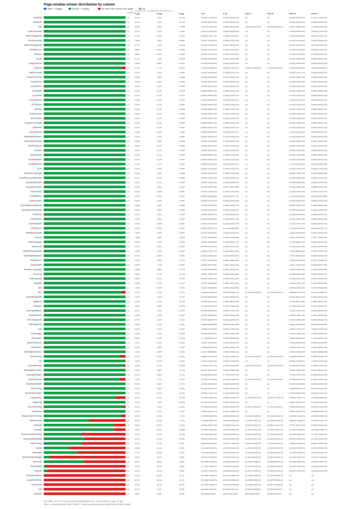
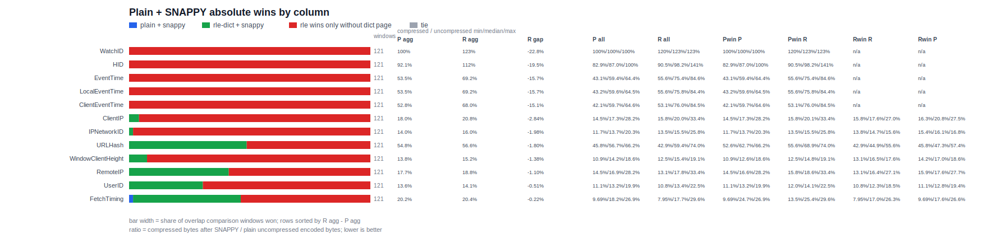

# Column Top 5 Encoding Rankings [#](#column-top-5-encoding-rankings)

- Experiment: `page-256kib-rgsize-10mib-file-10mib-dictpage-256kib/1000000_rows`
- Source data: [2026-07-05_rows-1000000_encoding-matrix_column-results.tsv](../tsvs/2026-07-05_rows-1000000_encoding-matrix_column-results.tsv)
- Rows: `1,000,000`
- Ranking metric: per-column `compressed_bytes`, after Parquet page encoding and Snappy/ZSTD compression.
- Each numbered item starts with the achieved compressed size for that encoding/compression choice.
- Duplicate matrix rows with the same effective column encoding are collapsed to the best observed row before ranking.
- Encodings in this matrix: `plain`, `rle-dict`, `delta-binary-packed`, `delta-byte-array`, `delta-length-byte-array`.
- Column shape stats: [column_shape_stats.json](column_shape_stats/column_shape_stats.json)

## Winner Distribution [#](#winner-distribution)

Counts are based on each column's first `Compressed overall` ranking below: one winner per column, grouped by compression algorithm and configured column encoding.

| Compression | Encoding | Column wins |
| --- | --- | ---: |
| `zstd-3` | `plain` | 54 |
| `zstd-3` | `rle-dict` | 46 |
| `snappy` | `rle-dict` | 2 |
| `zstd-3` | `delta-binary-packed` | 2 |
| `snappy` | `plain` | 1 |

## Encoding Rank Distribution [#](#encoding-rank-distribution)

For each column and compression codec, duplicate matrix rows with the same effective column encoding are collapsed to the smallest compressed byte count. The remaining encodings are sorted by compressed bytes; counts below show how often each compression + encoding landed at rank 1, rank 2, and so on. Encodings that are not valid for a column type are not counted for that column.

| Compression | Encoding | Ranked columns | Rank 1 | Rank 2 | Rank 3 | Rank 4 |
| --- | --- | ---: | ---: | ---: | ---: | ---: |
| `zstd-3` | `plain` | 105 | 55 | 41 | 9 | 0 |
| `zstd-3` | `rle-dict` | 105 | 48 | 30 | 22 | 5 |
| `zstd-3` | `delta-binary-packed` | 77 | 2 | 26 | 49 | 0 |
| `zstd-3` | `delta-byte-array` | 28 | 0 | 1 | 8 | 19 |
| `zstd-3` | `delta-length-byte-array` | 28 | 0 | 7 | 17 | 4 |
| `snappy` | `plain` | 105 | 7 | 18 | 56 | 24 |
| `snappy` | `rle-dict` | 105 | 91 | 8 | 6 | 0 |
| `snappy` | `delta-binary-packed` | 77 | 7 | 51 | 19 | 0 |
| `snappy` | `delta-byte-array` | 28 | 0 | 12 | 16 | 0 |
| `snappy` | `delta-length-byte-array` | 28 | 0 | 16 | 8 | 4 |

## ZSTD Plain Winner Second-Place Distribution [#](#zstd-plain-winner-second-place-distribution)

For columns where `zstd + plain` is rank 1 in the ZSTD-only compressed-byte ranking, this counts which encoding landed at rank 2 after collapsing duplicate matrix rows to each encoding's smallest compressed byte count.

- Columns where `zstd + plain` ranked first: `55`
- Missing second-place rows: `0`

| Second-place encoding | Columns |
| --- | ---: |
| `zstd + rle-dict` | 29 |
| `zstd + delta-binary-packed` | 20 |
| `zstd + delta-length-byte-array` | 6 |

## ZSTD Plain vs RLE Dict Improvement Distribution [#](#zstd-plain-vs-rle-dict-improvement-distribution)

For each column, this compares the best observed `zstd + plain` compressed byte count with the best observed `zstd + rle-dict` compressed byte count. Improvement is `(larger compressed bytes - smaller compressed bytes) / larger compressed bytes * 100`.

- Compared columns: `105`
- `zstd + plain` smaller: `56`; `zstd + rle-dict` smaller: `49`; ties: `0`; missing comparisons: `0`

| Improvement bucket | `zstd + plain` better | `zstd + rle-dict` better |
| --- | ---: | ---: |
| `0-10%` | 6 | 13 |
| `10-20%` | 19 | 15 |
| `20-30%` | 15 | 10 |
| `30-40%` | 7 | 5 |
| `40-50%` | 8 | 4 |
| `50-60%` | 1 | 2 |

### ZSTD Overall Absolute Difference [#](#zstd-overall-absolute-difference)

These are overall column-level comparisons, not page-window comparisons. `zstd + plain` is the all-plain run for every type group, and `zstd + rle-dict` is the all-rle-dict run for every type group. The ratio denominator is the same for both sides: the all-plain/no-compression Parquet encoded byte count for that column. Absolute difference is `abs((zstd + plain compressed bytes / plain uncompressed encoded bytes) - (zstd + rle-dict compressed bytes / plain uncompressed encoded bytes))`.

The added ratio column is `zstd + rle-dict encoded+compressed bytes / zstd + plain encoded+compressed bytes` for the same column.

- Compared columns: `105`; `zstd + rle-dict` better: `47`; `zstd + plain` better: `58`; ties: `0`; missing comparisons: `0`

#### ZSTD RLE Dict Better By Absolute Difference [#](#zstd-rle-dict-better-by-absolute-difference)

| Column | Type | Row-group cardinality/rows min | Row-group cardinality/rows median | Row-group cardinality/rows max | Plain uncompressed encoded bytes | zstd + plain compressed bytes | zstd + rle-dict compressed bytes | zstd + plain ratio | zstd + rle-dict ratio | Absolute difference | zstd + rle-dict encoded+compressed / zstd + plain encoded+compressed |
| --- | --- | ---: | ---: | ---: | ---: | ---: | ---: | ---: | ---: | ---: | ---: |
| `Title` | `string` | 0.831473% | 19.316254% | 21.464368% | 142,885,454 B (136.27 MiB) | 13,939,135 B (13.29 MiB) | 7,975,230 B (7.61 MiB) | `0.097555` | `0.055816` | `0.041739` | `0.572147` |
| `Referer` | `string` | 2.814815% | 22.063723% | 44.766506% | 83,647,157 B (79.77 MiB) | 14,218,039 B (13.56 MiB) | 11,752,116 B (11.21 MiB) | `0.169976` | `0.140496` | `0.029480` | `0.826564` |
| `URL` | `string` | 23.982242% | 26.314448% | 50.666246% | 92,653,185 B (88.36 MiB) | 15,306,955 B (14.60 MiB) | 12,707,286 B (12.12 MiB) | `0.165207` | `0.137149` | `0.028058` | `0.830164` |
| `TraficSourceID` | `int16` | 0.042119% | 0.057724% | 0.075148% | 4,005,051 B (3.82 MiB) | 288,326 B (281.57 KiB) | 178,371 B (174.19 KiB) | `0.071991` | `0.044537` | `0.027454` | `0.618643` |
| `IsRefresh` | `int16` | 0.014083% | 0.016753% | 0.021471% | 4,005,051 B (3.82 MiB) | 178,941 B (174.75 KiB) | 84,103 B (82.13 KiB) | `0.044679` | `0.020999` | `0.023680` | `0.470004` |
| `IsArtifical` | `int16` | 0.014083% | 0.016753% | 0.021471% | 4,005,048 B (3.82 MiB) | 164,989 B (161.12 KiB) | 82,436 B (80.50 KiB) | `0.041195` | `0.020583` | `0.020612` | `0.499645` |
| `RefererRegionID` | `int32` | 0.053558% | 0.142888% | 0.238871% | 4,005,050 B (3.82 MiB) | 231,356 B (225.93 KiB) | 165,218 B (161.35 KiB) | `0.057766` | `0.041252` | `0.016514` | `0.714129` |
| `RefererCategoryID` | `int16` | 0.092386% | 0.296183% | 0.569493% | 4,005,053 B (3.82 MiB) | 275,135 B (268.69 KiB) | 216,084 B (211.02 KiB) | `0.068697` | `0.053953` | `0.014744` | `0.785374` |
| `OriginalURL` | `string` | 0.802772% | 1.916420% | 48.101365% | 31,865,983 B (30.39 MiB) | 5,323,588 B (5.08 MiB) | 4,887,325 B (4.66 MiB) | `0.167062` | `0.153371` | `0.013691` | `0.918051` |
| `FlashMinor2` | `string` | 0.132353% | 0.193880% | 0.248458% | 7,359,204 B (7.02 MiB) | 246,539 B (240.76 KiB) | 146,647 B (143.21 KiB) | `0.033501` | `0.019927` | `0.013574` | `0.594823` |
| `SearchPhrase` | `string` | 0.054581% | 3.558540% | 4.691632% | 7,537,911 B (7.19 MiB) | 719,930 B (703.06 KiB) | 636,259 B (621.35 KiB) | `0.095508` | `0.084408` | `0.011100` | `0.883779` |
| `Income` | `int16` | 0.025130% | 0.033350% | 0.042941% | 4,005,054 B (3.82 MiB) | 122,679 B (119.80 KiB) | 89,413 B (87.32 KiB) | `0.030631` | `0.022325` | `0.008306` | `0.728837` |
| `DontCountHits` | `int16` | 0.014083% | 0.016753% | 0.021471% | 4,005,049 B (3.82 MiB) | 82,558 B (80.62 KiB) | 50,501 B (49.32 KiB) | `0.020613` | `0.012609` | `0.008004` | `0.611703` |
| `BrowserCountry` | `string` | 0.025130% | 0.042212% | 0.079994% | 7,329,878 B (6.99 MiB) | 122,222 B (119.36 KiB) | 69,669 B (68.04 KiB) | `0.016674` | `0.009505` | `0.007170` | `0.570020` |
| `UserAgentMinor` | `string` | 0.136250% | 0.175953% | 0.237147% | 7,772,251 B (7.41 MiB) | 137,050 B (133.84 KiB) | 83,983 B (82.01 KiB) | `0.017633` | `0.010805` | `0.006828` | `0.612791` |
| `Sex` | `int16` | 0.021124% | 0.025130% | 0.032206% | 4,005,052 B (3.82 MiB) | 107,976 B (105.45 KiB) | 80,827 B (78.93 KiB) | `0.026960` | `0.020181` | `0.006779` | `0.748564` |
| `SearchEngineID` | `int16` | 0.023392% | 0.087051% | 0.129177% | 4,005,050 B (3.82 MiB) | 101,613 B (99.23 KiB) | 76,937 B (75.13 KiB) | `0.025371` | `0.019210` | `0.006161` | `0.757157` |
| `Age` | `int16` | 0.042248% | 0.050260% | 0.064412% | 4,005,052 B (3.82 MiB) | 142,624 B (139.28 KiB) | 118,882 B (116.10 KiB) | `0.035611` | `0.029683` | `0.005928` | `0.833534` |
| `IsLink` | `int16` | 0.008335% | 0.008558% | 0.021471% | 4,005,053 B (3.82 MiB) | 56,781 B (55.45 KiB) | 37,020 B (36.15 KiB) | `0.014177` | `0.009243` | `0.004934` | `0.651979` |
| `ResolutionDepth` | `int16` | 0.028165% | 0.033512% | 0.042941% | 4,005,051 B (3.82 MiB) | 82,090 B (80.17 KiB) | 62,736 B (61.27 KiB) | `0.020497` | `0.015664` | `0.004832` | `0.764234` |
| `SilverlightVersion2` | `int16` | 0.014083% | 0.016753% | 0.021471% | 4,005,055 B (3.82 MiB) | 74,028 B (72.29 KiB) | 56,776 B (55.45 KiB) | `0.018484` | `0.014176` | `0.004308` | `0.766953` |
| `URLCategoryID` | `int16` | 0.016675% | 0.033878% | 0.560627% | 4,005,048 B (3.82 MiB) | 87,570 B (85.52 KiB) | 72,205 B (70.51 KiB) | `0.021865` | `0.018028` | `0.003836` | `0.824540` |
| `ClientTimeZone` | `int16` | 0.079222% | 0.116584% | 0.182501% | 4,005,051 B (3.82 MiB) | 99,924 B (97.58 KiB) | 85,542 B (83.54 KiB) | `0.024949` | `0.021359` | `0.003591` | `0.856071` |
| `FlashMinor` | `int16` | 0.063371% | 0.075390% | 0.096618% | 4,005,048 B (3.82 MiB) | 126,766 B (123.79 KiB) | 114,356 B (111.68 KiB) | `0.031652` | `0.028553` | `0.003099` | `0.902103` |
| `JavaEnable` | `int16` | 0.014083% | 0.016753% | 0.021471% | 4,005,050 B (3.82 MiB) | 63,644 B (62.15 KiB) | 51,484 B (50.28 KiB) | `0.015891` | `0.012855` | `0.003036` | `0.808937` |
| `UserAgent` | `int16` | 0.086430% | 0.109529% | 0.150295% | 4,005,053 B (3.82 MiB) | 135,169 B (132.00 KiB) | 125,928 B (122.98 KiB) | `0.033750` | `0.031442` | `0.002307` | `0.931634` |
| `IsNotBounce` | `int16` | 0.007154% | 0.008541% | 0.021471% | 4,005,054 B (3.82 MiB) | 25,193 B (24.60 KiB) | 17,680 B (17.27 KiB) | `0.006290` | `0.004414` | `0.001876` | `0.701782` |
| `AdvEngineID` | `int16` | 0.007797% | 0.025161% | 0.034270% | 4,005,053 B (3.82 MiB) | 30,696 B (29.98 KiB) | 23,249 B (22.70 KiB) | `0.007664` | `0.005805` | `0.001859` | `0.757395` |
| `URLRegionID` | `int32` | 0.025013% | 0.042312% | 0.250842% | 4,005,049 B (3.82 MiB) | 48,124 B (47.00 KiB) | 40,697 B (39.74 KiB) | `0.012016` | `0.010161` | `0.001854` | `0.845670` |
| `SilverlightVersion1` | `int16` | 0.028397% | 0.042709% | 0.053677% | 4,005,050 B (3.82 MiB) | 90,600 B (88.48 KiB) | 84,773 B (82.79 KiB) | `0.022621` | `0.021167` | `0.001455` | `0.935684` |
| `FromTag` | `string` | 0.008335% | 0.008558% | 0.108030% | 4,049,422 B (3.86 MiB) | 28,372 B (27.71 KiB) | 22,821 B (22.29 KiB) | `0.007006` | `0.005636` | `0.001371` | `0.804349` |
| `FlashMajor` | `int16` | 0.028397% | 0.042470% | 0.059819% | 4,005,053 B (3.82 MiB) | 53,604 B (52.35 KiB) | 49,164 B (48.01 KiB) | `0.013384` | `0.012275` | `0.001109` | `0.917170` |
| `HasGCLID` | `int16` | 0.007041% | 0.016753% | 0.017224% | 4,005,052 B (3.82 MiB) | 21,186 B (20.69 KiB) | 17,019 B (16.62 KiB) | `0.005290` | `0.004249` | `0.001040` | `0.803314` |
| `HistoryLength` | `int16` | 0.008411% | 0.033350% | 0.663009% | 4,005,054 B (3.82 MiB) | 55,137 B (53.84 KiB) | 51,071 B (49.87 KiB) | `0.013767` | `0.012752` | `0.001015` | `0.926256` |
| `IsMobile` | `int16` | 0.014083% | 0.016753% | 0.021471% | 4,005,047 B (3.82 MiB) | 28,686 B (28.01 KiB) | 24,770 B (24.19 KiB) | `0.007162` | `0.006185` | `0.000978` | `0.863487` |
| `HitColor` | `string` | 0.014289% | 0.021186% | 0.032206% | 5,004,106 B (4.77 MiB) | 29,173 B (28.49 KiB) | 25,054 B (24.47 KiB) | `0.005830` | `0.005007` | `0.000823` | `0.858808` |
| `BrowserLanguage` | `string` | 0.025136% | 0.058509% | 0.102011% | 6,005,761 B (5.73 MiB) | 32,361 B (31.60 KiB) | 27,773 B (27.12 KiB) | `0.005388` | `0.004624` | `0.000764` | `0.858224` |
| `UTMSource` | `string` | 0.007569% | 0.049971% | 0.060282% | 4,054,721 B (3.87 MiB) | 21,033 B (20.54 KiB) | 18,473 B (18.04 KiB) | `0.005187` | `0.004556` | `0.000631` | `0.878287` |
| `UTMMedium` | `string` | 0.007569% | 0.025206% | 0.053677% | 4,021,208 B (3.83 MiB) | 16,986 B (16.59 KiB) | 14,496 B (14.16 KiB) | `0.004224` | `0.003605` | `0.000619` | `0.853409` |
| `UTMCampaign` | `string` | 0.007569% | 0.076609% | 0.127443% | 4,099,800 B (3.91 MiB) | 29,858 B (29.16 KiB) | 27,397 B (26.75 KiB) | `0.007283` | `0.006683` | `0.000600` | `0.917577` |
| `MobilePhoneModel` | `string` | 0.016756% | 0.033350% | 0.044287% | 4,086,223 B (3.90 MiB) | 22,607 B (22.08 KiB) | 20,619 B (20.14 KiB) | `0.005532` | `0.005046` | `0.000487` | `0.912063` |
| `OpenstatServiceName` | `string` | 0.007569% | 0.017024% | 0.053677% | 4,064,307 B (3.88 MiB) | 19,232 B (18.78 KiB) | 17,819 B (17.40 KiB) | `0.004732` | `0.004384` | `0.000348` | `0.926529` |
| `PageCharset` | `string` | 0.007651% | 0.016919% | 0.032206% | 17,598,960 B (16.78 MiB) | 14,612 B (14.27 KiB) | 10,012 B (9.78 KiB) | `0.000830` | `0.000569` | `0.000261` | `0.685190` |
| `NetMinor` | `int16` | 0.014124% | 0.023392% | 0.025835% | 4,005,046 B (3.82 MiB) | 24,917 B (24.33 KiB) | 24,001 B (23.44 KiB) | `0.006221` | `0.005993` | `0.000229` | `0.963238` |
| `OpenstatCampaignID` | `string` | 0.007569% | 0.029089% | 0.064412% | 4,027,078 B (3.84 MiB) | 16,542 B (16.15 KiB) | 15,897 B (15.52 KiB) | `0.004108` | `0.003948` | `0.000160` | `0.961008` |
| `OpenstatAdID` | `string` | 0.007569% | 0.076052% | 0.153741% | 4,030,476 B (3.84 MiB) | 19,026 B (18.58 KiB) | 18,400 B (17.97 KiB) | `0.004721` | `0.004565` | `0.000155` | `0.967098` |
| `OpenstatSourceID` | `string` | 0.007041% | 0.025185% | 0.059585% | 4,053,388 B (3.87 MiB) | 13,322 B (13.01 KiB) | 12,930 B (12.63 KiB) | `0.003287` | `0.003190` | `0.000097` | `0.970575` |

#### ZSTD Plain Better By Absolute Difference [#](#zstd-plain-better-by-absolute-difference)

| Column | Type | Row-group cardinality/rows min | Row-group cardinality/rows median | Row-group cardinality/rows max | Plain uncompressed encoded bytes | zstd + plain compressed bytes | zstd + rle-dict compressed bytes | zstd + plain ratio | zstd + rle-dict ratio | Absolute difference | zstd + rle-dict encoded+compressed / zstd + plain encoded+compressed |
| --- | --- | ---: | ---: | ---: | ---: | ---: | ---: | ---: | ---: | ---: | ---: |
| `WatchID` | `int64` | 100.000000% | 100.000000% | 100.000000% | 8,006,312 B (7.64 MiB) | 8,005,365 B (7.63 MiB) | 9,852,495 B (9.40 MiB) | `0.999882` | `1.230591` | `0.230709` | `1.230737` |
| `EventTime` | `timestamp_millis` | 50.744627% | 52.788728% | 94.761138% | 8,006,315 B (7.64 MiB) | 2,517,896 B (2.40 MiB) | 4,021,665 B (3.84 MiB) | `0.314489` | `0.502312` | `0.187823` | `1.597232` |
| `LocalEventTime` | `timestamp_millis` | 50.499238% | 52.809367% | 94.299517% | 8,006,317 B (7.64 MiB) | 2,520,192 B (2.40 MiB) | 4,023,641 B (3.84 MiB) | `0.314775` | `0.502558` | `0.187783` | `1.596561` |
| `ClientEventTime` | `timestamp_millis` | 48.381863% | 49.378778% | 94.396135% | 8,006,314 B (7.64 MiB) | 2,475,752 B (2.36 MiB) | 3,958,950 B (3.78 MiB) | `0.309225` | `0.494478` | `0.185254` | `1.599090` |
| `HID` | `int32` | 49.311946% | 50.165633% | 94.235105% | 4,005,051 B (3.82 MiB) | 3,849,795 B (3.67 MiB) | 4,492,493 B (4.28 MiB) | `0.961235` | `1.121707` | `0.160472` | `1.166943` |
| `URLHash` | `int64` | 25.393468% | 27.962287% | 53.978447% | 8,006,310 B (7.64 MiB) | 3,580,480 B (3.41 MiB) | 4,558,127 B (4.35 MiB) | `0.447207` | `0.569317` | `0.122110` | `1.273049` |
| `ClientIP` | `int32` | 6.257885% | 7.900581% | 14.891023% | 4,005,050 B (3.82 MiB) | 408,069 B (398.50 KiB) | 813,095 B (794.04 KiB) | `0.101889` | `0.203017` | `0.101129` | `1.992543` |
| `RefererHash` | `int64` | 2.947368% | 23.157086% | 45.185185% | 8,006,316 B (7.64 MiB) | 2,842,003 B (2.71 MiB) | 3,530,099 B (3.37 MiB) | `0.354970` | `0.440914` | `0.085944` | `1.242117` |
| `ResponseStartTiming` | `int32` | 6.769335% | 9.473684% | 28.695652% | 4,005,050 B (3.82 MiB) | 1,245,891 B (1.19 MiB) | 1,587,891 B (1.51 MiB) | `0.311080` | `0.396472` | `0.085392` | `1.274502` |
| `IPNetworkID` | `int32` | 4.203951% | 5.043581% | 8.287920% | 4,005,052 B (3.82 MiB) | 323,783 B (316.19 KiB) | 623,466 B (608.85 KiB) | `0.080844` | `0.155670` | `0.074826` | `1.925567` |
| `RemoteIP` | `int32` | 5.325528% | 6.689083% | 14.837677% | 4,005,047 B (3.82 MiB) | 426,607 B (416.61 KiB) | 701,005 B (684.58 KiB) | `0.106517` | `0.175030` | `0.068513` | `1.643210` |
| `WindowClientHeight` | `int16` | 2.479532% | 3.664659% | 4.433709% | 4,005,051 B (3.82 MiB) | 319,807 B (312.31 KiB) | 591,986 B (578.11 KiB) | `0.079851` | `0.147810` | `0.067959` | `1.851073` |
| `UserID` | `int64` | 6.106485% | 7.601629% | 13.661823% | 8,006,315 B (7.64 MiB) | 618,298 B (603.81 KiB) | 1,106,815 B (1.06 MiB) | `0.077226` | `0.138243` | `0.061016` | `1.790100` |
| `FUniqID` | `int64` | 5.282194% | 6.943970% | 12.889797% | 8,006,317 B (7.64 MiB) | 694,033 B (677.77 KiB) | 1,065,272 B (1.02 MiB) | `0.086686` | `0.133054` | `0.046368` | `1.534901` |
| `WindowClientWidth` | `int16` | 2.042885% | 2.366693% | 2.763798% | 4,005,052 B (3.82 MiB) | 305,751 B (298.58 KiB) | 475,942 B (464.79 KiB) | `0.076341` | `0.118835` | `0.042494` | `1.556633` |
| `FetchTiming` | `int32` | 2.594023% | 5.612027% | 9.016978% | 4,005,053 B (3.82 MiB) | 549,819 B (536.93 KiB) | 695,763 B (679.46 KiB) | `0.137281` | `0.173721` | `0.036440` | `1.265440` |
| `ResponseEndTiming` | `int32` | 4.417671% | 5.746734% | 11.308713% | 4,005,051 B (3.82 MiB) | 937,782 B (915.80 KiB) | 1,056,836 B (1.01 MiB) | `0.234150` | `0.263876` | `0.029726` | `1.126953` |
| `Interests` | `int16` | 1.301836% | 1.715872% | 2.989706% | 4,005,050 B (3.82 MiB) | 193,520 B (188.98 KiB) | 310,229 B (302.96 KiB) | `0.048319` | `0.077459` | `0.029140` | `1.603085` |
| `WindowName` | `int32` | 0.008411% | 0.043026% | 24.100995% | 4,005,052 B (3.82 MiB) | 70,817 B (69.16 KiB) | 148,984 B (145.49 KiB) | `0.017682` | `0.037199` | `0.019517` | `2.103789` |
| `Robotness` | `int16` | 0.720400% | 0.958943% | 1.530222% | 4,005,054 B (3.82 MiB) | 173,697 B (169.63 KiB) | 243,015 B (237.32 KiB) | `0.043369` | `0.060677` | `0.017308` | `1.399074` |
| `RegionID` | `int32` | 0.933567% | 1.257915% | 2.081441% | 4,005,048 B (3.82 MiB) | 191,174 B (186.69 KiB) | 248,192 B (242.38 KiB) | `0.047733` | `0.061970` | `0.014237` | `1.298252` |
| `ConnectTiming` | `int32` | 0.980064% | 1.865233% | 4.435028% | 4,005,051 B (3.82 MiB) | 333,314 B (325.50 KiB) | 380,387 B (371.47 KiB) | `0.083223` | `0.094977` | `0.011753` | `1.141227` |
| `UserAgentMajor` | `int16` | 0.198244% | 0.233918% | 0.279120% | 4,005,050 B (3.82 MiB) | 154,189 B (150.58 KiB) | 180,166 B (175.94 KiB) | `0.038499` | `0.044985` | `0.006486` | `1.168475` |
| `DNSTiming` | `int32` | 0.569753% | 0.835963% | 2.775369% | 4,005,051 B (3.82 MiB) | 135,564 B (132.39 KiB) | 158,368 B (154.66 KiB) | `0.033848` | `0.039542` | `0.005694` | `1.168216` |
| `ResolutionHeight` | `int16` | 0.411246% | 0.557204% | 0.756175% | 4,005,050 B (3.82 MiB) | 186,024 B (181.66 KiB) | 208,351 B (203.47 KiB) | `0.046447` | `0.052022` | `0.005575` | `1.120022` |
| `SendTiming` | `int32` | 0.007154% | 0.008539% | 7.711501% | 4,005,054 B (3.82 MiB) | 61,444 B (60.00 KiB) | 80,125 B (78.25 KiB) | `0.015342` | `0.020006` | `0.004664` | `1.304033` |
| `ResolutionWidth` | `int16` | 0.410186% | 0.506543% | 0.610865% | 4,005,053 B (3.82 MiB) | 187,141 B (182.75 KiB) | 205,670 B (200.85 KiB) | `0.046726` | `0.051353` | `0.004626` | `1.099011` |
| `OS` | `int16` | 0.134782% | 0.179430% | 0.220499% | 4,005,049 B (3.82 MiB) | 105,905 B (103.42 KiB) | 121,811 B (118.96 KiB) | `0.026443` | `0.030414` | `0.003971` | `1.150191` |
| `ParamOrderID` | `string` | 0.007041% | 0.008377% | 0.010735% | 4,003,158 B (3.82 MiB) | 2,872 B (2.80 KiB) | 5,332 B (5.21 KiB) | `0.000717` | `0.001332` | `0.000615` | `1.856546` |
| `Params` | `string` | 0.007041% | 0.008377% | 0.010735% | 4,003,158 B (3.82 MiB) | 2,872 B (2.80 KiB) | 5,332 B (5.21 KiB) | `0.000717` | `0.001332` | `0.000615` | `1.856546` |
| `SocialAction` | `string` | 0.007041% | 0.008377% | 0.010735% | 4,003,158 B (3.82 MiB) | 2,872 B (2.80 KiB) | 5,332 B (5.21 KiB) | `0.000717` | `0.001332` | `0.000615` | `1.856546` |
| `SocialNetwork` | `string` | 0.007041% | 0.008377% | 0.010735% | 4,003,158 B (3.82 MiB) | 2,872 B (2.80 KiB) | 5,332 B (5.21 KiB) | `0.000717` | `0.001332` | `0.000615` | `1.856546` |
| `SocialSourcePage` | `string` | 0.007041% | 0.008462% | 0.038104% | 4,005,153 B (3.82 MiB) | 4,856 B (4.74 KiB) | 6,940 B (6.78 KiB) | `0.001212` | `0.001733` | `0.000520` | `1.429160` |
| `OpenerName` | `int32` | 0.007041% | 0.008377% | 0.010735% | 4,005,046 B (3.82 MiB) | 4,239 B (4.14 KiB) | 6,292 B (6.14 KiB) | `0.001058` | `0.001571` | `0.000513` | `1.484312` |
| `CounterClass` | `int16` | 0.007041% | 0.008377% | 0.010735% | 4,005,054 B (3.82 MiB) | 4,240 B (4.14 KiB) | 6,292 B (6.14 KiB) | `0.001059` | `0.001571` | `0.000512` | `1.483962` |
| `HTTPError` | `int16` | 0.007041% | 0.008377% | 0.010735% | 4,005,054 B (3.82 MiB) | 4,240 B (4.14 KiB) | 6,292 B (6.14 KiB) | `0.001059` | `0.001571` | `0.000512` | `1.483962` |
| `IsEvent` | `int16` | 0.007041% | 0.008377% | 0.010735% | 4,005,054 B (3.82 MiB) | 4,240 B (4.14 KiB) | 6,292 B (6.14 KiB) | `0.001059` | `0.001571` | `0.000512` | `1.483962` |
| `IsOldCounter` | `int16` | 0.007041% | 0.008377% | 0.010735% | 4,005,054 B (3.82 MiB) | 4,240 B (4.14 KiB) | 6,292 B (6.14 KiB) | `0.001059` | `0.001571` | `0.000512` | `1.483962` |
| `IsParameter` | `int16` | 0.007041% | 0.008377% | 0.010735% | 4,005,054 B (3.82 MiB) | 4,240 B (4.14 KiB) | 6,292 B (6.14 KiB) | `0.001059` | `0.001571` | `0.000512` | `1.483962` |
| `ParamCurrencyID` | `int16` | 0.007041% | 0.008377% | 0.010735% | 4,005,054 B (3.82 MiB) | 4,240 B (4.14 KiB) | 6,292 B (6.14 KiB) | `0.001059` | `0.001571` | `0.000512` | `1.483962` |
| `WithHash` | `int16` | 0.007041% | 0.008377% | 0.010735% | 4,005,054 B (3.82 MiB) | 4,240 B (4.14 KiB) | 6,292 B (6.14 KiB) | `0.001059` | `0.001571` | `0.000512` | `1.483962` |
| `SilverlightVersion4` | `int16` | 0.007041% | 0.008391% | 0.025452% | 4,005,054 B (3.82 MiB) | 4,368 B (4.27 KiB) | 6,401 B (6.25 KiB) | `0.001091` | `0.001598` | `0.000508` | `1.465430` |
| `SocialSourceNetworkID` | `int16` | 0.007041% | 0.015595% | 0.034165% | 4,005,053 B (3.82 MiB) | 5,318 B (5.19 KiB) | 7,223 B (7.05 KiB) | `0.001328` | `0.001803` | `0.000476` | `1.358217` |
| `MobilePhone` | `int16` | 0.025327% | 0.057155% | 0.084162% | 4,005,050 B (3.82 MiB) | 22,518 B (21.99 KiB) | 24,212 B (23.64 KiB) | `0.005622` | `0.006045` | `0.000423` | `1.075229` |
| `CLID` | `int32` | 0.007569% | 0.008512% | 0.021471% | 4,005,054 B (3.82 MiB) | 5,641 B (5.51 KiB) | 7,234 B (7.06 KiB) | `0.001408` | `0.001806` | `0.000398` | `1.282397` |
| `IsDownload` | `int16` | 0.007569% | 0.008512% | 0.021471% | 4,005,055 B (3.82 MiB) | 8,096 B (7.91 KiB) | 9,596 B (9.37 KiB) | `0.002021` | `0.002396` | `0.000375` | `1.185277` |
| `CounterID` | `int32` | 0.007041% | 0.008378% | 0.033467% | 4,005,052 B (3.82 MiB) | 4,941 B (4.83 KiB) | 6,343 B (6.19 KiB) | `0.001234` | `0.001584` | `0.000350` | `1.283748` |
| `EventDate` | `date` | 0.007041% | 0.008377% | 0.010735% | 4,005,045 B (3.82 MiB) | 4,923 B (4.81 KiB) | 6,292 B (6.14 KiB) | `0.001229` | `0.001571` | `0.000342` | `1.278082` |
| `GoodEvent` | `int16` | 0.007041% | 0.008377% | 0.010735% | 4,005,053 B (3.82 MiB) | 4,925 B (4.81 KiB) | 6,292 B (6.14 KiB) | `0.001230` | `0.001571` | `0.000341` | `1.277563` |
| `CookieEnable` | `int16` | 0.007076% | 0.014405% | 0.021471% | 4,005,052 B (3.82 MiB) | 6,094 B (5.95 KiB) | 7,425 B (7.25 KiB) | `0.001522` | `0.001854` | `0.000332` | `1.218412` |
| `CodeVersion` | `int32` | 0.007651% | 0.016883% | 0.032206% | 4,005,053 B (3.82 MiB) | 7,064 B (6.90 KiB) | 8,314 B (8.12 KiB) | `0.001764` | `0.002076` | `0.000312` | `1.176954` |
| `JavascriptEnable` | `int16` | 0.007099% | 0.016734% | 0.021471% | 4,005,051 B (3.82 MiB) | 6,510 B (6.36 KiB) | 7,740 B (7.56 KiB) | `0.001625` | `0.001933` | `0.000307` | `1.188940` |
| `UTMContent` | `string` | 0.007272% | 0.025161% | 0.180388% | 4,018,131 B (3.83 MiB) | 13,966 B (13.64 KiB) | 15,105 B (14.75 KiB) | `0.003476` | `0.003759` | `0.000283` | `1.081555` |
| `SilverlightVersion3` | `int32` | 0.136171% | 0.169815% | 0.222507% | 4,005,051 B (3.82 MiB) | 123,785 B (120.88 KiB) | 124,901 B (121.97 KiB) | `0.030907` | `0.031186` | `0.000279` | `1.009016` |
| `ParamPrice` | `int64` | 0.007041% | 0.008377% | 0.010735% | 8,006,318 B (7.64 MiB) | 5,725 B (5.59 KiB) | 7,492 B (7.32 KiB) | `0.000715` | `0.000936` | `0.000221` | `1.308646` |
| `ParamCurrency` | `string` | 0.007041% | 0.008377% | 0.010735% | 7,004,733 B (6.68 MiB) | 5,261 B (5.14 KiB) | 6,232 B (6.09 KiB) | `0.000751` | `0.000890` | `0.000139` | `1.184566` |
| `UTMTerm` | `string` | 0.007209% | 0.016966% | 0.537827% | 4,034,484 B (3.85 MiB) | 15,728 B (15.36 KiB) | 16,158 B (15.78 KiB) | `0.003898` | `0.004005` | `0.000107` | `1.027340` |
| `NetMajor` | `int16` | 0.021186% | 0.031538% | 0.034447% | 4,005,052 B (3.82 MiB) | 26,145 B (25.53 KiB) | 26,304 B (25.69 KiB) | `0.006528` | `0.006568` | `0.000040` | `1.006081` |

### ZSTD Page-Level Winner Distribution [#](#zstd-page-level-winner-distribution)

This is the page-level version of the same `plain + zstd` vs `rle-dict + zstd` comparison. Page ranges differ between the two runs, so the distribution is computed over overlap windows from the union of page row ranges. Red chart segments are windows where RLE would win if dictionary-page bytes were excluded, but does not win when amortized dictionary-page bytes are included. Rows are sorted by `plain + zstd aggregate ratio - rle-dict + zstd aggregate ratio`, where each aggregate ratio is final encoded-and-compressed page bytes divided by the same plain uncompressed encoded bytes. Larger positive gaps are bigger absolute wins for RLE dictionary.

- Source TSV: [2026-07-05_rows-1000000_plain-zstd_vs_rle-dict-zstd_page-distribution.tsv](../tsvs/page_encoding_distribution/2026-07-05_rows-1000000_plain-zstd_vs_rle-dict-zstd_page-distribution.tsv)
- Compared columns: `105`; mixed page winners: `84`; plain-only columns: `16`; rle-dict-only columns: `5`; tie-only columns: `0`
- Overlap windows: `13,449`; `plain + zstd` wins: `7,557`; `rle-dict + zstd` wins: `5,892`; ties: `0`
- Row-weighted wins: `plain + zstd` `64,862,049` (`61.77%`); `rle-dict + zstd` `40,137,951` (`38.23%`); ties `0` (`0.00%`)
- Red overhead-flip windows: `4,418` (`32.85%`); row-weighted: `40,100,736` (`38.19%`)
- Allocated page bytes: `plain + zstd` `86,812,277 B (82.79 MiB)`; `rle-dict + zstd` `86,384,156 B (82.38 MiB)`; `rle-dict + zstd / plain + zstd` `0.995068`
- Exact matched page ranges: `0`; unmatched plain pages: `7,254`; unmatched rle-dict pages: `6,300`

#### ZSTD Best Pagewise Strategy [#](#zstd-best-pagewise-strategy)

This simulates a hybrid strategy over the two full page-stat runs: use `zstd + plain` for every page-window unless `zstd + rle-dict` is smaller for that same row span. RLE dictionary costs include amortized dictionary-page bytes. The final file-size row is simulated, not a materialized Parquet file: it keeps the real `zstd + plain` file count and non-column-data overhead, then subtracts the measured encoded+compressed page-data savings.

- Plain run markdown: [2026-07-05_rows-1000000-comp-zstd-3-int-plain-str-plain-date-plain-ts-plain.md](page_encoding_distribution/configs/2026-07-05_rows-1000000-comp-zstd-3-int-plain-str-plain-date-plain-ts-plain.md)
- RLE dict run markdown: [2026-07-05_rows-1000000-comp-zstd-3-int-rle-dict-str-rle-dict-date-rle-dict-ts-rle-dict.md](page_encoding_distribution/configs/2026-07-05_rows-1000000-comp-zstd-3-int-rle-dict-str-rle-dict-date-rle-dict-ts-rle-dict.md)
- Snappy plain run markdown: [2026-07-05_rows-1000000-comp-snappy-int-plain-str-plain-date-plain-ts-plain.md](page_encoding_distribution/configs/2026-07-05_rows-1000000-comp-snappy-int-plain-str-plain-date-plain-ts-plain.md)

##### ZSTD Encoded And Compressed Column Sizes [#](#zstd-encoded-and-compressed-column-sizes)

| Column | Type | Windows | RLE dict selected windows | RLE dict selected rows | zstd + plain encoded+compressed bytes | zstd + rle-dict encoded+compressed bytes | Best pagewise encoded+compressed bytes | Savings vs zstd + plain | Best/zstd + plain |
| --- | --- | ---: | ---: | ---: | ---: | ---: | ---: | ---: | ---: |
| `Title` | `STRING` | `635` | `632` (`99.53%`) | `982,209` (`98.22%`) | `13,939,135 B (13.29 MiB)` | `7,975,230 B (7.61 MiB)` | `7,936,989 B (7.57 MiB)` | `6,002,146 B (5.72 MiB)` | `0.569403` |
| `URL` | `STRING` | `449` | `427` (`95.10%`) | `955,414` (`95.54%`) | `15,306,955 B (14.60 MiB)` | `12,707,286 B (12.12 MiB)` | `12,638,231 B (12.05 MiB)` | `2,668,724 B (2.55 MiB)` | `0.825653` |
| `Referer` | `STRING` | `411` | `393` (`95.62%`) | `949,767` (`94.98%`) | `14,218,039 B (13.56 MiB)` | `11,752,116 B (11.21 MiB)` | `11,704,391 B (11.16 MiB)` | `2,513,648 B (2.40 MiB)` | `0.823207` |
| `OriginalURL` | `STRING` | `210` | `172` (`81.90%`) | `892,008` (`89.20%`) | `5,323,588 B (5.08 MiB)` | `4,887,325 B (4.66 MiB)` | `4,787,860 B (4.57 MiB)` | `535,728 B (523.17 KiB)` | `0.899367` |
| `TraficSourceID` | `INT(16,true)` | `116` | `115` (`99.14%`) | `999,361` (`99.94%`) | `288,326 B (281.57 KiB)` | `178,371 B (174.19 KiB)` | `178,356 B (174.18 KiB)` | `109,970 B (107.39 KiB)` | `0.618593` |
| `HID` | `INT(32,true)` | `116` | `49` (`42.24%`) | `427,540` (`42.75%`) | `3,849,795 B (3.67 MiB)` | `4,492,493 B (4.28 MiB)` | `3,743,108 B (3.57 MiB)` | `106,687 B (104.19 KiB)` | `0.972288` |
| `FlashMinor2` | `STRING` | `116` | `116` (`100.00%`) | `1,000,000` (`100.00%`) | `246,539 B (240.76 KiB)` | `146,647 B (143.21 KiB)` | `146,647 B (143.21 KiB)` | `99,892 B (97.55 KiB)` | `0.594823` |
| `IsRefresh` | `INT(16,true)` | `116` | `112` (`96.55%`) | `970,406` (`97.04%`) | `178,941 B (174.75 KiB)` | `84,103 B (82.13 KiB)` | `83,938 B (81.97 KiB)` | `95,003 B (92.78 KiB)` | `0.469083` |
| `SearchPhrase` | `STRING` | `116` | `98` (`84.48%`) | `854,403` (`85.44%`) | `719,930 B (703.06 KiB)` | `636,259 B (621.35 KiB)` | `633,846 B (618.99 KiB)` | `86,084 B (84.07 KiB)` | `0.880427` |
| `IsArtifical` | `INT(16,true)` | `116` | `77` (`66.38%`) | `673,889` (`67.39%`) | `164,989 B (161.12 KiB)` | `82,436 B (80.50 KiB)` | `81,790 B (79.87 KiB)` | `83,199 B (81.25 KiB)` | `0.495732` |
| `RefererRegionID` | `INT(32,true)` | `116` | `116` (`100.00%`) | `1,000,000` (`100.00%`) | `231,356 B (225.93 KiB)` | `165,218 B (161.35 KiB)` | `165,218 B (161.35 KiB)` | `66,138 B (64.59 KiB)` | `0.714129` |
| `RefererCategoryID` | `INT(16,true)` | `116` | `115` (`99.14%`) | `999,361` (`99.94%`) | `275,135 B (268.69 KiB)` | `216,084 B (211.02 KiB)` | `216,020 B (210.96 KiB)` | `59,115 B (57.73 KiB)` | `0.785140` |
| `UserAgentMinor` | `STRING` | `116` | `116` (`100.00%`) | `1,000,000` (`100.00%`) | `137,050 B (133.84 KiB)` | `83,983 B (82.01 KiB)` | `83,983 B (82.01 KiB)` | `53,067 B (51.82 KiB)` | `0.612791` |
| `BrowserCountry` | `STRING` | `116` | `116` (`100.00%`) | `1,000,000` (`100.00%`) | `122,222 B (119.36 KiB)` | `69,669 B (68.04 KiB)` | `69,669 B (68.04 KiB)` | `52,553 B (51.32 KiB)` | `0.570020` |
| `DontCountHits` | `INT(16,true)` | `116` | `76` (`65.52%`) | `620,187` (`62.02%`) | `82,558 B (80.62 KiB)` | `50,501 B (49.32 KiB)` | `49,230 B (48.08 KiB)` | `33,328 B (32.55 KiB)` | `0.596303` |
| `Income` | `INT(16,true)` | `116` | `114` (`98.28%`) | `999,193` (`99.92%`) | `122,679 B (119.80 KiB)` | `89,413 B (87.32 KiB)` | `89,406 B (87.31 KiB)` | `33,273 B (32.49 KiB)` | `0.728777` |
| `Sex` | `INT(16,true)` | `116` | `116` (`100.00%`) | `1,000,000` (`100.00%`) | `107,976 B (105.45 KiB)` | `80,827 B (78.93 KiB)` | `80,827 B (78.93 KiB)` | `27,149 B (26.51 KiB)` | `0.748564` |
| `SearchEngineID` | `INT(16,true)` | `116` | `89` (`76.72%`) | `796,751` (`79.68%`) | `101,613 B (99.23 KiB)` | `76,937 B (75.13 KiB)` | `76,319 B (74.53 KiB)` | `25,294 B (24.70 KiB)` | `0.751078` |
| `Age` | `INT(16,true)` | `116` | `113` (`97.41%`) | `982,712` (`98.27%`) | `142,624 B (139.28 KiB)` | `118,882 B (116.10 KiB)` | `118,855 B (116.07 KiB)` | `23,769 B (23.21 KiB)` | `0.833345` |
| `IsLink` | `INT(16,true)` | `116` | `60` (`51.72%`) | `494,571` (`49.46%`) | `56,781 B (55.45 KiB)` | `37,020 B (36.15 KiB)` | `36,152 B (35.30 KiB)` | `20,629 B (20.15 KiB)` | `0.636683` |
| `ResolutionDepth` | `INT(16,true)` | `116` | `107` (`92.24%`) | `910,460` (`91.05%`) | `82,090 B (80.17 KiB)` | `62,736 B (61.27 KiB)` | `61,945 B (60.49 KiB)` | `20,145 B (19.67 KiB)` | `0.754602` |
| `SilverlightVersion2` | `INT(16,true)` | `116` | `108` (`93.10%`) | `940,817` (`94.08%`) | `74,028 B (72.29 KiB)` | `56,776 B (55.45 KiB)` | `56,514 B (55.19 KiB)` | `17,514 B (17.10 KiB)` | `0.763411` |
| `RefererHash` | `INT(64,true)` | `116` | `9` (`7.76%`) | `57,304` (`5.73%`) | `2,842,003 B (2.71 MiB)` | `3,530,099 B (3.37 MiB)` | `2,825,250 B (2.69 MiB)` | `16,753 B (16.36 KiB)` | `0.994105` |
| `FlashMinor` | `INT(16,true)` | `116` | `88` (`75.86%`) | `770,867` (`77.09%`) | `126,766 B (123.79 KiB)` | `114,356 B (111.68 KiB)` | `110,016 B (107.44 KiB)` | `16,750 B (16.36 KiB)` | `0.867869` |
| `UserAgent` | `INT(16,true)` | `116` | `80` (`68.97%`) | `723,105` (`72.31%`) | `135,169 B (132.00 KiB)` | `125,928 B (122.98 KiB)` | `119,680 B (116.88 KiB)` | `15,489 B (15.13 KiB)` | `0.885409` |
| `URLCategoryID` | `INT(16,true)` | `116` | `109` (`93.97%`) | `983,946` (`98.39%`) | `87,570 B (85.52 KiB)` | `72,205 B (70.51 KiB)` | `72,150 B (70.46 KiB)` | `15,420 B (15.06 KiB)` | `0.823914` |
| `ClientTimeZone` | `INT(16,true)` | `116` | `114` (`98.28%`) | `998,685` (`99.87%`) | `99,924 B (97.58 KiB)` | `85,542 B (83.54 KiB)` | `85,497 B (83.49 KiB)` | `14,427 B (14.09 KiB)` | `0.855624` |
| `JavaEnable` | `INT(16,true)` | `116` | `103` (`88.79%`) | `900,302` (`90.03%`) | `63,644 B (62.15 KiB)` | `51,484 B (50.28 KiB)` | `51,220 B (50.02 KiB)` | `12,424 B (12.13 KiB)` | `0.804796` |
| `SilverlightVersion1` | `INT(16,true)` | `116` | `85` (`73.28%`) | `730,417` (`73.04%`) | `90,600 B (88.48 KiB)` | `84,773 B (82.79 KiB)` | `81,236 B (79.33 KiB)` | `9,364 B (9.14 KiB)` | `0.896646` |
| `IsNotBounce` | `INT(16,true)` | `116` | `14` (`12.07%`) | `125,881` (`12.59%`) | `25,193 B (24.60 KiB)` | `17,680 B (17.27 KiB)` | `15,935 B (15.56 KiB)` | `9,258 B (9.04 KiB)` | `0.632536` |
| `AdvEngineID` | `INT(16,true)` | `116` | `65` (`56.03%`) | `568,178` (`56.82%`) | `30,696 B (29.98 KiB)` | `23,249 B (22.70 KiB)` | `22,362 B (21.84 KiB)` | `8,334 B (8.14 KiB)` | `0.728485` |
| `URLRegionID` | `INT(32,true)` | `116` | `108` (`93.10%`) | `955,523` (`95.55%`) | `48,124 B (47.00 KiB)` | `40,697 B (39.74 KiB)` | `40,599 B (39.65 KiB)` | `7,525 B (7.35 KiB)` | `0.843625` |
| `HistoryLength` | `INT(16,true)` | `116` | `27` (`23.28%`) | `134,005` (`13.40%`) | `55,137 B (53.84 KiB)` | `51,071 B (49.87 KiB)` | `47,865 B (46.74 KiB)` | `7,272 B (7.10 KiB)` | `0.868113` |
| `FromTag` | `STRING` | `116` | `53` (`45.69%`) | `427,549` (`42.75%`) | `28,372 B (27.71 KiB)` | `22,821 B (22.29 KiB)` | `21,536 B (21.03 KiB)` | `6,836 B (6.68 KiB)` | `0.759055` |
| `FlashMajor` | `INT(16,true)` | `116` | `81` (`69.83%`) | `678,186` (`67.82%`) | `53,604 B (52.35 KiB)` | `49,164 B (48.01 KiB)` | `47,100 B (46.00 KiB)` | `6,504 B (6.35 KiB)` | `0.878668` |
| `HitColor` | `STRING` | `116` | `69` (`59.48%`) | `655,248` (`65.52%`) | `29,173 B (28.49 KiB)` | `25,054 B (24.47 KiB)` | `23,655 B (23.10 KiB)` | `5,518 B (5.39 KiB)` | `0.810849` |
| `HasGCLID` | `INT(16,true)` | `116` | `55` (`47.41%`) | `495,023` (`49.50%`) | `21,186 B (20.69 KiB)` | `17,019 B (16.62 KiB)` | `15,786 B (15.42 KiB)` | `5,400 B (5.27 KiB)` | `0.745125` |
| `PageCharset` | `STRING` | `144` | `104` (`72.22%`) | `686,703` (`68.67%`) | `14,612 B (14.27 KiB)` | `10,012 B (9.78 KiB)` | `9,563 B (9.34 KiB)` | `5,049 B (4.93 KiB)` | `0.654455` |
| `BrowserLanguage` | `STRING` | `116` | `97` (`83.62%`) | `891,503` (`89.15%`) | `32,361 B (31.60 KiB)` | `27,773 B (27.12 KiB)` | `27,651 B (27.00 KiB)` | `4,710 B (4.60 KiB)` | `0.854463` |
| `IsMobile` | `INT(16,true)` | `116` | `83` (`71.55%`) | `702,016` (`70.20%`) | `28,686 B (28.01 KiB)` | `24,770 B (24.19 KiB)` | `24,166 B (23.60 KiB)` | `4,520 B (4.41 KiB)` | `0.842418` |
| `UTMCampaign` | `STRING` | `116` | `77` (`66.38%`) | `636,902` (`63.69%`) | `29,858 B (29.16 KiB)` | `27,397 B (26.75 KiB)` | `25,503 B (24.91 KiB)` | `4,355 B (4.25 KiB)` | `0.854157` |
| `UTMSource` | `STRING` | `116` | `75` (`64.66%`) | `632,438` (`63.24%`) | `21,033 B (20.54 KiB)` | `18,473 B (18.04 KiB)` | `17,227 B (16.82 KiB)` | `3,806 B (3.72 KiB)` | `0.819044` |
| `SilverlightVersion3` | `INT(32,true)` | `116` | `46` (`39.66%`) | `359,420` (`35.94%`) | `123,785 B (120.88 KiB)` | `124,901 B (121.97 KiB)` | `120,464 B (117.64 KiB)` | `3,321 B (3.24 KiB)` | `0.973168` |
| `UTMMedium` | `STRING` | `116` | `77` (`66.38%`) | `671,320` (`67.13%`) | `16,986 B (16.59 KiB)` | `14,496 B (14.16 KiB)` | `13,706 B (13.38 KiB)` | `3,280 B (3.20 KiB)` | `0.806910` |
| `NetMinor` | `INT(16,true)` | `116` | `58` (`50.00%`) | `546,163` (`54.62%`) | `24,917 B (24.33 KiB)` | `24,001 B (23.44 KiB)` | `22,474 B (21.95 KiB)` | `2,443 B (2.39 KiB)` | `0.901971` |
| `MobilePhoneModel` | `STRING` | `116` | `77` (`66.38%`) | `665,863` (`66.59%`) | `22,607 B (22.08 KiB)` | `20,619 B (20.14 KiB)` | `20,203 B (19.73 KiB)` | `2,404 B (2.35 KiB)` | `0.893682` |
| `NetMajor` | `INT(16,true)` | `116` | `52` (`44.83%`) | `499,014` (`49.90%`) | `26,145 B (25.53 KiB)` | `26,304 B (25.69 KiB)` | `24,099 B (23.53 KiB)` | `2,046 B (2.00 KiB)` | `0.921749` |
| `OpenstatServiceName` | `STRING` | `116` | `81` (`69.83%`) | `759,319` (`75.93%`) | `19,232 B (18.78 KiB)` | `17,819 B (17.40 KiB)` | `17,230 B (16.83 KiB)` | `2,002 B (1.96 KiB)` | `0.895910` |
| `OS` | `INT(16,true)` | `116` | `31` (`26.72%`) | `260,125` (`26.01%`) | `105,905 B (103.42 KiB)` | `121,811 B (118.96 KiB)` | `104,070 B (101.63 KiB)` | `1,835 B (1.79 KiB)` | `0.982673` |
| `SendTiming` | `INT(32,true)` | `116` | `4` (`3.45%`) | `37,537` (`3.75%`) | `61,444 B (60.00 KiB)` | `80,125 B (78.25 KiB)` | `59,622 B (58.22 KiB)` | `1,822 B (1.78 KiB)` | `0.970347` |
| `OpenstatSourceID` | `STRING` | `116` | `53` (`45.69%`) | `497,699` (`49.77%`) | `13,322 B (13.01 KiB)` | `12,930 B (12.63 KiB)` | `11,558 B (11.29 KiB)` | `1,764 B (1.72 KiB)` | `0.867565` |
| `UTMTerm` | `STRING` | `116` | `64` (`55.17%`) | `597,723` (`59.77%`) | `15,728 B (15.36 KiB)` | `16,158 B (15.78 KiB)` | `14,115 B (13.78 KiB)` | `1,613 B (1.58 KiB)` | `0.897457` |
| `OpenstatCampaignID` | `STRING` | `116` | `66` (`56.90%`) | `640,251` (`64.03%`) | `16,542 B (16.15 KiB)` | `15,897 B (15.52 KiB)` | `14,957 B (14.61 KiB)` | `1,585 B (1.55 KiB)` | `0.904153` |
| `OpenstatAdID` | `STRING` | `116` | `70` (`60.34%`) | `670,227` (`67.02%`) | `19,026 B (18.58 KiB)` | `18,400 B (17.97 KiB)` | `17,479 B (17.07 KiB)` | `1,547 B (1.51 KiB)` | `0.918671` |
| `UserAgentMajor` | `INT(16,true)` | `116` | `20` (`17.24%`) | `186,636` (`18.66%`) | `154,189 B (150.58 KiB)` | `180,166 B (175.94 KiB)` | `152,823 B (149.24 KiB)` | `1,366 B (1.33 KiB)` | `0.991141` |
| `FetchTiming` | `INT(32,true)` | `116` | `2` (`1.72%`) | `7,594` (`0.76%`) | `549,819 B (536.93 KiB)` | `695,763 B (679.46 KiB)` | `548,560 B (535.70 KiB)` | `1,259 B (1.23 KiB)` | `0.997711` |
| `UTMContent` | `STRING` | `116` | `51` (`43.97%`) | `422,613` (`42.26%`) | `13,966 B (13.64 KiB)` | `15,105 B (14.75 KiB)` | `13,057 B (12.75 KiB)` | `909 B (909 B)` | `0.934884` |
| `WindowName` | `INT(32,true)` | `116` | `18` (`15.52%`) | `50,833` (`5.08%`) | `70,817 B (69.16 KiB)` | `148,984 B (145.49 KiB)` | `70,003 B (68.36 KiB)` | `814 B (814 B)` | `0.988511` |
| `MobilePhone` | `INT(16,true)` | `116` | `37` (`31.90%`) | `285,788` (`28.58%`) | `22,518 B (21.99 KiB)` | `24,212 B (23.64 KiB)` | `21,802 B (21.29 KiB)` | `716 B (716 B)` | `0.968207` |
| `DNSTiming` | `INT(32,true)` | `116` | `14` (`12.07%`) | `108,974` (`10.90%`) | `135,564 B (132.39 KiB)` | `158,368 B (154.66 KiB)` | `134,859 B (131.70 KiB)` | `705 B (705 B)` | `0.994799` |
| `ResolutionWidth` | `INT(16,true)` | `116` | `14` (`12.07%`) | `131,749` (`13.17%`) | `187,141 B (182.75 KiB)` | `205,670 B (200.85 KiB)` | `186,466 B (182.10 KiB)` | `675 B (675 B)` | `0.996393` |
| `ResponseEndTiming` | `INT(32,true)` | `116` | `4` (`3.45%`) | `7,404` (`0.74%`) | `937,782 B (915.80 KiB)` | `1,056,836 B (1.01 MiB)` | `937,313 B (915.34 KiB)` | `469 B (469 B)` | `0.999500` |
| `ResolutionHeight` | `INT(16,true)` | `116` | `5` (`4.31%`) | `39,539` (`3.95%`) | `186,024 B (181.66 KiB)` | `208,351 B (203.47 KiB)` | `185,731 B (181.38 KiB)` | `293 B (293 B)` | `0.998423` |
| `IsDownload` | `INT(16,true)` | `116` | `20` (`17.24%`) | `147,153` (`14.72%`) | `8,096 B (7.91 KiB)` | `9,596 B (9.37 KiB)` | `7,862 B (7.68 KiB)` | `234 B (234 B)` | `0.971090` |
| `SocialSourcePage` | `STRING` | `116` | `14` (`12.07%`) | `37,129` (`3.71%`) | `4,856 B (4.74 KiB)` | `6,940 B (6.78 KiB)` | `4,760 B (4.65 KiB)` | `96 B (96 B)` | `0.980188` |
| `RemoteIP` | `INT(32,true)` | `116` | `2` (`1.72%`) | `11,358` (`1.14%`) | `426,607 B (416.61 KiB)` | `701,005 B (684.58 KiB)` | `426,522 B (416.53 KiB)` | `85 B (85 B)` | `0.999801` |
| `CookieEnable` | `INT(16,true)` | `116` | `14` (`12.07%`) | `41,775` (`4.18%`) | `6,094 B (5.95 KiB)` | `7,425 B (7.25 KiB)` | `6,030 B (5.89 KiB)` | `64 B (64 B)` | `0.989523` |
| `ConnectTiming` | `INT(32,true)` | `116` | `9` (`7.76%`) | `20,902` (`2.09%`) | `333,314 B (325.50 KiB)` | `380,387 B (371.47 KiB)` | `333,253 B (325.44 KiB)` | `61 B (61 B)` | `0.999817` |
| `CodeVersion` | `INT(32,true)` | `116` | `13` (`11.21%`) | `46,845` (`4.68%`) | `7,064 B (6.90 KiB)` | `8,314 B (8.12 KiB)` | `7,013 B (6.85 KiB)` | `51 B (51 B)` | `0.992733` |
| `JavascriptEnable` | `INT(16,true)` | `116` | `15` (`12.93%`) | `65,311` (`6.53%`) | `6,510 B (6.36 KiB)` | `7,740 B (7.56 KiB)` | `6,459 B (6.31 KiB)` | `51 B (51 B)` | `0.992158` |
| `CLID` | `INT(32,true)` | `116` | `7` (`6.03%`) | `48,588` (`4.86%`) | `5,641 B (5.51 KiB)` | `7,234 B (7.06 KiB)` | `5,599 B (5.47 KiB)` | `42 B (42 B)` | `0.992599` |
| `CounterID` | `INT(32,true)` | `116` | `1` (`0.86%`) | `3,983` (`0.40%`) | `4,941 B (4.83 KiB)` | `6,343 B (6.19 KiB)` | `4,917 B (4.80 KiB)` | `24 B (24 B)` | `0.995242` |
| `EventDate` | `DATE` | `116` | `1` (`0.86%`) | `3,983` (`0.40%`) | `4,923 B (4.81 KiB)` | `6,292 B (6.14 KiB)` | `4,899 B (4.78 KiB)` | `24 B (24 B)` | `0.995224` |
| `GoodEvent` | `INT(16,true)` | `116` | `1` (`0.86%`) | `3,983` (`0.40%`) | `4,925 B (4.81 KiB)` | `6,292 B (6.14 KiB)` | `4,901 B (4.79 KiB)` | `24 B (24 B)` | `0.995226` |
| `ParamCurrency` | `STRING` | `116` | `1` (`0.86%`) | `3,983` (`0.40%`) | `5,261 B (5.14 KiB)` | `6,232 B (6.09 KiB)` | `5,237 B (5.11 KiB)` | `24 B (24 B)` | `0.995422` |
| `RegionID` | `INT(32,true)` | `116` | `1` (`0.86%`) | `8,395` (`0.84%`) | `191,174 B (186.69 KiB)` | `248,192 B (242.38 KiB)` | `191,151 B (186.67 KiB)` | `23 B (23 B)` | `0.999881` |
| `Robotness` | `INT(16,true)` | `116` | `1` (`0.86%`) | `1,411` (`0.14%`) | `173,697 B (169.63 KiB)` | `243,015 B (237.32 KiB)` | `173,680 B (169.61 KiB)` | `17 B (17 B)` | `0.999905` |
| `ParamPrice` | `INT(64,true)` | `116` | `1` (`0.86%`) | `3,983` (`0.40%`) | `5,725 B (5.59 KiB)` | `7,492 B (7.32 KiB)` | `5,709 B (5.58 KiB)` | `16 B (16 B)` | `0.997198` |
| `CounterClass` | `INT(16,true)` | `116` | `1` (`0.86%`) | `3,983` (`0.40%`) | `4,240 B (4.14 KiB)` | `6,292 B (6.14 KiB)` | `4,227 B (4.13 KiB)` | `13 B (13 B)` | `0.997049` |
| `HTTPError` | `INT(16,true)` | `116` | `1` (`0.86%`) | `3,983` (`0.40%`) | `4,240 B (4.14 KiB)` | `6,292 B (6.14 KiB)` | `4,227 B (4.13 KiB)` | `13 B (13 B)` | `0.997049` |
| `IsEvent` | `INT(16,true)` | `116` | `1` (`0.86%`) | `3,983` (`0.40%`) | `4,240 B (4.14 KiB)` | `6,292 B (6.14 KiB)` | `4,227 B (4.13 KiB)` | `13 B (13 B)` | `0.997049` |
| `IsOldCounter` | `INT(16,true)` | `116` | `1` (`0.86%`) | `3,983` (`0.40%`) | `4,240 B (4.14 KiB)` | `6,292 B (6.14 KiB)` | `4,227 B (4.13 KiB)` | `13 B (13 B)` | `0.997049` |
| `IsParameter` | `INT(16,true)` | `116` | `1` (`0.86%`) | `3,983` (`0.40%`) | `4,240 B (4.14 KiB)` | `6,292 B (6.14 KiB)` | `4,227 B (4.13 KiB)` | `13 B (13 B)` | `0.997049` |
| `OpenerName` | `INT(32,true)` | `116` | `1` (`0.86%`) | `3,983` (`0.40%`) | `4,239 B (4.14 KiB)` | `6,292 B (6.14 KiB)` | `4,226 B (4.13 KiB)` | `13 B (13 B)` | `0.997049` |
| `ParamCurrencyID` | `INT(16,true)` | `116` | `1` (`0.86%`) | `3,983` (`0.40%`) | `4,240 B (4.14 KiB)` | `6,292 B (6.14 KiB)` | `4,227 B (4.13 KiB)` | `13 B (13 B)` | `0.997049` |
| `SilverlightVersion4` | `INT(16,true)` | `116` | `1` (`0.86%`) | `3,983` (`0.40%`) | `4,368 B (4.27 KiB)` | `6,401 B (6.25 KiB)` | `4,355 B (4.25 KiB)` | `13 B (13 B)` | `0.997136` |
| `SocialSourceNetworkID` | `INT(16,true)` | `116` | `4` (`3.45%`) | `4,533` (`0.45%`) | `5,318 B (5.19 KiB)` | `7,223 B (7.05 KiB)` | `5,305 B (5.18 KiB)` | `13 B (13 B)` | `0.997586` |
| `WithHash` | `INT(16,true)` | `116` | `1` (`0.86%`) | `3,983` (`0.40%`) | `4,240 B (4.14 KiB)` | `6,292 B (6.14 KiB)` | `4,227 B (4.13 KiB)` | `13 B (13 B)` | `0.997049` |
| `ResponseStartTiming` | `INT(32,true)` | `116` | `1` (`0.86%`) | `168` (`0.02%`) | `1,245,891 B (1.19 MiB)` | `1,587,891 B (1.51 MiB)` | `1,245,889 B (1.19 MiB)` | `2 B (2 B)` | `0.999998` |
| `ClientEventTime` | `TIMESTAMP(isAdjustedToUTC=true,unit=MILLIS)` | `116` | `0` (`0.00%`) | `0` (`0.00%`) | `2,475,752 B (2.36 MiB)` | `3,958,950 B (3.78 MiB)` | `2,475,752 B (2.36 MiB)` | `0 B (0 B)` | `1.000000` |
| `ClientIP` | `INT(32,true)` | `116` | `0` (`0.00%`) | `0` (`0.00%`) | `408,069 B (398.50 KiB)` | `813,095 B (794.04 KiB)` | `408,069 B (398.50 KiB)` | `0 B (0 B)` | `1.000000` |
| `EventTime` | `TIMESTAMP(isAdjustedToUTC=true,unit=MILLIS)` | `116` | `0` (`0.00%`) | `0` (`0.00%`) | `2,517,896 B (2.40 MiB)` | `4,021,665 B (3.84 MiB)` | `2,517,896 B (2.40 MiB)` | `0 B (0 B)` | `1.000000` |
| `FUniqID` | `INT(64,true)` | `116` | `0` (`0.00%`) | `0` (`0.00%`) | `694,033 B (677.77 KiB)` | `1,065,272 B (1.02 MiB)` | `694,033 B (677.77 KiB)` | `0 B (0 B)` | `1.000000` |
| `IPNetworkID` | `INT(32,true)` | `116` | `0` (`0.00%`) | `0` (`0.00%`) | `323,783 B (316.19 KiB)` | `623,466 B (608.85 KiB)` | `323,783 B (316.19 KiB)` | `0 B (0 B)` | `1.000000` |
| `Interests` | `INT(16,true)` | `116` | `0` (`0.00%`) | `0` (`0.00%`) | `193,520 B (188.98 KiB)` | `310,229 B (302.96 KiB)` | `193,520 B (188.98 KiB)` | `0 B (0 B)` | `1.000000` |
| `LocalEventTime` | `TIMESTAMP(isAdjustedToUTC=true,unit=MILLIS)` | `116` | `0` (`0.00%`) | `0` (`0.00%`) | `2,520,192 B (2.40 MiB)` | `4,023,641 B (3.84 MiB)` | `2,520,192 B (2.40 MiB)` | `0 B (0 B)` | `1.000000` |
| `ParamOrderID` | `STRING` | `116` | `0` (`0.00%`) | `0` (`0.00%`) | `2,872 B (2.80 KiB)` | `5,332 B (5.21 KiB)` | `2,872 B (2.80 KiB)` | `0 B (0 B)` | `1.000000` |
| `Params` | `STRING` | `116` | `0` (`0.00%`) | `0` (`0.00%`) | `2,872 B (2.80 KiB)` | `5,332 B (5.21 KiB)` | `2,872 B (2.80 KiB)` | `0 B (0 B)` | `1.000000` |
| `SocialAction` | `STRING` | `116` | `0` (`0.00%`) | `0` (`0.00%`) | `2,872 B (2.80 KiB)` | `5,332 B (5.21 KiB)` | `2,872 B (2.80 KiB)` | `0 B (0 B)` | `1.000000` |
| `SocialNetwork` | `STRING` | `116` | `0` (`0.00%`) | `0` (`0.00%`) | `2,872 B (2.80 KiB)` | `5,332 B (5.21 KiB)` | `2,872 B (2.80 KiB)` | `0 B (0 B)` | `1.000000` |
| `URLHash` | `INT(64,true)` | `116` | `0` (`0.00%`) | `0` (`0.00%`) | `3,580,480 B (3.41 MiB)` | `4,558,127 B (4.35 MiB)` | `3,580,480 B (3.41 MiB)` | `0 B (0 B)` | `1.000000` |
| `UserID` | `INT(64,true)` | `116` | `0` (`0.00%`) | `0` (`0.00%`) | `618,298 B (603.81 KiB)` | `1,106,815 B (1.06 MiB)` | `618,298 B (603.81 KiB)` | `0 B (0 B)` | `1.000000` |
| `WatchID` | `INT(64,true)` | `116` | `0` (`0.00%`) | `0` (`0.00%`) | `8,005,365 B (7.63 MiB)` | `9,852,495 B (9.40 MiB)` | `8,005,365 B (7.63 MiB)` | `0 B (0 B)` | `1.000000` |
| `WindowClientHeight` | `INT(16,true)` | `116` | `0` (`0.00%`) | `0` (`0.00%`) | `319,807 B (312.31 KiB)` | `591,986 B (578.11 KiB)` | `319,807 B (312.31 KiB)` | `0 B (0 B)` | `1.000000` |
| `WindowClientWidth` | `INT(16,true)` | `116` | `0` (`0.00%`) | `0` (`0.00%`) | `305,751 B (298.58 KiB)` | `475,942 B (464.79 KiB)` | `305,751 B (298.58 KiB)` | `0 B (0 B)` | `1.000000` |

##### ZSTD Final File Size Simulation [#](#zstd-final-file-size-simulation)

| Strategy | Files | Encoded+compressed column bytes | Parquet file bytes | Savings vs zstd + plain file bytes | Ratio vs zstd + plain file bytes |
| --- | ---: | ---: | ---: | ---: | ---: |
| `zstd + plain actual` | `29` | `86,812,277 B (82.79 MiB)` | `87,711,727 B (83.65 MiB)` | `0 B (0 B)` | `1.000000` |
| `best pagewise simulated (zstd + plain or zstd + rle-dict)` | `29` | `73,865,679 B (70.44 MiB)` | `74,765,129 B (71.30 MiB)` | `12,946,598 B (12.35 MiB)` | `0.852396` |
| `zstd + rle-dict actual, reference only` | `30` | `86,384,156 B (82.38 MiB)` | `87,339,116 B (83.29 MiB)` | `372,611 B (363.88 KiB)` | `0.995752` |

##### ZSTD Best Vs Snappy Plain Final File Size [#](#zstd-best-vs-snappy-plain-final-file-size)

| Strategy | Files | Parquet file bytes | Savings vs snappy + plain file bytes | Ratio vs snappy + plain file bytes |
| --- | ---: | ---: | ---: | ---: |
| `snappy + plain actual` | `31` | `135,277,383 B (129.01 MiB)` | `0 B (0 B)` | `1.000000` |
| `best pagewise simulated (zstd + plain or zstd + rle-dict)` | `29` | `74,765,129 B (71.30 MiB)` | `60,512,254 B (57.71 MiB)` | `0.552680` |

- Compared to `snappy + plain`, the simulated best ZSTD pagewise strategy is `60,512,254 B (57.71 MiB)` smaller in final Parquet file bytes, a `44.731982%` reduction.

- Page aggregate check: `zstd + plain` allocated page bytes = `86,812,277 B (82.79 MiB)`; `zstd + rle-dict` allocated page bytes = `86,384,156 B (82.38 MiB)`; best pagewise bytes = `73,865,679 B (70.44 MiB)`; pagewise savings = `12,946,598 B (12.35 MiB)`.

- With the simulated best strategy, encoded+compressed column data bytes are `12,946,598 B (12.35 MiB)` lower than the actual `zstd + plain` run, which is a `14.913326%` reduction in column data bytes.

| Column | Type | Windows | Plain wins | RLE dict wins | Red overhead flips | Ties | Row-weighted plain | Row-weighted RLE dict | Plain allocated bytes | RLE dict allocated bytes | Plain ratio | RLE ratio | RLE+zstd advantage | Abs ratio gap | RLE+zstd / plain+zstd | Exact matches | Unmatched pages |
| --- | --- | ---: | ---: | ---: | ---: | ---: | ---: | ---: | ---: | ---: | ---: | ---: | ---: | ---: | ---: | ---: | ---: |
| `Title` | `STRING` | `635` | `3` (`0.47%`) | `632` (`99.53%`) | `3` (`0.47%`) | `0` (`0.00%`) | `17,791` (`1.78%`) | `982,209` (`98.22%`) | `13,939,135 B (13.29 MiB)` | `7,975,230 B (7.61 MiB)` | `9.76%` | `5.58%` | `+4.17%` | `4.17%` | `0.572147` | `0` | `576 / 60` |
| `Referer` | `STRING` | `411` | `18` (`4.38%`) | `393` (`95.62%`) | `18` (`4.38%`) | `0` (`0.00%`) | `50,233` (`5.02%`) | `949,767` (`94.98%`) | `14,218,039 B (13.56 MiB)` | `11,752,116 B (11.21 MiB)` | `17.0%` | `14.0%` | `+2.95%` | `2.95%` | `0.826564` | `0` | `352 / 60` |
| `URL` | `STRING` | `449` | `22` (`4.90%`) | `427` (`95.10%`) | `22` (`4.90%`) | `0` (`0.00%`) | `44,586` (`4.46%`) | `955,414` (`95.54%`) | `15,306,955 B (14.60 MiB)` | `12,707,286 B (12.12 MiB)` | `16.5%` | `13.7%` | `+2.81%` | `2.81%` | `0.830164` | `0` | `390 / 60` |
| `TraficSourceID` | `INT(16,true)` | `116` | `1` (`0.86%`) | `115` (`99.14%`) | `0` (`0.00%`) | `0` (`0.00%`) | `639` (`0.06%`) | `999,361` (`99.94%`) | `288,326 B (281.57 KiB)` | `178,371 B (174.19 KiB)` | `7.20%` | `4.46%` | `+2.75%` | `2.75%` | `0.618643` | `0` | `57 / 60` |
| `IsRefresh` | `INT(16,true)` | `116` | `4` (`3.45%`) | `112` (`96.55%`) | `0` (`0.00%`) | `0` (`0.00%`) | `29,594` (`2.96%`) | `970,406` (`97.04%`) | `178,941 B (174.75 KiB)` | `84,103 B (82.13 KiB)` | `4.47%` | `2.10%` | `+2.37%` | `2.37%` | `0.470004` | `0` | `57 / 60` |
| `IsArtifical` | `INT(16,true)` | `116` | `39` (`33.62%`) | `77` (`66.38%`) | `27` (`23.28%`) | `0` (`0.00%`) | `326,111` (`32.61%`) | `673,889` (`67.39%`) | `164,989 B (161.12 KiB)` | `82,436 B (80.50 KiB)` | `4.12%` | `2.06%` | `+2.06%` | `2.06%` | `0.499645` | `0` | `57 / 60` |
| `RefererRegionID` | `INT(32,true)` | `116` | `0` (`0.00%`) | `116` (`100.00%`) | `0` (`0.00%`) | `0` (`0.00%`) | `0` (`0.00%`) | `1,000,000` (`100.00%`) | `231,356 B (225.93 KiB)` | `165,218 B (161.35 KiB)` | `5.78%` | `4.13%` | `+1.65%` | `1.65%` | `0.714129` | `0` | `57 / 60` |
| `RefererCategoryID` | `INT(16,true)` | `116` | `1` (`0.86%`) | `115` (`99.14%`) | `0` (`0.00%`) | `0` (`0.00%`) | `639` (`0.06%`) | `999,361` (`99.94%`) | `275,135 B (268.69 KiB)` | `216,084 B (211.02 KiB)` | `6.87%` | `5.40%` | `+1.47%` | `1.47%` | `0.785374` | `0` | `57 / 60` |
| `OriginalURL` | `STRING` | `210` | `38` (`18.10%`) | `172` (`81.90%`) | `37` (`17.62%`) | `0` (`0.00%`) | `107,992` (`10.80%`) | `892,008` (`89.20%`) | `5,323,588 B (5.08 MiB)` | `4,887,325 B (4.66 MiB)` | `16.7%` | `15.3%` | `+1.37%` | `1.37%` | `0.918051` | `0` | `151 / 60` |
| `FlashMinor2` | `STRING` | `116` | `0` (`0.00%`) | `116` (`100.00%`) | `0` (`0.00%`) | `0` (`0.00%`) | `0` (`0.00%`) | `1,000,000` (`100.00%`) | `246,539 B (240.76 KiB)` | `146,647 B (143.21 KiB)` | `3.35%` | `1.99%` | `+1.36%` | `1.36%` | `0.594823` | `0` | `57 / 60` |
| `SearchPhrase` | `STRING` | `116` | `18` (`15.52%`) | `98` (`84.48%`) | `18` (`15.52%`) | `0` (`0.00%`) | `145,597` (`14.56%`) | `854,403` (`85.44%`) | `719,930 B (703.06 KiB)` | `636,259 B (621.35 KiB)` | `9.55%` | `8.44%` | `+1.11%` | `1.11%` | `0.883779` | `0` | `57 / 60` |
| `Income` | `INT(16,true)` | `116` | `2` (`1.72%`) | `114` (`98.28%`) | `1` (`0.86%`) | `0` (`0.00%`) | `807` (`0.08%`) | `999,193` (`99.92%`) | `122,679 B (119.80 KiB)` | `89,413 B (87.32 KiB)` | `3.06%` | `2.23%` | `+0.83%` | `0.83%` | `0.728837` | `0` | `57 / 60` |
| `DontCountHits` | `INT(16,true)` | `116` | `40` (`34.48%`) | `76` (`65.52%`) | `9` (`7.76%`) | `0` (`0.00%`) | `379,813` (`37.98%`) | `620,187` (`62.02%`) | `82,558 B (80.62 KiB)` | `50,501 B (49.32 KiB)` | `2.06%` | `1.26%` | `+0.80%` | `0.80%` | `0.611703` | `0` | `57 / 60` |
| `BrowserCountry` | `STRING` | `116` | `0` (`0.00%`) | `116` (`100.00%`) | `0` (`0.00%`) | `0` (`0.00%`) | `0` (`0.00%`) | `1,000,000` (`100.00%`) | `122,222 B (119.36 KiB)` | `69,669 B (68.04 KiB)` | `1.67%` | `0.95%` | `+0.72%` | `0.72%` | `0.570020` | `0` | `57 / 60` |
| `UserAgentMinor` | `STRING` | `116` | `0` (`0.00%`) | `116` (`100.00%`) | `0` (`0.00%`) | `0` (`0.00%`) | `0` (`0.00%`) | `1,000,000` (`100.00%`) | `137,050 B (133.84 KiB)` | `83,983 B (82.01 KiB)` | `1.76%` | `1.08%` | `+0.68%` | `0.68%` | `0.612791` | `0` | `57 / 60` |
| `Sex` | `INT(16,true)` | `116` | `0` (`0.00%`) | `116` (`100.00%`) | `0` (`0.00%`) | `0` (`0.00%`) | `0` (`0.00%`) | `1,000,000` (`100.00%`) | `107,976 B (105.45 KiB)` | `80,827 B (78.93 KiB)` | `2.70%` | `2.02%` | `+0.68%` | `0.68%` | `0.748564` | `0` | `57 / 60` |
| `SearchEngineID` | `INT(16,true)` | `116` | `27` (`23.28%`) | `89` (`76.72%`) | `22` (`18.97%`) | `0` (`0.00%`) | `203,249` (`20.32%`) | `796,751` (`79.68%`) | `101,613 B (99.23 KiB)` | `76,937 B (75.13 KiB)` | `2.54%` | `1.92%` | `+0.62%` | `0.62%` | `0.757157` | `0` | `57 / 60` |
| `Age` | `INT(16,true)` | `116` | `3` (`2.59%`) | `113` (`97.41%`) | `2` (`1.72%`) | `0` (`0.00%`) | `17,288` (`1.73%`) | `982,712` (`98.27%`) | `142,624 B (139.28 KiB)` | `118,882 B (116.10 KiB)` | `3.56%` | `2.97%` | `+0.59%` | `0.59%` | `0.833534` | `0` | `57 / 60` |
| `IsLink` | `INT(16,true)` | `116` | `56` (`48.28%`) | `60` (`51.72%`) | `42` (`36.21%`) | `0` (`0.00%`) | `505,429` (`50.54%`) | `494,571` (`49.46%`) | `56,781 B (55.45 KiB)` | `37,020 B (36.15 KiB)` | `1.42%` | `0.92%` | `+0.49%` | `0.49%` | `0.651979` | `0` | `57 / 60` |
| `ResolutionDepth` | `INT(16,true)` | `116` | `9` (`7.76%`) | `107` (`92.24%`) | `0` (`0.00%`) | `0` (`0.00%`) | `89,540` (`8.95%`) | `910,460` (`91.05%`) | `82,090 B (80.17 KiB)` | `62,736 B (61.27 KiB)` | `2.05%` | `1.57%` | `+0.48%` | `0.48%` | `0.764234` | `0` | `57 / 60` |
| `SilverlightVersion2` | `INT(16,true)` | `116` | `8` (`6.90%`) | `108` (`93.10%`) | `1` (`0.86%`) | `0` (`0.00%`) | `59,183` (`5.92%`) | `940,817` (`94.08%`) | `74,028 B (72.29 KiB)` | `56,776 B (55.45 KiB)` | `1.85%` | `1.42%` | `+0.43%` | `0.43%` | `0.766953` | `0` | `57 / 60` |
| `URLCategoryID` | `INT(16,true)` | `116` | `7` (`6.03%`) | `109` (`93.97%`) | `5` (`4.31%`) | `0` (`0.00%`) | `16,054` (`1.61%`) | `983,946` (`98.39%`) | `87,570 B (85.52 KiB)` | `72,205 B (70.51 KiB)` | `2.19%` | `1.80%` | `+0.38%` | `0.38%` | `0.824540` | `0` | `57 / 60` |
| `ClientTimeZone` | `INT(16,true)` | `116` | `2` (`1.72%`) | `114` (`98.28%`) | `1` (`0.86%`) | `0` (`0.00%`) | `1,315` (`0.13%`) | `998,685` (`99.87%`) | `99,924 B (97.58 KiB)` | `85,542 B (83.54 KiB)` | `2.50%` | `2.14%` | `+0.36%` | `0.36%` | `0.856071` | `0` | `57 / 60` |
| `FlashMinor` | `INT(16,true)` | `116` | `28` (`24.14%`) | `88` (`75.86%`) | `3` (`2.59%`) | `0` (`0.00%`) | `229,133` (`22.91%`) | `770,867` (`77.09%`) | `126,766 B (123.79 KiB)` | `114,356 B (111.68 KiB)` | `3.17%` | `2.86%` | `+0.31%` | `0.31%` | `0.902103` | `0` | `57 / 60` |
| `JavaEnable` | `INT(16,true)` | `116` | `13` (`11.21%`) | `103` (`88.79%`) | `5` (`4.31%`) | `0` (`0.00%`) | `99,698` (`9.97%`) | `900,302` (`90.03%`) | `63,644 B (62.15 KiB)` | `51,484 B (50.28 KiB)` | `1.59%` | `1.29%` | `+0.30%` | `0.30%` | `0.808937` | `0` | `57 / 60` |
| `UserAgent` | `INT(16,true)` | `116` | `36` (`31.03%`) | `80` (`68.97%`) | `9` (`7.76%`) | `0` (`0.00%`) | `276,895` (`27.69%`) | `723,105` (`72.31%`) | `135,169 B (132.00 KiB)` | `125,928 B (122.98 KiB)` | `3.38%` | `3.15%` | `+0.23%` | `0.23%` | `0.931634` | `0` | `57 / 60` |
| `IsNotBounce` | `INT(16,true)` | `116` | `102` (`87.93%`) | `14` (`12.07%`) | `70` (`60.34%`) | `0` (`0.00%`) | `874,119` (`87.41%`) | `125,881` (`12.59%`) | `25,193 B (24.60 KiB)` | `17,680 B (17.27 KiB)` | `0.63%` | `0.44%` | `+0.19%` | `0.19%` | `0.701782` | `0` | `57 / 60` |
| `AdvEngineID` | `INT(16,true)` | `116` | `51` (`43.97%`) | `65` (`56.03%`) | `37` (`31.90%`) | `0` (`0.00%`) | `431,822` (`43.18%`) | `568,178` (`56.82%`) | `30,696 B (29.98 KiB)` | `23,249 B (22.70 KiB)` | `0.77%` | `0.58%` | `+0.19%` | `0.19%` | `0.757395` | `0` | `57 / 60` |
| `URLRegionID` | `INT(32,true)` | `116` | `8` (`6.90%`) | `108` (`93.10%`) | `5` (`4.31%`) | `0` (`0.00%`) | `44,477` (`4.45%`) | `955,523` (`95.55%`) | `48,124 B (47.00 KiB)` | `40,697 B (39.74 KiB)` | `1.20%` | `1.02%` | `+0.19%` | `0.19%` | `0.845670` | `0` | `57 / 60` |
| `SilverlightVersion1` | `INT(16,true)` | `116` | `31` (`26.72%`) | `85` (`73.28%`) | `4` (`3.45%`) | `0` (`0.00%`) | `269,583` (`26.96%`) | `730,417` (`73.04%`) | `90,600 B (88.48 KiB)` | `84,773 B (82.79 KiB)` | `2.26%` | `2.12%` | `+0.15%` | `0.15%` | `0.935684` | `0` | `57 / 60` |
| `FromTag` | `STRING` | `116` | `63` (`54.31%`) | `53` (`45.69%`) | `19` (`16.38%`) | `0` (`0.00%`) | `572,451` (`57.25%`) | `427,549` (`42.75%`) | `28,372 B (27.71 KiB)` | `22,821 B (22.29 KiB)` | `0.70%` | `0.56%` | `+0.14%` | `0.14%` | `0.804349` | `0` | `57 / 60` |
| `FlashMajor` | `INT(16,true)` | `116` | `35` (`30.17%`) | `81` (`69.83%`) | `11` (`9.48%`) | `0` (`0.00%`) | `321,814` (`32.18%`) | `678,186` (`67.82%`) | `53,604 B (52.35 KiB)` | `49,164 B (48.01 KiB)` | `1.34%` | `1.23%` | `+0.11%` | `0.11%` | `0.917170` | `0` | `57 / 60` |
| `HasGCLID` | `INT(16,true)` | `116` | `61` (`52.59%`) | `55` (`47.41%`) | `16` (`13.79%`) | `0` (`0.00%`) | `504,977` (`50.50%`) | `495,023` (`49.50%`) | `21,186 B (20.69 KiB)` | `17,019 B (16.62 KiB)` | `0.53%` | `0.43%` | `+0.10%` | `0.10%` | `0.803314` | `0` | `57 / 60` |
| `HistoryLength` | `INT(16,true)` | `116` | `89` (`76.72%`) | `27` (`23.28%`) | `68` (`58.62%`) | `0` (`0.00%`) | `865,995` (`86.60%`) | `134,005` (`13.40%`) | `55,137 B (53.84 KiB)` | `51,071 B (49.87 KiB)` | `1.38%` | `1.28%` | `+0.10%` | `0.10%` | `0.926256` | `0` | `57 / 60` |
| `IsMobile` | `INT(16,true)` | `116` | `33` (`28.45%`) | `83` (`71.55%`) | `18` (`15.52%`) | `0` (`0.00%`) | `297,984` (`29.80%`) | `702,016` (`70.20%`) | `28,686 B (28.01 KiB)` | `24,770 B (24.19 KiB)` | `0.72%` | `0.62%` | `+0.10%` | `0.10%` | `0.863487` | `0` | `57 / 60` |
| `HitColor` | `STRING` | `116` | `47` (`40.52%`) | `69` (`59.48%`) | `28` (`24.14%`) | `0` (`0.00%`) | `344,752` (`34.48%`) | `655,248` (`65.52%`) | `29,173 B (28.49 KiB)` | `25,054 B (24.47 KiB)` | `0.58%` | `0.50%` | `+0.08%` | `0.08%` | `0.858808` | `0` | `57 / 60` |
| `BrowserLanguage` | `STRING` | `116` | `19` (`16.38%`) | `97` (`83.62%`) | `17` (`14.66%`) | `0` (`0.00%`) | `108,497` (`10.85%`) | `891,503` (`89.15%`) | `32,361 B (31.60 KiB)` | `27,773 B (27.12 KiB)` | `0.54%` | `0.46%` | `+0.08%` | `0.08%` | `0.858224` | `0` | `57 / 60` |
| `UTMSource` | `STRING` | `116` | `41` (`35.34%`) | `75` (`64.66%`) | `31` (`26.72%`) | `0` (`0.00%`) | `367,562` (`36.76%`) | `632,438` (`63.24%`) | `21,033 B (20.54 KiB)` | `18,473 B (18.04 KiB)` | `0.52%` | `0.46%` | `+0.06%` | `0.06%` | `0.878287` | `0` | `57 / 60` |
| `UTMMedium` | `STRING` | `116` | `39` (`33.62%`) | `77` (`66.38%`) | `27` (`23.28%`) | `0` (`0.00%`) | `328,680` (`32.87%`) | `671,320` (`67.13%`) | `16,986 B (16.59 KiB)` | `14,496 B (14.16 KiB)` | `0.42%` | `0.36%` | `+0.06%` | `0.06%` | `0.853409` | `0` | `57 / 60` |
| `UTMCampaign` | `STRING` | `116` | `39` (`33.62%`) | `77` (`66.38%`) | `29` (`25.00%`) | `0` (`0.00%`) | `363,098` (`36.31%`) | `636,902` (`63.69%`) | `29,858 B (29.16 KiB)` | `27,397 B (26.75 KiB)` | `0.73%` | `0.67%` | `+0.06%` | `0.06%` | `0.917577` | `0` | `57 / 60` |
| `MobilePhoneModel` | `STRING` | `116` | `39` (`33.62%`) | `77` (`66.38%`) | `32` (`27.59%`) | `0` (`0.00%`) | `334,137` (`33.41%`) | `665,863` (`66.59%`) | `22,607 B (22.08 KiB)` | `20,619 B (20.14 KiB)` | `0.55%` | `0.50%` | `+0.05%` | `0.05%` | `0.912063` | `0` | `57 / 60` |
| `OpenstatServiceName` | `STRING` | `116` | `35` (`30.17%`) | `81` (`69.83%`) | `32` (`27.59%`) | `0` (`0.00%`) | `240,681` (`24.07%`) | `759,319` (`75.93%`) | `19,232 B (18.78 KiB)` | `17,819 B (17.40 KiB)` | `0.47%` | `0.44%` | `+0.03%` | `0.03%` | `0.926529` | `0` | `57 / 60` |
| `PageCharset` | `STRING` | `144` | `40` (`27.78%`) | `104` (`72.22%`) | `38` (`26.39%`) | `0` (`0.00%`) | `313,297` (`31.33%`) | `686,703` (`68.67%`) | `14,612 B (14.27 KiB)` | `10,012 B (9.78 KiB)` | `0.08%` | `0.06%` | `+0.03%` | `0.03%` | `0.685190` | `0` | `85 / 60` |
| `NetMinor` | `INT(16,true)` | `116` | `58` (`50.00%`) | `58` (`50.00%`) | `21` (`18.10%`) | `0` (`0.00%`) | `453,837` (`45.38%`) | `546,163` (`54.62%`) | `24,917 B (24.33 KiB)` | `24,001 B (23.44 KiB)` | `0.62%` | `0.60%` | `+0.02%` | `0.02%` | `0.963238` | `0` | `57 / 60` |
| `OpenstatCampaignID` | `STRING` | `116` | `50` (`43.10%`) | `66` (`56.90%`) | `40` (`34.48%`) | `0` (`0.00%`) | `359,749` (`35.97%`) | `640,251` (`64.03%`) | `16,542 B (16.15 KiB)` | `15,897 B (15.52 KiB)` | `0.41%` | `0.39%` | `+0.02%` | `0.02%` | `0.961008` | `0` | `57 / 60` |
| `OpenstatAdID` | `STRING` | `116` | `46` (`39.66%`) | `70` (`60.34%`) | `32` (`27.59%`) | `0` (`0.00%`) | `329,773` (`32.98%`) | `670,227` (`67.02%`) | `19,026 B (18.58 KiB)` | `18,400 B (17.97 KiB)` | `0.47%` | `0.46%` | `+0.02%` | `0.02%` | `0.967098` | `0` | `57 / 60` |
| `OpenstatSourceID` | `STRING` | `116` | `63` (`54.31%`) | `53` (`45.69%`) | `8` (`6.90%`) | `0` (`0.00%`) | `502,301` (`50.23%`) | `497,699` (`49.77%`) | `13,322 B (13.01 KiB)` | `12,930 B (12.63 KiB)` | `0.33%` | `0.32%` | `+0.01%` | `0.01%` | `0.970575` | `0` | `57 / 60` |
| `NetMajor` | `INT(16,true)` | `116` | `64` (`55.17%`) | `52` (`44.83%`) | `23` (`19.83%`) | `0` (`0.00%`) | `500,986` (`50.10%`) | `499,014` (`49.90%`) | `26,145 B (25.53 KiB)` | `26,304 B (25.69 KiB)` | `0.65%` | `0.66%` | `-0.00%` | `0.00%` | `1.006081` | `0` | `57 / 60` |
| `UTMTerm` | `STRING` | `116` | `52` (`44.83%`) | `64` (`55.17%`) | `38` (`32.76%`) | `0` (`0.00%`) | `402,277` (`40.23%`) | `597,723` (`59.77%`) | `15,728 B (15.36 KiB)` | `16,158 B (15.78 KiB)` | `0.39%` | `0.40%` | `-0.01%` | `0.01%` | `1.027340` | `0` | `57 / 60` |
| `ParamCurrency` | `STRING` | `116` | `115` (`99.14%`) | `1` (`0.86%`) | `114` (`98.28%`) | `0` (`0.00%`) | `996,017` (`99.60%`) | `3,983` (`0.40%`) | `5,261 B (5.14 KiB)` | `6,232 B (6.09 KiB)` | `0.08%` | `0.09%` | `-0.01%` | `0.01%` | `1.184566` | `0` | `57 / 60` |
| `ParamPrice` | `INT(64,true)` | `116` | `115` (`99.14%`) | `1` (`0.86%`) | `83` (`71.55%`) | `0` (`0.00%`) | `996,017` (`99.60%`) | `3,983` (`0.40%`) | `5,725 B (5.59 KiB)` | `7,492 B (7.32 KiB)` | `0.07%` | `0.09%` | `-0.02%` | `0.02%` | `1.308646` | `0` | `57 / 60` |
| `SilverlightVersion3` | `INT(32,true)` | `116` | `70` (`60.34%`) | `46` (`39.66%`) | `39` (`33.62%`) | `0` (`0.00%`) | `640,580` (`64.06%`) | `359,420` (`35.94%`) | `123,785 B (120.88 KiB)` | `124,901 B (121.97 KiB)` | `3.09%` | `3.12%` | `-0.03%` | `0.03%` | `1.009016` | `0` | `57 / 60` |
| `UTMContent` | `STRING` | `116` | `65` (`56.03%`) | `51` (`43.97%`) | `50` (`43.10%`) | `0` (`0.00%`) | `577,387` (`57.74%`) | `422,613` (`42.26%`) | `13,966 B (13.64 KiB)` | `15,105 B (14.75 KiB)` | `0.35%` | `0.38%` | `-0.03%` | `0.03%` | `1.081555` | `0` | `57 / 60` |
| `JavascriptEnable` | `INT(16,true)` | `116` | `101` (`87.07%`) | `15` (`12.93%`) | `69` (`59.48%`) | `0` (`0.00%`) | `934,689` (`93.47%`) | `65,311` (`6.53%`) | `6,510 B (6.36 KiB)` | `7,740 B (7.56 KiB)` | `0.16%` | `0.19%` | `-0.03%` | `0.03%` | `1.188940` | `0` | `57 / 60` |
| `CodeVersion` | `INT(32,true)` | `116` | `103` (`88.79%`) | `13` (`11.21%`) | `77` (`66.38%`) | `0` (`0.00%`) | `953,155` (`95.32%`) | `46,845` (`4.68%`) | `7,064 B (6.90 KiB)` | `8,314 B (8.12 KiB)` | `0.18%` | `0.21%` | `-0.03%` | `0.03%` | `1.176954` | `0` | `57 / 60` |
| `CookieEnable` | `INT(16,true)` | `116` | `102` (`87.93%`) | `14` (`12.07%`) | `73` (`62.93%`) | `0` (`0.00%`) | `958,225` (`95.82%`) | `41,775` (`4.18%`) | `6,094 B (5.95 KiB)` | `7,425 B (7.25 KiB)` | `0.15%` | `0.19%` | `-0.03%` | `0.03%` | `1.218412` | `0` | `57 / 60` |
| `GoodEvent` | `INT(16,true)` | `116` | `115` (`99.14%`) | `1` (`0.86%`) | `98` (`84.48%`) | `0` (`0.00%`) | `996,017` (`99.60%`) | `3,983` (`0.40%`) | `4,925 B (4.81 KiB)` | `6,292 B (6.14 KiB)` | `0.12%` | `0.16%` | `-0.03%` | `0.03%` | `1.277563` | `0` | `57 / 60` |
| `EventDate` | `DATE` | `116` | `115` (`99.14%`) | `1` (`0.86%`) | `98` (`84.48%`) | `0` (`0.00%`) | `996,017` (`99.60%`) | `3,983` (`0.40%`) | `4,923 B (4.81 KiB)` | `6,292 B (6.14 KiB)` | `0.12%` | `0.16%` | `-0.03%` | `0.03%` | `1.278082` | `0` | `57 / 60` |
| `CounterID` | `INT(32,true)` | `116` | `115` (`99.14%`) | `1` (`0.86%`) | `98` (`84.48%`) | `0` (`0.00%`) | `996,017` (`99.60%`) | `3,983` (`0.40%`) | `4,941 B (4.83 KiB)` | `6,343 B (6.19 KiB)` | `0.12%` | `0.16%` | `-0.03%` | `0.03%` | `1.283748` | `0` | `57 / 60` |
| `IsDownload` | `INT(16,true)` | `116` | `96` (`82.76%`) | `20` (`17.24%`) | `56` (`48.28%`) | `0` (`0.00%`) | `852,847` (`85.28%`) | `147,153` (`14.72%`) | `8,096 B (7.91 KiB)` | `9,596 B (9.37 KiB)` | `0.20%` | `0.24%` | `-0.04%` | `0.04%` | `1.185277` | `0` | `57 / 60` |
| `CLID` | `INT(32,true)` | `116` | `109` (`93.97%`) | `7` (`6.03%`) | `80` (`68.97%`) | `0` (`0.00%`) | `951,412` (`95.14%`) | `48,588` (`4.86%`) | `5,641 B (5.51 KiB)` | `7,234 B (7.06 KiB)` | `0.14%` | `0.18%` | `-0.04%` | `0.04%` | `1.282397` | `0` | `57 / 60` |
| `MobilePhone` | `INT(16,true)` | `116` | `79` (`68.10%`) | `37` (`31.90%`) | `41` (`35.34%`) | `0` (`0.00%`) | `714,212` (`71.42%`) | `285,788` (`28.58%`) | `22,518 B (21.99 KiB)` | `24,212 B (23.64 KiB)` | `0.56%` | `0.60%` | `-0.04%` | `0.04%` | `1.075229` | `0` | `57 / 60` |
| `SocialSourceNetworkID` | `INT(16,true)` | `116` | `112` (`96.55%`) | `4` (`3.45%`) | `67` (`57.76%`) | `0` (`0.00%`) | `995,467` (`99.55%`) | `4,533` (`0.45%`) | `5,318 B (5.19 KiB)` | `7,223 B (7.05 KiB)` | `0.13%` | `0.18%` | `-0.05%` | `0.05%` | `1.358217` | `0` | `57 / 60` |
| `SilverlightVersion4` | `INT(16,true)` | `116` | `115` (`99.14%`) | `1` (`0.86%`) | `58` (`50.00%`) | `0` (`0.00%`) | `996,017` (`99.60%`) | `3,983` (`0.40%`) | `4,368 B (4.27 KiB)` | `6,401 B (6.25 KiB)` | `0.11%` | `0.16%` | `-0.05%` | `0.05%` | `1.465430` | `0` | `57 / 60` |
| `CounterClass` | `INT(16,true)` | `116` | `115` (`99.14%`) | `1` (`0.86%`) | `57` (`49.14%`) | `0` (`0.00%`) | `996,017` (`99.60%`) | `3,983` (`0.40%`) | `4,240 B (4.14 KiB)` | `6,292 B (6.14 KiB)` | `0.11%` | `0.16%` | `-0.05%` | `0.05%` | `1.483962` | `0` | `57 / 60` |
| `HTTPError` | `INT(16,true)` | `116` | `115` (`99.14%`) | `1` (`0.86%`) | `57` (`49.14%`) | `0` (`0.00%`) | `996,017` (`99.60%`) | `3,983` (`0.40%`) | `4,240 B (4.14 KiB)` | `6,292 B (6.14 KiB)` | `0.11%` | `0.16%` | `-0.05%` | `0.05%` | `1.483962` | `0` | `57 / 60` |
| `IsEvent` | `INT(16,true)` | `116` | `115` (`99.14%`) | `1` (`0.86%`) | `57` (`49.14%`) | `0` (`0.00%`) | `996,017` (`99.60%`) | `3,983` (`0.40%`) | `4,240 B (4.14 KiB)` | `6,292 B (6.14 KiB)` | `0.11%` | `0.16%` | `-0.05%` | `0.05%` | `1.483962` | `0` | `57 / 60` |
| `IsOldCounter` | `INT(16,true)` | `116` | `115` (`99.14%`) | `1` (`0.86%`) | `57` (`49.14%`) | `0` (`0.00%`) | `996,017` (`99.60%`) | `3,983` (`0.40%`) | `4,240 B (4.14 KiB)` | `6,292 B (6.14 KiB)` | `0.11%` | `0.16%` | `-0.05%` | `0.05%` | `1.483962` | `0` | `57 / 60` |
| `IsParameter` | `INT(16,true)` | `116` | `115` (`99.14%`) | `1` (`0.86%`) | `57` (`49.14%`) | `0` (`0.00%`) | `996,017` (`99.60%`) | `3,983` (`0.40%`) | `4,240 B (4.14 KiB)` | `6,292 B (6.14 KiB)` | `0.11%` | `0.16%` | `-0.05%` | `0.05%` | `1.483962` | `0` | `57 / 60` |
| `OpenerName` | `INT(32,true)` | `116` | `115` (`99.14%`) | `1` (`0.86%`) | `56` (`48.28%`) | `0` (`0.00%`) | `996,017` (`99.60%`) | `3,983` (`0.40%`) | `4,239 B (4.14 KiB)` | `6,292 B (6.14 KiB)` | `0.11%` | `0.16%` | `-0.05%` | `0.05%` | `1.484312` | `0` | `57 / 60` |
| `ParamCurrencyID` | `INT(16,true)` | `116` | `115` (`99.14%`) | `1` (`0.86%`) | `57` (`49.14%`) | `0` (`0.00%`) | `996,017` (`99.60%`) | `3,983` (`0.40%`) | `4,240 B (4.14 KiB)` | `6,292 B (6.14 KiB)` | `0.11%` | `0.16%` | `-0.05%` | `0.05%` | `1.483962` | `0` | `57 / 60` |
| `WithHash` | `INT(16,true)` | `116` | `115` (`99.14%`) | `1` (`0.86%`) | `57` (`49.14%`) | `0` (`0.00%`) | `996,017` (`99.60%`) | `3,983` (`0.40%`) | `4,240 B (4.14 KiB)` | `6,292 B (6.14 KiB)` | `0.11%` | `0.16%` | `-0.05%` | `0.05%` | `1.483962` | `0` | `57 / 60` |
| `SocialSourcePage` | `STRING` | `116` | `102` (`87.93%`) | `14` (`12.07%`) | `36` (`31.03%`) | `0` (`0.00%`) | `962,871` (`96.29%`) | `37,129` (`3.71%`) | `4,856 B (4.74 KiB)` | `6,940 B (6.78 KiB)` | `0.12%` | `0.17%` | `-0.05%` | `0.05%` | `1.429160` | `0` | `57 / 60` |
| `ParamOrderID` | `STRING` | `116` | `116` (`100.00%`) | `0` (`0.00%`) | `15` (`12.93%`) | `0` (`0.00%`) | `1,000,000` (`100.00%`) | `0` (`0.00%`) | `2,872 B (2.80 KiB)` | `5,332 B (5.21 KiB)` | `0.07%` | `0.13%` | `-0.06%` | `0.06%` | `1.856546` | `0` | `57 / 60` |
| `Params` | `STRING` | `116` | `116` (`100.00%`) | `0` (`0.00%`) | `15` (`12.93%`) | `0` (`0.00%`) | `1,000,000` (`100.00%`) | `0` (`0.00%`) | `2,872 B (2.80 KiB)` | `5,332 B (5.21 KiB)` | `0.07%` | `0.13%` | `-0.06%` | `0.06%` | `1.856546` | `0` | `57 / 60` |
| `SocialAction` | `STRING` | `116` | `116` (`100.00%`) | `0` (`0.00%`) | `15` (`12.93%`) | `0` (`0.00%`) | `1,000,000` (`100.00%`) | `0` (`0.00%`) | `2,872 B (2.80 KiB)` | `5,332 B (5.21 KiB)` | `0.07%` | `0.13%` | `-0.06%` | `0.06%` | `1.856546` | `0` | `57 / 60` |
| `SocialNetwork` | `STRING` | `116` | `116` (`100.00%`) | `0` (`0.00%`) | `15` (`12.93%`) | `0` (`0.00%`) | `1,000,000` (`100.00%`) | `0` (`0.00%`) | `2,872 B (2.80 KiB)` | `5,332 B (5.21 KiB)` | `0.07%` | `0.13%` | `-0.06%` | `0.06%` | `1.856546` | `0` | `57 / 60` |
| `OS` | `INT(16,true)` | `116` | `85` (`73.28%`) | `31` (`26.72%`) | `18` (`15.52%`) | `0` (`0.00%`) | `739,875` (`73.99%`) | `260,125` (`26.01%`) | `105,905 B (103.42 KiB)` | `121,811 B (118.96 KiB)` | `2.65%` | `3.04%` | `-0.40%` | `0.40%` | `1.150191` | `0` | `57 / 60` |
| `ResolutionWidth` | `INT(16,true)` | `116` | `102` (`87.93%`) | `14` (`12.07%`) | `45` (`38.79%`) | `0` (`0.00%`) | `868,251` (`86.83%`) | `131,749` (`13.17%`) | `187,141 B (182.75 KiB)` | `205,670 B (200.85 KiB)` | `4.67%` | `5.14%` | `-0.46%` | `0.46%` | `1.099011` | `0` | `57 / 60` |
| `SendTiming` | `INT(32,true)` | `116` | `112` (`96.55%`) | `4` (`3.45%`) | `76` (`65.52%`) | `0` (`0.00%`) | `962,463` (`96.25%`) | `37,537` (`3.75%`) | `61,444 B (60.00 KiB)` | `80,125 B (78.25 KiB)` | `1.53%` | `2.00%` | `-0.47%` | `0.47%` | `1.304033` | `0` | `57 / 60` |
| `ResolutionHeight` | `INT(16,true)` | `116` | `111` (`95.69%`) | `5` (`4.31%`) | `50` (`43.10%`) | `0` (`0.00%`) | `960,461` (`96.05%`) | `39,539` (`3.95%`) | `186,024 B (181.66 KiB)` | `208,351 B (203.47 KiB)` | `4.65%` | `5.20%` | `-0.56%` | `0.56%` | `1.120022` | `0` | `57 / 60` |
| `DNSTiming` | `INT(32,true)` | `116` | `102` (`87.93%`) | `14` (`12.07%`) | `92` (`79.31%`) | `0` (`0.00%`) | `891,026` (`89.10%`) | `108,974` (`10.90%`) | `135,564 B (132.39 KiB)` | `158,368 B (154.66 KiB)` | `3.39%` | `3.96%` | `-0.57%` | `0.57%` | `1.168216` | `0` | `57 / 60` |
| `UserAgentMajor` | `INT(16,true)` | `116` | `96` (`82.76%`) | `20` (`17.24%`) | `24` (`20.69%`) | `0` (`0.00%`) | `813,364` (`81.34%`) | `186,636` (`18.66%`) | `154,189 B (150.58 KiB)` | `180,166 B (175.94 KiB)` | `3.85%` | `4.50%` | `-0.65%` | `0.65%` | `1.168475` | `0` | `57 / 60` |
| `ConnectTiming` | `INT(32,true)` | `116` | `107` (`92.24%`) | `9` (`7.76%`) | `101` (`87.07%`) | `0` (`0.00%`) | `979,098` (`97.91%`) | `20,902` (`2.09%`) | `333,314 B (325.50 KiB)` | `380,387 B (371.47 KiB)` | `8.33%` | `9.50%` | `-1.18%` | `1.18%` | `1.141227` | `0` | `57 / 60` |
| `RegionID` | `INT(32,true)` | `116` | `115` (`99.14%`) | `1` (`0.86%`) | `43` (`37.07%`) | `0` (`0.00%`) | `991,605` (`99.16%`) | `8,395` (`0.84%`) | `191,174 B (186.69 KiB)` | `248,192 B (242.38 KiB)` | `4.78%` | `6.20%` | `-1.42%` | `1.42%` | `1.298252` | `0` | `57 / 60` |
| `Robotness` | `INT(16,true)` | `116` | `115` (`99.14%`) | `1` (`0.86%`) | `7` (`6.03%`) | `0` (`0.00%`) | `998,589` (`99.86%`) | `1,411` (`0.14%`) | `173,697 B (169.63 KiB)` | `243,015 B (237.32 KiB)` | `4.34%` | `6.07%` | `-1.73%` | `1.73%` | `1.399074` | `0` | `57 / 60` |
| `WindowName` | `INT(32,true)` | `116` | `98` (`84.48%`) | `18` (`15.52%`) | `74` (`63.79%`) | `0` (`0.00%`) | `949,167` (`94.92%`) | `50,833` (`5.08%`) | `70,817 B (69.16 KiB)` | `148,984 B (145.49 KiB)` | `1.77%` | `3.72%` | `-1.95%` | `1.95%` | `2.103789` | `0` | `57 / 60` |
| `Interests` | `INT(16,true)` | `116` | `116` (`100.00%`) | `0` (`0.00%`) | `16` (`13.79%`) | `0` (`0.00%`) | `1,000,000` (`100.00%`) | `0` (`0.00%`) | `193,520 B (188.98 KiB)` | `310,229 B (302.96 KiB)` | `4.83%` | `7.75%` | `-2.92%` | `2.92%` | `1.603085` | `0` | `57 / 60` |
| `ResponseEndTiming` | `INT(32,true)` | `116` | `112` (`96.55%`) | `4` (`3.45%`) | `112` (`96.55%`) | `0` (`0.00%`) | `992,596` (`99.26%`) | `7,404` (`0.74%`) | `937,782 B (915.80 KiB)` | `1,056,836 B (1.01 MiB)` | `23.4%` | `26.4%` | `-2.97%` | `2.97%` | `1.126953` | `0` | `57 / 60` |
| `FetchTiming` | `INT(32,true)` | `116` | `114` (`98.28%`) | `2` (`1.72%`) | `111` (`95.69%`) | `0` (`0.00%`) | `992,406` (`99.24%`) | `7,594` (`0.76%`) | `549,819 B (536.93 KiB)` | `695,763 B (679.46 KiB)` | `13.7%` | `17.4%` | `-3.65%` | `3.65%` | `1.265440` | `0` | `57 / 60` |
| `WindowClientWidth` | `INT(16,true)` | `116` | `116` (`100.00%`) | `0` (`0.00%`) | `2` (`1.72%`) | `0` (`0.00%`) | `1,000,000` (`100.00%`) | `0` (`0.00%`) | `305,751 B (298.58 KiB)` | `475,942 B (464.79 KiB)` | `7.64%` | `11.9%` | `-4.25%` | `4.25%` | `1.556633` | `0` | `57 / 60` |
| `FUniqID` | `INT(64,true)` | `116` | `116` (`100.00%`) | `0` (`0.00%`) | `115` (`99.14%`) | `0` (`0.00%`) | `1,000,000` (`100.00%`) | `0` (`0.00%`) | `694,033 B (677.77 KiB)` | `1,065,272 B (1.02 MiB)` | `8.67%` | `13.3%` | `-4.64%` | `4.64%` | `1.534901` | `0` | `57 / 60` |
| `UserID` | `INT(64,true)` | `116` | `116` (`100.00%`) | `0` (`0.00%`) | `115` (`99.14%`) | `0` (`0.00%`) | `1,000,000` (`100.00%`) | `0` (`0.00%`) | `618,298 B (603.81 KiB)` | `1,106,815 B (1.06 MiB)` | `7.72%` | `13.8%` | `-6.10%` | `6.10%` | `1.790100` | `0` | `57 / 60` |
| `WindowClientHeight` | `INT(16,true)` | `116` | `116` (`100.00%`) | `0` (`0.00%`) | `1` (`0.86%`) | `0` (`0.00%`) | `1,000,000` (`100.00%`) | `0` (`0.00%`) | `319,807 B (312.31 KiB)` | `591,986 B (578.11 KiB)` | `7.99%` | `14.8%` | `-6.80%` | `6.80%` | `1.851073` | `0` | `57 / 60` |
| `RemoteIP` | `INT(32,true)` | `116` | `114` (`98.28%`) | `2` (`1.72%`) | `53` (`45.69%`) | `0` (`0.00%`) | `988,642` (`98.86%`) | `11,358` (`1.14%`) | `426,607 B (416.61 KiB)` | `701,005 B (684.58 KiB)` | `10.7%` | `17.5%` | `-6.85%` | `6.85%` | `1.643210` | `0` | `57 / 60` |
| `IPNetworkID` | `INT(32,true)` | `116` | `116` (`100.00%`) | `0` (`0.00%`) | `0` (`0.00%`) | `0` (`0.00%`) | `1,000,000` (`100.00%`) | `0` (`0.00%`) | `323,783 B (316.19 KiB)` | `623,466 B (608.85 KiB)` | `8.09%` | `15.6%` | `-7.49%` | `7.49%` | `1.925567` | `0` | `57 / 60` |
| `ResponseStartTiming` | `INT(32,true)` | `116` | `115` (`99.14%`) | `1` (`0.86%`) | `112` (`96.55%`) | `0` (`0.00%`) | `999,832` (`99.98%`) | `168` (`0.02%`) | `1,245,891 B (1.19 MiB)` | `1,587,891 B (1.51 MiB)` | `31.1%` | `39.7%` | `-8.54%` | `8.54%` | `1.274502` | `0` | `57 / 60` |
| `RefererHash` | `INT(64,true)` | `116` | `107` (`92.24%`) | `9` (`7.76%`) | `107` (`92.24%`) | `0` (`0.00%`) | `942,696` (`94.27%`) | `57,304` (`5.73%`) | `2,842,003 B (2.71 MiB)` | `3,530,099 B (3.37 MiB)` | `35.5%` | `44.1%` | `-8.60%` | `8.60%` | `1.242117` | `0` | `57 / 60` |
| `ClientIP` | `INT(32,true)` | `116` | `116` (`100.00%`) | `0` (`0.00%`) | `9` (`7.76%`) | `0` (`0.00%`) | `1,000,000` (`100.00%`) | `0` (`0.00%`) | `408,069 B (398.50 KiB)` | `813,095 B (794.04 KiB)` | `10.2%` | `20.3%` | `-10.1%` | `10.1%` | `1.992543` | `0` | `57 / 60` |
| `URLHash` | `INT(64,true)` | `116` | `116` (`100.00%`) | `0` (`0.00%`) | `116` (`100.00%`) | `0` (`0.00%`) | `1,000,000` (`100.00%`) | `0` (`0.00%`) | `3,580,480 B (3.41 MiB)` | `4,558,127 B (4.35 MiB)` | `44.7%` | `56.9%` | `-12.2%` | `12.2%` | `1.273049` | `0` | `57 / 60` |
| `HID` | `INT(32,true)` | `116` | `67` (`57.76%`) | `49` (`42.24%`) | `67` (`57.76%`) | `0` (`0.00%`) | `572,460` (`57.25%`) | `427,540` (`42.75%`) | `3,849,795 B (3.67 MiB)` | `4,492,493 B (4.28 MiB)` | `96.2%` | `112%` | `-16.1%` | `16.1%` | `1.166943` | `0` | `57 / 60` |
| `ClientEventTime` | `TIMESTAMP(isAdjustedToUTC=true,unit=MILLIS)` | `116` | `116` (`100.00%`) | `0` (`0.00%`) | `87` (`75.00%`) | `0` (`0.00%`) | `1,000,000` (`100.00%`) | `0` (`0.00%`) | `2,475,752 B (2.36 MiB)` | `3,958,950 B (3.78 MiB)` | `30.9%` | `49.5%` | `-18.5%` | `18.5%` | `1.599090` | `0` | `57 / 60` |
| `LocalEventTime` | `TIMESTAMP(isAdjustedToUTC=true,unit=MILLIS)` | `116` | `116` (`100.00%`) | `0` (`0.00%`) | `114` (`98.28%`) | `0` (`0.00%`) | `1,000,000` (`100.00%`) | `0` (`0.00%`) | `2,520,192 B (2.40 MiB)` | `4,023,641 B (3.84 MiB)` | `31.5%` | `50.3%` | `-18.8%` | `18.8%` | `1.596561` | `0` | `57 / 60` |
| `EventTime` | `TIMESTAMP(isAdjustedToUTC=true,unit=MILLIS)` | `116` | `116` (`100.00%`) | `0` (`0.00%`) | `114` (`98.28%`) | `0` (`0.00%`) | `1,000,000` (`100.00%`) | `0` (`0.00%`) | `2,517,896 B (2.40 MiB)` | `4,021,665 B (3.84 MiB)` | `31.5%` | `50.2%` | `-18.8%` | `18.8%` | `1.597232` | `0` | `57 / 60` |
| `WatchID` | `INT(64,true)` | `116` | `116` (`100.00%`) | `0` (`0.00%`) | `116` (`100.00%`) | `0` (`0.00%`) | `1,000,000` (`100.00%`) | `0` (`0.00%`) | `8,005,365 B (7.63 MiB)` | `9,852,495 B (9.40 MiB)` | `100%` | `123%` | `-23.1%` | `23.1%` | `1.230737` | `0` | `57 / 60` |

### ZSTD Plain Absolute Wins [#](#zstd-plain-absolute-wins)

These are the columns where `plain + zstd` has a lower aggregate final-bytes-to-uncompressed ratio than `rle-dict + zstd`, sorted by the largest absolute plain advantage.

| Column | Type | Windows | Plain wins | RLE dict wins | Red overhead flips | Ties | Row-weighted plain | Row-weighted RLE dict | Plain allocated bytes | RLE dict allocated bytes | Plain ratio | RLE ratio | RLE+zstd advantage | Abs ratio gap | RLE+zstd / plain+zstd | Exact matches | Unmatched pages |
| --- | --- | ---: | ---: | ---: | ---: | ---: | ---: | ---: | ---: | ---: | ---: | ---: | ---: | ---: | ---: | ---: | ---: |
| `WatchID` | `INT(64,true)` | `116` | `116` (`100.00%`) | `0` (`0.00%`) | `116` (`100.00%`) | `0` (`0.00%`) | `1,000,000` (`100.00%`) | `0` (`0.00%`) | `8,005,365 B (7.63 MiB)` | `9,852,495 B (9.40 MiB)` | `100%` | `123%` | `-23.1%` | `23.1%` | `1.230737` | `0` | `57 / 60` |
| `EventTime` | `TIMESTAMP(isAdjustedToUTC=true,unit=MILLIS)` | `116` | `116` (`100.00%`) | `0` (`0.00%`) | `114` (`98.28%`) | `0` (`0.00%`) | `1,000,000` (`100.00%`) | `0` (`0.00%`) | `2,517,896 B (2.40 MiB)` | `4,021,665 B (3.84 MiB)` | `31.5%` | `50.2%` | `-18.8%` | `18.8%` | `1.597232` | `0` | `57 / 60` |
| `LocalEventTime` | `TIMESTAMP(isAdjustedToUTC=true,unit=MILLIS)` | `116` | `116` (`100.00%`) | `0` (`0.00%`) | `114` (`98.28%`) | `0` (`0.00%`) | `1,000,000` (`100.00%`) | `0` (`0.00%`) | `2,520,192 B (2.40 MiB)` | `4,023,641 B (3.84 MiB)` | `31.5%` | `50.3%` | `-18.8%` | `18.8%` | `1.596561` | `0` | `57 / 60` |
| `ClientEventTime` | `TIMESTAMP(isAdjustedToUTC=true,unit=MILLIS)` | `116` | `116` (`100.00%`) | `0` (`0.00%`) | `87` (`75.00%`) | `0` (`0.00%`) | `1,000,000` (`100.00%`) | `0` (`0.00%`) | `2,475,752 B (2.36 MiB)` | `3,958,950 B (3.78 MiB)` | `30.9%` | `49.5%` | `-18.5%` | `18.5%` | `1.599090` | `0` | `57 / 60` |
| `HID` | `INT(32,true)` | `116` | `67` (`57.76%`) | `49` (`42.24%`) | `67` (`57.76%`) | `0` (`0.00%`) | `572,460` (`57.25%`) | `427,540` (`42.75%`) | `3,849,795 B (3.67 MiB)` | `4,492,493 B (4.28 MiB)` | `96.2%` | `112%` | `-16.1%` | `16.1%` | `1.166943` | `0` | `57 / 60` |
| `URLHash` | `INT(64,true)` | `116` | `116` (`100.00%`) | `0` (`0.00%`) | `116` (`100.00%`) | `0` (`0.00%`) | `1,000,000` (`100.00%`) | `0` (`0.00%`) | `3,580,480 B (3.41 MiB)` | `4,558,127 B (4.35 MiB)` | `44.7%` | `56.9%` | `-12.2%` | `12.2%` | `1.273049` | `0` | `57 / 60` |
| `ClientIP` | `INT(32,true)` | `116` | `116` (`100.00%`) | `0` (`0.00%`) | `9` (`7.76%`) | `0` (`0.00%`) | `1,000,000` (`100.00%`) | `0` (`0.00%`) | `408,069 B (398.50 KiB)` | `813,095 B (794.04 KiB)` | `10.2%` | `20.3%` | `-10.1%` | `10.1%` | `1.992543` | `0` | `57 / 60` |
| `RefererHash` | `INT(64,true)` | `116` | `107` (`92.24%`) | `9` (`7.76%`) | `107` (`92.24%`) | `0` (`0.00%`) | `942,696` (`94.27%`) | `57,304` (`5.73%`) | `2,842,003 B (2.71 MiB)` | `3,530,099 B (3.37 MiB)` | `35.5%` | `44.1%` | `-8.60%` | `8.60%` | `1.242117` | `0` | `57 / 60` |
| `ResponseStartTiming` | `INT(32,true)` | `116` | `115` (`99.14%`) | `1` (`0.86%`) | `112` (`96.55%`) | `0` (`0.00%`) | `999,832` (`99.98%`) | `168` (`0.02%`) | `1,245,891 B (1.19 MiB)` | `1,587,891 B (1.51 MiB)` | `31.1%` | `39.7%` | `-8.54%` | `8.54%` | `1.274502` | `0` | `57 / 60` |
| `IPNetworkID` | `INT(32,true)` | `116` | `116` (`100.00%`) | `0` (`0.00%`) | `0` (`0.00%`) | `0` (`0.00%`) | `1,000,000` (`100.00%`) | `0` (`0.00%`) | `323,783 B (316.19 KiB)` | `623,466 B (608.85 KiB)` | `8.09%` | `15.6%` | `-7.49%` | `7.49%` | `1.925567` | `0` | `57 / 60` |
| `RemoteIP` | `INT(32,true)` | `116` | `114` (`98.28%`) | `2` (`1.72%`) | `53` (`45.69%`) | `0` (`0.00%`) | `988,642` (`98.86%`) | `11,358` (`1.14%`) | `426,607 B (416.61 KiB)` | `701,005 B (684.58 KiB)` | `10.7%` | `17.5%` | `-6.85%` | `6.85%` | `1.643210` | `0` | `57 / 60` |
| `WindowClientHeight` | `INT(16,true)` | `116` | `116` (`100.00%`) | `0` (`0.00%`) | `1` (`0.86%`) | `0` (`0.00%`) | `1,000,000` (`100.00%`) | `0` (`0.00%`) | `319,807 B (312.31 KiB)` | `591,986 B (578.11 KiB)` | `7.99%` | `14.8%` | `-6.80%` | `6.80%` | `1.851073` | `0` | `57 / 60` |
| `UserID` | `INT(64,true)` | `116` | `116` (`100.00%`) | `0` (`0.00%`) | `115` (`99.14%`) | `0` (`0.00%`) | `1,000,000` (`100.00%`) | `0` (`0.00%`) | `618,298 B (603.81 KiB)` | `1,106,815 B (1.06 MiB)` | `7.72%` | `13.8%` | `-6.10%` | `6.10%` | `1.790100` | `0` | `57 / 60` |
| `FUniqID` | `INT(64,true)` | `116` | `116` (`100.00%`) | `0` (`0.00%`) | `115` (`99.14%`) | `0` (`0.00%`) | `1,000,000` (`100.00%`) | `0` (`0.00%`) | `694,033 B (677.77 KiB)` | `1,065,272 B (1.02 MiB)` | `8.67%` | `13.3%` | `-4.64%` | `4.64%` | `1.534901` | `0` | `57 / 60` |
| `WindowClientWidth` | `INT(16,true)` | `116` | `116` (`100.00%`) | `0` (`0.00%`) | `2` (`1.72%`) | `0` (`0.00%`) | `1,000,000` (`100.00%`) | `0` (`0.00%`) | `305,751 B (298.58 KiB)` | `475,942 B (464.79 KiB)` | `7.64%` | `11.9%` | `-4.25%` | `4.25%` | `1.556633` | `0` | `57 / 60` |
| `FetchTiming` | `INT(32,true)` | `116` | `114` (`98.28%`) | `2` (`1.72%`) | `111` (`95.69%`) | `0` (`0.00%`) | `992,406` (`99.24%`) | `7,594` (`0.76%`) | `549,819 B (536.93 KiB)` | `695,763 B (679.46 KiB)` | `13.7%` | `17.4%` | `-3.65%` | `3.65%` | `1.265440` | `0` | `57 / 60` |
| `ResponseEndTiming` | `INT(32,true)` | `116` | `112` (`96.55%`) | `4` (`3.45%`) | `112` (`96.55%`) | `0` (`0.00%`) | `992,596` (`99.26%`) | `7,404` (`0.74%`) | `937,782 B (915.80 KiB)` | `1,056,836 B (1.01 MiB)` | `23.4%` | `26.4%` | `-2.97%` | `2.97%` | `1.126953` | `0` | `57 / 60` |
| `Interests` | `INT(16,true)` | `116` | `116` (`100.00%`) | `0` (`0.00%`) | `16` (`13.79%`) | `0` (`0.00%`) | `1,000,000` (`100.00%`) | `0` (`0.00%`) | `193,520 B (188.98 KiB)` | `310,229 B (302.96 KiB)` | `4.83%` | `7.75%` | `-2.92%` | `2.92%` | `1.603085` | `0` | `57 / 60` |
| `WindowName` | `INT(32,true)` | `116` | `98` (`84.48%`) | `18` (`15.52%`) | `74` (`63.79%`) | `0` (`0.00%`) | `949,167` (`94.92%`) | `50,833` (`5.08%`) | `70,817 B (69.16 KiB)` | `148,984 B (145.49 KiB)` | `1.77%` | `3.72%` | `-1.95%` | `1.95%` | `2.103789` | `0` | `57 / 60` |
| `Robotness` | `INT(16,true)` | `116` | `115` (`99.14%`) | `1` (`0.86%`) | `7` (`6.03%`) | `0` (`0.00%`) | `998,589` (`99.86%`) | `1,411` (`0.14%`) | `173,697 B (169.63 KiB)` | `243,015 B (237.32 KiB)` | `4.34%` | `6.07%` | `-1.73%` | `1.73%` | `1.399074` | `0` | `57 / 60` |
| `RegionID` | `INT(32,true)` | `116` | `115` (`99.14%`) | `1` (`0.86%`) | `43` (`37.07%`) | `0` (`0.00%`) | `991,605` (`99.16%`) | `8,395` (`0.84%`) | `191,174 B (186.69 KiB)` | `248,192 B (242.38 KiB)` | `4.78%` | `6.20%` | `-1.42%` | `1.42%` | `1.298252` | `0` | `57 / 60` |
| `ConnectTiming` | `INT(32,true)` | `116` | `107` (`92.24%`) | `9` (`7.76%`) | `101` (`87.07%`) | `0` (`0.00%`) | `979,098` (`97.91%`) | `20,902` (`2.09%`) | `333,314 B (325.50 KiB)` | `380,387 B (371.47 KiB)` | `8.33%` | `9.50%` | `-1.18%` | `1.18%` | `1.141227` | `0` | `57 / 60` |
| `UserAgentMajor` | `INT(16,true)` | `116` | `96` (`82.76%`) | `20` (`17.24%`) | `24` (`20.69%`) | `0` (`0.00%`) | `813,364` (`81.34%`) | `186,636` (`18.66%`) | `154,189 B (150.58 KiB)` | `180,166 B (175.94 KiB)` | `3.85%` | `4.50%` | `-0.65%` | `0.65%` | `1.168475` | `0` | `57 / 60` |
| `DNSTiming` | `INT(32,true)` | `116` | `102` (`87.93%`) | `14` (`12.07%`) | `92` (`79.31%`) | `0` (`0.00%`) | `891,026` (`89.10%`) | `108,974` (`10.90%`) | `135,564 B (132.39 KiB)` | `158,368 B (154.66 KiB)` | `3.39%` | `3.96%` | `-0.57%` | `0.57%` | `1.168216` | `0` | `57 / 60` |
| `ResolutionHeight` | `INT(16,true)` | `116` | `111` (`95.69%`) | `5` (`4.31%`) | `50` (`43.10%`) | `0` (`0.00%`) | `960,461` (`96.05%`) | `39,539` (`3.95%`) | `186,024 B (181.66 KiB)` | `208,351 B (203.47 KiB)` | `4.65%` | `5.20%` | `-0.56%` | `0.56%` | `1.120022` | `0` | `57 / 60` |
| `SendTiming` | `INT(32,true)` | `116` | `112` (`96.55%`) | `4` (`3.45%`) | `76` (`65.52%`) | `0` (`0.00%`) | `962,463` (`96.25%`) | `37,537` (`3.75%`) | `61,444 B (60.00 KiB)` | `80,125 B (78.25 KiB)` | `1.53%` | `2.00%` | `-0.47%` | `0.47%` | `1.304033` | `0` | `57 / 60` |
| `ResolutionWidth` | `INT(16,true)` | `116` | `102` (`87.93%`) | `14` (`12.07%`) | `45` (`38.79%`) | `0` (`0.00%`) | `868,251` (`86.83%`) | `131,749` (`13.17%`) | `187,141 B (182.75 KiB)` | `205,670 B (200.85 KiB)` | `4.67%` | `5.14%` | `-0.46%` | `0.46%` | `1.099011` | `0` | `57 / 60` |
| `OS` | `INT(16,true)` | `116` | `85` (`73.28%`) | `31` (`26.72%`) | `18` (`15.52%`) | `0` (`0.00%`) | `739,875` (`73.99%`) | `260,125` (`26.01%`) | `105,905 B (103.42 KiB)` | `121,811 B (118.96 KiB)` | `2.65%` | `3.04%` | `-0.40%` | `0.40%` | `1.150191` | `0` | `57 / 60` |
| `ParamOrderID` | `STRING` | `116` | `116` (`100.00%`) | `0` (`0.00%`) | `15` (`12.93%`) | `0` (`0.00%`) | `1,000,000` (`100.00%`) | `0` (`0.00%`) | `2,872 B (2.80 KiB)` | `5,332 B (5.21 KiB)` | `0.07%` | `0.13%` | `-0.06%` | `0.06%` | `1.856546` | `0` | `57 / 60` |
| `Params` | `STRING` | `116` | `116` (`100.00%`) | `0` (`0.00%`) | `15` (`12.93%`) | `0` (`0.00%`) | `1,000,000` (`100.00%`) | `0` (`0.00%`) | `2,872 B (2.80 KiB)` | `5,332 B (5.21 KiB)` | `0.07%` | `0.13%` | `-0.06%` | `0.06%` | `1.856546` | `0` | `57 / 60` |
| `SocialAction` | `STRING` | `116` | `116` (`100.00%`) | `0` (`0.00%`) | `15` (`12.93%`) | `0` (`0.00%`) | `1,000,000` (`100.00%`) | `0` (`0.00%`) | `2,872 B (2.80 KiB)` | `5,332 B (5.21 KiB)` | `0.07%` | `0.13%` | `-0.06%` | `0.06%` | `1.856546` | `0` | `57 / 60` |
| `SocialNetwork` | `STRING` | `116` | `116` (`100.00%`) | `0` (`0.00%`) | `15` (`12.93%`) | `0` (`0.00%`) | `1,000,000` (`100.00%`) | `0` (`0.00%`) | `2,872 B (2.80 KiB)` | `5,332 B (5.21 KiB)` | `0.07%` | `0.13%` | `-0.06%` | `0.06%` | `1.856546` | `0` | `57 / 60` |
| `SocialSourcePage` | `STRING` | `116` | `102` (`87.93%`) | `14` (`12.07%`) | `36` (`31.03%`) | `0` (`0.00%`) | `962,871` (`96.29%`) | `37,129` (`3.71%`) | `4,856 B (4.74 KiB)` | `6,940 B (6.78 KiB)` | `0.12%` | `0.17%` | `-0.05%` | `0.05%` | `1.429160` | `0` | `57 / 60` |
| `CounterClass` | `INT(16,true)` | `116` | `115` (`99.14%`) | `1` (`0.86%`) | `57` (`49.14%`) | `0` (`0.00%`) | `996,017` (`99.60%`) | `3,983` (`0.40%`) | `4,240 B (4.14 KiB)` | `6,292 B (6.14 KiB)` | `0.11%` | `0.16%` | `-0.05%` | `0.05%` | `1.483962` | `0` | `57 / 60` |
| `HTTPError` | `INT(16,true)` | `116` | `115` (`99.14%`) | `1` (`0.86%`) | `57` (`49.14%`) | `0` (`0.00%`) | `996,017` (`99.60%`) | `3,983` (`0.40%`) | `4,240 B (4.14 KiB)` | `6,292 B (6.14 KiB)` | `0.11%` | `0.16%` | `-0.05%` | `0.05%` | `1.483962` | `0` | `57 / 60` |
| `IsEvent` | `INT(16,true)` | `116` | `115` (`99.14%`) | `1` (`0.86%`) | `57` (`49.14%`) | `0` (`0.00%`) | `996,017` (`99.60%`) | `3,983` (`0.40%`) | `4,240 B (4.14 KiB)` | `6,292 B (6.14 KiB)` | `0.11%` | `0.16%` | `-0.05%` | `0.05%` | `1.483962` | `0` | `57 / 60` |
| `IsOldCounter` | `INT(16,true)` | `116` | `115` (`99.14%`) | `1` (`0.86%`) | `57` (`49.14%`) | `0` (`0.00%`) | `996,017` (`99.60%`) | `3,983` (`0.40%`) | `4,240 B (4.14 KiB)` | `6,292 B (6.14 KiB)` | `0.11%` | `0.16%` | `-0.05%` | `0.05%` | `1.483962` | `0` | `57 / 60` |
| `IsParameter` | `INT(16,true)` | `116` | `115` (`99.14%`) | `1` (`0.86%`) | `57` (`49.14%`) | `0` (`0.00%`) | `996,017` (`99.60%`) | `3,983` (`0.40%`) | `4,240 B (4.14 KiB)` | `6,292 B (6.14 KiB)` | `0.11%` | `0.16%` | `-0.05%` | `0.05%` | `1.483962` | `0` | `57 / 60` |
| `OpenerName` | `INT(32,true)` | `116` | `115` (`99.14%`) | `1` (`0.86%`) | `56` (`48.28%`) | `0` (`0.00%`) | `996,017` (`99.60%`) | `3,983` (`0.40%`) | `4,239 B (4.14 KiB)` | `6,292 B (6.14 KiB)` | `0.11%` | `0.16%` | `-0.05%` | `0.05%` | `1.484312` | `0` | `57 / 60` |
| `ParamCurrencyID` | `INT(16,true)` | `116` | `115` (`99.14%`) | `1` (`0.86%`) | `57` (`49.14%`) | `0` (`0.00%`) | `996,017` (`99.60%`) | `3,983` (`0.40%`) | `4,240 B (4.14 KiB)` | `6,292 B (6.14 KiB)` | `0.11%` | `0.16%` | `-0.05%` | `0.05%` | `1.483962` | `0` | `57 / 60` |
| `WithHash` | `INT(16,true)` | `116` | `115` (`99.14%`) | `1` (`0.86%`) | `57` (`49.14%`) | `0` (`0.00%`) | `996,017` (`99.60%`) | `3,983` (`0.40%`) | `4,240 B (4.14 KiB)` | `6,292 B (6.14 KiB)` | `0.11%` | `0.16%` | `-0.05%` | `0.05%` | `1.483962` | `0` | `57 / 60` |
| `SilverlightVersion4` | `INT(16,true)` | `116` | `115` (`99.14%`) | `1` (`0.86%`) | `58` (`50.00%`) | `0` (`0.00%`) | `996,017` (`99.60%`) | `3,983` (`0.40%`) | `4,368 B (4.27 KiB)` | `6,401 B (6.25 KiB)` | `0.11%` | `0.16%` | `-0.05%` | `0.05%` | `1.465430` | `0` | `57 / 60` |
| `SocialSourceNetworkID` | `INT(16,true)` | `116` | `112` (`96.55%`) | `4` (`3.45%`) | `67` (`57.76%`) | `0` (`0.00%`) | `995,467` (`99.55%`) | `4,533` (`0.45%`) | `5,318 B (5.19 KiB)` | `7,223 B (7.05 KiB)` | `0.13%` | `0.18%` | `-0.05%` | `0.05%` | `1.358217` | `0` | `57 / 60` |
| `MobilePhone` | `INT(16,true)` | `116` | `79` (`68.10%`) | `37` (`31.90%`) | `41` (`35.34%`) | `0` (`0.00%`) | `714,212` (`71.42%`) | `285,788` (`28.58%`) | `22,518 B (21.99 KiB)` | `24,212 B (23.64 KiB)` | `0.56%` | `0.60%` | `-0.04%` | `0.04%` | `1.075229` | `0` | `57 / 60` |
| `CLID` | `INT(32,true)` | `116` | `109` (`93.97%`) | `7` (`6.03%`) | `80` (`68.97%`) | `0` (`0.00%`) | `951,412` (`95.14%`) | `48,588` (`4.86%`) | `5,641 B (5.51 KiB)` | `7,234 B (7.06 KiB)` | `0.14%` | `0.18%` | `-0.04%` | `0.04%` | `1.282397` | `0` | `57 / 60` |
| `IsDownload` | `INT(16,true)` | `116` | `96` (`82.76%`) | `20` (`17.24%`) | `56` (`48.28%`) | `0` (`0.00%`) | `852,847` (`85.28%`) | `147,153` (`14.72%`) | `8,096 B (7.91 KiB)` | `9,596 B (9.37 KiB)` | `0.20%` | `0.24%` | `-0.04%` | `0.04%` | `1.185277` | `0` | `57 / 60` |
| `CounterID` | `INT(32,true)` | `116` | `115` (`99.14%`) | `1` (`0.86%`) | `98` (`84.48%`) | `0` (`0.00%`) | `996,017` (`99.60%`) | `3,983` (`0.40%`) | `4,941 B (4.83 KiB)` | `6,343 B (6.19 KiB)` | `0.12%` | `0.16%` | `-0.03%` | `0.03%` | `1.283748` | `0` | `57 / 60` |
| `EventDate` | `DATE` | `116` | `115` (`99.14%`) | `1` (`0.86%`) | `98` (`84.48%`) | `0` (`0.00%`) | `996,017` (`99.60%`) | `3,983` (`0.40%`) | `4,923 B (4.81 KiB)` | `6,292 B (6.14 KiB)` | `0.12%` | `0.16%` | `-0.03%` | `0.03%` | `1.278082` | `0` | `57 / 60` |
| `GoodEvent` | `INT(16,true)` | `116` | `115` (`99.14%`) | `1` (`0.86%`) | `98` (`84.48%`) | `0` (`0.00%`) | `996,017` (`99.60%`) | `3,983` (`0.40%`) | `4,925 B (4.81 KiB)` | `6,292 B (6.14 KiB)` | `0.12%` | `0.16%` | `-0.03%` | `0.03%` | `1.277563` | `0` | `57 / 60` |
| `CookieEnable` | `INT(16,true)` | `116` | `102` (`87.93%`) | `14` (`12.07%`) | `73` (`62.93%`) | `0` (`0.00%`) | `958,225` (`95.82%`) | `41,775` (`4.18%`) | `6,094 B (5.95 KiB)` | `7,425 B (7.25 KiB)` | `0.15%` | `0.19%` | `-0.03%` | `0.03%` | `1.218412` | `0` | `57 / 60` |
| `CodeVersion` | `INT(32,true)` | `116` | `103` (`88.79%`) | `13` (`11.21%`) | `77` (`66.38%`) | `0` (`0.00%`) | `953,155` (`95.32%`) | `46,845` (`4.68%`) | `7,064 B (6.90 KiB)` | `8,314 B (8.12 KiB)` | `0.18%` | `0.21%` | `-0.03%` | `0.03%` | `1.176954` | `0` | `57 / 60` |
| `JavascriptEnable` | `INT(16,true)` | `116` | `101` (`87.07%`) | `15` (`12.93%`) | `69` (`59.48%`) | `0` (`0.00%`) | `934,689` (`93.47%`) | `65,311` (`6.53%`) | `6,510 B (6.36 KiB)` | `7,740 B (7.56 KiB)` | `0.16%` | `0.19%` | `-0.03%` | `0.03%` | `1.188940` | `0` | `57 / 60` |
| `UTMContent` | `STRING` | `116` | `65` (`56.03%`) | `51` (`43.97%`) | `50` (`43.10%`) | `0` (`0.00%`) | `577,387` (`57.74%`) | `422,613` (`42.26%`) | `13,966 B (13.64 KiB)` | `15,105 B (14.75 KiB)` | `0.35%` | `0.38%` | `-0.03%` | `0.03%` | `1.081555` | `0` | `57 / 60` |
| `SilverlightVersion3` | `INT(32,true)` | `116` | `70` (`60.34%`) | `46` (`39.66%`) | `39` (`33.62%`) | `0` (`0.00%`) | `640,580` (`64.06%`) | `359,420` (`35.94%`) | `123,785 B (120.88 KiB)` | `124,901 B (121.97 KiB)` | `3.09%` | `3.12%` | `-0.03%` | `0.03%` | `1.009016` | `0` | `57 / 60` |
| `ParamPrice` | `INT(64,true)` | `116` | `115` (`99.14%`) | `1` (`0.86%`) | `83` (`71.55%`) | `0` (`0.00%`) | `996,017` (`99.60%`) | `3,983` (`0.40%`) | `5,725 B (5.59 KiB)` | `7,492 B (7.32 KiB)` | `0.07%` | `0.09%` | `-0.02%` | `0.02%` | `1.308646` | `0` | `57 / 60` |
| `ParamCurrency` | `STRING` | `116` | `115` (`99.14%`) | `1` (`0.86%`) | `114` (`98.28%`) | `0` (`0.00%`) | `996,017` (`99.60%`) | `3,983` (`0.40%`) | `5,261 B (5.14 KiB)` | `6,232 B (6.09 KiB)` | `0.08%` | `0.09%` | `-0.01%` | `0.01%` | `1.184566` | `0` | `57 / 60` |
| `UTMTerm` | `STRING` | `116` | `52` (`44.83%`) | `64` (`55.17%`) | `38` (`32.76%`) | `0` (`0.00%`) | `402,277` (`40.23%`) | `597,723` (`59.77%`) | `15,728 B (15.36 KiB)` | `16,158 B (15.78 KiB)` | `0.39%` | `0.40%` | `-0.01%` | `0.01%` | `1.027340` | `0` | `57 / 60` |
| `NetMajor` | `INT(16,true)` | `116` | `64` (`55.17%`) | `52` (`44.83%`) | `23` (`19.83%`) | `0` (`0.00%`) | `500,986` (`50.10%`) | `499,014` (`49.90%`) | `26,145 B (25.53 KiB)` | `26,304 B (25.69 KiB)` | `0.65%` | `0.66%` | `-0.00%` | `0.00%` | `1.006081` | `0` | `57 / 60` |

## ZSTD RLE Dict Worse Distribution By Category [#](#zstd-rle-dict-worse-distribution-by-category)

For columns where the best observed `zstd + plain` compressed byte count is smaller than the best observed `zstd + rle-dict` compressed byte count, each category image plots `plain + zstd` compressed bytes on the x-axis and `rle-dict + zstd` compressed bytes on the y-axis using the same log byte scale. Points above the diagonal are larger with RLE dictionary encoding. Point color is bucketed by `plain/no-compression encoded bytes / rle-dict + zstd compressed bytes`, so high-ratio colors identify columns where RLE dictionary lost the head-to-head but still compressed the baseline dramatically.

The bucket tables below each image still show how much worse RLE dictionary encoding was. Worse-by percentage is `(rle_dict_compressed_bytes / plain_compressed_bytes - 1) * 100`, so values can exceed 100%.

The compressed bytes are Parquet column-chunk bytes, including dictionary pages and page headers.

`Plain encoded bytes before compression` is the same column's byte count from the all-plain/no-compression baseline run. The `/ plain encoded` percentage columns compare compressed column bytes against that baseline denominator.

Categorization uses only measured byte sizes, row-group cardinality, and column type: `True dictionary bloat` means RLE dictionary encoded bytes exceeded plain encoded bytes before ZSTD; `Tiny/constant plain stream` means median row-group cardinality is at most 2 or median cardinality/rows is at most 0.0006; `Structured medium/high-cardinality numeric streams` means a numeric or temporal column has median cardinality/rows at least 0.09; the remaining losing columns fall into `Small-domain fixed-width literals`. Sortedness, page min/max, and value-length distributions are shown elsewhere in this report but are not currently used for this category assignment.

- Compared columns: `105`
- `zstd + rle-dict` worse than `zstd + plain`: `56`; better: `49`; ties: `0`; missing comparisons: `0`
- Missing shape stats while categorizing: `0`

| Category | Columns | Worse by min/median/max |
| --- | ---: | ---: |
| True dictionary bloat | 2 | 18.468449% / 20.666456% / 22.864463% |
| Tiny/constant plain stream | 30 | 1.738241% / 34.805520% / 110.023587% |
| Small-domain fixed-width literals | 18 | 8.762892% / 33.500720% / 97.747379% |
| Structured medium/high-cardinality numeric streams | 6 | 23.259941% / 43.172756% / 59.989014% |

### True dictionary bloat [#](#true-dictionary-bloat)

RLE dictionary encoding was already larger than plain before ZSTD, usually because the dictionary itself was too large for the column.

| Improvement bucket | `zstd + rle-dict` worse by |
| --- | ---: |
| `0-10%` | 0 |
| `10-20%` | 1 |
| `20-30%` | 1 |
| `30-40%` | 0 |
| `40-50%` | 0 |
| `50-60%` | 0 |
| `60-70%` | 0 |
| `70-80%` | 0 |
| `80-90%` | 0 |
| `90-100%` | 0 |
| `100-200%` | 0 |
| `200-500%` | 0 |
| `500%+` | 0 |

| Column | Type | Category | Measured feature | Measured reason | Row-group cardinality min/median/max | Median cardinality / rows | Min value length (B) | Median value length (B) | Max value length (B) | Physical bytes before encoding/compression | Plain encoded bytes before compression | Plain + ZSTD compressed bytes | Plain + ZSTD / physical | Plain + ZSTD / plain encoded | RLE dict + ZSTD compressed bytes | RLE dict + ZSTD / physical | RLE dict + ZSTD / plain encoded | RLE dict + ZSTD vs plain + ZSTD | RLE dict + ZSTD without dict pages | RLE dict without dict pages / physical | RLE dict without dict pages / plain encoded | RLE dict without dict pages vs plain + ZSTD | RLE + dict is better without including dict page | Dictionary pages |
| --- | --- | --- | --- | --- | ---: | ---: | ---: | ---: | ---: | ---: | ---: | ---: | ---: | ---: | ---: | ---: | ---: | ---: | ---: | ---: | ---: | ---: | --- | ---: |
| `WatchID` | `int64` | True dictionary bloat | plain encoded 8,004,555 B (7.63 MiB); rle encoded 9,834,361 B (9.38 MiB) | RLE dictionary was larger than plain before ZSTD; the compressed result stayed larger. | 9,315 / 11,938 / 14,202 | 100.000000% | 8 | 8 | 8 | 8,000,000 B (7.63 MiB) | 8,006,312 B (7.64 MiB) | 8,005,353 B (7.63 MiB) | 100.066913% | 99.988022% | 9,835,734 B (9.38 MiB) | 122.946675% | 122.849747% | 22.864463% | 1,834,419 B (1.75 MiB) | 22.930238% | 22.912160% | -77.085095% | yes | 58 |
| `HID` | `int32` | True dictionary bloat | plain encoded 4,003,775 B (3.82 MiB); rle encoded 4,491,293 B (4.28 MiB) | RLE dictionary was larger than plain before ZSTD; the compressed result stayed larger. | 5,818 / 5,965 / 13,281 | 49.966494% | 4 | 4 | 4 | 4,000,000 B (3.81 MiB) | 4,005,051 B (3.82 MiB) | 3,792,143 B (3.62 MiB) | 94.803575% | 94.684013% | 4,492,493 B (4.28 MiB) | 112.312325% | 112.170681% | 18.468449% | 1,752,569 B (1.67 MiB) | 43.814225% | 43.758968% | -53.784206% | yes | 60 |

### Tiny/constant plain stream [#](#tiny-constant-plain-stream)

The column is tiny or nearly constant per row group; plain pages give ZSTD an extremely repetitive stream, while dictionary pages add overhead.

| Improvement bucket | `zstd + rle-dict` worse by |
| --- | ---: |
| `0-10%` | 3 |
| `10-20%` | 5 |
| `20-30%` | 7 |
| `30-40%` | 1 |
| `40-50%` | 9 |
| `50-60%` | 0 |
| `60-70%` | 0 |
| `70-80%` | 0 |
| `80-90%` | 4 |
| `90-100%` | 0 |
| `100-200%` | 1 |
| `200-500%` | 0 |
| `500%+` | 0 |

| Column | Type | Category | Measured feature | Measured reason | Row-group cardinality min/median/max | Median cardinality / rows | Min value length (B) | Median value length (B) | Max value length (B) | Physical bytes before encoding/compression | Plain encoded bytes before compression | Plain + ZSTD compressed bytes | Plain + ZSTD / physical | Plain + ZSTD / plain encoded | RLE dict + ZSTD compressed bytes | RLE dict + ZSTD / physical | RLE dict + ZSTD / plain encoded | RLE dict + ZSTD vs plain + ZSTD | RLE dict + ZSTD without dict pages | RLE dict without dict pages / physical | RLE dict without dict pages / plain encoded | RLE dict without dict pages vs plain + ZSTD | RLE + dict is better without including dict page | Dictionary pages |
| --- | --- | --- | --- | --- | ---: | ---: | ---: | ---: | ---: | ---: | ---: | ---: | ---: | ---: | ---: | ---: | ---: | ---: | ---: | ---: | ---: | ---: | --- | ---: |
| `WindowName` | `int32` | Tiny/constant plain stream | median row-group cardinality 6; median cardinality/rows 0.050260% | Plain+ZSTD collapsed a constant or near-constant stream more than RLE-dict's dictionary/page/ID overhead. | 1 / 6 / 3,150 | 0.050260% | 4 | 4 | 4 | 4,000,000 B (3.81 MiB) | 4,005,052 B (3.82 MiB) | 70,803 B (69.14 KiB) | 1.770075% | 1.767842% | 148,703 B (145.22 KiB) | 3.717575% | 3.712886% | 110.023587% | 73,928 B (72.20 KiB) | 1.848200% | 1.845869% | 4.413655% | no | 59 |
| `ParamOrderID` | `string` | Tiny/constant plain stream | median row-group cardinality 1; median cardinality/rows 0.008377% | Plain+ZSTD collapsed a constant or near-constant stream more than RLE-dict's dictionary/page/ID overhead. | 1 / 1 / 1 | 0.008377% | 0 | 0 | 0 | 0 B (0 B) | 4,003,158 B (3.82 MiB) | 2,848 B (2.78 KiB) | n/a | 0.071144% | 5,247 B (5.12 KiB) | n/a | 0.131072% | 84.234551% | 3,949 B (3.86 KiB) | n/a | 0.098647% | 38.658708% | no | 59 |
| `Params` | `string` | Tiny/constant plain stream | median row-group cardinality 1; median cardinality/rows 0.008377% | Plain+ZSTD collapsed a constant or near-constant stream more than RLE-dict's dictionary/page/ID overhead. | 1 / 1 / 1 | 0.008377% | 0 | 0 | 0 | 0 B (0 B) | 4,003,158 B (3.82 MiB) | 2,848 B (2.78 KiB) | n/a | 0.071144% | 5,247 B (5.12 KiB) | n/a | 0.131072% | 84.234551% | 3,949 B (3.86 KiB) | n/a | 0.098647% | 38.658708% | no | 59 |
| `SocialAction` | `string` | Tiny/constant plain stream | median row-group cardinality 1; median cardinality/rows 0.008377% | Plain+ZSTD collapsed a constant or near-constant stream more than RLE-dict's dictionary/page/ID overhead. | 1 / 1 / 1 | 0.008377% | 0 | 0 | 0 | 0 B (0 B) | 4,003,158 B (3.82 MiB) | 2,848 B (2.78 KiB) | n/a | 0.071144% | 5,247 B (5.12 KiB) | n/a | 0.131072% | 84.234551% | 3,949 B (3.86 KiB) | n/a | 0.098647% | 38.658708% | no | 59 |
| `SocialNetwork` | `string` | Tiny/constant plain stream | median row-group cardinality 1; median cardinality/rows 0.008377% | Plain+ZSTD collapsed a constant or near-constant stream more than RLE-dict's dictionary/page/ID overhead. | 1 / 1 / 1 | 0.008377% | 0 | 0 | 0 | 0 B (0 B) | 4,003,158 B (3.82 MiB) | 2,848 B (2.78 KiB) | n/a | 0.071144% | 5,247 B (5.12 KiB) | n/a | 0.131072% | 84.234551% | 3,949 B (3.86 KiB) | n/a | 0.098647% | 38.658708% | no | 59 |
| `CounterClass` | `int16` | Tiny/constant plain stream | median row-group cardinality 1; median cardinality/rows 0.008377% | Plain+ZSTD collapsed a constant or near-constant stream more than RLE-dict's dictionary/page/ID overhead. | 1 / 1 / 1 | 0.008377% | 4 | 4 | 4 | 4,000,000 B (3.81 MiB) | 4,005,054 B (3.82 MiB) | 4,228 B (4.13 KiB) | 0.105700% | 0.105567% | 5,975 B (5.83 KiB) | 0.149375% | 0.149187% | 41.319773% | 4,721 B (4.61 KiB) | 0.118025% | 0.117876% | 11.660360% | no | 57 |
| `HTTPError` | `int16` | Tiny/constant plain stream | median row-group cardinality 1; median cardinality/rows 0.008377% | Plain+ZSTD collapsed a constant or near-constant stream more than RLE-dict's dictionary/page/ID overhead. | 1 / 1 / 1 | 0.008377% | 4 | 4 | 4 | 4,000,000 B (3.81 MiB) | 4,005,054 B (3.82 MiB) | 4,228 B (4.13 KiB) | 0.105700% | 0.105567% | 5,975 B (5.83 KiB) | 0.149375% | 0.149187% | 41.319773% | 4,721 B (4.61 KiB) | 0.118025% | 0.117876% | 11.660360% | no | 57 |
| `IsEvent` | `int16` | Tiny/constant plain stream | median row-group cardinality 1; median cardinality/rows 0.008377% | Plain+ZSTD collapsed a constant or near-constant stream more than RLE-dict's dictionary/page/ID overhead. | 1 / 1 / 1 | 0.008377% | 4 | 4 | 4 | 4,000,000 B (3.81 MiB) | 4,005,054 B (3.82 MiB) | 4,228 B (4.13 KiB) | 0.105700% | 0.105567% | 5,975 B (5.83 KiB) | 0.149375% | 0.149187% | 41.319773% | 4,721 B (4.61 KiB) | 0.118025% | 0.117876% | 11.660360% | no | 57 |
| `IsOldCounter` | `int16` | Tiny/constant plain stream | median row-group cardinality 1; median cardinality/rows 0.008377% | Plain+ZSTD collapsed a constant or near-constant stream more than RLE-dict's dictionary/page/ID overhead. | 1 / 1 / 1 | 0.008377% | 4 | 4 | 4 | 4,000,000 B (3.81 MiB) | 4,005,054 B (3.82 MiB) | 4,228 B (4.13 KiB) | 0.105700% | 0.105567% | 5,975 B (5.83 KiB) | 0.149375% | 0.149187% | 41.319773% | 4,721 B (4.61 KiB) | 0.118025% | 0.117876% | 11.660360% | no | 57 |
| `IsParameter` | `int16` | Tiny/constant plain stream | median row-group cardinality 1; median cardinality/rows 0.008377% | Plain+ZSTD collapsed a constant or near-constant stream more than RLE-dict's dictionary/page/ID overhead. | 1 / 1 / 1 | 0.008377% | 4 | 4 | 4 | 4,000,000 B (3.81 MiB) | 4,005,054 B (3.82 MiB) | 4,228 B (4.13 KiB) | 0.105700% | 0.105567% | 5,975 B (5.83 KiB) | 0.149375% | 0.149187% | 41.319773% | 4,721 B (4.61 KiB) | 0.118025% | 0.117876% | 11.660360% | no | 57 |
| `ParamCurrencyID` | `int16` | Tiny/constant plain stream | median row-group cardinality 1; median cardinality/rows 0.008377% | Plain+ZSTD collapsed a constant or near-constant stream more than RLE-dict's dictionary/page/ID overhead. | 1 / 1 / 1 | 0.008377% | 4 | 4 | 4 | 4,000,000 B (3.81 MiB) | 4,005,054 B (3.82 MiB) | 4,228 B (4.13 KiB) | 0.105700% | 0.105567% | 5,975 B (5.83 KiB) | 0.149375% | 0.149187% | 41.319773% | 4,721 B (4.61 KiB) | 0.118025% | 0.117876% | 11.660360% | no | 57 |
| `WithHash` | `int16` | Tiny/constant plain stream | median row-group cardinality 1; median cardinality/rows 0.008377% | Plain+ZSTD collapsed a constant or near-constant stream more than RLE-dict's dictionary/page/ID overhead. | 1 / 1 / 1 | 0.008377% | 4 | 4 | 4 | 4,000,000 B (3.81 MiB) | 4,005,054 B (3.82 MiB) | 4,228 B (4.13 KiB) | 0.105700% | 0.105567% | 5,975 B (5.83 KiB) | 0.149375% | 0.149187% | 41.319773% | 4,721 B (4.61 KiB) | 0.118025% | 0.117876% | 11.660360% | no | 57 |
| `OpenerName` | `int32` | Tiny/constant plain stream | median row-group cardinality 1; median cardinality/rows 0.008377% | Plain+ZSTD collapsed a constant or near-constant stream more than RLE-dict's dictionary/page/ID overhead. | 1 / 1 / 1 | 0.008377% | 4 | 4 | 4 | 4,000,000 B (3.81 MiB) | 4,005,046 B (3.82 MiB) | 4,232 B (4.13 KiB) | 0.105800% | 0.105667% | 5,975 B (5.83 KiB) | 0.149375% | 0.149187% | 41.186200% | 4,721 B (4.61 KiB) | 0.118025% | 0.117876% | 11.554820% | no | 57 |
| `SocialSourcePage` | `string` | Tiny/constant plain stream | median row-group cardinality 1; median cardinality/rows 0.008377% | Plain+ZSTD collapsed a constant or near-constant stream more than RLE-dict's dictionary/page/ID overhead. | 1 / 1 / 5 | 0.008377% | 0 | 0 | 28 | 1,024 B (1.00 KiB) | 4,005,153 B (3.82 MiB) | 4,853 B (4.74 KiB) | 473.925781% | 0.121169% | 6,826 B (6.67 KiB) | 666.601562% | 0.170430% | 40.655265% | 4,890 B (4.78 KiB) | 477.539062% | 0.122093% | 0.762415% | no | 59 |
| `SilverlightVersion4` | `int16` | Tiny/constant plain stream | median row-group cardinality 1; median cardinality/rows 0.008377% | Plain+ZSTD collapsed a constant or near-constant stream more than RLE-dict's dictionary/page/ID overhead. | 1 / 1 / 3 | 0.008377% | 4 | 4 | 4 | 4,000,000 B (3.81 MiB) | 4,005,054 B (3.82 MiB) | 4,357 B (4.25 KiB) | 0.108925% | 0.108788% | 6,084 B (5.94 KiB) | 0.152100% | 0.151908% | 39.637365% | 4,794 B (4.68 KiB) | 0.119850% | 0.119699% | 10.029837% | no | 57 |
| `SocialSourceNetworkID` | `int16` | Tiny/constant plain stream | median row-group cardinality 2; median cardinality/rows 0.016753% | Plain+ZSTD collapsed a constant or near-constant stream more than RLE-dict's dictionary/page/ID overhead. | 1 / 2 / 4 | 0.016753% | 4 | 4 | 4 | 4,000,000 B (3.81 MiB) | 4,005,053 B (3.82 MiB) | 5,318 B (5.19 KiB) | 0.132950% | 0.132782% | 6,912 B (6.75 KiB) | 0.172800% | 0.172582% | 29.973674% | 5,390 B (5.26 KiB) | 0.134750% | 0.134580% | 1.353892% | no | 57 |
| `ParamPrice` | `int64` | Tiny/constant plain stream | median row-group cardinality 1; median cardinality/rows 0.008377% | Plain+ZSTD collapsed a constant or near-constant stream more than RLE-dict's dictionary/page/ID overhead. | 1 / 1 / 1 | 0.008377% | 8 | 8 | 8 | 8,000,000 B (7.63 MiB) | 8,006,318 B (7.64 MiB) | 5,675 B (5.54 KiB) | 0.070938% | 0.070882% | 7,115 B (6.95 KiB) | 0.088938% | 0.088867% | 25.374449% | 5,633 B (5.50 KiB) | 0.070413% | 0.070357% | -0.740088% | yes | 57 |
| `SendTiming` | `int32` | Tiny/constant plain stream | median row-group cardinality 1; median cardinality/rows 0.008377% | Plain+ZSTD collapsed a constant or near-constant stream more than RLE-dict's dictionary/page/ID overhead. | 1 / 1 / 989 | 0.008377% | 4 | 4 | 4 | 4,000,000 B (3.81 MiB) | 4,005,054 B (3.82 MiB) | 61,415 B (59.98 KiB) | 1.535375% | 1.533438% | 76,243 B (74.46 KiB) | 1.906075% | 1.903670% | 24.143939% | 53,896 B (52.63 KiB) | 1.347400% | 1.345700% | -12.242937% | yes | 59 |
| `CLID` | `int32` | Tiny/constant plain stream | median row-group cardinality 1; median cardinality/rows 0.008377% | Plain+ZSTD collapsed a constant or near-constant stream more than RLE-dict's dictionary/page/ID overhead. | 1 / 1 / 2 | 0.008377% | 4 | 4 | 4 | 4,000,000 B (3.81 MiB) | 4,005,054 B (3.82 MiB) | 5,627 B (5.50 KiB) | 0.140675% | 0.140497% | 6,908 B (6.75 KiB) | 0.172700% | 0.172482% | 22.765239% | 5,554 B (5.42 KiB) | 0.138850% | 0.138675% | -1.297317% | yes | 57 |
| `CounterID` | `int32` | Tiny/constant plain stream | median row-group cardinality 1; median cardinality/rows 0.008377% | Plain+ZSTD collapsed a constant or near-constant stream more than RLE-dict's dictionary/page/ID overhead. | 1 / 1 / 4 | 0.008377% | 4 | 4 | 4 | 4,000,000 B (3.81 MiB) | 4,005,052 B (3.82 MiB) | 4,931 B (4.82 KiB) | 0.123275% | 0.123120% | 6,020 B (5.88 KiB) | 0.150500% | 0.150310% | 22.084770% | 4,742 B (4.63 KiB) | 0.118550% | 0.118400% | -3.832894% | yes | 57 |
| `EventDate` | `date` | Tiny/constant plain stream | median row-group cardinality 1; median cardinality/rows 0.008377% | Plain+ZSTD collapsed a constant or near-constant stream more than RLE-dict's dictionary/page/ID overhead. | 1 / 1 / 1 | 0.008377% | 4 | 4 | 4 | 4,000,000 B (3.81 MiB) | 4,005,045 B (3.82 MiB) | 4,905 B (4.79 KiB) | 0.122625% | 0.122471% | 5,976 B (5.84 KiB) | 0.149400% | 0.149212% | 21.834862% | 4,722 B (4.61 KiB) | 0.118050% | 0.117901% | -3.730887% | yes | 57 |
| `GoodEvent` | `int16` | Tiny/constant plain stream | median row-group cardinality 1; median cardinality/rows 0.008377% | Plain+ZSTD collapsed a constant or near-constant stream more than RLE-dict's dictionary/page/ID overhead. | 1 / 1 / 1 | 0.008377% | 4 | 4 | 4 | 4,000,000 B (3.81 MiB) | 4,005,053 B (3.82 MiB) | 4,915 B (4.80 KiB) | 0.122875% | 0.122720% | 5,975 B (5.83 KiB) | 0.149375% | 0.149187% | 21.566633% | 4,721 B (4.61 KiB) | 0.118025% | 0.117876% | -3.947101% | yes | 57 |
| `CookieEnable` | `int16` | Tiny/constant plain stream | median row-group cardinality 2; median cardinality/rows 0.016753% | Plain+ZSTD collapsed a constant or near-constant stream more than RLE-dict's dictionary/page/ID overhead. | 1 / 2 / 2 | 0.016753% | 4 | 4 | 4 | 4,000,000 B (3.81 MiB) | 4,005,052 B (3.82 MiB) | 6,053 B (5.91 KiB) | 0.151325% | 0.151134% | 7,077 B (6.91 KiB) | 0.176925% | 0.176702% | 16.917231% | 5,663 B (5.53 KiB) | 0.141575% | 0.141396% | -6.443086% | yes | 57 |
| `ParamCurrency` | `string` | Tiny/constant plain stream | median row-group cardinality 1; median cardinality/rows 0.008377% | Plain+ZSTD collapsed a constant or near-constant stream more than RLE-dict's dictionary/page/ID overhead. | 1 / 1 / 1 | 0.008377% | 3 | 3 | 3 | 3,000,000 B (2.86 MiB) | 7,004,733 B (6.68 MiB) | 5,256 B (5.13 KiB) | 0.175200% | 0.075035% | 6,132 B (5.99 KiB) | 0.204400% | 0.087541% | 16.666667% | 4,657 B (4.55 KiB) | 0.155233% | 0.066484% | -11.396499% | yes | 59 |
| `IsDownload` | `int16` | Tiny/constant plain stream | median row-group cardinality 1; median cardinality/rows 0.008377% | Plain+ZSTD collapsed a constant or near-constant stream more than RLE-dict's dictionary/page/ID overhead. | 1 / 1 / 2 | 0.008377% | 4 | 4 | 4 | 4,000,000 B (3.81 MiB) | 4,005,055 B (3.82 MiB) | 8,024 B (7.84 KiB) | 0.200600% | 0.200347% | 9,254 B (9.04 KiB) | 0.231350% | 0.231058% | 15.329013% | 7,900 B (7.71 KiB) | 0.197500% | 0.197251% | -1.545364% | yes | 57 |
| `JavascriptEnable` | `int16` | Tiny/constant plain stream | median row-group cardinality 2; median cardinality/rows 0.016753% | Plain+ZSTD collapsed a constant or near-constant stream more than RLE-dict's dictionary/page/ID overhead. | 1 / 2 / 2 | 0.016753% | 4 | 4 | 4 | 4,000,000 B (3.81 MiB) | 4,005,051 B (3.82 MiB) | 6,485 B (6.33 KiB) | 0.162125% | 0.161921% | 7,387 B (7.21 KiB) | 0.184675% | 0.184442% | 13.909021% | 5,941 B (5.80 KiB) | 0.148525% | 0.148338% | -8.388589% | yes | 57 |
| `CodeVersion` | `int32` | Tiny/constant plain stream | median row-group cardinality 2; median cardinality/rows 0.016753% | Plain+ZSTD collapsed a constant or near-constant stream more than RLE-dict's dictionary/page/ID overhead. | 1 / 2 / 3 | 0.016753% | 4 | 4 | 4 | 4,000,000 B (3.81 MiB) | 4,005,053 B (3.82 MiB) | 7,031 B (6.87 KiB) | 0.175775% | 0.175553% | 7,970 B (7.78 KiB) | 0.199250% | 0.198999% | 13.355142% | 6,424 B (6.27 KiB) | 0.160600% | 0.160397% | -8.633196% | yes | 57 |
| `UTMContent` | `string` | Tiny/constant plain stream | median row-group cardinality 3; median cardinality/rows 0.025130% | Plain+ZSTD collapsed a constant or near-constant stream more than RLE-dict's dictionary/page/ID overhead. | 1 / 3 / 25 | 0.025130% | 0 | 0 | 62 | 13,001 B (12.70 KiB) | 4,018,131 B (3.83 MiB) | 13,959 B (13.63 KiB) | 107.368664% | 0.347400% | 14,839 B (14.49 KiB) | 114.137374% | 0.369301% | 6.304177% | 9,904 B (9.67 KiB) | 76.178755% | 0.246483% | -29.049359% | yes | 59 |
| `MobilePhone` | `int16` | Tiny/constant plain stream | median row-group cardinality 7; median cardinality/rows 0.058636% | Plain+ZSTD collapsed a constant or near-constant stream more than RLE-dict's dictionary/page/ID overhead. | 3 / 7 / 11 | 0.058636% | 4 | 4 | 4 | 4,000,000 B (3.81 MiB) | 4,005,050 B (3.82 MiB) | 22,463 B (21.94 KiB) | 0.561575% | 0.560867% | 23,572 B (23.02 KiB) | 0.589300% | 0.588557% | 4.937008% | 20,726 B (20.24 KiB) | 0.518150% | 0.517497% | -7.732716% | yes | 57 |
| `UTMTerm` | `string` | Tiny/constant plain stream | median row-group cardinality 2; median cardinality/rows 0.016753% | Plain+ZSTD collapsed a constant or near-constant stream more than RLE-dict's dictionary/page/ID overhead. | 1 / 2 / 75 | 0.016753% | 0 | 0 | 72 | 28,101 B (27.44 KiB) | 4,034,484 B (3.85 MiB) | 15,648 B (15.28 KiB) | 55.684851% | 0.387856% | 15,920 B (15.55 KiB) | 56.652788% | 0.394598% | 1.738241% | 10,518 B (10.27 KiB) | 37.429273% | 0.260702% | -32.783742% | yes | 59 |

### Small-domain fixed-width literals [#](#small-domain-fixed-width-literals)

RLE dictionary shrank the encoded stream, but ZSTD compressed the repeated fixed-width plain literals better than dictionary IDs plus a dictionary page.

| Improvement bucket | `zstd + rle-dict` worse by |
| --- | ---: |
| `0-10%` | 1 |
| `10-20%` | 6 |
| `20-30%` | 2 |
| `30-40%` | 1 |
| `40-50%` | 0 |
| `50-60%` | 2 |
| `60-70%` | 2 |
| `70-80%` | 1 |
| `80-90%` | 1 |
| `90-100%` | 2 |
| `100-200%` | 0 |
| `200-500%` | 0 |
| `500%+` | 0 |

| Column | Type | Category | Measured feature | Measured reason | Row-group cardinality min/median/max | Median cardinality / rows | Min value length (B) | Median value length (B) | Max value length (B) | Physical bytes before encoding/compression | Plain encoded bytes before compression | Plain + ZSTD compressed bytes | Plain + ZSTD / physical | Plain + ZSTD / plain encoded | RLE dict + ZSTD compressed bytes | RLE dict + ZSTD / physical | RLE dict + ZSTD / plain encoded | RLE dict + ZSTD vs plain + ZSTD | RLE dict + ZSTD without dict pages | RLE dict without dict pages / physical | RLE dict without dict pages / plain encoded | RLE dict without dict pages vs plain + ZSTD | RLE + dict is better without including dict page | Dictionary pages |
| --- | --- | --- | --- | --- | ---: | ---: | ---: | ---: | ---: | ---: | ---: | ---: | ---: | ---: | ---: | ---: | ---: | ---: | ---: | ---: | ---: | ---: | --- | ---: |
| `ClientIP` | `int32` | Small-domain fixed-width literals | median row-group cardinality 924; median cardinality/rows 7.739990%; plain encoded 4,003,592 B (3.82 MiB); rle encoded 941,748 B (919.68 KiB) | RLE dictionary reduced pre-codec bytes, but ZSTD compressed the plain fixed-width values to fewer bytes. | 744 / 924 / 1,957 | 7.739990% | 4 | 4 | 4 | 4,000,000 B (3.81 MiB) | 4,005,050 B (3.82 MiB) | 408,058 B (398.49 KiB) | 10.201450% | 10.188587% | 806,924 B (788.01 KiB) | 20.173100% | 20.147664% | 97.747379% | 469,904 B (458.89 KiB) | 11.747600% | 11.732787% | 15.156179% | no | 57 |
| `IPNetworkID` | `int32` | Small-domain fixed-width literals | median row-group cardinality 600; median cardinality/rows 5.025967%; plain encoded 4,003,590 B (3.82 MiB); rle encoded 748,476 B (730.93 KiB) | RLE dictionary reduced pre-codec bytes, but ZSTD compressed the plain fixed-width values to fewer bytes. | 498 / 600 / 1,095 | 5.025967% | 4 | 4 | 4 | 4,000,000 B (3.81 MiB) | 4,005,052 B (3.82 MiB) | 323,708 B (316.12 KiB) | 8.092700% | 8.082492% | 619,756 B (605.23 KiB) | 15.493900% | 15.474356% | 91.455262% | 420,504 B (410.65 KiB) | 10.512600% | 10.499339% | 29.902258% | no | 57 |
| `WindowClientHeight` | `int16` | Small-domain fixed-width literals | median row-group cardinality 435; median cardinality/rows 3.643826%; plain encoded 4,003,650 B (3.82 MiB); rle encoded 750,345 B (732.76 KiB) | RLE dictionary reduced pre-codec bytes, but ZSTD compressed the plain fixed-width values to fewer bytes. | 318 / 435 / 575 | 3.643826% | 4 | 4 | 4 | 4,000,000 B (3.81 MiB) | 4,005,051 B (3.82 MiB) | 319,342 B (311.86 KiB) | 7.983550% | 7.973481% | 583,325 B (569.65 KiB) | 14.583125% | 14.564733% | 82.664667% | 459,637 B (448.86 KiB) | 11.490925% | 11.476433% | 43.932524% | no | 57 |
| `UserID` | `int64` | Small-domain fixed-width literals | median row-group cardinality 898; median cardinality/rows 7.522198%; plain encoded 8,004,550 B (7.63 MiB); rle encoded 1,230,153 B (1.17 MiB) | RLE dictionary reduced pre-codec bytes, but ZSTD compressed the plain fixed-width values to fewer bytes. | 716 / 898 / 1,805 | 7.522198% | 8 | 8 | 8 | 8,000,000 B (7.63 MiB) | 8,006,315 B (7.64 MiB) | 617,840 B (603.36 KiB) | 7.723000% | 7.716908% | 1,101,572 B (1.05 MiB) | 13.769650% | 13.758789% | 78.294057% | 455,193 B (444.52 KiB) | 5.689913% | 5.685425% | -26.325100% | yes | 57 |
| `RemoteIP` | `int32` | Small-domain fixed-width literals | median row-group cardinality 851; median cardinality/rows 7.128497%; plain encoded 4,003,606 B (3.82 MiB); rle encoded 927,182 B (905.45 KiB) | RLE dictionary reduced pre-codec bytes, but ZSTD compressed the plain fixed-width values to fewer bytes. | 508 / 851 / 1,951 | 7.128497% | 4 | 4 | 4 | 4,000,000 B (3.81 MiB) | 4,005,047 B (3.82 MiB) | 426,425 B (416.43 KiB) | 10.660625% | 10.647191% | 698,454 B (682.08 KiB) | 17.461350% | 17.439346% | 63.792930% | 407,905 B (398.34 KiB) | 10.197625% | 10.184774% | -4.343085% | yes | 59 |
| `Interests` | `int16` | Small-domain fixed-width literals | median row-group cardinality 217; median cardinality/rows 1.817725%; plain encoded 4,003,589 B (3.82 MiB); rle encoded 487,582 B (476.15 KiB) | RLE dictionary reduced pre-codec bytes, but ZSTD compressed the plain fixed-width values to fewer bytes. | 151 / 217 / 395 | 1.817725% | 4 | 4 | 4 | 4,000,000 B (3.81 MiB) | 4,005,050 B (3.82 MiB) | 193,369 B (188.84 KiB) | 4.834225% | 4.828129% | 310,021 B (302.75 KiB) | 7.750525% | 7.740752% | 60.326112% | 243,865 B (238.15 KiB) | 6.096625% | 6.088938% | 26.113803% | no | 60 |
| `WindowClientWidth` | `int16` | Small-domain fixed-width literals | median row-group cardinality 306; median cardinality/rows 2.563243%; plain encoded 4,003,590 B (3.82 MiB); rle encoded 695,366 B (679.07 KiB) | RLE dictionary reduced pre-codec bytes, but ZSTD compressed the plain fixed-width values to fewer bytes. | 241 / 306 / 374 | 2.563243% | 4 | 4 | 4 | 4,000,000 B (3.81 MiB) | 4,005,052 B (3.82 MiB) | 305,724 B (298.56 KiB) | 7.643100% | 7.633459% | 471,075 B (460.03 KiB) | 11.776875% | 11.762020% | 54.085057% | 384,571 B (375.56 KiB) | 9.614275% | 9.602147% | 25.790255% | no | 57 |
| `FUniqID` | `int64` | Small-domain fixed-width literals | median row-group cardinality 812; median cardinality/rows 6.801809%; plain encoded 8,004,554 B (7.63 MiB); rle encoded 1,186,134 B (1.13 MiB) | RLE dictionary reduced pre-codec bytes, but ZSTD compressed the plain fixed-width values to fewer bytes. | 628 / 812 / 1,703 | 6.801809% | 8 | 8 | 8 | 8,000,000 B (7.63 MiB) | 8,006,317 B (7.64 MiB) | 693,929 B (677.67 KiB) | 8.674112% | 8.667269% | 1,058,653 B (1.01 MiB) | 13.233163% | 13.222722% | 52.559268% | 451,570 B (440.99 KiB) | 5.644625% | 5.640171% | -34.925619% | yes | 57 |
| `Robotness` | `int16` | Small-domain fixed-width literals | median row-group cardinality 114; median cardinality/rows 0.954934%; plain encoded 4,003,775 B (3.82 MiB); rle encoded 415,545 B (405.81 KiB) | RLE dictionary reduced pre-codec bytes, but ZSTD compressed the plain fixed-width values to fewer bytes. | 85 / 114 / 200 | 0.954934% | 4 | 4 | 4 | 4,000,000 B (3.81 MiB) | 4,005,054 B (3.82 MiB) | 173,390 B (169.33 KiB) | 4.334750% | 4.329280% | 240,793 B (235.15 KiB) | 6.019825% | 6.012229% | 38.873637% | 207,281 B (202.42 KiB) | 5.182025% | 5.175486% | 19.546110% | no | 57 |
| `RegionID` | `int32` | Small-domain fixed-width literals | median row-group cardinality 149; median cardinality/rows 1.248115%; plain encoded 4,003,584 B (3.82 MiB); rle encoded 435,033 B (424.84 KiB) | RLE dictionary reduced pre-codec bytes, but ZSTD compressed the plain fixed-width values to fewer bytes. | 112 / 149 / 275 | 1.248115% | 4 | 4 | 4 | 4,000,000 B (3.81 MiB) | 4,005,048 B (3.82 MiB) | 190,701 B (186.23 KiB) | 4.767525% | 4.761516% | 244,341 B (238.61 KiB) | 6.108525% | 6.100826% | 28.127802% | 198,133 B (193.49 KiB) | 4.953325% | 4.947082% | 3.897200% | no | 57 |
| `FetchTiming` | `int32` | Small-domain fixed-width literals | median row-group cardinality 664; median cardinality/rows 5.562071%; plain encoded 4,003,625 B (3.82 MiB); rle encoded 1,131,789 B (1.08 MiB) | RLE dictionary reduced pre-codec bytes, but ZSTD compressed the plain fixed-width values to fewer bytes. | 329 / 664 / 1,264 | 5.562071% | 4 | 4 | 4 | 4,000,000 B (3.81 MiB) | 4,005,053 B (3.82 MiB) | 549,819 B (536.93 KiB) | 13.745475% | 13.728133% | 685,133 B (669.08 KiB) | 17.128325% | 17.106715% | 24.610645% | 475,578 B (464.43 KiB) | 11.889450% | 11.874450% | -13.502807% | yes | 57 |
| `DNSTiming` | `int32` | Small-domain fixed-width literals | median row-group cardinality 98; median cardinality/rows 0.820908%; plain encoded 4,003,588 B (3.82 MiB); rle encoded 343,417 B (335.37 KiB) | RLE dictionary reduced pre-codec bytes, but ZSTD compressed the plain fixed-width values to fewer bytes. | 68 / 98 / 352 | 0.820908% | 4 | 4 | 4 | 4,000,000 B (3.81 MiB) | 4,005,051 B (3.82 MiB) | 135,085 B (131.92 KiB) | 3.377125% | 3.372866% | 156,185 B (152.52 KiB) | 3.904625% | 3.899701% | 15.619795% | 121,048 B (118.21 KiB) | 3.026200% | 3.022383% | -10.391235% | yes | 57 |
| `UserAgentMajor` | `int16` | Small-domain fixed-width literals | median row-group cardinality 29; median cardinality/rows 0.242922%; plain encoded 4,003,585 B (3.82 MiB); rle encoded 275,570 B (269.11 KiB) | RLE dictionary reduced pre-codec bytes, but ZSTD compressed the plain fixed-width values to fewer bytes. | 26 / 29 / 31 | 0.242922% | 4 | 4 | 4 | 4,000,000 B (3.81 MiB) | 4,005,050 B (3.82 MiB) | 154,186 B (150.57 KiB) | 3.854650% | 3.849790% | 177,456 B (173.30 KiB) | 4.436400% | 4.430806% | 15.092161% | 169,722 B (165.74 KiB) | 4.243050% | 4.237700% | 10.076142% | no | 57 |
| `ConnectTiming` | `int32` | Small-domain fixed-width literals | median row-group cardinality 222; median cardinality/rows 1.859608%; plain encoded 4,003,660 B (3.82 MiB); rle encoded 703,627 B (687.14 KiB) | RLE dictionary reduced pre-codec bytes, but ZSTD compressed the plain fixed-width values to fewer bytes. | 117 / 222 / 628 | 1.859608% | 4 | 4 | 4 | 4,000,000 B (3.81 MiB) | 4,005,051 B (3.82 MiB) | 333,011 B (325.21 KiB) | 8.325275% | 8.314776% | 377,469 B (368.62 KiB) | 9.436725% | 9.424824% | 13.350310% | 291,018 B (284.20 KiB) | 7.275450% | 7.266275% | -12.610094% | yes | 57 |
| `OS` | `int16` | Small-domain fixed-width literals | median row-group cardinality 23; median cardinality/rows 0.192662%; plain encoded 4,003,587 B (3.82 MiB); rle encoded 229,346 B (223.97 KiB) | RLE dictionary reduced pre-codec bytes, but ZSTD compressed the plain fixed-width values to fewer bytes. | 16 / 23 / 31 | 0.192662% | 4 | 4 | 4 | 4,000,000 B (3.81 MiB) | 4,005,049 B (3.82 MiB) | 105,900 B (103.42 KiB) | 2.647500% | 2.644162% | 119,893 B (117.08 KiB) | 2.997325% | 2.993546% | 13.213409% | 113,271 B (110.62 KiB) | 2.831775% | 2.828205% | 6.960340% | no | 57 |
| `ResponseEndTiming` | `int32` | Small-domain fixed-width literals | median row-group cardinality 673; median cardinality/rows 5.637460%; plain encoded 4,003,640 B (3.82 MiB); rle encoded 1,358,021 B (1.30 MiB) | RLE dictionary reduced pre-codec bytes, but ZSTD compressed the plain fixed-width values to fewer bytes. | 528 / 673 / 1,577 | 5.637460% | 4 | 4 | 4 | 4,000,000 B (3.81 MiB) | 4,005,051 B (3.82 MiB) | 937,781 B (915.80 KiB) | 23.444525% | 23.414958% | 1,037,700 B (1013.38 KiB) | 25.942500% | 25.909782% | 10.654833% | 796,993 B (778.31 KiB) | 19.924825% | 19.899697% | -15.012887% | yes | 57 |
| `ResolutionHeight` | `int16` | Small-domain fixed-width literals | median row-group cardinality 70; median cardinality/rows 0.586363%; plain encoded 4,003,586 B (3.82 MiB); rle encoded 371,693 B (362.98 KiB) | RLE dictionary reduced pre-codec bytes, but ZSTD compressed the plain fixed-width values to fewer bytes. | 49 / 70 / 103 | 0.586363% | 4 | 4 | 4 | 4,000,000 B (3.81 MiB) | 4,005,050 B (3.82 MiB) | 186,022 B (181.66 KiB) | 4.650550% | 4.644686% | 205,409 B (200.59 KiB) | 5.135225% | 5.128750% | 10.421886% | 184,227 B (179.91 KiB) | 4.605675% | 4.599868% | -0.964940% | yes | 57 |
| `ResolutionWidth` | `int16` | Small-domain fixed-width literals | median row-group cardinality 64; median cardinality/rows 0.536103%; plain encoded 4,003,581 B (3.82 MiB); rle encoded 368,799 B (360.16 KiB) | RLE dictionary reduced pre-codec bytes, but ZSTD compressed the plain fixed-width values to fewer bytes. | 48 / 64 / 84 | 0.536103% | 4 | 4 | 4 | 4,000,000 B (3.81 MiB) | 4,005,053 B (3.82 MiB) | 187,130 B (182.74 KiB) | 4.678250% | 4.672348% | 203,528 B (198.76 KiB) | 5.088200% | 5.081780% | 8.762892% | 185,086 B (180.75 KiB) | 4.627150% | 4.621312% | -1.092289% | yes | 57 |

### Structured medium/high-cardinality numeric streams [#](#structured-medium-high-cardinality-numeric-streams)

The column has enough distinct numeric/timestamp values that the plain stream preserves structure ZSTD can exploit better than dictionary IDs.

| Improvement bucket | `zstd + rle-dict` worse by |
| --- | ---: |
| `0-10%` | 0 |
| `10-20%` | 0 |
| `20-30%` | 3 |
| `30-40%` | 0 |
| `40-50%` | 0 |
| `50-60%` | 3 |
| `60-70%` | 0 |
| `70-80%` | 0 |
| `80-90%` | 0 |
| `90-100%` | 0 |
| `100-200%` | 0 |
| `200-500%` | 0 |
| `500%+` | 0 |

| Column | Type | Category | Measured feature | Measured reason | Row-group cardinality min/median/max | Median cardinality / rows | Min value length (B) | Median value length (B) | Max value length (B) | Physical bytes before encoding/compression | Plain encoded bytes before compression | Plain + ZSTD compressed bytes | Plain + ZSTD / physical | Plain + ZSTD / plain encoded | RLE dict + ZSTD compressed bytes | RLE dict + ZSTD / physical | RLE dict + ZSTD / plain encoded | RLE dict + ZSTD vs plain + ZSTD | RLE dict + ZSTD without dict pages | RLE dict without dict pages / physical | RLE dict without dict pages / plain encoded | RLE dict without dict pages vs plain + ZSTD | RLE + dict is better without including dict page | Dictionary pages |
| --- | --- | --- | --- | --- | ---: | ---: | ---: | ---: | ---: | ---: | ---: | ---: | ---: | ---: | ---: | ---: | ---: | ---: | ---: | ---: | ---: | ---: | --- | ---: |
| `ClientEventTime` | `timestamp_millis` | Structured medium/high-cardinality numeric streams | median row-group cardinality 5882; median cardinality/rows 49.271235%; plain+zstd 2,474,093 B (2.36 MiB); rle+zstd 3,958,277 B (3.77 MiB) | The high-cardinality numeric/timestamp column produced a larger RLE-dict+ZSTD stream than plain+ZSTD. | 5,666 / 5,882 / 13,078 | 49.271235% | 8 | 8 | 8 | 8,000,000 B (7.63 MiB) | 8,006,314 B (7.64 MiB) | 2,474,093 B (2.36 MiB) | 30.926162% | 30.901773% | 3,958,277 B (3.77 MiB) | 49.478462% | 49.439442% | 59.989014% | 1,725,958 B (1.65 MiB) | 21.574475% | 21.557461% | -30.238758% | yes | 60 |
| `EventTime` | `timestamp_millis` | Structured medium/high-cardinality numeric streams | median row-group cardinality 6237; median cardinality/rows 52.244932%; plain+zstd 2,514,539 B (2.40 MiB); rle+zstd 4,021,616 B (3.84 MiB) | The high-cardinality numeric/timestamp column produced a larger RLE-dict+ZSTD stream than plain+ZSTD. | 5,997 / 6,237 / 13,042 | 52.244932% | 8 | 8 | 8 | 8,000,000 B (7.63 MiB) | 8,006,315 B (7.64 MiB) | 2,514,539 B (2.40 MiB) | 31.431738% | 31.406946% | 4,021,616 B (3.84 MiB) | 50.270200% | 50.230549% | 59.934525% | 1,755,738 B (1.67 MiB) | 21.946725% | 21.929414% | -30.176545% | yes | 60 |
| `LocalEventTime` | `timestamp_millis` | Structured medium/high-cardinality numeric streams | median row-group cardinality 6254; median cardinality/rows 52.387335%; plain+zstd 2,517,265 B (2.40 MiB); rle+zstd 4,023,316 B (3.84 MiB) | The high-cardinality numeric/timestamp column produced a larger RLE-dict+ZSTD stream than plain+ZSTD. | 5,968 / 6,254 / 13,047 | 52.387335% | 8 | 8 | 8 | 8,000,000 B (7.63 MiB) | 8,006,317 B (7.64 MiB) | 2,517,265 B (2.40 MiB) | 31.465813% | 31.440986% | 4,023,316 B (3.84 MiB) | 50.291450% | 50.251770% | 59.828862% | 1,755,643 B (1.67 MiB) | 21.945538% | 21.928222% | -30.255933% | yes | 60 |
| `URLHash` | `int64` | Structured medium/high-cardinality numeric streams | median row-group cardinality 3292; median cardinality/rows 27.575808%; plain+zstd 3,580,060 B (3.41 MiB); rle+zstd 4,529,372 B (4.32 MiB) | The high-cardinality numeric/timestamp column produced a larger RLE-dict+ZSTD stream than plain+ZSTD. | 3,001 / 3,292 / 7,420 | 27.575808% | 8 | 8 | 8 | 8,000,000 B (7.63 MiB) | 8,006,310 B (7.64 MiB) | 3,580,060 B (3.41 MiB) | 44.750750% | 44.715481% | 4,529,372 B (4.32 MiB) | 56.617150% | 56.572528% | 26.516651% | 1,565,061 B (1.49 MiB) | 19.563263% | 19.547844% | -56.283945% | yes | 57 |
| `ResponseStartTiming` | `int32` | Structured medium/high-cardinality numeric streams | median row-group cardinality 1112; median cardinality/rows 9.314793%; plain+zstd 1,245,745 B (1.19 MiB); rle+zstd 1,556,751 B (1.48 MiB) | The high-cardinality numeric/timestamp column produced a larger RLE-dict+ZSTD stream than plain+ZSTD. | 800 / 1,112 / 3,761 | 9.314793% | 4 | 4 | 4 | 4,000,000 B (3.81 MiB) | 4,005,050 B (3.82 MiB) | 1,245,745 B (1.19 MiB) | 31.143625% | 31.104356% | 1,556,751 B (1.48 MiB) | 38.918775% | 38.869702% | 24.965462% | 1,001,805 B (978.33 KiB) | 25.045125% | 25.013545% | -19.581857% | yes | 58 |
| `RefererHash` | `int64` | Structured medium/high-cardinality numeric streams | median row-group cardinality 2729; median cardinality/rows 22.859776%; plain+zstd 2,841,886 B (2.71 MiB); rle+zstd 3,502,907 B (3.34 MiB) | The high-cardinality numeric/timestamp column produced a larger RLE-dict+ZSTD stream than plain+ZSTD. | 378 / 2,729 / 6,051 | 22.859776% | 8 | 8 | 8 | 8,000,000 B (7.63 MiB) | 8,006,316 B (7.64 MiB) | 2,841,886 B (2.71 MiB) | 35.523575% | 35.495551% | 3,502,907 B (3.34 MiB) | 43.786338% | 43.751795% | 23.259941% | 1,272,178 B (1.21 MiB) | 15.902225% | 15.889680% | -55.234728% | yes | 59 |

## Snappy RLE Dict Worse Distribution By Category [#](#snappy-rle-dict-worse-distribution-by-category)

For columns where the best observed `snappy + plain` compressed byte count is smaller than the best observed `snappy + rle-dict` compressed byte count, each category image plots `plain + snappy` compressed bytes on the x-axis and `rle-dict + snappy` compressed bytes on the y-axis using the same log byte scale. Points above the diagonal are larger with RLE dictionary encoding. Point color is bucketed by `plain/no-compression encoded bytes / rle-dict + snappy compressed bytes`, so high-ratio colors identify columns where RLE dictionary lost the head-to-head but still compressed the baseline dramatically.

The bucket tables below each image show how much worse RLE dictionary encoding was. Worse-by percentage is `(rle_dict_snappy_compressed_bytes / plain_snappy_compressed_bytes - 1) * 100`, so values can exceed 100%.

The compressed bytes are Parquet column-chunk bytes, including dictionary pages and page headers. Dictionary-page byte breakdown columns are left blank when the cached Snappy result TSV does not contain those byte counts.

`Plain encoded bytes before compression` is the same column's byte count from the all-plain/no-compression baseline run. The `/ plain encoded` percentage columns compare compressed column bytes against that baseline denominator.

Categorization uses measured row-group cardinality and column type: `Medium-cardinality fixed-width numeric streams` means a non-timestamp numeric column has median cardinality/rows below 9%; `High-cardinality fixed-width IDs / hashes` means a non-timestamp numeric column has median cardinality/rows at least 9%; `High-cardinality timestamp streams` covers timestamp columns. Value-length distributions are included in the table for context, but these Snappy categories are driven by fixed-width type plus cardinality.

- Compared columns: `105`
- `snappy + rle-dict` worse than `snappy + plain`: `12`; better: `93`; ties: `0`; missing comparisons: `0`
- Missing shape stats while categorizing: `0`

| Category | Columns | Worse by min/median/max |
| --- | ---: | ---: |
| Medium-cardinality fixed-width numeric streams | 6 | 0.377184% / 7.527025% / 15.194024% |
| High-cardinality fixed-width IDs / hashes | 3 | 2.639084% / 21.157028% / 22.749867% |
| High-cardinality timestamp streams | 3 | 28.674248% / 28.732596% / 28.817198% |

### Medium-cardinality fixed-width numeric streams [#](#medium-cardinality-fixed-width-numeric-streams)

Non-timestamp numeric columns with medium row-group cardinality; RLE dictionary reduced the pre-compression stream, but Snappy compressed the plain fixed-width stream to fewer bytes.

| Improvement bucket | `snappy + rle-dict` worse by |
| --- | ---: |
| `0-10%` | 4 |
| `10-20%` | 2 |
| `20-30%` | 0 |
| `30-40%` | 0 |
| `40-50%` | 0 |
| `50-60%` | 0 |
| `60-70%` | 0 |
| `70-80%` | 0 |
| `80-90%` | 0 |
| `90-100%` | 0 |
| `100-200%` | 0 |
| `200-500%` | 0 |
| `500%+` | 0 |

| Column | Type | Category | Measured feature | Measured reason | Row-group cardinality min/median/max | Median cardinality / rows | Min value length (B) | Median value length (B) | Max value length (B) | Physical bytes before encoding/compression | Plain encoded bytes before compression | RLE dict encoded bytes before compression | RLE dict encoded / plain encoded | Plain + Snappy compressed bytes | Plain + Snappy / physical | Plain + Snappy / plain encoded | RLE dict + Snappy compressed bytes | RLE dict + Snappy / physical | RLE dict + Snappy / plain encoded | RLE dict + Snappy vs plain + Snappy | RLE dict + Snappy without dict pages | RLE dict without dict pages / physical | RLE dict without dict pages / plain encoded | RLE dict without dict pages vs plain + Snappy | RLE + dict is better without including dict page | Dictionary pages |
| --- | --- | --- | --- | --- | ---: | ---: | ---: | ---: | ---: | ---: | ---: | ---: | ---: | ---: | ---: | ---: | ---: | ---: | ---: | ---: | ---: | ---: | ---: | ---: | --- | ---: |
| `ClientIP` | `int32` | Medium-cardinality fixed-width numeric streams | median row-group cardinality 924; median cardinality/rows 7.739990%; rle encoded 23.427048% of plain encoded | RLE dictionary reduced pre-compression bytes, but Snappy compressed the plain fixed-width stream better for this column. | 744 / 924 / 1,957 | 7.739990% | 4 | 4 | 4 | 4,000,000 B (3.81 MiB) | 4,005,050 B (3.82 MiB) | 938,265 B (916.27 KiB) | 23.427048% | 719,059 B (702.21 KiB) | 17.976475% | 17.953808% | 828,313 B (808.90 KiB) | 20.707825% | 20.681714% | 15.194024% | 491,147 B (479.64 KiB) | 12.278675% | 12.263193% | -31.695869% | yes | 61 |
| `IPNetworkID` | `int32` | Medium-cardinality fixed-width numeric streams | median row-group cardinality 600; median cardinality/rows 5.025967%; rle encoded 18.662230% of plain encoded | RLE dictionary reduced pre-compression bytes, but Snappy compressed the plain fixed-width stream better for this column. | 498 / 600 / 1,095 | 5.025967% | 4 | 4 | 4 | 4,000,000 B (3.81 MiB) | 4,005,052 B (3.82 MiB) | 747,432 B (729.91 KiB) | 18.662230% | 560,148 B (547.02 KiB) | 14.003700% | 13.986036% | 636,803 B (621.88 KiB) | 15.920075% | 15.899993% | 13.684776% | 436,391 B (426.16 KiB) | 10.909775% | 10.896013% | -22.093625% | yes | 58 |
| `WindowClientHeight` | `int16` | Medium-cardinality fixed-width numeric streams | median row-group cardinality 435; median cardinality/rows 3.643826%; rle encoded 18.722233% of plain encoded | RLE dictionary reduced pre-compression bytes, but Snappy compressed the plain fixed-width stream better for this column. | 318 / 435 / 575 | 3.643826% | 4 | 4 | 4 | 4,000,000 B (3.81 MiB) | 4,005,051 B (3.82 MiB) | 749,835 B (732.26 KiB) | 18.722233% | 551,321 B (538.40 KiB) | 13.783025% | 13.765642% | 601,354 B (587.26 KiB) | 15.033850% | 15.014890% | 9.075112% | 481,703 B (470.41 KiB) | 12.042575% | 12.027387% | -12.627489% | yes | 58 |
| `RemoteIP` | `int32` | Medium-cardinality fixed-width numeric streams | median row-group cardinality 851; median cardinality/rows 7.128497%; rle encoded 23.165746% of plain encoded | RLE dictionary reduced pre-compression bytes, but Snappy compressed the plain fixed-width stream better for this column. | 508 / 851 / 1,951 | 7.128497% | 4 | 4 | 4 | 4,000,000 B (3.81 MiB) | 4,005,047 B (3.82 MiB) | 927,799 B (906.05 KiB) | 23.165746% | 706,731 B (690.17 KiB) | 17.668275% | 17.646010% | 748,986 B (731.43 KiB) | 18.724650% | 18.701054% | 5.978937% | 458,600 B (447.85 KiB) | 11.465000% | 11.450552% | -35.109681% | yes | 61 |
| `UserID` | `int64` | Medium-cardinality fixed-width numeric streams | median row-group cardinality 898; median cardinality/rows 7.522198%; rle encoded 15.311738% of plain encoded | RLE dictionary reduced pre-compression bytes, but Snappy compressed the plain fixed-width stream better for this column. | 716 / 898 / 1,805 | 7.522198% | 8 | 8 | 8 | 8,000,000 B (7.63 MiB) | 8,006,315 B (7.64 MiB) | 1,225,906 B (1.17 MiB) | 15.311738% | 1,084,714 B (1.03 MiB) | 13.558925% | 13.548230% | 1,120,481 B (1.07 MiB) | 14.006013% | 13.994965% | 3.297367% | 474,344 B (463.23 KiB) | 5.929300% | 5.924623% | -56.270132% | yes | 61 |
| `FetchTiming` | `int32` | Medium-cardinality fixed-width numeric streams | median row-group cardinality 664; median cardinality/rows 5.562071%; rle encoded 28.140701% of plain encoded | RLE dictionary reduced pre-compression bytes, but Snappy compressed the plain fixed-width stream better for this column. | 329 / 664 / 1,264 | 5.562071% | 4 | 4 | 4 | 4,000,000 B (3.81 MiB) | 4,005,053 B (3.82 MiB) | 1,127,050 B (1.07 MiB) | 28.140701% | 808,624 B (789.67 KiB) | 20.215600% | 20.190095% | 811,674 B (792.65 KiB) | 20.291850% | 20.266249% | 0.377184% | 606,675 B (592.46 KiB) | 15.166875% | 15.147740% | -24.974401% | yes | 59 |

### High-cardinality fixed-width IDs / hashes [#](#high-cardinality-fixed-width-ids-hashes)

Non-timestamp numeric ID/hash-like columns with high row-group cardinality; dictionary IDs had too little repetition to beat Snappy over plain fixed-width values.

| Improvement bucket | `snappy + rle-dict` worse by |
| --- | ---: |
| `0-10%` | 1 |
| `10-20%` | 0 |
| `20-30%` | 2 |
| `30-40%` | 0 |
| `40-50%` | 0 |
| `50-60%` | 0 |
| `60-70%` | 0 |
| `70-80%` | 0 |
| `80-90%` | 0 |
| `90-100%` | 0 |
| `100-200%` | 0 |
| `200-500%` | 0 |
| `500%+` | 0 |

| Column | Type | Category | Measured feature | Measured reason | Row-group cardinality min/median/max | Median cardinality / rows | Min value length (B) | Median value length (B) | Max value length (B) | Physical bytes before encoding/compression | Plain encoded bytes before compression | RLE dict encoded bytes before compression | RLE dict encoded / plain encoded | Plain + Snappy compressed bytes | Plain + Snappy / physical | Plain + Snappy / plain encoded | RLE dict + Snappy compressed bytes | RLE dict + Snappy / physical | RLE dict + Snappy / plain encoded | RLE dict + Snappy vs plain + Snappy | RLE dict + Snappy without dict pages | RLE dict without dict pages / physical | RLE dict without dict pages / plain encoded | RLE dict without dict pages vs plain + Snappy | RLE + dict is better without including dict page | Dictionary pages |
| --- | --- | --- | --- | --- | ---: | ---: | ---: | ---: | ---: | ---: | ---: | ---: | ---: | ---: | ---: | ---: | ---: | ---: | ---: | ---: | ---: | ---: | ---: | ---: | --- | ---: |
| `WatchID` | `int64` | High-cardinality fixed-width IDs / hashes | median row-group cardinality 11938; median cardinality/rows 100.000000%; rle encoded 122.722135% of plain encoded | RLE dictionary was already larger than plain before Snappy; the compressed result stayed larger. | 9,315 / 11,938 / 14,202 | 100.000000% | 8 | 8 | 8 | 8,000,000 B (7.63 MiB) | 8,006,312 B (7.64 MiB) | 9,825,517 B (9.37 MiB) | 122.722135% | 8,005,128 B (7.63 MiB) | 100.064100% | 99.985212% | 9,826,284 B (9.37 MiB) | 122.828550% | 122.731715% | 22.749867% | 1,825,340 B (1.74 MiB) | 22.816750% | 22.798762% | -77.197866% | yes | 59 |
| `HID` | `int32` | High-cardinality fixed-width IDs / hashes | median row-group cardinality 5965; median cardinality/rows 49.966494%; rle encoded 111.552287% of plain encoded | RLE dictionary was already larger than plain before Snappy; the compressed result stayed larger. | 5,818 / 5,965 / 13,281 | 49.966494% | 4 | 4 | 4 | 4,000,000 B (3.81 MiB) | 4,005,051 B (3.82 MiB) | 4,467,726 B (4.26 MiB) | 111.552287% | 3,688,155 B (3.52 MiB) | 92.203875% | 92.087591% | 4,468,459 B (4.26 MiB) | 111.711475% | 111.570589% | 21.157028% | 1,728,746 B (1.65 MiB) | 43.218650% | 43.164144% | -53.127078% | yes | 61 |
| `URLHash` | `int64` | High-cardinality fixed-width IDs / hashes | median row-group cardinality 3292; median cardinality/rows 27.575808%; rle encoded 57.494464% of plain encoded | High cardinality limited dictionary benefit; Snappy over plain fixed-width values stayed smaller. | 3,001 / 3,292 / 7,420 | 27.575808% | 8 | 8 | 8 | 8,000,000 B (7.63 MiB) | 8,006,310 B (7.64 MiB) | 4,603,185 B (4.39 MiB) | 57.494464% | 4,382,430 B (4.18 MiB) | 54.780375% | 54.737201% | 4,498,086 B (4.29 MiB) | 56.226075% | 56.181762% | 2.639084% | 1,523,644 B (1.45 MiB) | 19.045550% | 19.030540% | -65.232896% | yes | 60 |

### High-cardinality timestamp streams [#](#high-cardinality-timestamp-streams)

Timestamp columns with high row-group cardinality; RLE dictionary barely reduced the encoded stream, and Snappy did better on the plain timestamp bytes.

| Improvement bucket | `snappy + rle-dict` worse by |
| --- | ---: |
| `0-10%` | 0 |
| `10-20%` | 0 |
| `20-30%` | 3 |
| `30-40%` | 0 |
| `40-50%` | 0 |
| `50-60%` | 0 |
| `60-70%` | 0 |
| `70-80%` | 0 |
| `80-90%` | 0 |
| `90-100%` | 0 |
| `100-200%` | 0 |
| `200-500%` | 0 |
| `500%+` | 0 |

| Column | Type | Category | Measured feature | Measured reason | Row-group cardinality min/median/max | Median cardinality / rows | Min value length (B) | Median value length (B) | Max value length (B) | Physical bytes before encoding/compression | Plain encoded bytes before compression | RLE dict encoded bytes before compression | RLE dict encoded / plain encoded | Plain + Snappy compressed bytes | Plain + Snappy / physical | Plain + Snappy / plain encoded | RLE dict + Snappy compressed bytes | RLE dict + Snappy / physical | RLE dict + Snappy / plain encoded | RLE dict + Snappy vs plain + Snappy | RLE dict + Snappy without dict pages | RLE dict without dict pages / physical | RLE dict without dict pages / plain encoded | RLE dict without dict pages vs plain + Snappy | RLE + dict is better without including dict page | Dictionary pages |
| --- | --- | --- | --- | --- | ---: | ---: | ---: | ---: | ---: | ---: | ---: | ---: | ---: | ---: | ---: | ---: | ---: | ---: | ---: | ---: | ---: | ---: | ---: | ---: | --- | ---: |
| `EventTime` | `timestamp_millis` | High-cardinality timestamp streams | median row-group cardinality 6237; median cardinality/rows 52.244932%; rle encoded 91.735386% of plain encoded | High-cardinality timestamp values left little dictionary repetition; Snappy compressed the plain timestamp stream to fewer bytes. | 5,997 / 6,237 / 13,042 | 52.244932% | 8 | 8 | 8 | 8,000,000 B (7.63 MiB) | 8,006,315 B (7.64 MiB) | 7,344,624 B (7.00 MiB) | 91.735386% | 4,282,415 B (4.08 MiB) | 53.530188% | 53.487965% | 5,516,487 B (5.26 MiB) | 68.956087% | 68.901698% | 28.817198% | 1,730,189 B (1.65 MiB) | 21.627363% | 21.610304% | -59.597820% | yes | 62 |
| `LocalEventTime` | `timestamp_millis` | High-cardinality timestamp streams | median row-group cardinality 6254; median cardinality/rows 52.387335%; rle encoded 91.671601% of plain encoded | High-cardinality timestamp values left little dictionary repetition; Snappy compressed the plain timestamp stream to fewer bytes. | 5,968 / 6,254 / 13,047 | 52.387335% | 8 | 8 | 8 | 8,000,000 B (7.63 MiB) | 8,006,317 B (7.64 MiB) | 7,339,519 B (7.00 MiB) | 91.671601% | 4,283,734 B (4.09 MiB) | 53.546675% | 53.504427% | 5,514,562 B (5.26 MiB) | 68.932025% | 68.877637% | 28.732596% | 1,728,196 B (1.65 MiB) | 21.602450% | 21.585406% | -59.656785% | yes | 62 |
| `ClientEventTime` | `timestamp_millis` | High-cardinality timestamp streams | median row-group cardinality 5882; median cardinality/rows 49.271235%; rle encoded 90.150524% of plain encoded | High-cardinality timestamp values left little dictionary repetition; Snappy compressed the plain timestamp stream to fewer bytes. | 5,666 / 5,882 / 13,078 | 49.271235% | 8 | 8 | 8 | 8,000,000 B (7.63 MiB) | 8,006,314 B (7.64 MiB) | 7,217,734 B (6.88 MiB) | 90.150524% | 4,228,484 B (4.03 MiB) | 52.856050% | 52.814366% | 5,440,970 B (5.19 MiB) | 68.012125% | 67.958489% | 28.674248% | 1,727,979 B (1.65 MiB) | 21.599737% | 21.582703% | -59.134787% | yes | 62 |

## Delta Binary Packed Winner vs Second Best Improvement Distribution [#](#delta-binary-packed-winner-vs-second-best-improvement-distribution)

For each column, this looks at the `Compressed overall` ranking below. Only columns where `delta-binary-packed` is the best observed compressed result are bucketed. Improvement is `(second-best compressed bytes - delta-binary-packed compressed bytes) / second-best compressed bytes * 100`.

- Delta-binary-packed winner columns: `2`
- Missing second-best rows: `0`

| Improvement bucket | `delta-binary-packed` better than second best |
| --- | ---: |
| `0-10%` | 2 |
| `10-20%` | 0 |

## Snappy Plain vs RLE Dict Improvement Distribution [#](#snappy-plain-vs-rle-dict-improvement-distribution)

For each column, this compares the best observed `snappy + plain` compressed byte count with the best observed `snappy + rle-dict` compressed byte count. Improvement is `(larger compressed bytes - smaller compressed bytes) / larger compressed bytes * 100`.

- Compared columns: `105`
- `snappy + rle-dict` smaller: `93`; `snappy + plain` smaller: `12`; ties: `0`; missing comparisons: `0`

`snappy + rle-dict` better buckets:

| Improvement bucket | `snappy + rle-dict` better |
| --- | ---: |
| `0-10%` | 5 |
| `10-20%` | 3 |
| `20-30%` | 5 |
| `30-40%` | 2 |
| `40-50%` | 5 |
| `50-60%` | 7 |
| `60-70%` | 9 |
| `70-80%` | 8 |
| `80-90%` | 13 |
| `90-100%` | 36 |

`snappy + plain` better buckets:

| Improvement bucket | `snappy + plain` better |
| --- | ---: |
| `0-10%` | 5 |
| `10-20%` | 4 |
| `20-30%` | 3 |

### SNAPPY Overall Absolute Difference [#](#snappy-overall-absolute-difference)

These are overall column-level comparisons, not page-window comparisons. `snappy + plain` is the all-plain run for every type group, and `snappy + rle-dict` is the all-rle-dict run for every type group. The ratio denominator is the same for both sides: the all-plain/no-compression Parquet encoded byte count for that column. Absolute difference is `abs((snappy + plain compressed bytes / plain uncompressed encoded bytes) - (snappy + rle-dict compressed bytes / plain uncompressed encoded bytes))`.

The added ratio column is `snappy + rle-dict encoded+compressed bytes / snappy + plain encoded+compressed bytes` for the same column.

- Compared columns: `105`; `snappy + rle-dict` better: `93`; `snappy + plain` better: `12`; ties: `0`; missing comparisons: `0`

#### SNAPPY RLE Dict Better By Absolute Difference [#](#snappy-rle-dict-better-by-absolute-difference)

| Column | Type | Row-group cardinality/rows min | Row-group cardinality/rows median | Row-group cardinality/rows max | Plain uncompressed encoded bytes | snappy + plain compressed bytes | snappy + rle-dict compressed bytes | snappy + plain ratio | snappy + rle-dict ratio | Absolute difference | snappy + rle-dict encoded+compressed / snappy + plain encoded+compressed |
| --- | --- | ---: | ---: | ---: | ---: | ---: | ---: | ---: | ---: | ---: | ---: |
| `IsArtifical` | `int16` | 0.014083% | 0.016753% | 0.021471% | 4,005,048 B (3.82 MiB) | 505,868 B (494.01 KiB) | 81,722 B (79.81 KiB) | `0.126308` | `0.020405` | `0.105903` | `0.161548` |
| `IsRefresh` | `int16` | 0.014083% | 0.016753% | 0.021471% | 4,005,051 B (3.82 MiB) | 492,036 B (480.50 KiB) | 89,066 B (86.98 KiB) | `0.122854` | `0.022238` | `0.100615` | `0.181015` |
| `Title` | `string` | 0.831473% | 19.316254% | 21.464368% | 142,885,454 B (136.27 MiB) | 20,906,222 B (19.94 MiB) | 10,005,931 B (9.54 MiB) | `0.146315` | `0.070028` | `0.076287` | `0.478610` |
| `TraficSourceID` | `int16` | 0.042119% | 0.057724% | 0.075148% | 4,005,051 B (3.82 MiB) | 526,869 B (514.52 KiB) | 244,705 B (238.97 KiB) | `0.131551` | `0.061099` | `0.070452` | `0.464451` |
| `RefererRegionID` | `int32` | 0.053558% | 0.142888% | 0.238871% | 4,005,050 B (3.82 MiB) | 458,123 B (447.39 KiB) | 221,002 B (215.82 KiB) | `0.114386` | `0.055181` | `0.059206` | `0.482408` |
| `DontCountHits` | `int16` | 0.014083% | 0.016753% | 0.021471% | 4,005,049 B (3.82 MiB) | 295,708 B (288.78 KiB) | 59,967 B (58.56 KiB) | `0.073834` | `0.014973` | `0.058861` | `0.202791` |
| `RefererCategoryID` | `int16` | 0.092386% | 0.296183% | 0.569493% | 4,005,053 B (3.82 MiB) | 509,008 B (497.08 KiB) | 283,272 B (276.63 KiB) | `0.127091` | `0.070729` | `0.056363` | `0.556518` |
| `IsNotBounce` | `int16` | 0.007154% | 0.008541% | 0.021471% | 4,005,054 B (3.82 MiB) | 235,444 B (229.93 KiB) | 16,928 B (16.53 KiB) | `0.058787` | `0.004227` | `0.054560` | `0.071898` |
| `HitColor` | `string` | 0.014289% | 0.021186% | 0.032206% | 5,004,106 B (4.77 MiB) | 294,413 B (287.51 KiB) | 32,065 B (31.31 KiB) | `0.058834` | `0.006408` | `0.052427` | `0.108912` |
| `IsLink` | `int16` | 0.008335% | 0.008558% | 0.021471% | 4,005,053 B (3.82 MiB) | 256,552 B (250.54 KiB) | 47,709 B (46.59 KiB) | `0.064057` | `0.011912` | `0.052145` | `0.185962` |
| `PageCharset` | `string` | 0.007651% | 0.016919% | 0.032206% | 17,598,960 B (16.78 MiB) | 924,713 B (903.04 KiB) | 9,242 B (9.03 KiB) | `0.052544` | `0.000525` | `0.052018` | `0.009994` |
| `Referer` | `string` | 2.814815% | 22.063723% | 44.766506% | 83,647,157 B (79.77 MiB) | 19,049,622 B (18.17 MiB) | 14,806,515 B (14.12 MiB) | `0.227738` | `0.177012` | `0.050726` | `0.777260` |
| `HistoryLength` | `int16` | 0.008411% | 0.033350% | 0.663009% | 4,005,054 B (3.82 MiB) | 258,329 B (252.27 KiB) | 58,757 B (57.38 KiB) | `0.064501` | `0.014671` | `0.049830` | `0.227450` |
| `ParamCurrency` | `string` | 0.007041% | 0.008377% | 0.010735% | 7,004,733 B (6.68 MiB) | 354,326 B (346.02 KiB) | 5,483 B (5.35 KiB) | `0.050584` | `0.000783` | `0.049801` | `0.015474` |
| `ParamPrice` | `int64` | 0.007041% | 0.008377% | 0.010735% | 8,006,318 B (7.64 MiB) | 405,190 B (395.69 KiB) | 6,764 B (6.61 KiB) | `0.050609` | `0.000845` | `0.049764` | `0.016693` |
| `GoodEvent` | `int16` | 0.007041% | 0.008377% | 0.010735% | 4,005,053 B (3.82 MiB) | 204,379 B (199.59 KiB) | 5,544 B (5.41 KiB) | `0.051030` | `0.001384` | `0.049646` | `0.027126` |
| `EventDate` | `date` | 0.007041% | 0.008377% | 0.010735% | 4,005,045 B (3.82 MiB) | 204,376 B (199.59 KiB) | 5,544 B (5.41 KiB) | `0.051030` | `0.001384` | `0.049645` | `0.027126` |
| `CounterID` | `int32` | 0.007041% | 0.008378% | 0.033467% | 4,005,052 B (3.82 MiB) | 204,399 B (199.61 KiB) | 5,572 B (5.44 KiB) | `0.051035` | `0.001391` | `0.049644` | `0.027260` |
| `CounterClass` | `int16` | 0.007041% | 0.008377% | 0.010735% | 4,005,054 B (3.82 MiB) | 204,215 B (199.43 KiB) | 5,544 B (5.41 KiB) | `0.050989` | `0.001384` | `0.049605` | `0.027148` |
| `HTTPError` | `int16` | 0.007041% | 0.008377% | 0.010735% | 4,005,054 B (3.82 MiB) | 204,215 B (199.43 KiB) | 5,544 B (5.41 KiB) | `0.050989` | `0.001384` | `0.049605` | `0.027148` |
| `IsEvent` | `int16` | 0.007041% | 0.008377% | 0.010735% | 4,005,054 B (3.82 MiB) | 204,215 B (199.43 KiB) | 5,544 B (5.41 KiB) | `0.050989` | `0.001384` | `0.049605` | `0.027148` |
| `IsOldCounter` | `int16` | 0.007041% | 0.008377% | 0.010735% | 4,005,054 B (3.82 MiB) | 204,215 B (199.43 KiB) | 5,544 B (5.41 KiB) | `0.050989` | `0.001384` | `0.049605` | `0.027148` |
| `IsParameter` | `int16` | 0.007041% | 0.008377% | 0.010735% | 4,005,054 B (3.82 MiB) | 204,215 B (199.43 KiB) | 5,544 B (5.41 KiB) | `0.050989` | `0.001384` | `0.049605` | `0.027148` |
| `ParamCurrencyID` | `int16` | 0.007041% | 0.008377% | 0.010735% | 4,005,054 B (3.82 MiB) | 204,215 B (199.43 KiB) | 5,544 B (5.41 KiB) | `0.050989` | `0.001384` | `0.049605` | `0.027148` |
| `WithHash` | `int16` | 0.007041% | 0.008377% | 0.010735% | 4,005,054 B (3.82 MiB) | 204,215 B (199.43 KiB) | 5,544 B (5.41 KiB) | `0.050989` | `0.001384` | `0.049605` | `0.027148` |
| `OpenerName` | `int32` | 0.007041% | 0.008377% | 0.010735% | 4,005,046 B (3.82 MiB) | 204,210 B (199.42 KiB) | 5,544 B (5.41 KiB) | `0.050988` | `0.001384` | `0.049604` | `0.027149` |
| `SilverlightVersion4` | `int16` | 0.007041% | 0.008391% | 0.025452% | 4,005,054 B (3.82 MiB) | 204,253 B (199.47 KiB) | 5,651 B (5.52 KiB) | `0.050999` | `0.001411` | `0.049588` | `0.027667` |
| `OpenstatSourceID` | `string` | 0.007041% | 0.025185% | 0.059585% | 4,053,388 B (3.87 MiB) | 214,370 B (209.35 KiB) | 13,482 B (13.17 KiB) | `0.052887` | `0.003326` | `0.049561` | `0.062891` |
| `ParamOrderID` | `string` | 0.007041% | 0.008377% | 0.010735% | 4,003,158 B (3.82 MiB) | 202,751 B (198.00 KiB) | 4,568 B (4.46 KiB) | `0.050648` | `0.001141` | `0.049507` | `0.022530` |
| `Params` | `string` | 0.007041% | 0.008377% | 0.010735% | 4,003,158 B (3.82 MiB) | 202,751 B (198.00 KiB) | 4,568 B (4.46 KiB) | `0.050648` | `0.001141` | `0.049507` | `0.022530` |
| `SocialAction` | `string` | 0.007041% | 0.008377% | 0.010735% | 4,003,158 B (3.82 MiB) | 202,751 B (198.00 KiB) | 4,568 B (4.46 KiB) | `0.050648` | `0.001141` | `0.049507` | `0.022530` |
| `SocialNetwork` | `string` | 0.007041% | 0.008377% | 0.010735% | 4,003,158 B (3.82 MiB) | 202,751 B (198.00 KiB) | 4,568 B (4.46 KiB) | `0.050648` | `0.001141` | `0.049507` | `0.022530` |
| `CookieEnable` | `int16` | 0.007076% | 0.014405% | 0.021471% | 4,005,052 B (3.82 MiB) | 204,886 B (200.08 KiB) | 6,680 B (6.52 KiB) | `0.051157` | `0.001668` | `0.049489` | `0.032603` |
| `CLID` | `int32` | 0.007569% | 0.008512% | 0.021471% | 4,005,054 B (3.82 MiB) | 204,666 B (199.87 KiB) | 6,521 B (6.37 KiB) | `0.051102` | `0.001628` | `0.049474` | `0.031862` |
| `SocialSourcePage` | `string` | 0.007041% | 0.008462% | 0.038104% | 4,005,153 B (3.82 MiB) | 204,280 B (199.49 KiB) | 6,134 B (5.99 KiB) | `0.051004` | `0.001532` | `0.049473` | `0.030027` |
| `SocialSourceNetworkID` | `int16` | 0.007041% | 0.015595% | 0.034165% | 4,005,053 B (3.82 MiB) | 204,595 B (199.80 KiB) | 6,481 B (6.33 KiB) | `0.051084` | `0.001618` | `0.049466` | `0.031677` |
| `JavascriptEnable` | `int16` | 0.007099% | 0.016734% | 0.021471% | 4,005,051 B (3.82 MiB) | 204,972 B (200.17 KiB) | 6,989 B (6.83 KiB) | `0.051178` | `0.001745` | `0.049433` | `0.034097` |
| `BrowserCountry` | `string` | 0.025130% | 0.042212% | 0.079994% | 7,329,878 B (6.99 MiB) | 457,183 B (446.47 KiB) | 94,958 B (92.73 KiB) | `0.062373` | `0.012955` | `0.049418` | `0.207702` |
| `IsDownload` | `int16` | 0.007569% | 0.008512% | 0.021471% | 4,005,055 B (3.82 MiB) | 206,697 B (201.85 KiB) | 8,926 B (8.72 KiB) | `0.051609` | `0.002229` | `0.049380` | `0.043184` |
| `UTMMedium` | `string` | 0.007569% | 0.025206% | 0.053677% | 4,021,208 B (3.83 MiB) | 214,394 B (209.37 KiB) | 15,927 B (15.55 KiB) | `0.053316` | `0.003961` | `0.049355` | `0.074288` |
| `CodeVersion` | `int32` | 0.007651% | 0.016883% | 0.032206% | 4,005,053 B (3.82 MiB) | 205,215 B (200.41 KiB) | 7,596 B (7.42 KiB) | `0.051239` | `0.001897` | `0.049342` | `0.037015` |
| `OpenstatServiceName` | `string` | 0.007569% | 0.017024% | 0.053677% | 4,064,307 B (3.88 MiB) | 218,529 B (213.41 KiB) | 18,081 B (17.66 KiB) | `0.053768` | `0.004449` | `0.049319` | `0.082740` |
| `OpenstatCampaignID` | `string` | 0.007569% | 0.029089% | 0.064412% | 4,027,078 B (3.84 MiB) | 214,750 B (209.72 KiB) | 16,150 B (15.77 KiB) | `0.053327` | `0.004010` | `0.049316` | `0.075204` |
| `UTMTerm` | `string` | 0.007209% | 0.016966% | 0.537827% | 4,034,484 B (3.85 MiB) | 214,577 B (209.55 KiB) | 15,789 B (15.42 KiB) | `0.053186` | `0.003914` | `0.049272` | `0.073582` |
| `UTMContent` | `string` | 0.007272% | 0.025161% | 0.180388% | 4,018,131 B (3.83 MiB) | 212,235 B (207.26 KiB) | 14,626 B (14.28 KiB) | `0.052819` | `0.003640` | `0.049179` | `0.068914` |
| `OpenstatAdID` | `string` | 0.007569% | 0.076052% | 0.153741% | 4,030,476 B (3.84 MiB) | 219,153 B (214.02 KiB) | 21,074 B (20.58 KiB) | `0.054374` | `0.005229` | `0.049145` | `0.096161` |
| `UTMSource` | `string` | 0.007569% | 0.049971% | 0.060282% | 4,054,721 B (3.87 MiB) | 219,144 B (214.01 KiB) | 20,395 B (19.92 KiB) | `0.054047` | `0.005030` | `0.049017` | `0.093067` |
| `ResolutionDepth` | `int16` | 0.028165% | 0.033512% | 0.042941% | 4,005,051 B (3.82 MiB) | 283,052 B (276.42 KiB) | 87,954 B (85.89 KiB) | `0.070674` | `0.021961` | `0.048713` | `0.310734` |
| `Income` | `int16` | 0.025130% | 0.033350% | 0.042941% | 4,005,054 B (3.82 MiB) | 318,283 B (310.82 KiB) | 123,378 B (120.49 KiB) | `0.079470` | `0.030806` | `0.048665` | `0.387636` |
| `UTMCampaign` | `string` | 0.007569% | 0.076609% | 0.127443% | 4,099,800 B (3.91 MiB) | 230,416 B (225.02 KiB) | 31,797 B (31.05 KiB) | `0.056202` | `0.007756` | `0.048446` | `0.137998` |
| `HasGCLID` | `int16` | 0.007041% | 0.016753% | 0.017224% | 4,005,052 B (3.82 MiB) | 213,611 B (208.60 KiB) | 19,957 B (19.49 KiB) | `0.053335` | `0.004983` | `0.048352` | `0.093427` |
| `MobilePhoneModel` | `string` | 0.016756% | 0.033350% | 0.044287% | 4,086,223 B (3.90 MiB) | 220,038 B (214.88 KiB) | 23,089 B (22.55 KiB) | `0.053849` | `0.005650` | `0.048198` | `0.104932` |
| `SilverlightVersion2` | `int16` | 0.014083% | 0.016753% | 0.021471% | 4,005,055 B (3.82 MiB) | 269,816 B (263.49 KiB) | 76,846 B (75.04 KiB) | `0.067369` | `0.019187` | `0.048182` | `0.284809` |
| `FlashMinor2` | `string` | 0.132353% | 0.193880% | 0.248458% | 7,359,204 B (7.02 MiB) | 536,824 B (524.24 KiB) | 182,660 B (178.38 KiB) | `0.072946` | `0.024821` | `0.048125` | `0.340260` |
| `JavaEnable` | `int16` | 0.014083% | 0.016753% | 0.021471% | 4,005,050 B (3.82 MiB) | 262,070 B (255.93 KiB) | 69,720 B (68.09 KiB) | `0.065435` | `0.017408` | `0.048027` | `0.266036` |
| `BrowserLanguage` | `string` | 0.025136% | 0.058509% | 0.102011% | 6,005,761 B (5.73 MiB) | 321,313 B (313.78 KiB) | 34,649 B (33.84 KiB) | `0.053501` | `0.005769` | `0.047732` | `0.107836` |
| `FromTag` | `string` | 0.008335% | 0.008558% | 0.108030% | 4,049,422 B (3.86 MiB) | 221,659 B (216.46 KiB) | 28,733 B (28.06 KiB) | `0.054738` | `0.007096` | `0.047643` | `0.129627` |
| `AdvEngineID` | `int16` | 0.007797% | 0.025161% | 0.034270% | 4,005,053 B (3.82 MiB) | 220,366 B (215.20 KiB) | 30,207 B (29.50 KiB) | `0.055022` | `0.007542` | `0.047480` | `0.137077` |
| `IsMobile` | `int16` | 0.014083% | 0.016753% | 0.021471% | 4,005,047 B (3.82 MiB) | 218,511 B (213.39 KiB) | 28,633 B (27.96 KiB) | `0.054559` | `0.007149` | `0.047410` | `0.131037` |
| `Sex` | `int16` | 0.021124% | 0.025130% | 0.032206% | 4,005,052 B (3.82 MiB) | 302,670 B (295.58 KiB) | 112,908 B (110.26 KiB) | `0.075572` | `0.028191` | `0.047381` | `0.373040` |
| `URL` | `string` | 23.982242% | 26.314448% | 50.666246% | 92,653,185 B (88.36 MiB) | 20,480,534 B (19.53 MiB) | 16,097,301 B (15.35 MiB) | `0.221045` | `0.173737` | `0.047308` | `0.785981` |
| `SearchEngineID` | `int16` | 0.023392% | 0.087051% | 0.129177% | 4,005,050 B (3.82 MiB) | 293,177 B (286.31 KiB) | 104,836 B (102.38 KiB) | `0.073202` | `0.026176` | `0.047026` | `0.357586` |
| `NetMinor` | `int16` | 0.014124% | 0.023392% | 0.025835% | 4,005,046 B (3.82 MiB) | 217,372 B (212.28 KiB) | 29,042 B (28.36 KiB) | `0.054275` | `0.007251` | `0.047023` | `0.133605` |
| `NetMajor` | `int16` | 0.021186% | 0.031538% | 0.034447% | 4,005,052 B (3.82 MiB) | 219,217 B (214.08 KiB) | 32,210 B (31.46 KiB) | `0.054735` | `0.008042` | `0.046693` | `0.146932` |
| `UserAgentMinor` | `string` | 0.136250% | 0.175953% | 0.237147% | 7,772,251 B (7.41 MiB) | 467,164 B (456.21 KiB) | 104,364 B (101.92 KiB) | `0.060107` | `0.013428` | `0.046679` | `0.223399` |
| `MobilePhone` | `int16` | 0.025327% | 0.057155% | 0.084162% | 4,005,050 B (3.82 MiB) | 215,432 B (210.38 KiB) | 30,289 B (29.58 KiB) | `0.053790` | `0.007563` | `0.046227` | `0.140597` |
| `URLCategoryID` | `int16` | 0.016675% | 0.033878% | 0.560627% | 4,005,048 B (3.82 MiB) | 272,037 B (265.66 KiB) | 92,583 B (90.41 KiB) | `0.067924` | `0.023117` | `0.044807` | `0.340332` |
| `URLRegionID` | `int32` | 0.025013% | 0.042312% | 0.250842% | 4,005,049 B (3.82 MiB) | 232,236 B (226.79 KiB) | 53,030 B (51.79 KiB) | `0.057986` | `0.013241` | `0.044745` | `0.228345` |
| `Age` | `int16` | 0.042248% | 0.050260% | 0.064412% | 4,005,052 B (3.82 MiB) | 333,988 B (326.16 KiB) | 156,437 B (152.77 KiB) | `0.083392` | `0.039060` | `0.044332` | `0.468391` |
| `FlashMajor` | `int16` | 0.028397% | 0.042470% | 0.059819% | 4,005,053 B (3.82 MiB) | 245,331 B (239.58 KiB) | 68,555 B (66.95 KiB) | `0.061255` | `0.017117` | `0.044138` | `0.279439` |
| `UserAgent` | `int16` | 0.086430% | 0.109529% | 0.150295% | 4,005,053 B (3.82 MiB) | 342,202 B (334.18 KiB) | 165,769 B (161.88 KiB) | `0.085443` | `0.041390` | `0.044053` | `0.484419` |
| `ClientTimeZone` | `int16` | 0.079222% | 0.116584% | 0.182501% | 4,005,051 B (3.82 MiB) | 285,815 B (279.12 KiB) | 111,153 B (108.55 KiB) | `0.071364` | `0.027753` | `0.043610` | `0.388898` |
| `FlashMinor` | `int16` | 0.063371% | 0.075390% | 0.096618% | 4,005,048 B (3.82 MiB) | 328,455 B (320.76 KiB) | 154,029 B (150.42 KiB) | `0.082010` | `0.038459` | `0.043552` | `0.468950` |
| `SilverlightVersion1` | `int16` | 0.028397% | 0.042709% | 0.053677% | 4,005,050 B (3.82 MiB) | 287,294 B (280.56 KiB) | 113,328 B (110.67 KiB) | `0.071733` | `0.028296` | `0.043437` | `0.394467` |
| `SendTiming` | `int32` | 0.007154% | 0.008539% | 7.711501% | 4,005,054 B (3.82 MiB) | 269,326 B (263.01 KiB) | 95,932 B (93.68 KiB) | `0.067247` | `0.023953` | `0.043294` | `0.356193` |
| `OS` | `int16` | 0.134782% | 0.179430% | 0.220499% | 4,005,049 B (3.82 MiB) | 318,110 B (310.65 KiB) | 150,131 B (146.61 KiB) | `0.079427` | `0.037485` | `0.041942` | `0.471947` |
| `SearchPhrase` | `string` | 0.054581% | 3.558540% | 4.691632% | 7,537,911 B (7.19 MiB) | 1,098,051 B (1.05 MiB) | 784,774 B (766.38 KiB) | `0.145670` | `0.104110` | `0.041560` | `0.714697` |
| `SilverlightVersion3` | `int32` | 0.136171% | 0.169815% | 0.222507% | 4,005,051 B (3.82 MiB) | 304,934 B (297.79 KiB) | 155,286 B (151.65 KiB) | `0.076137` | `0.038773` | `0.037365` | `0.509245` |
| `UserAgentMajor` | `int16` | 0.198244% | 0.233918% | 0.279120% | 4,005,050 B (3.82 MiB) | 365,174 B (356.62 KiB) | 215,694 B (210.64 KiB) | `0.091178` | `0.053856` | `0.037323` | `0.590661` |
| `WindowName` | `int32` | 0.008411% | 0.043026% | 24.100995% | 4,005,052 B (3.82 MiB) | 295,315 B (288.39 KiB) | 150,912 B (147.38 KiB) | `0.073736` | `0.037680` | `0.036055` | `0.511020` |
| `ResolutionWidth` | `int16` | 0.410186% | 0.506543% | 0.610865% | 4,005,053 B (3.82 MiB) | 373,488 B (364.73 KiB) | 242,649 B (236.96 KiB) | `0.093254` | `0.060586` | `0.032668` | `0.649684` |
| `DNSTiming` | `int32` | 0.569753% | 0.835963% | 2.775369% | 4,005,051 B (3.82 MiB) | 327,222 B (319.55 KiB) | 196,695 B (192.08 KiB) | `0.081702` | `0.049112` | `0.032591` | `0.601106` |
| `ResolutionHeight` | `int16` | 0.411246% | 0.557204% | 0.756175% | 4,005,050 B (3.82 MiB) | 373,249 B (364.50 KiB) | 244,226 B (238.50 KiB) | `0.093195` | `0.060980` | `0.032215` | `0.654325` |
| `OriginalURL` | `string` | 0.802772% | 1.916420% | 48.101365% | 31,865,983 B (30.39 MiB) | 7,037,379 B (6.71 MiB) | 6,164,859 B (5.88 MiB) | `0.220843` | `0.193462` | `0.027381` | `0.876016` |
| `RegionID` | `int32` | 0.933567% | 1.257915% | 2.081441% | 4,005,048 B (3.82 MiB) | 396,778 B (387.48 KiB) | 290,011 B (283.21 KiB) | `0.099069` | `0.072411` | `0.026658` | `0.730915` |
| `ConnectTiming` | `int32` | 0.980064% | 1.865233% | 4.435028% | 4,005,051 B (3.82 MiB) | 564,916 B (551.68 KiB) | 466,312 B (455.38 KiB) | `0.141051` | `0.116431` | `0.024620` | `0.825454` |
| `Robotness` | `int16` | 0.720400% | 0.958943% | 1.530222% | 4,005,054 B (3.82 MiB) | 381,887 B (372.94 KiB) | 284,538 B (277.87 KiB) | `0.095351` | `0.071045` | `0.024307` | `0.745084` |
| `ResponseEndTiming` | `int32` | 4.417671% | 5.746734% | 11.308713% | 4,005,051 B (3.82 MiB) | 1,282,976 B (1.22 MiB) | 1,214,458 B (1.16 MiB) | `0.320339` | `0.303232` | `0.017108` | `0.946594` |
| `RefererHash` | `int64` | 2.947368% | 23.157086% | 45.185185% | 8,006,316 B (7.64 MiB) | 3,641,169 B (3.47 MiB) | 3,546,244 B (3.38 MiB) | `0.454787` | `0.442931` | `0.011856` | `0.973930` |
| `Interests` | `int16` | 1.301836% | 1.715872% | 2.989706% | 4,005,050 B (3.82 MiB) | 385,674 B (376.63 KiB) | 345,367 B (337.27 KiB) | `0.096297` | `0.086233` | `0.010064` | `0.895489` |
| `FUniqID` | `int64` | 5.282194% | 6.943970% | 12.889797% | 8,006,317 B (7.64 MiB) | 1,151,604 B (1.10 MiB) | 1,079,481 B (1.03 MiB) | `0.143837` | `0.134829` | `0.009008` | `0.937372` |
| `ResponseStartTiming` | `int32` | 6.769335% | 9.473684% | 28.695652% | 4,005,050 B (3.82 MiB) | 1,726,790 B (1.65 MiB) | 1,719,136 B (1.64 MiB) | `0.431153` | `0.429242` | `0.001911` | `0.995567` |
| `WindowClientWidth` | `int16` | 2.042885% | 2.366693% | 2.763798% | 4,005,052 B (3.82 MiB) | 516,714 B (504.60 KiB) | 515,363 B (503.28 KiB) | `0.129016` | `0.128678` | `0.000337` | `0.997385` |

#### SNAPPY Plain Better By Absolute Difference [#](#snappy-plain-better-by-absolute-difference)

| Column | Type | Row-group cardinality/rows min | Row-group cardinality/rows median | Row-group cardinality/rows max | Plain uncompressed encoded bytes | snappy + plain compressed bytes | snappy + rle-dict compressed bytes | snappy + plain ratio | snappy + rle-dict ratio | Absolute difference | snappy + rle-dict encoded+compressed / snappy + plain encoded+compressed |
| --- | --- | ---: | ---: | ---: | ---: | ---: | ---: | ---: | ---: | ---: | ---: |
| `WatchID` | `int64` | 100.000000% | 100.000000% | 100.000000% | 8,006,312 B (7.64 MiB) | 8,005,306 B (7.63 MiB) | 9,827,003 B (9.37 MiB) | `0.999874` | `1.227407` | `0.227533` | `1.227561` |
| `HID` | `int32` | 49.311946% | 50.165633% | 94.235105% | 4,005,051 B (3.82 MiB) | 3,688,228 B (3.52 MiB) | 4,468,496 B (4.26 MiB) | `0.920894` | `1.115715` | `0.194821` | `1.211556` |
| `EventTime` | `timestamp_millis` | 50.744627% | 52.788728% | 94.761138% | 8,006,315 B (7.64 MiB) | 4,282,586 B (4.08 MiB) | 5,540,155 B (5.28 MiB) | `0.534901` | `0.691973` | `0.157072` | `1.293647` |
| `LocalEventTime` | `timestamp_millis` | 50.499238% | 52.809367% | 94.299517% | 8,006,317 B (7.64 MiB) | 4,284,958 B (4.09 MiB) | 5,541,082 B (5.28 MiB) | `0.535197` | `0.692089` | `0.156892` | `1.293147` |
| `ClientEventTime` | `timestamp_millis` | 48.381863% | 49.378778% | 94.396135% | 8,006,314 B (7.64 MiB) | 4,229,160 B (4.03 MiB) | 5,441,369 B (5.19 MiB) | `0.528228` | `0.679635` | `0.151407` | `1.286631` |
| `ClientIP` | `int32` | 6.257885% | 7.900581% | 14.891023% | 4,005,050 B (3.82 MiB) | 719,481 B (702.62 KiB) | 833,008 B (813.48 KiB) | `0.179643` | `0.207989` | `0.028346` | `1.157790` |
| `IPNetworkID` | `int32` | 4.203951% | 5.043581% | 8.287920% | 4,005,052 B (3.82 MiB) | 561,124 B (547.97 KiB) | 640,209 B (625.20 KiB) | `0.140104` | `0.159850` | `0.019746` | `1.140940` |
| `URLHash` | `int64` | 25.393468% | 27.962287% | 53.978447% | 8,006,310 B (7.64 MiB) | 4,387,520 B (4.18 MiB) | 4,531,916 B (4.32 MiB) | `0.548008` | `0.566043` | `0.018035` | `1.032911` |
| `WindowClientHeight` | `int16` | 2.479532% | 3.664659% | 4.433709% | 4,005,051 B (3.82 MiB) | 551,892 B (538.96 KiB) | 606,959 B (592.73 KiB) | `0.137799` | `0.151548` | `0.013749` | `1.099779` |
| `RemoteIP` | `int32` | 5.325528% | 6.689083% | 14.837677% | 4,005,047 B (3.82 MiB) | 707,621 B (691.04 KiB) | 751,786 B (734.17 KiB) | `0.176682` | `0.187710` | `0.011027` | `1.062413` |
| `UserID` | `int64` | 6.106485% | 7.601629% | 13.661823% | 8,006,315 B (7.64 MiB) | 1,084,918 B (1.03 MiB) | 1,125,895 B (1.07 MiB) | `0.135508` | `0.140626` | `0.005118` | `1.037770` |
| `FetchTiming` | `int32` | 2.594023% | 5.612027% | 9.016978% | 4,005,053 B (3.82 MiB) | 809,765 B (790.79 KiB) | 818,492 B (799.31 KiB) | `0.202186` | `0.204365` | `0.002179` | `1.010777` |

### SNAPPY Page-Level Winner Distribution [#](#snappy-page-level-winner-distribution)

This is the page-level version of the same `plain + snappy` vs `rle-dict + snappy` comparison. Page ranges differ between the two runs, so the distribution is computed over overlap windows from the union of page row ranges. Red chart segments are windows where RLE would win if dictionary-page bytes were excluded, but does not win when amortized dictionary-page bytes are included. Rows are sorted by `plain + snappy aggregate ratio - rle-dict + snappy aggregate ratio`, where each aggregate ratio is final encoded-and-compressed page bytes divided by the same plain uncompressed encoded bytes. Larger positive gaps are bigger absolute wins for RLE dictionary.

- Source TSV: [2026-07-05_rows-1000000_plain-snappy_vs_rle-dict-snappy_page-distribution.tsv](../tsvs/page_encoding_distribution/2026-07-05_rows-1000000_plain-snappy_vs_rle-dict-snappy_page-distribution.tsv)
- Compared columns: `105`; mixed page winners: `21`; plain-only columns: `5`; rle-dict-only columns: `79`; tie-only columns: `0`
- Overlap windows: `13,972`; `plain + snappy` wins: `1,549`; `rle-dict + snappy` wins: `12,423`; ties: `0`
- Row-weighted wins: `plain + snappy` `12,539,251` (`11.94%`); `rle-dict + snappy` `92,460,749` (`88.06%`); ties `0` (`0.00%`)
- Red overhead-flip windows: `1,547` (`11.07%`); row-weighted: `12,533,089` (`11.94%`)
- Allocated page bytes: `plain + snappy` `134,316,393 B (128.09 MiB)`; `rle-dict + snappy` `102,485,767 B (97.74 MiB)`; `rle-dict + snappy / plain + snappy` `0.763018`
- Exact matched page ranges: `0`; unmatched plain pages: `7,672`; unmatched rle-dict pages: `6,405`

| Column | Type | Windows | Plain wins | RLE dict wins | Red overhead flips | Ties | Row-weighted plain | Row-weighted RLE dict | Plain allocated bytes | RLE dict allocated bytes | Plain ratio | RLE ratio | RLE+snappy advantage | Abs ratio gap | RLE+snappy / plain+snappy | Exact matches | Unmatched pages |
| --- | --- | ---: | ---: | ---: | ---: | ---: | ---: | ---: | ---: | ---: | ---: | ---: | ---: | ---: | ---: | ---: | ---: |
| `IsArtifical` | `INT(16,true)` | `121` | `0` (`0.00%`) | `121` (`100.00%`) | `0` (`0.00%`) | `0` (`0.00%`) | `0` (`0.00%`) | `1,000,000` (`100.00%`) | `505,868 B (494.01 KiB)` | `81,722 B (79.81 KiB)` | `12.6%` | `2.04%` | `+10.6%` | `10.6%` | `0.161548` | `0` | `61 / 61` |
| `IsRefresh` | `INT(16,true)` | `121` | `0` (`0.00%`) | `121` (`100.00%`) | `0` (`0.00%`) | `0` (`0.00%`) | `0` (`0.00%`) | `1,000,000` (`100.00%`) | `492,036 B (480.50 KiB)` | `89,066 B (86.98 KiB)` | `12.3%` | `2.22%` | `+10.1%` | `10.1%` | `0.181015` | `0` | `61 / 61` |
| `Title` | `STRING` | `644` | `3` (`0.47%`) | `641` (`99.53%`) | `3` (`0.47%`) | `0` (`0.00%`) | `11,764` (`1.18%`) | `988,236` (`98.82%`) | `20,906,222 B (19.94 MiB)` | `10,005,931 B (9.54 MiB)` | `14.6%` | `7.00%` | `+7.63%` | `7.63%` | `0.478610` | `0` | `584 / 61` |
| `TraficSourceID` | `INT(16,true)` | `121` | `0` (`0.00%`) | `121` (`100.00%`) | `0` (`0.00%`) | `0` (`0.00%`) | `0` (`0.00%`) | `1,000,000` (`100.00%`) | `526,869 B (514.52 KiB)` | `244,705 B (238.97 KiB)` | `13.2%` | `6.11%` | `+7.05%` | `7.05%` | `0.464451` | `0` | `61 / 61` |
| `RefererRegionID` | `INT(32,true)` | `121` | `0` (`0.00%`) | `121` (`100.00%`) | `0` (`0.00%`) | `0` (`0.00%`) | `0` (`0.00%`) | `1,000,000` (`100.00%`) | `458,123 B (447.39 KiB)` | `221,002 B (215.82 KiB)` | `11.4%` | `5.52%` | `+5.92%` | `5.92%` | `0.482408` | `0` | `61 / 61` |
| `DontCountHits` | `INT(16,true)` | `121` | `0` (`0.00%`) | `121` (`100.00%`) | `0` (`0.00%`) | `0` (`0.00%`) | `0` (`0.00%`) | `1,000,000` (`100.00%`) | `295,708 B (288.78 KiB)` | `59,967 B (58.56 KiB)` | `7.39%` | `1.50%` | `+5.89%` | `5.89%` | `0.202791` | `0` | `61 / 61` |
| `RefererCategoryID` | `INT(16,true)` | `121` | `0` (`0.00%`) | `121` (`100.00%`) | `0` (`0.00%`) | `0` (`0.00%`) | `0` (`0.00%`) | `1,000,000` (`100.00%`) | `509,008 B (497.08 KiB)` | `283,272 B (276.63 KiB)` | `12.7%` | `7.07%` | `+5.64%` | `5.64%` | `0.556518` | `0` | `61 / 61` |
| `IsNotBounce` | `INT(16,true)` | `121` | `0` (`0.00%`) | `121` (`100.00%`) | `0` (`0.00%`) | `0` (`0.00%`) | `0` (`0.00%`) | `1,000,000` (`100.00%`) | `235,444 B (229.93 KiB)` | `16,928 B (16.53 KiB)` | `5.88%` | `0.42%` | `+5.46%` | `5.46%` | `0.071898` | `0` | `61 / 61` |
| `HitColor` | `STRING` | `121` | `0` (`0.00%`) | `121` (`100.00%`) | `0` (`0.00%`) | `0` (`0.00%`) | `0` (`0.00%`) | `1,000,000` (`100.00%`) | `294,413 B (287.51 KiB)` | `32,065 B (31.31 KiB)` | `5.88%` | `0.64%` | `+5.24%` | `5.24%` | `0.108912` | `0` | `61 / 61` |
| `IsLink` | `INT(16,true)` | `121` | `0` (`0.00%`) | `121` (`100.00%`) | `0` (`0.00%`) | `0` (`0.00%`) | `0` (`0.00%`) | `1,000,000` (`100.00%`) | `256,552 B (250.54 KiB)` | `47,709 B (46.59 KiB)` | `6.41%` | `1.19%` | `+5.22%` | `5.22%` | `0.185962` | `0` | `61 / 61` |
| `PageCharset` | `STRING` | `152` | `0` (`0.00%`) | `152` (`100.00%`) | `0` (`0.00%`) | `0` (`0.00%`) | `0` (`0.00%`) | `1,000,000` (`100.00%`) | `924,713 B (903.04 KiB)` | `9,242 B (9.03 KiB)` | `5.26%` | `0.05%` | `+5.20%` | `5.20%` | `0.009994` | `0` | `92 / 61` |
| `Referer` | `STRING` | `412` | `18` (`4.37%`) | `394` (`95.63%`) | `18` (`4.37%`) | `0` (`0.00%`) | `49,805` (`4.98%`) | `950,195` (`95.02%`) | `19,049,622 B (18.17 MiB)` | `14,806,515 B (14.12 MiB)` | `22.8%` | `17.7%` | `+5.07%` | `5.07%` | `0.777260` | `0` | `352 / 61` |
| `HistoryLength` | `INT(16,true)` | `121` | `0` (`0.00%`) | `121` (`100.00%`) | `0` (`0.00%`) | `0` (`0.00%`) | `0` (`0.00%`) | `1,000,000` (`100.00%`) | `258,329 B (252.27 KiB)` | `58,757 B (57.38 KiB)` | `6.45%` | `1.47%` | `+4.98%` | `4.98%` | `0.227450` | `0` | `61 / 61` |
| `ParamCurrency` | `STRING` | `121` | `0` (`0.00%`) | `121` (`100.00%`) | `0` (`0.00%`) | `0` (`0.00%`) | `0` (`0.00%`) | `1,000,000` (`100.00%`) | `354,326 B (346.02 KiB)` | `5,483 B (5.35 KiB)` | `5.06%` | `0.08%` | `+4.98%` | `4.98%` | `0.015474` | `0` | `61 / 61` |
| `ParamPrice` | `INT(64,true)` | `121` | `0` (`0.00%`) | `121` (`100.00%`) | `0` (`0.00%`) | `0` (`0.00%`) | `0` (`0.00%`) | `1,000,000` (`100.00%`) | `405,190 B (395.69 KiB)` | `6,764 B (6.61 KiB)` | `5.06%` | `0.08%` | `+4.98%` | `4.98%` | `0.016693` | `0` | `61 / 61` |
| `GoodEvent` | `INT(16,true)` | `121` | `0` (`0.00%`) | `121` (`100.00%`) | `0` (`0.00%`) | `0` (`0.00%`) | `0` (`0.00%`) | `1,000,000` (`100.00%`) | `204,379 B (199.59 KiB)` | `5,544 B (5.41 KiB)` | `5.10%` | `0.14%` | `+4.97%` | `4.97%` | `0.027126` | `0` | `61 / 61` |
| `EventDate` | `DATE` | `121` | `0` (`0.00%`) | `121` (`100.00%`) | `0` (`0.00%`) | `0` (`0.00%`) | `0` (`0.00%`) | `1,000,000` (`100.00%`) | `204,376 B (199.59 KiB)` | `5,544 B (5.41 KiB)` | `5.10%` | `0.14%` | `+4.97%` | `4.97%` | `0.027126` | `0` | `61 / 61` |
| `CounterID` | `INT(32,true)` | `121` | `0` (`0.00%`) | `121` (`100.00%`) | `0` (`0.00%`) | `0` (`0.00%`) | `0` (`0.00%`) | `1,000,000` (`100.00%`) | `204,399 B (199.61 KiB)` | `5,572 B (5.44 KiB)` | `5.11%` | `0.14%` | `+4.97%` | `4.97%` | `0.027260` | `0` | `61 / 61` |
| `CounterClass` | `INT(16,true)` | `121` | `0` (`0.00%`) | `121` (`100.00%`) | `0` (`0.00%`) | `0` (`0.00%`) | `0` (`0.00%`) | `1,000,000` (`100.00%`) | `204,215 B (199.43 KiB)` | `5,544 B (5.41 KiB)` | `5.10%` | `0.14%` | `+4.96%` | `4.96%` | `0.027148` | `0` | `61 / 61` |
| `HTTPError` | `INT(16,true)` | `121` | `0` (`0.00%`) | `121` (`100.00%`) | `0` (`0.00%`) | `0` (`0.00%`) | `0` (`0.00%`) | `1,000,000` (`100.00%`) | `204,215 B (199.43 KiB)` | `5,544 B (5.41 KiB)` | `5.10%` | `0.14%` | `+4.96%` | `4.96%` | `0.027148` | `0` | `61 / 61` |
| `IsEvent` | `INT(16,true)` | `121` | `0` (`0.00%`) | `121` (`100.00%`) | `0` (`0.00%`) | `0` (`0.00%`) | `0` (`0.00%`) | `1,000,000` (`100.00%`) | `204,215 B (199.43 KiB)` | `5,544 B (5.41 KiB)` | `5.10%` | `0.14%` | `+4.96%` | `4.96%` | `0.027148` | `0` | `61 / 61` |
| `IsOldCounter` | `INT(16,true)` | `121` | `0` (`0.00%`) | `121` (`100.00%`) | `0` (`0.00%`) | `0` (`0.00%`) | `0` (`0.00%`) | `1,000,000` (`100.00%`) | `204,215 B (199.43 KiB)` | `5,544 B (5.41 KiB)` | `5.10%` | `0.14%` | `+4.96%` | `4.96%` | `0.027148` | `0` | `61 / 61` |
| `IsParameter` | `INT(16,true)` | `121` | `0` (`0.00%`) | `121` (`100.00%`) | `0` (`0.00%`) | `0` (`0.00%`) | `0` (`0.00%`) | `1,000,000` (`100.00%`) | `204,215 B (199.43 KiB)` | `5,544 B (5.41 KiB)` | `5.10%` | `0.14%` | `+4.96%` | `4.96%` | `0.027148` | `0` | `61 / 61` |
| `ParamCurrencyID` | `INT(16,true)` | `121` | `0` (`0.00%`) | `121` (`100.00%`) | `0` (`0.00%`) | `0` (`0.00%`) | `0` (`0.00%`) | `1,000,000` (`100.00%`) | `204,215 B (199.43 KiB)` | `5,544 B (5.41 KiB)` | `5.10%` | `0.14%` | `+4.96%` | `4.96%` | `0.027148` | `0` | `61 / 61` |
| `WithHash` | `INT(16,true)` | `121` | `0` (`0.00%`) | `121` (`100.00%`) | `0` (`0.00%`) | `0` (`0.00%`) | `0` (`0.00%`) | `1,000,000` (`100.00%`) | `204,215 B (199.43 KiB)` | `5,544 B (5.41 KiB)` | `5.10%` | `0.14%` | `+4.96%` | `4.96%` | `0.027148` | `0` | `61 / 61` |
| `OpenerName` | `INT(32,true)` | `121` | `0` (`0.00%`) | `121` (`100.00%`) | `0` (`0.00%`) | `0` (`0.00%`) | `0` (`0.00%`) | `1,000,000` (`100.00%`) | `204,210 B (199.42 KiB)` | `5,544 B (5.41 KiB)` | `5.10%` | `0.14%` | `+4.96%` | `4.96%` | `0.027149` | `0` | `61 / 61` |
| `SilverlightVersion4` | `INT(16,true)` | `121` | `0` (`0.00%`) | `121` (`100.00%`) | `0` (`0.00%`) | `0` (`0.00%`) | `0` (`0.00%`) | `1,000,000` (`100.00%`) | `204,253 B (199.47 KiB)` | `5,651 B (5.52 KiB)` | `5.10%` | `0.14%` | `+4.96%` | `4.96%` | `0.027667` | `0` | `61 / 61` |
| `OpenstatSourceID` | `STRING` | `121` | `0` (`0.00%`) | `121` (`100.00%`) | `0` (`0.00%`) | `0` (`0.00%`) | `0` (`0.00%`) | `1,000,000` (`100.00%`) | `214,370 B (209.35 KiB)` | `13,482 B (13.17 KiB)` | `5.29%` | `0.33%` | `+4.96%` | `4.96%` | `0.062891` | `0` | `61 / 61` |
| `ParamOrderID` | `STRING` | `121` | `0` (`0.00%`) | `121` (`100.00%`) | `0` (`0.00%`) | `0` (`0.00%`) | `0` (`0.00%`) | `1,000,000` (`100.00%`) | `202,751 B (198.00 KiB)` | `4,568 B (4.46 KiB)` | `5.07%` | `0.11%` | `+4.95%` | `4.95%` | `0.022530` | `0` | `61 / 61` |
| `Params` | `STRING` | `121` | `0` (`0.00%`) | `121` (`100.00%`) | `0` (`0.00%`) | `0` (`0.00%`) | `0` (`0.00%`) | `1,000,000` (`100.00%`) | `202,751 B (198.00 KiB)` | `4,568 B (4.46 KiB)` | `5.07%` | `0.11%` | `+4.95%` | `4.95%` | `0.022530` | `0` | `61 / 61` |
| `SocialAction` | `STRING` | `121` | `0` (`0.00%`) | `121` (`100.00%`) | `0` (`0.00%`) | `0` (`0.00%`) | `0` (`0.00%`) | `1,000,000` (`100.00%`) | `202,751 B (198.00 KiB)` | `4,568 B (4.46 KiB)` | `5.07%` | `0.11%` | `+4.95%` | `4.95%` | `0.022530` | `0` | `61 / 61` |
| `SocialNetwork` | `STRING` | `121` | `0` (`0.00%`) | `121` (`100.00%`) | `0` (`0.00%`) | `0` (`0.00%`) | `0` (`0.00%`) | `1,000,000` (`100.00%`) | `202,751 B (198.00 KiB)` | `4,568 B (4.46 KiB)` | `5.07%` | `0.11%` | `+4.95%` | `4.95%` | `0.022530` | `0` | `61 / 61` |
| `CookieEnable` | `INT(16,true)` | `121` | `0` (`0.00%`) | `121` (`100.00%`) | `0` (`0.00%`) | `0` (`0.00%`) | `0` (`0.00%`) | `1,000,000` (`100.00%`) | `204,886 B (200.08 KiB)` | `6,680 B (6.52 KiB)` | `5.12%` | `0.17%` | `+4.95%` | `4.95%` | `0.032603` | `0` | `61 / 61` |
| `CLID` | `INT(32,true)` | `121` | `0` (`0.00%`) | `121` (`100.00%`) | `0` (`0.00%`) | `0` (`0.00%`) | `0` (`0.00%`) | `1,000,000` (`100.00%`) | `204,666 B (199.87 KiB)` | `6,521 B (6.37 KiB)` | `5.11%` | `0.16%` | `+4.95%` | `4.95%` | `0.031862` | `0` | `61 / 61` |
| `SocialSourcePage` | `STRING` | `121` | `0` (`0.00%`) | `121` (`100.00%`) | `0` (`0.00%`) | `0` (`0.00%`) | `0` (`0.00%`) | `1,000,000` (`100.00%`) | `204,280 B (199.49 KiB)` | `6,134 B (5.99 KiB)` | `5.10%` | `0.15%` | `+4.95%` | `4.95%` | `0.030027` | `0` | `61 / 61` |
| `SocialSourceNetworkID` | `INT(16,true)` | `121` | `0` (`0.00%`) | `121` (`100.00%`) | `0` (`0.00%`) | `0` (`0.00%`) | `0` (`0.00%`) | `1,000,000` (`100.00%`) | `204,595 B (199.80 KiB)` | `6,481 B (6.33 KiB)` | `5.11%` | `0.16%` | `+4.95%` | `4.95%` | `0.031677` | `0` | `61 / 61` |
| `JavascriptEnable` | `INT(16,true)` | `121` | `0` (`0.00%`) | `121` (`100.00%`) | `0` (`0.00%`) | `0` (`0.00%`) | `0` (`0.00%`) | `1,000,000` (`100.00%`) | `204,972 B (200.17 KiB)` | `6,989 B (6.83 KiB)` | `5.12%` | `0.17%` | `+4.94%` | `4.94%` | `0.034097` | `0` | `61 / 61` |
| `BrowserCountry` | `STRING` | `121` | `0` (`0.00%`) | `121` (`100.00%`) | `0` (`0.00%`) | `0` (`0.00%`) | `0` (`0.00%`) | `1,000,000` (`100.00%`) | `457,183 B (446.47 KiB)` | `94,958 B (92.73 KiB)` | `6.24%` | `1.30%` | `+4.94%` | `4.94%` | `0.207702` | `0` | `61 / 61` |
| `IsDownload` | `INT(16,true)` | `121` | `0` (`0.00%`) | `121` (`100.00%`) | `0` (`0.00%`) | `0` (`0.00%`) | `0` (`0.00%`) | `1,000,000` (`100.00%`) | `206,697 B (201.85 KiB)` | `8,926 B (8.72 KiB)` | `5.16%` | `0.22%` | `+4.94%` | `4.94%` | `0.043184` | `0` | `61 / 61` |
| `UTMMedium` | `STRING` | `121` | `0` (`0.00%`) | `121` (`100.00%`) | `0` (`0.00%`) | `0` (`0.00%`) | `0` (`0.00%`) | `1,000,000` (`100.00%`) | `214,394 B (209.37 KiB)` | `15,927 B (15.55 KiB)` | `5.33%` | `0.40%` | `+4.94%` | `4.94%` | `0.074288` | `0` | `61 / 61` |
| `CodeVersion` | `INT(32,true)` | `121` | `0` (`0.00%`) | `121` (`100.00%`) | `0` (`0.00%`) | `0` (`0.00%`) | `0` (`0.00%`) | `1,000,000` (`100.00%`) | `205,215 B (200.41 KiB)` | `7,596 B (7.42 KiB)` | `5.13%` | `0.19%` | `+4.94%` | `4.94%` | `0.037015` | `0` | `61 / 61` |
| `OpenstatServiceName` | `STRING` | `121` | `0` (`0.00%`) | `121` (`100.00%`) | `0` (`0.00%`) | `0` (`0.00%`) | `0` (`0.00%`) | `1,000,000` (`100.00%`) | `218,529 B (213.41 KiB)` | `18,081 B (17.66 KiB)` | `5.38%` | `0.45%` | `+4.93%` | `4.93%` | `0.082740` | `0` | `61 / 61` |
| `OpenstatCampaignID` | `STRING` | `121` | `0` (`0.00%`) | `121` (`100.00%`) | `0` (`0.00%`) | `0` (`0.00%`) | `0` (`0.00%`) | `1,000,000` (`100.00%`) | `214,750 B (209.72 KiB)` | `16,150 B (15.77 KiB)` | `5.33%` | `0.40%` | `+4.93%` | `4.93%` | `0.075204` | `0` | `61 / 61` |
| `UTMTerm` | `STRING` | `121` | `0` (`0.00%`) | `121` (`100.00%`) | `0` (`0.00%`) | `0` (`0.00%`) | `0` (`0.00%`) | `1,000,000` (`100.00%`) | `214,577 B (209.55 KiB)` | `15,789 B (15.42 KiB)` | `5.32%` | `0.39%` | `+4.93%` | `4.93%` | `0.073582` | `0` | `61 / 61` |
| `UTMContent` | `STRING` | `121` | `0` (`0.00%`) | `121` (`100.00%`) | `0` (`0.00%`) | `0` (`0.00%`) | `0` (`0.00%`) | `1,000,000` (`100.00%`) | `212,235 B (207.26 KiB)` | `14,626 B (14.28 KiB)` | `5.28%` | `0.36%` | `+4.92%` | `4.92%` | `0.068914` | `0` | `61 / 61` |
| `OpenstatAdID` | `STRING` | `121` | `0` (`0.00%`) | `121` (`100.00%`) | `0` (`0.00%`) | `0` (`0.00%`) | `0` (`0.00%`) | `1,000,000` (`100.00%`) | `219,153 B (214.02 KiB)` | `21,074 B (20.58 KiB)` | `5.44%` | `0.52%` | `+4.92%` | `4.92%` | `0.096161` | `0` | `61 / 61` |
| `UTMSource` | `STRING` | `121` | `0` (`0.00%`) | `121` (`100.00%`) | `0` (`0.00%`) | `0` (`0.00%`) | `0` (`0.00%`) | `1,000,000` (`100.00%`) | `219,144 B (214.01 KiB)` | `20,395 B (19.92 KiB)` | `5.41%` | `0.50%` | `+4.90%` | `4.90%` | `0.093067` | `0` | `61 / 61` |
| `ResolutionDepth` | `INT(16,true)` | `121` | `0` (`0.00%`) | `121` (`100.00%`) | `0` (`0.00%`) | `0` (`0.00%`) | `0` (`0.00%`) | `1,000,000` (`100.00%`) | `283,052 B (276.42 KiB)` | `87,954 B (85.89 KiB)` | `7.07%` | `2.20%` | `+4.87%` | `4.87%` | `0.310734` | `0` | `61 / 61` |
| `Income` | `INT(16,true)` | `121` | `0` (`0.00%`) | `121` (`100.00%`) | `0` (`0.00%`) | `0` (`0.00%`) | `0` (`0.00%`) | `1,000,000` (`100.00%`) | `318,283 B (310.82 KiB)` | `123,378 B (120.49 KiB)` | `7.95%` | `3.08%` | `+4.87%` | `4.87%` | `0.387636` | `0` | `61 / 61` |
| `UTMCampaign` | `STRING` | `121` | `0` (`0.00%`) | `121` (`100.00%`) | `0` (`0.00%`) | `0` (`0.00%`) | `0` (`0.00%`) | `1,000,000` (`100.00%`) | `230,416 B (225.02 KiB)` | `31,797 B (31.05 KiB)` | `5.62%` | `0.78%` | `+4.85%` | `4.85%` | `0.137998` | `0` | `61 / 61` |
| `HasGCLID` | `INT(16,true)` | `121` | `0` (`0.00%`) | `121` (`100.00%`) | `0` (`0.00%`) | `0` (`0.00%`) | `0` (`0.00%`) | `1,000,000` (`100.00%`) | `213,611 B (208.60 KiB)` | `19,957 B (19.49 KiB)` | `5.34%` | `0.50%` | `+4.84%` | `4.84%` | `0.093427` | `0` | `61 / 61` |
| `MobilePhoneModel` | `STRING` | `121` | `0` (`0.00%`) | `121` (`100.00%`) | `0` (`0.00%`) | `0` (`0.00%`) | `0` (`0.00%`) | `1,000,000` (`100.00%`) | `220,038 B (214.88 KiB)` | `23,089 B (22.55 KiB)` | `5.39%` | `0.57%` | `+4.82%` | `4.82%` | `0.104932` | `0` | `61 / 61` |
| `SilverlightVersion2` | `INT(16,true)` | `121` | `0` (`0.00%`) | `121` (`100.00%`) | `0` (`0.00%`) | `0` (`0.00%`) | `0` (`0.00%`) | `1,000,000` (`100.00%`) | `269,816 B (263.49 KiB)` | `76,846 B (75.04 KiB)` | `6.74%` | `1.92%` | `+4.82%` | `4.82%` | `0.284809` | `0` | `61 / 61` |
| `FlashMinor2` | `STRING` | `121` | `0` (`0.00%`) | `121` (`100.00%`) | `0` (`0.00%`) | `0` (`0.00%`) | `0` (`0.00%`) | `1,000,000` (`100.00%`) | `536,824 B (524.24 KiB)` | `182,660 B (178.38 KiB)` | `7.30%` | `2.48%` | `+4.81%` | `4.81%` | `0.340260` | `0` | `61 / 61` |
| `JavaEnable` | `INT(16,true)` | `121` | `0` (`0.00%`) | `121` (`100.00%`) | `0` (`0.00%`) | `0` (`0.00%`) | `0` (`0.00%`) | `1,000,000` (`100.00%`) | `262,070 B (255.93 KiB)` | `69,720 B (68.09 KiB)` | `6.55%` | `1.74%` | `+4.80%` | `4.80%` | `0.266036` | `0` | `61 / 61` |
| `BrowserLanguage` | `STRING` | `121` | `0` (`0.00%`) | `121` (`100.00%`) | `0` (`0.00%`) | `0` (`0.00%`) | `0` (`0.00%`) | `1,000,000` (`100.00%`) | `321,313 B (313.78 KiB)` | `34,649 B (33.84 KiB)` | `5.35%` | `0.58%` | `+4.77%` | `4.77%` | `0.107836` | `0` | `61 / 61` |
| `FromTag` | `STRING` | `121` | `0` (`0.00%`) | `121` (`100.00%`) | `0` (`0.00%`) | `0` (`0.00%`) | `0` (`0.00%`) | `1,000,000` (`100.00%`) | `221,659 B (216.46 KiB)` | `28,733 B (28.06 KiB)` | `5.48%` | `0.71%` | `+4.77%` | `4.77%` | `0.129627` | `0` | `61 / 61` |
| `AdvEngineID` | `INT(16,true)` | `121` | `0` (`0.00%`) | `121` (`100.00%`) | `0` (`0.00%`) | `0` (`0.00%`) | `0` (`0.00%`) | `1,000,000` (`100.00%`) | `220,366 B (215.20 KiB)` | `30,207 B (29.50 KiB)` | `5.50%` | `0.75%` | `+4.75%` | `4.75%` | `0.137077` | `0` | `61 / 61` |
| `IsMobile` | `INT(16,true)` | `121` | `0` (`0.00%`) | `121` (`100.00%`) | `0` (`0.00%`) | `0` (`0.00%`) | `0` (`0.00%`) | `1,000,000` (`100.00%`) | `218,511 B (213.39 KiB)` | `28,633 B (27.96 KiB)` | `5.46%` | `0.72%` | `+4.74%` | `4.74%` | `0.131037` | `0` | `61 / 61` |
| `Sex` | `INT(16,true)` | `121` | `0` (`0.00%`) | `121` (`100.00%`) | `0` (`0.00%`) | `0` (`0.00%`) | `0` (`0.00%`) | `1,000,000` (`100.00%`) | `302,670 B (295.58 KiB)` | `112,908 B (110.26 KiB)` | `7.56%` | `2.82%` | `+4.74%` | `4.74%` | `0.373040` | `0` | `61 / 61` |
| `URL` | `STRING` | `449` | `20` (`4.45%`) | `429` (`95.55%`) | `20` (`4.45%`) | `0` (`0.00%`) | `38,946` (`3.89%`) | `961,054` (`96.11%`) | `20,480,534 B (19.53 MiB)` | `16,097,301 B (15.35 MiB)` | `22.1%` | `17.4%` | `+4.73%` | `4.73%` | `0.785981` | `0` | `389 / 61` |
| `SearchEngineID` | `INT(16,true)` | `121` | `0` (`0.00%`) | `121` (`100.00%`) | `0` (`0.00%`) | `0` (`0.00%`) | `0` (`0.00%`) | `1,000,000` (`100.00%`) | `293,177 B (286.31 KiB)` | `104,836 B (102.38 KiB)` | `7.32%` | `2.62%` | `+4.70%` | `4.70%` | `0.357586` | `0` | `61 / 61` |
| `NetMinor` | `INT(16,true)` | `121` | `0` (`0.00%`) | `121` (`100.00%`) | `0` (`0.00%`) | `0` (`0.00%`) | `0` (`0.00%`) | `1,000,000` (`100.00%`) | `217,372 B (212.28 KiB)` | `29,042 B (28.36 KiB)` | `5.43%` | `0.73%` | `+4.70%` | `4.70%` | `0.133605` | `0` | `61 / 61` |
| `NetMajor` | `INT(16,true)` | `121` | `0` (`0.00%`) | `121` (`100.00%`) | `0` (`0.00%`) | `0` (`0.00%`) | `0` (`0.00%`) | `1,000,000` (`100.00%`) | `219,217 B (214.08 KiB)` | `32,210 B (31.46 KiB)` | `5.48%` | `0.80%` | `+4.67%` | `4.67%` | `0.146932` | `0` | `61 / 61` |
| `UserAgentMinor` | `STRING` | `121` | `0` (`0.00%`) | `121` (`100.00%`) | `0` (`0.00%`) | `0` (`0.00%`) | `0` (`0.00%`) | `1,000,000` (`100.00%`) | `467,164 B (456.21 KiB)` | `104,364 B (101.92 KiB)` | `6.01%` | `1.34%` | `+4.67%` | `4.67%` | `0.223399` | `0` | `61 / 61` |
| `MobilePhone` | `INT(16,true)` | `121` | `0` (`0.00%`) | `121` (`100.00%`) | `0` (`0.00%`) | `0` (`0.00%`) | `0` (`0.00%`) | `1,000,000` (`100.00%`) | `215,432 B (210.38 KiB)` | `30,289 B (29.58 KiB)` | `5.38%` | `0.76%` | `+4.62%` | `4.62%` | `0.140597` | `0` | `61 / 61` |
| `URLCategoryID` | `INT(16,true)` | `121` | `0` (`0.00%`) | `121` (`100.00%`) | `0` (`0.00%`) | `0` (`0.00%`) | `0` (`0.00%`) | `1,000,000` (`100.00%`) | `272,037 B (265.66 KiB)` | `92,583 B (90.41 KiB)` | `6.79%` | `2.31%` | `+4.48%` | `4.48%` | `0.340332` | `0` | `61 / 61` |
| `URLRegionID` | `INT(32,true)` | `121` | `0` (`0.00%`) | `121` (`100.00%`) | `0` (`0.00%`) | `0` (`0.00%`) | `0` (`0.00%`) | `1,000,000` (`100.00%`) | `232,236 B (226.79 KiB)` | `53,030 B (51.79 KiB)` | `5.80%` | `1.32%` | `+4.48%` | `4.48%` | `0.228345` | `0` | `61 / 61` |
| `Age` | `INT(16,true)` | `121` | `0` (`0.00%`) | `121` (`100.00%`) | `0` (`0.00%`) | `0` (`0.00%`) | `0` (`0.00%`) | `1,000,000` (`100.00%`) | `333,988 B (326.16 KiB)` | `156,437 B (152.77 KiB)` | `8.34%` | `3.91%` | `+4.43%` | `4.43%` | `0.468391` | `0` | `61 / 61` |
| `FlashMajor` | `INT(16,true)` | `121` | `0` (`0.00%`) | `121` (`100.00%`) | `0` (`0.00%`) | `0` (`0.00%`) | `0` (`0.00%`) | `1,000,000` (`100.00%`) | `245,331 B (239.58 KiB)` | `68,555 B (66.95 KiB)` | `6.13%` | `1.71%` | `+4.42%` | `4.42%` | `0.279439` | `0` | `61 / 61` |
| `UserAgent` | `INT(16,true)` | `121` | `0` (`0.00%`) | `121` (`100.00%`) | `0` (`0.00%`) | `0` (`0.00%`) | `0` (`0.00%`) | `1,000,000` (`100.00%`) | `342,202 B (334.18 KiB)` | `165,769 B (161.88 KiB)` | `8.55%` | `4.14%` | `+4.41%` | `4.41%` | `0.484419` | `0` | `61 / 61` |
| `ClientTimeZone` | `INT(16,true)` | `121` | `0` (`0.00%`) | `121` (`100.00%`) | `0` (`0.00%`) | `0` (`0.00%`) | `0` (`0.00%`) | `1,000,000` (`100.00%`) | `285,815 B (279.12 KiB)` | `111,153 B (108.55 KiB)` | `7.14%` | `2.78%` | `+4.36%` | `4.36%` | `0.388898` | `0` | `61 / 61` |
| `FlashMinor` | `INT(16,true)` | `121` | `0` (`0.00%`) | `121` (`100.00%`) | `0` (`0.00%`) | `0` (`0.00%`) | `0` (`0.00%`) | `1,000,000` (`100.00%`) | `328,455 B (320.76 KiB)` | `154,029 B (150.42 KiB)` | `8.20%` | `3.85%` | `+4.36%` | `4.36%` | `0.468950` | `0` | `61 / 61` |
| `SilverlightVersion1` | `INT(16,true)` | `121` | `0` (`0.00%`) | `121` (`100.00%`) | `0` (`0.00%`) | `0` (`0.00%`) | `0` (`0.00%`) | `1,000,000` (`100.00%`) | `287,294 B (280.56 KiB)` | `113,328 B (110.67 KiB)` | `7.18%` | `2.83%` | `+4.35%` | `4.35%` | `0.394467` | `0` | `61 / 61` |
| `SendTiming` | `INT(32,true)` | `121` | `9` (`7.44%`) | `112` (`92.56%`) | `9` (`7.44%`) | `0` (`0.00%`) | `87,166` (`8.72%`) | `912,834` (`91.28%`) | `269,326 B (263.01 KiB)` | `95,932 B (93.68 KiB)` | `6.73%` | `2.40%` | `+4.33%` | `4.33%` | `0.356193` | `0` | `61 / 61` |
| `OS` | `INT(16,true)` | `121` | `0` (`0.00%`) | `121` (`100.00%`) | `0` (`0.00%`) | `0` (`0.00%`) | `0` (`0.00%`) | `1,000,000` (`100.00%`) | `318,110 B (310.65 KiB)` | `150,131 B (146.61 KiB)` | `7.95%` | `3.75%` | `+4.20%` | `4.20%` | `0.471947` | `0` | `61 / 61` |
| `SearchPhrase` | `STRING` | `121` | `2` (`1.65%`) | `119` (`98.35%`) | `2` (`1.65%`) | `0` (`0.00%`) | `5,518` (`0.55%`) | `994,482` (`99.45%`) | `1,098,051 B (1.05 MiB)` | `784,774 B (766.38 KiB)` | `14.6%` | `10.4%` | `+4.16%` | `4.16%` | `0.714697` | `0` | `61 / 61` |
| `SilverlightVersion3` | `INT(32,true)` | `121` | `0` (`0.00%`) | `121` (`100.00%`) | `0` (`0.00%`) | `0` (`0.00%`) | `0` (`0.00%`) | `1,000,000` (`100.00%`) | `304,934 B (297.79 KiB)` | `155,286 B (151.65 KiB)` | `7.62%` | `3.88%` | `+3.74%` | `3.74%` | `0.509245` | `0` | `61 / 61` |
| `UserAgentMajor` | `INT(16,true)` | `121` | `0` (`0.00%`) | `121` (`100.00%`) | `0` (`0.00%`) | `0` (`0.00%`) | `0` (`0.00%`) | `1,000,000` (`100.00%`) | `365,174 B (356.62 KiB)` | `215,694 B (210.64 KiB)` | `9.12%` | `5.39%` | `+3.73%` | `3.73%` | `0.590661` | `0` | `61 / 61` |
| `WindowName` | `INT(32,true)` | `121` | `9` (`7.44%`) | `112` (`92.56%`) | `9` (`7.44%`) | `0` (`0.00%`) | `87,166` (`8.72%`) | `912,834` (`91.28%`) | `295,315 B (288.39 KiB)` | `150,912 B (147.38 KiB)` | `7.38%` | `3.77%` | `+3.61%` | `3.61%` | `0.511020` | `0` | `61 / 61` |
| `ResolutionWidth` | `INT(16,true)` | `121` | `0` (`0.00%`) | `121` (`100.00%`) | `0` (`0.00%`) | `0` (`0.00%`) | `0` (`0.00%`) | `1,000,000` (`100.00%`) | `373,488 B (364.73 KiB)` | `242,649 B (236.96 KiB)` | `9.33%` | `6.06%` | `+3.27%` | `3.27%` | `0.649684` | `0` | `61 / 61` |
| `DNSTiming` | `INT(32,true)` | `121` | `0` (`0.00%`) | `121` (`100.00%`) | `0` (`0.00%`) | `0` (`0.00%`) | `0` (`0.00%`) | `1,000,000` (`100.00%`) | `327,222 B (319.55 KiB)` | `196,695 B (192.08 KiB)` | `8.17%` | `4.91%` | `+3.26%` | `3.26%` | `0.601106` | `0` | `61 / 61` |
| `ResolutionHeight` | `INT(16,true)` | `121` | `0` (`0.00%`) | `121` (`100.00%`) | `0` (`0.00%`) | `0` (`0.00%`) | `0` (`0.00%`) | `1,000,000` (`100.00%`) | `373,249 B (364.50 KiB)` | `244,226 B (238.50 KiB)` | `9.32%` | `6.10%` | `+3.22%` | `3.22%` | `0.654325` | `0` | `61 / 61` |
| `OriginalURL` | `STRING` | `215` | `27` (`12.56%`) | `188` (`87.44%`) | `27` (`12.56%`) | `0` (`0.00%`) | `113,695` (`11.37%`) | `886,305` (`88.63%`) | `7,037,379 B (6.71 MiB)` | `6,164,859 B (5.88 MiB)` | `22.1%` | `19.4%` | `+2.74%` | `2.74%` | `0.876016` | `0` | `155 / 61` |
| `RegionID` | `INT(32,true)` | `121` | `0` (`0.00%`) | `121` (`100.00%`) | `0` (`0.00%`) | `0` (`0.00%`) | `0` (`0.00%`) | `1,000,000` (`100.00%`) | `396,778 B (387.48 KiB)` | `290,011 B (283.21 KiB)` | `9.91%` | `7.24%` | `+2.67%` | `2.67%` | `0.730915` | `0` | `61 / 61` |
| `ConnectTiming` | `INT(32,true)` | `121` | `3` (`2.48%`) | `118` (`97.52%`) | `3` (`2.48%`) | `0` (`0.00%`) | `19,642` (`1.96%`) | `980,358` (`98.04%`) | `564,916 B (551.68 KiB)` | `466,312 B (455.38 KiB)` | `14.1%` | `11.6%` | `+2.46%` | `2.46%` | `0.825454` | `0` | `61 / 61` |
| `Robotness` | `INT(16,true)` | `121` | `0` (`0.00%`) | `121` (`100.00%`) | `0` (`0.00%`) | `0` (`0.00%`) | `0` (`0.00%`) | `1,000,000` (`100.00%`) | `381,887 B (372.94 KiB)` | `284,538 B (277.87 KiB)` | `9.54%` | `7.11%` | `+2.43%` | `2.43%` | `0.745084` | `0` | `61 / 61` |
| `ResponseEndTiming` | `INT(32,true)` | `121` | `7` (`5.79%`) | `114` (`94.21%`) | `7` (`5.79%`) | `0` (`0.00%`) | `50,495` (`5.05%`) | `949,505` (`94.95%`) | `1,282,976 B (1.22 MiB)` | `1,214,458 B (1.16 MiB)` | `32.0%` | `30.3%` | `+1.71%` | `1.71%` | `0.946594` | `0` | `61 / 61` |
| `RefererHash` | `INT(64,true)` | `121` | `54` (`44.63%`) | `67` (`55.37%`) | `54` (`44.63%`) | `0` (`0.00%`) | `412,655` (`41.27%`) | `587,345` (`58.73%`) | `3,641,169 B (3.47 MiB)` | `3,546,244 B (3.38 MiB)` | `45.5%` | `44.3%` | `+1.19%` | `1.19%` | `0.973930` | `0` | `61 / 61` |
| `Interests` | `INT(16,true)` | `121` | `17` (`14.05%`) | `104` (`85.95%`) | `17` (`14.05%`) | `0` (`0.00%`) | `119,345` (`11.93%`) | `880,655` (`88.07%`) | `385,674 B (376.63 KiB)` | `345,367 B (337.27 KiB)` | `9.63%` | `8.63%` | `+1.01%` | `1.01%` | `0.895489` | `0` | `61 / 61` |
| `FUniqID` | `INT(64,true)` | `121` | `17` (`14.05%`) | `104` (`85.95%`) | `17` (`14.05%`) | `0` (`0.00%`) | `149,964` (`15.00%`) | `850,036` (`85.00%`) | `1,151,604 B (1.10 MiB)` | `1,079,481 B (1.03 MiB)` | `14.4%` | `13.5%` | `+0.90%` | `0.90%` | `0.937372` | `0` | `61 / 61` |
| `ResponseStartTiming` | `INT(32,true)` | `121` | `66` (`54.55%`) | `55` (`45.45%`) | `66` (`54.55%`) | `0` (`0.00%`) | `573,106` (`57.31%`) | `426,894` (`42.69%`) | `1,726,790 B (1.65 MiB)` | `1,719,136 B (1.64 MiB)` | `43.1%` | `42.9%` | `+0.19%` | `0.19%` | `0.995567` | `0` | `61 / 61` |
| `WindowClientWidth` | `INT(16,true)` | `121` | `61` (`50.41%`) | `60` (`49.59%`) | `61` (`50.41%`) | `0` (`0.00%`) | `551,329` (`55.13%`) | `448,671` (`44.87%`) | `516,714 B (504.60 KiB)` | `515,363 B (503.28 KiB)` | `12.9%` | `12.9%` | `+0.03%` | `0.03%` | `0.997385` | `0` | `61 / 61` |
| `FetchTiming` | `INT(32,true)` | `121` | `67` (`55.37%`) | `54` (`44.63%`) | `65` (`53.72%`) | `0` (`0.00%`) | `529,129` (`52.91%`) | `470,871` (`47.09%`) | `809,765 B (790.79 KiB)` | `818,492 B (799.31 KiB)` | `20.2%` | `20.4%` | `-0.22%` | `0.22%` | `1.010777` | `0` | `61 / 61` |
| `UserID` | `INT(64,true)` | `121` | `84` (`69.42%`) | `37` (`30.58%`) | `84` (`69.42%`) | `0` (`0.00%`) | `701,068` (`70.11%`) | `298,932` (`29.89%`) | `1,084,918 B (1.03 MiB)` | `1,125,895 B (1.07 MiB)` | `13.6%` | `14.1%` | `-0.51%` | `0.51%` | `1.037770` | `0` | `61 / 61` |
| `RemoteIP` | `INT(32,true)` | `121` | `71` (`58.68%`) | `50` (`41.32%`) | `71` (`58.68%`) | `0` (`0.00%`) | `613,876` (`61.39%`) | `386,124` (`38.61%`) | `707,621 B (691.04 KiB)` | `751,786 B (734.17 KiB)` | `17.7%` | `18.8%` | `-1.10%` | `1.10%` | `1.062413` | `0` | `61 / 61` |
| `WindowClientHeight` | `INT(16,true)` | `121` | `112` (`92.56%`) | `9` (`7.44%`) | `112` (`92.56%`) | `0` (`0.00%`) | `951,586` (`95.16%`) | `48,414` (`4.84%`) | `551,892 B (538.96 KiB)` | `606,959 B (592.73 KiB)` | `13.8%` | `15.2%` | `-1.38%` | `1.38%` | `1.099779` | `0` | `61 / 61` |
| `URLHash` | `INT(64,true)` | `121` | `62` (`51.24%`) | `59` (`48.76%`) | `62` (`51.24%`) | `0` (`0.00%`) | `498,898` (`49.89%`) | `501,102` (`50.11%`) | `4,387,520 B (4.18 MiB)` | `4,531,916 B (4.32 MiB)` | `54.8%` | `56.6%` | `-1.80%` | `1.80%` | `1.032911` | `0` | `61 / 61` |
| `IPNetworkID` | `INT(32,true)` | `121` | `119` (`98.35%`) | `2` (`1.65%`) | `119` (`98.35%`) | `0` (`0.00%`) | `993,463` (`99.35%`) | `6,537` (`0.65%`) | `561,124 B (547.97 KiB)` | `640,209 B (625.20 KiB)` | `14.0%` | `16.0%` | `-1.98%` | `1.98%` | `1.140940` | `0` | `61 / 61` |
| `ClientIP` | `INT(32,true)` | `121` | `116` (`95.87%`) | `5` (`4.13%`) | `116` (`95.87%`) | `0` (`0.00%`) | `980,635` (`98.06%`) | `19,365` (`1.94%`) | `719,481 B (702.62 KiB)` | `833,008 B (813.48 KiB)` | `18.0%` | `20.8%` | `-2.84%` | `2.84%` | `1.157790` | `0` | `61 / 61` |
| `ClientEventTime` | `TIMESTAMP(isAdjustedToUTC=true,unit=MILLIS)` | `121` | `121` (`100.00%`) | `0` (`0.00%`) | `121` (`100.00%`) | `0` (`0.00%`) | `1,000,000` (`100.00%`) | `0` (`0.00%`) | `4,229,160 B (4.03 MiB)` | `5,441,369 B (5.19 MiB)` | `52.8%` | `68.0%` | `-15.1%` | `15.1%` | `1.286631` | `0` | `61 / 61` |
| `LocalEventTime` | `TIMESTAMP(isAdjustedToUTC=true,unit=MILLIS)` | `121` | `121` (`100.00%`) | `0` (`0.00%`) | `121` (`100.00%`) | `0` (`0.00%`) | `1,000,000` (`100.00%`) | `0` (`0.00%`) | `4,284,958 B (4.09 MiB)` | `5,541,082 B (5.28 MiB)` | `53.5%` | `69.2%` | `-15.7%` | `15.7%` | `1.293147` | `0` | `61 / 61` |
| `EventTime` | `TIMESTAMP(isAdjustedToUTC=true,unit=MILLIS)` | `121` | `121` (`100.00%`) | `0` (`0.00%`) | `121` (`100.00%`) | `0` (`0.00%`) | `1,000,000` (`100.00%`) | `0` (`0.00%`) | `4,282,586 B (4.08 MiB)` | `5,540,155 B (5.28 MiB)` | `53.5%` | `69.2%` | `-15.7%` | `15.7%` | `1.293647` | `0` | `61 / 61` |
| `HID` | `INT(32,true)` | `121` | `121` (`100.00%`) | `0` (`0.00%`) | `121` (`100.00%`) | `0` (`0.00%`) | `1,000,000` (`100.00%`) | `0` (`0.00%`) | `3,688,228 B (3.52 MiB)` | `4,468,496 B (4.26 MiB)` | `92.1%` | `112%` | `-19.5%` | `19.5%` | `1.211556` | `0` | `61 / 61` |
| `WatchID` | `INT(64,true)` | `121` | `121` (`100.00%`) | `0` (`0.00%`) | `121` (`100.00%`) | `0` (`0.00%`) | `1,000,000` (`100.00%`) | `0` (`0.00%`) | `8,005,306 B (7.63 MiB)` | `9,827,003 B (9.37 MiB)` | `100%` | `123%` | `-22.8%` | `22.8%` | `1.227561` | `0` | `61 / 61` |

### SNAPPY Plain Absolute Wins [#](#snappy-plain-absolute-wins)

These are the columns where `plain + snappy` has a lower aggregate final-bytes-to-uncompressed ratio than `rle-dict + snappy`, sorted by the largest absolute plain advantage.

| Column | Type | Windows | Plain wins | RLE dict wins | Red overhead flips | Ties | Row-weighted plain | Row-weighted RLE dict | Plain allocated bytes | RLE dict allocated bytes | Plain ratio | RLE ratio | RLE+snappy advantage | Abs ratio gap | RLE+snappy / plain+snappy | Exact matches | Unmatched pages |
| --- | --- | ---: | ---: | ---: | ---: | ---: | ---: | ---: | ---: | ---: | ---: | ---: | ---: | ---: | ---: | ---: | ---: |
| `WatchID` | `INT(64,true)` | `121` | `121` (`100.00%`) | `0` (`0.00%`) | `121` (`100.00%`) | `0` (`0.00%`) | `1,000,000` (`100.00%`) | `0` (`0.00%`) | `8,005,306 B (7.63 MiB)` | `9,827,003 B (9.37 MiB)` | `100%` | `123%` | `-22.8%` | `22.8%` | `1.227561` | `0` | `61 / 61` |
| `HID` | `INT(32,true)` | `121` | `121` (`100.00%`) | `0` (`0.00%`) | `121` (`100.00%`) | `0` (`0.00%`) | `1,000,000` (`100.00%`) | `0` (`0.00%`) | `3,688,228 B (3.52 MiB)` | `4,468,496 B (4.26 MiB)` | `92.1%` | `112%` | `-19.5%` | `19.5%` | `1.211556` | `0` | `61 / 61` |
| `EventTime` | `TIMESTAMP(isAdjustedToUTC=true,unit=MILLIS)` | `121` | `121` (`100.00%`) | `0` (`0.00%`) | `121` (`100.00%`) | `0` (`0.00%`) | `1,000,000` (`100.00%`) | `0` (`0.00%`) | `4,282,586 B (4.08 MiB)` | `5,540,155 B (5.28 MiB)` | `53.5%` | `69.2%` | `-15.7%` | `15.7%` | `1.293647` | `0` | `61 / 61` |
| `LocalEventTime` | `TIMESTAMP(isAdjustedToUTC=true,unit=MILLIS)` | `121` | `121` (`100.00%`) | `0` (`0.00%`) | `121` (`100.00%`) | `0` (`0.00%`) | `1,000,000` (`100.00%`) | `0` (`0.00%`) | `4,284,958 B (4.09 MiB)` | `5,541,082 B (5.28 MiB)` | `53.5%` | `69.2%` | `-15.7%` | `15.7%` | `1.293147` | `0` | `61 / 61` |
| `ClientEventTime` | `TIMESTAMP(isAdjustedToUTC=true,unit=MILLIS)` | `121` | `121` (`100.00%`) | `0` (`0.00%`) | `121` (`100.00%`) | `0` (`0.00%`) | `1,000,000` (`100.00%`) | `0` (`0.00%`) | `4,229,160 B (4.03 MiB)` | `5,441,369 B (5.19 MiB)` | `52.8%` | `68.0%` | `-15.1%` | `15.1%` | `1.286631` | `0` | `61 / 61` |
| `ClientIP` | `INT(32,true)` | `121` | `116` (`95.87%`) | `5` (`4.13%`) | `116` (`95.87%`) | `0` (`0.00%`) | `980,635` (`98.06%`) | `19,365` (`1.94%`) | `719,481 B (702.62 KiB)` | `833,008 B (813.48 KiB)` | `18.0%` | `20.8%` | `-2.84%` | `2.84%` | `1.157790` | `0` | `61 / 61` |
| `IPNetworkID` | `INT(32,true)` | `121` | `119` (`98.35%`) | `2` (`1.65%`) | `119` (`98.35%`) | `0` (`0.00%`) | `993,463` (`99.35%`) | `6,537` (`0.65%`) | `561,124 B (547.97 KiB)` | `640,209 B (625.20 KiB)` | `14.0%` | `16.0%` | `-1.98%` | `1.98%` | `1.140940` | `0` | `61 / 61` |
| `URLHash` | `INT(64,true)` | `121` | `62` (`51.24%`) | `59` (`48.76%`) | `62` (`51.24%`) | `0` (`0.00%`) | `498,898` (`49.89%`) | `501,102` (`50.11%`) | `4,387,520 B (4.18 MiB)` | `4,531,916 B (4.32 MiB)` | `54.8%` | `56.6%` | `-1.80%` | `1.80%` | `1.032911` | `0` | `61 / 61` |
| `WindowClientHeight` | `INT(16,true)` | `121` | `112` (`92.56%`) | `9` (`7.44%`) | `112` (`92.56%`) | `0` (`0.00%`) | `951,586` (`95.16%`) | `48,414` (`4.84%`) | `551,892 B (538.96 KiB)` | `606,959 B (592.73 KiB)` | `13.8%` | `15.2%` | `-1.38%` | `1.38%` | `1.099779` | `0` | `61 / 61` |
| `RemoteIP` | `INT(32,true)` | `121` | `71` (`58.68%`) | `50` (`41.32%`) | `71` (`58.68%`) | `0` (`0.00%`) | `613,876` (`61.39%`) | `386,124` (`38.61%`) | `707,621 B (691.04 KiB)` | `751,786 B (734.17 KiB)` | `17.7%` | `18.8%` | `-1.10%` | `1.10%` | `1.062413` | `0` | `61 / 61` |
| `UserID` | `INT(64,true)` | `121` | `84` (`69.42%`) | `37` (`30.58%`) | `84` (`69.42%`) | `0` (`0.00%`) | `701,068` (`70.11%`) | `298,932` (`29.89%`) | `1,084,918 B (1.03 MiB)` | `1,125,895 B (1.07 MiB)` | `13.6%` | `14.1%` | `-0.51%` | `0.51%` | `1.037770` | `0` | `61 / 61` |
| `FetchTiming` | `INT(32,true)` | `121` | `67` (`55.37%`) | `54` (`44.63%`) | `65` (`53.72%`) | `0` (`0.00%`) | `529,129` (`52.91%`) | `470,871` (`47.09%`) | `809,765 B (790.79 KiB)` | `818,492 B (799.31 KiB)` | `20.2%` | `20.4%` | `-0.22%` | `0.22%` | `1.010777` | `0` | `61 / 61` |

## AdvEngineID (int16) [#](#advengineid-int16)

Column shape stats:
- Parquet type: `INT(16,true)`; physical type: `INT32`
- Sorted ascending across written rows: `false`; sorted descending: `false`
- Row groups: `79`; pages: `79`
- Row-group cardinality min/median/max: `1 / 3 / 4`
- Page cardinality per row group min/median/max of mins: `1 / 3 / 4`; of maxes: `1 / 3 / 4`
- Value length min/median/max: `4 / 4 / 4` bytes
- Value length per row group min/median/max of mins: `4 / 4 / 4`; of maxes: `4 / 4 / 4`

Compressed overall:
1. 22,787 B (22.25 KiB) compressed - `zstd-3` + `rle-dict`; 34,609 B (33.80 KiB) encoded; 175.760434x post-compression ratio; experiment `rows-1000000-comp-zstd-3-int-rle-dict-str-plain-date-plain-ts-plain`
2. 29,802 B (29.10 KiB) compressed - `snappy` + `rle-dict`; 34,781 B (33.97 KiB) encoded; 134.388732x post-compression ratio; experiment `rows-1000000-comp-snappy-int-rle-dict-str-delta-byte-array-date-delta-binary-packed-ts-delta-binary-packed`
3. 30,642 B (29.92 KiB) compressed - `zstd-3` + `plain`; 4,003,579 B (3.82 MiB) encoded; 130.704686x post-compression ratio; experiment `rows-1000000-comp-zstd-3-int-plain-str-delta-length-byte-array-date-delta-binary-packed-ts-plain`
4. 44,831 B (43.78 KiB) compressed - `zstd-3` + `delta-binary-packed`; 200,545 B (195.84 KiB) encoded; 89.336687x post-compression ratio; experiment `rows-1000000-comp-zstd-3-int-delta-binary-packed-str-delta-byte-array-date-delta-binary-packed-ts-plain`
5. 53,198 B (51.95 KiB) compressed - `snappy` + `delta-binary-packed`; 202,399 B (197.66 KiB) encoded; 75.285781x post-compression ratio; experiment `rows-1000000-comp-snappy-int-delta-binary-packed-str-delta-byte-array-date-rle-dict-ts-plain`

ZSTD:
1. 22,787 B (22.25 KiB) compressed - `zstd-3` + `rle-dict`; 34,609 B (33.80 KiB) encoded; 175.760434x post-compression ratio; experiment `rows-1000000-comp-zstd-3-int-rle-dict-str-plain-date-plain-ts-plain`
2. 30,642 B (29.92 KiB) compressed - `zstd-3` + `plain`; 4,003,579 B (3.82 MiB) encoded; 130.704686x post-compression ratio; experiment `rows-1000000-comp-zstd-3-int-plain-str-delta-length-byte-array-date-delta-binary-packed-ts-plain`
3. 44,831 B (43.78 KiB) compressed - `zstd-3` + `delta-binary-packed`; 200,545 B (195.84 KiB) encoded; 89.336687x post-compression ratio; experiment `rows-1000000-comp-zstd-3-int-delta-binary-packed-str-delta-byte-array-date-delta-binary-packed-ts-plain`

Snappy:
1. 29,802 B (29.10 KiB) compressed - `snappy` + `rle-dict`; 34,781 B (33.97 KiB) encoded; 134.388732x post-compression ratio; experiment `rows-1000000-comp-snappy-int-rle-dict-str-delta-byte-array-date-delta-binary-packed-ts-delta-binary-packed`
2. 53,198 B (51.95 KiB) compressed - `snappy` + `delta-binary-packed`; 202,399 B (197.66 KiB) encoded; 75.285781x post-compression ratio; experiment `rows-1000000-comp-snappy-int-delta-binary-packed-str-delta-byte-array-date-rle-dict-ts-plain`
3. 220,197 B (215.04 KiB) compressed - `snappy` + `plain`; 4,003,714 B (3.82 MiB) encoded; 18.188499x post-compression ratio; experiment `rows-1000000-comp-snappy-int-plain-str-delta-byte-array-date-delta-binary-packed-ts-plain`

## Age (int16) [#](#age-int16)

Column shape stats:
- Parquet type: `INT(16,true)`; physical type: `INT32`
- Sorted ascending across written rows: `false`; sorted descending: `false`
- Row groups: `79`; pages: `79`
- Row-group cardinality min/median/max: `6 / 6 / 6`
- Page cardinality per row group min/median/max of mins: `6 / 6 / 6`; of maxes: `6 / 6 / 6`
- Value length min/median/max: `4 / 4 / 4` bytes
- Value length per row group min/median/max of mins: `4 / 4 / 4`; of maxes: `4 / 4 / 4`

Compressed overall:
1. 117,935 B (115.17 KiB) compressed - `zstd-3` + `rle-dict`; 186,008 B (181.65 KiB) encoded; 33.959825x post-compression ratio; experiment `rows-1000000-comp-zstd-3-int-rle-dict-str-plain-date-delta-binary-packed-ts-rle-dict`
2. 142,526 B (139.19 KiB) compressed - `zstd-3` + `plain`; 4,003,588 B (3.82 MiB) encoded; 28.100501x post-compression ratio; experiment `rows-1000000-comp-zstd-3-int-plain-str-delta-byte-array-date-rle-dict-ts-rle-dict`
3. 155,617 B (151.97 KiB) compressed - `snappy` + `rle-dict`; 186,110 B (181.75 KiB) encoded; 25.736597x post-compression ratio; experiment `rows-1000000-comp-snappy-int-rle-dict-str-delta-byte-array-date-rle-dict-ts-delta-binary-packed`
4. 245,551 B (239.80 KiB) compressed - `zstd-3` + `delta-binary-packed`; 743,503 B (726.08 KiB) encoded; 16.310469x post-compression ratio; experiment `rows-1000000-comp-zstd-3-int-delta-binary-packed-str-delta-length-byte-array-date-delta-binary-packed-ts-plain`
5. 286,272 B (279.56 KiB) compressed - `snappy` + `delta-binary-packed`; 742,356 B (724.96 KiB) encoded; 13.990373x post-compression ratio; experiment `rows-1000000-comp-snappy-int-delta-binary-packed-str-rle-dict-date-rle-dict-ts-delta-binary-packed`

ZSTD:
1. 117,935 B (115.17 KiB) compressed - `zstd-3` + `rle-dict`; 186,008 B (181.65 KiB) encoded; 33.959825x post-compression ratio; experiment `rows-1000000-comp-zstd-3-int-rle-dict-str-plain-date-delta-binary-packed-ts-rle-dict`
2. 142,526 B (139.19 KiB) compressed - `zstd-3` + `plain`; 4,003,588 B (3.82 MiB) encoded; 28.100501x post-compression ratio; experiment `rows-1000000-comp-zstd-3-int-plain-str-delta-byte-array-date-rle-dict-ts-rle-dict`
3. 245,551 B (239.80 KiB) compressed - `zstd-3` + `delta-binary-packed`; 743,503 B (726.08 KiB) encoded; 16.310469x post-compression ratio; experiment `rows-1000000-comp-zstd-3-int-delta-binary-packed-str-delta-length-byte-array-date-delta-binary-packed-ts-plain`

Snappy:
1. 155,617 B (151.97 KiB) compressed - `snappy` + `rle-dict`; 186,110 B (181.75 KiB) encoded; 25.736597x post-compression ratio; experiment `rows-1000000-comp-snappy-int-rle-dict-str-delta-byte-array-date-rle-dict-ts-delta-binary-packed`
2. 286,272 B (279.56 KiB) compressed - `snappy` + `delta-binary-packed`; 742,356 B (724.96 KiB) encoded; 13.990373x post-compression ratio; experiment `rows-1000000-comp-snappy-int-delta-binary-packed-str-rle-dict-date-rle-dict-ts-delta-binary-packed`
3. 333,804 B (325.98 KiB) compressed - `snappy` + `plain`; 4,003,715 B (3.82 MiB) encoded; 11.998215x post-compression ratio; experiment `rows-1000000-comp-snappy-int-plain-str-delta-byte-array-date-rle-dict-ts-delta-binary-packed`

## BrowserCountry (string) [#](#browsercountry-string)

Column shape stats:
- Parquet type: `STRING`; physical type: `BYTE_ARRAY`
- Sorted ascending across written rows: `false`; sorted descending: `false`
- Row groups: `79`; pages: `79`
- Row-group cardinality min/median/max: `3 / 5 / 11`
- Page cardinality per row group min/median/max of mins: `3 / 5 / 11`; of maxes: `3 / 5 / 11`
- Value length min/median/max: `2 / 4 / 4` bytes
- Value length per row group min/median/max of mins: `2 / 2 / 2`; of maxes: `4 / 4 / 4`

Compressed overall:
1. 69,192 B (67.57 KiB) compressed - `zstd-3` + `rle-dict`; 136,881 B (133.67 KiB) encoded; 105.935339x post-compression ratio; experiment `rows-1000000-comp-zstd-3-int-rle-dict-str-rle-dict-date-rle-dict-ts-delta-binary-packed`
2. 94,626 B (92.41 KiB) compressed - `snappy` + `rle-dict`; 136,126 B (132.94 KiB) encoded; 77.461564x post-compression ratio; experiment `rows-1000000-comp-snappy-int-rle-dict-str-rle-dict-date-plain-ts-delta-binary-packed`
3. 122,185 B (119.32 KiB) compressed - `zstd-3` + `plain`; 7,328,504 B (6.99 MiB) encoded; 59.989999x post-compression ratio; experiment `rows-1000000-comp-zstd-3-int-plain-str-plain-date-delta-binary-packed-ts-rle-dict`
4. 185,035 B (180.70 KiB) compressed - `zstd-3` + `delta-length-byte-array`; 3,639,209 B (3.47 MiB) encoded; 39.613468x post-compression ratio; experiment `rows-1000000-comp-zstd-3-int-plain-str-delta-length-byte-array-date-delta-binary-packed-ts-delta-binary-packed`
5. 194,675 B (190.11 KiB) compressed - `zstd-3` + `delta-byte-array`; 960,047 B (937.55 KiB) encoded; 37.651871x post-compression ratio; experiment `rows-1000000-comp-zstd-3-int-rle-dict-str-delta-byte-array-date-delta-binary-packed-ts-rle-dict`

ZSTD:
1. 69,192 B (67.57 KiB) compressed - `zstd-3` + `rle-dict`; 136,881 B (133.67 KiB) encoded; 105.935339x post-compression ratio; experiment `rows-1000000-comp-zstd-3-int-rle-dict-str-rle-dict-date-rle-dict-ts-delta-binary-packed`
2. 122,185 B (119.32 KiB) compressed - `zstd-3` + `plain`; 7,328,504 B (6.99 MiB) encoded; 59.989999x post-compression ratio; experiment `rows-1000000-comp-zstd-3-int-plain-str-plain-date-delta-binary-packed-ts-rle-dict`
3. 185,035 B (180.70 KiB) compressed - `zstd-3` + `delta-length-byte-array`; 3,639,209 B (3.47 MiB) encoded; 39.613468x post-compression ratio; experiment `rows-1000000-comp-zstd-3-int-plain-str-delta-length-byte-array-date-delta-binary-packed-ts-delta-binary-packed`
4. 194,675 B (190.11 KiB) compressed - `zstd-3` + `delta-byte-array`; 960,047 B (937.55 KiB) encoded; 37.651871x post-compression ratio; experiment `rows-1000000-comp-zstd-3-int-rle-dict-str-delta-byte-array-date-delta-binary-packed-ts-rle-dict`

Snappy:
1. 94,626 B (92.41 KiB) compressed - `snappy` + `rle-dict`; 136,126 B (132.94 KiB) encoded; 77.461564x post-compression ratio; experiment `rows-1000000-comp-snappy-int-rle-dict-str-rle-dict-date-plain-ts-delta-binary-packed`
2. 253,396 B (247.46 KiB) compressed - `snappy` + `delta-byte-array`; 961,111 B (938.58 KiB) encoded; 28.926573x post-compression ratio; experiment `rows-1000000-comp-snappy-int-rle-dict-str-delta-byte-array-date-delta-binary-packed-ts-delta-binary-packed`
3. 352,235 B (343.98 KiB) compressed - `snappy` + `delta-length-byte-array`; 3,638,826 B (3.47 MiB) encoded; 20.809624x post-compression ratio; experiment `rows-1000000-comp-snappy-int-rle-dict-str-delta-length-byte-array-date-plain-ts-plain`
4. 457,031 B (446.32 KiB) compressed - `snappy` + `plain`; 7,328,708 B (6.99 MiB) encoded; 16.038032x post-compression ratio; experiment `rows-1000000-comp-snappy-int-rle-dict-str-plain-date-delta-binary-packed-ts-plain`

## BrowserLanguage (string) [#](#browserlanguage-string)

Column shape stats:
- Parquet type: `STRING`; physical type: `BYTE_ARRAY`
- Sorted ascending across written rows: `false`; sorted descending: `false`
- Row groups: `79`; pages: `79`
- Row-group cardinality min/median/max: `3 / 7 / 14`
- Page cardinality per row group min/median/max of mins: `3 / 7 / 14`; of maxes: `3 / 7 / 14`
- Value length min/median/max: `2 / 2 / 3` bytes
- Value length per row group min/median/max of mins: `2 / 2 / 2`; of maxes: `2 / 3 / 3`

Compressed overall:
1. 27,489 B (26.84 KiB) compressed - `zstd-3` + `rle-dict`; 42,266 B (41.28 KiB) encoded; 218.478701x post-compression ratio; experiment `rows-1000000-comp-zstd-3-int-rle-dict-str-rle-dict-date-delta-binary-packed-ts-plain`
2. 31,938 B (31.19 KiB) compressed - `zstd-3` + `delta-length-byte-array`; 2,051,163 B (1.96 MiB) encoded; 188.044367x post-compression ratio; experiment `rows-1000000-comp-zstd-3-int-plain-str-delta-length-byte-array-date-delta-binary-packed-ts-plain`
3. 32,231 B (31.48 KiB) compressed - `zstd-3` + `plain`; 6,004,431 B (5.73 MiB) encoded; 186.334926x post-compression ratio; experiment `rows-1000000-comp-zstd-3-int-plain-str-plain-date-delta-binary-packed-ts-delta-binary-packed`
4. 34,402 B (33.60 KiB) compressed - `snappy` + `rle-dict`; 42,486 B (41.49 KiB) encoded; 174.575926x post-compression ratio; experiment `rows-1000000-comp-snappy-int-rle-dict-str-rle-dict-date-delta-binary-packed-ts-delta-binary-packed`
5. 64,686 B (63.17 KiB) compressed - `zstd-3` + `delta-byte-array`; 333,815 B (325.99 KiB) encoded; 92.844835x post-compression ratio; experiment `rows-1000000-comp-zstd-3-int-plain-str-delta-byte-array-date-delta-binary-packed-ts-delta-binary-packed`

ZSTD:
1. 27,489 B (26.84 KiB) compressed - `zstd-3` + `rle-dict`; 42,266 B (41.28 KiB) encoded; 218.478701x post-compression ratio; experiment `rows-1000000-comp-zstd-3-int-rle-dict-str-rle-dict-date-delta-binary-packed-ts-plain`
2. 31,938 B (31.19 KiB) compressed - `zstd-3` + `delta-length-byte-array`; 2,051,163 B (1.96 MiB) encoded; 188.044367x post-compression ratio; experiment `rows-1000000-comp-zstd-3-int-plain-str-delta-length-byte-array-date-delta-binary-packed-ts-plain`
3. 32,231 B (31.48 KiB) compressed - `zstd-3` + `plain`; 6,004,431 B (5.73 MiB) encoded; 186.334926x post-compression ratio; experiment `rows-1000000-comp-zstd-3-int-plain-str-plain-date-delta-binary-packed-ts-delta-binary-packed`
4. 64,686 B (63.17 KiB) compressed - `zstd-3` + `delta-byte-array`; 333,815 B (325.99 KiB) encoded; 92.844835x post-compression ratio; experiment `rows-1000000-comp-zstd-3-int-plain-str-delta-byte-array-date-delta-binary-packed-ts-delta-binary-packed`

Snappy:
1. 34,402 B (33.60 KiB) compressed - `snappy` + `rle-dict`; 42,486 B (41.49 KiB) encoded; 174.575926x post-compression ratio; experiment `rows-1000000-comp-snappy-int-rle-dict-str-rle-dict-date-delta-binary-packed-ts-delta-binary-packed`
2. 89,360 B (87.27 KiB) compressed - `snappy` + `delta-byte-array`; 333,048 B (325.24 KiB) encoded; 67.208606x post-compression ratio; experiment `rows-1000000-comp-snappy-int-delta-binary-packed-str-delta-byte-array-date-plain-ts-delta-binary-packed`
3. 125,242 B (122.31 KiB) compressed - `snappy` + `delta-length-byte-array`; 2,051,313 B (1.96 MiB) encoded; 47.953251x post-compression ratio; experiment `rows-1000000-comp-snappy-int-rle-dict-str-delta-length-byte-array-date-plain-ts-delta-binary-packed`
4. 321,259 B (313.73 KiB) compressed - `snappy` + `plain`; 6,004,612 B (5.73 MiB) encoded; 18.694452x post-compression ratio; experiment `rows-1000000-comp-snappy-int-rle-dict-str-plain-date-delta-binary-packed-ts-plain`

## CLID (int32) [#](#clid-int32)

Column shape stats:
- Parquet type: `INT(32,true)`; physical type: `INT32`
- Sorted ascending across written rows: `false`; sorted descending: `false`
- Row groups: `79`; pages: `79`
- Row-group cardinality min/median/max: `1 / 1 / 2`
- Page cardinality per row group min/median/max of mins: `1 / 1 / 2`; of maxes: `1 / 1 / 2`
- Value length min/median/max: `4 / 4 / 4` bytes
- Value length per row group min/median/max of mins: `4 / 4 / 4`; of maxes: `4 / 4 / 4`

Compressed overall:
1. 5,627 B (5.50 KiB) compressed - `zstd-3` + `plain`; 4,003,542 B (3.82 MiB) encoded; 711.756531x post-compression ratio; experiment `rows-1000000-comp-zstd-3-int-plain-str-plain-date-rle-dict-ts-delta-binary-packed`
2. 6,231 B (6.08 KiB) compressed - `snappy` + `rle-dict`; 5,999 B (5.86 KiB) encoded; 642.762638x post-compression ratio; experiment `rows-1000000-comp-snappy-int-rle-dict-str-delta-byte-array-date-plain-ts-delta-binary-packed`
3. 6,908 B (6.75 KiB) compressed - `zstd-3` + `rle-dict`; 5,882 B (5.74 KiB) encoded; 579.770411x post-compression ratio; experiment `rows-1000000-comp-zstd-3-int-rle-dict-str-plain-date-plain-ts-plain`
4. 8,385 B (8.19 KiB) compressed - `zstd-3` + `delta-binary-packed`; 68,797 B (67.18 KiB) encoded; 477.645081x post-compression ratio; experiment `rows-1000000-comp-zstd-3-int-delta-binary-packed-str-delta-byte-array-date-delta-binary-packed-ts-delta-binary-packed`
5. 10,366 B (10.12 KiB) compressed - `snappy` + `delta-binary-packed`; 68,651 B (67.04 KiB) encoded; 386.364461x post-compression ratio; experiment `rows-1000000-comp-snappy-int-delta-binary-packed-str-delta-byte-array-date-plain-ts-plain`

ZSTD:
1. 5,627 B (5.50 KiB) compressed - `zstd-3` + `plain`; 4,003,542 B (3.82 MiB) encoded; 711.756531x post-compression ratio; experiment `rows-1000000-comp-zstd-3-int-plain-str-plain-date-rle-dict-ts-delta-binary-packed`
2. 6,908 B (6.75 KiB) compressed - `zstd-3` + `rle-dict`; 5,882 B (5.74 KiB) encoded; 579.770411x post-compression ratio; experiment `rows-1000000-comp-zstd-3-int-rle-dict-str-plain-date-plain-ts-plain`
3. 8,385 B (8.19 KiB) compressed - `zstd-3` + `delta-binary-packed`; 68,797 B (67.18 KiB) encoded; 477.645081x post-compression ratio; experiment `rows-1000000-comp-zstd-3-int-delta-binary-packed-str-delta-byte-array-date-delta-binary-packed-ts-delta-binary-packed`

Snappy:
1. 6,231 B (6.08 KiB) compressed - `snappy` + `rle-dict`; 5,999 B (5.86 KiB) encoded; 642.762638x post-compression ratio; experiment `rows-1000000-comp-snappy-int-rle-dict-str-delta-byte-array-date-plain-ts-delta-binary-packed`
2. 10,366 B (10.12 KiB) compressed - `snappy` + `delta-binary-packed`; 68,651 B (67.04 KiB) encoded; 386.364461x post-compression ratio; experiment `rows-1000000-comp-snappy-int-delta-binary-packed-str-delta-byte-array-date-plain-ts-plain`
3. 204,500 B (199.71 KiB) compressed - `snappy` + `plain`; 4,003,715 B (3.82 MiB) encoded; 19.584616x post-compression ratio; experiment `rows-1000000-comp-snappy-int-plain-str-delta-byte-array-date-delta-binary-packed-ts-plain`

## ClientEventTime (timestamp_millis) [#](#clienteventtime-timestamp-millis)

Column shape stats:
- Parquet type: `TIMESTAMP(isAdjustedToUTC=true,unit=MILLIS)`; physical type: `INT64`
- Sorted ascending across written rows: `false`; sorted descending: `false`
- Row groups: `79`; pages: `79`
- Row-group cardinality min/median/max: `5,666 / 5,882 / 13,078`
- Page cardinality per row group min/median/max of mins: `5,666 / 5,882 / 13,078`; of maxes: `5,666 / 5,882 / 13,078`
- Value length min/median/max: `8 / 8 / 8` bytes
- Value length per row group min/median/max of mins: `8 / 8 / 8`; of maxes: `8 / 8 / 8`

Compressed overall:
1. 2,474,093 B (2.36 MiB) compressed - `zstd-3` + `plain`; 8,004,796 B (7.63 MiB) encoded; 3.236060x post-compression ratio; experiment `rows-1000000-comp-zstd-3-int-delta-binary-packed-str-rle-dict-date-delta-binary-packed-ts-plain`
2. 2,895,535 B (2.76 MiB) compressed - `zstd-3` + `delta-binary-packed`; 3,488,803 B (3.33 MiB) encoded; 2.765055x post-compression ratio; experiment `rows-1000000-comp-zstd-3-int-plain-str-delta-byte-array-date-rle-dict-ts-delta-binary-packed`
3. 3,045,886 B (2.90 MiB) compressed - `snappy` + `delta-binary-packed`; 3,492,148 B (3.33 MiB) encoded; 2.628567x post-compression ratio; experiment `rows-1000000-comp-snappy-int-delta-binary-packed-str-rle-dict-date-delta-binary-packed-ts-delta-binary-packed`
4. 3,958,277 B (3.77 MiB) compressed - `zstd-3` + `rle-dict`; 7,210,522 B (6.88 MiB) encoded; 2.022677x post-compression ratio; experiment `rows-1000000-comp-zstd-3-int-plain-str-rle-dict-date-delta-binary-packed-ts-rle-dict`
5. 4,228,484 B (4.03 MiB) compressed - `snappy` + `plain`; 8,004,794 B (7.63 MiB) encoded; 1.893424x post-compression ratio; experiment `rows-1000000-comp-snappy-int-rle-dict-str-plain-date-rle-dict-ts-plain`

ZSTD:
1. 2,474,093 B (2.36 MiB) compressed - `zstd-3` + `plain`; 8,004,796 B (7.63 MiB) encoded; 3.236060x post-compression ratio; experiment `rows-1000000-comp-zstd-3-int-delta-binary-packed-str-rle-dict-date-delta-binary-packed-ts-plain`
2. 2,895,535 B (2.76 MiB) compressed - `zstd-3` + `delta-binary-packed`; 3,488,803 B (3.33 MiB) encoded; 2.765055x post-compression ratio; experiment `rows-1000000-comp-zstd-3-int-plain-str-delta-byte-array-date-rle-dict-ts-delta-binary-packed`
3. 3,958,277 B (3.77 MiB) compressed - `zstd-3` + `rle-dict`; 7,210,522 B (6.88 MiB) encoded; 2.022677x post-compression ratio; experiment `rows-1000000-comp-zstd-3-int-plain-str-rle-dict-date-delta-binary-packed-ts-rle-dict`

Snappy:
1. 3,045,886 B (2.90 MiB) compressed - `snappy` + `delta-binary-packed`; 3,492,148 B (3.33 MiB) encoded; 2.628567x post-compression ratio; experiment `rows-1000000-comp-snappy-int-delta-binary-packed-str-rle-dict-date-delta-binary-packed-ts-delta-binary-packed`
2. 4,228,484 B (4.03 MiB) compressed - `snappy` + `plain`; 8,004,794 B (7.63 MiB) encoded; 1.893424x post-compression ratio; experiment `rows-1000000-comp-snappy-int-rle-dict-str-plain-date-rle-dict-ts-plain`
3. 5,440,970 B (5.19 MiB) compressed - `snappy` + `rle-dict`; 7,217,734 B (6.88 MiB) encoded; 1.471487x post-compression ratio; experiment `rows-1000000-comp-snappy-int-delta-binary-packed-str-rle-dict-date-rle-dict-ts-rle-dict`

## ClientIP (int32) [#](#clientip-int32)

Column shape stats:
- Parquet type: `INT(32,true)`; physical type: `INT32`
- Sorted ascending across written rows: `false`; sorted descending: `false`
- Row groups: `79`; pages: `79`
- Row-group cardinality min/median/max: `744 / 924 / 1,957`
- Page cardinality per row group min/median/max of mins: `744 / 924 / 1,957`; of maxes: `744 / 924 / 1,957`
- Value length min/median/max: `4 / 4 / 4` bytes
- Value length per row group min/median/max of mins: `4 / 4 / 4`; of maxes: `4 / 4 / 4`

Compressed overall:
1. 408,058 B (398.49 KiB) compressed - `zstd-3` + `plain`; 4,003,592 B (3.82 MiB) encoded; 9.814904x post-compression ratio; experiment `rows-1000000-comp-zstd-3-int-plain-str-delta-byte-array-date-plain-ts-plain`
2. 719,059 B (702.21 KiB) compressed - `snappy` + `plain`; 4,003,772 B (3.82 MiB) encoded; 5.569849x post-compression ratio; experiment `rows-1000000-comp-snappy-int-plain-str-delta-byte-array-date-plain-ts-delta-binary-packed`
3. 806,924 B (788.01 KiB) compressed - `zstd-3` + `rle-dict`; 941,748 B (919.68 KiB) encoded; 4.963355x post-compression ratio; experiment `rows-1000000-comp-zstd-3-int-rle-dict-str-plain-date-plain-ts-plain`
4. 828,313 B (808.90 KiB) compressed - `snappy` + `rle-dict`; 938,265 B (916.27 KiB) encoded; 4.835189x post-compression ratio; experiment `rows-1000000-comp-snappy-int-rle-dict-str-plain-date-delta-binary-packed-ts-rle-dict`
5. 859,503 B (839.36 KiB) compressed - `zstd-3` + `delta-binary-packed`; 3,746,908 B (3.57 MiB) encoded; 4.659728x post-compression ratio; experiment `rows-1000000-comp-zstd-3-int-delta-binary-packed-str-plain-date-delta-binary-packed-ts-rle-dict`

ZSTD:
1. 408,058 B (398.49 KiB) compressed - `zstd-3` + `plain`; 4,003,592 B (3.82 MiB) encoded; 9.814904x post-compression ratio; experiment `rows-1000000-comp-zstd-3-int-plain-str-delta-byte-array-date-plain-ts-plain`
2. 806,924 B (788.01 KiB) compressed - `zstd-3` + `rle-dict`; 941,748 B (919.68 KiB) encoded; 4.963355x post-compression ratio; experiment `rows-1000000-comp-zstd-3-int-rle-dict-str-plain-date-plain-ts-plain`
3. 859,503 B (839.36 KiB) compressed - `zstd-3` + `delta-binary-packed`; 3,746,908 B (3.57 MiB) encoded; 4.659728x post-compression ratio; experiment `rows-1000000-comp-zstd-3-int-delta-binary-packed-str-plain-date-delta-binary-packed-ts-rle-dict`

Snappy:
1. 719,059 B (702.21 KiB) compressed - `snappy` + `plain`; 4,003,772 B (3.82 MiB) encoded; 5.569849x post-compression ratio; experiment `rows-1000000-comp-snappy-int-plain-str-delta-byte-array-date-plain-ts-delta-binary-packed`
2. 828,313 B (808.90 KiB) compressed - `snappy` + `rle-dict`; 938,265 B (916.27 KiB) encoded; 4.835189x post-compression ratio; experiment `rows-1000000-comp-snappy-int-rle-dict-str-plain-date-delta-binary-packed-ts-rle-dict`
3. 1,054,378 B (1.01 MiB) compressed - `snappy` + `delta-binary-packed`; 3,744,635 B (3.57 MiB) encoded; 3.798495x post-compression ratio; experiment `rows-1000000-comp-snappy-int-delta-binary-packed-str-delta-byte-array-date-plain-ts-plain`

## ClientTimeZone (int16) [#](#clienttimezone-int16)

Column shape stats:
- Parquet type: `INT(16,true)`; physical type: `INT32`
- Sorted ascending across written rows: `false`; sorted descending: `false`
- Row groups: `79`; pages: `79`
- Row-group cardinality min/median/max: `10 / 15 / 20`
- Page cardinality per row group min/median/max of mins: `10 / 15 / 20`; of maxes: `10 / 15 / 20`
- Value length min/median/max: `4 / 4 / 4` bytes
- Value length per row group min/median/max of mins: `4 / 4 / 4`; of maxes: `4 / 4 / 4`

Compressed overall:
1. 84,413 B (82.43 KiB) compressed - `zstd-3` + `rle-dict`; 164,301 B (160.45 KiB) encoded; 47.445903x post-compression ratio; experiment `rows-1000000-comp-zstd-3-int-rle-dict-str-plain-date-delta-binary-packed-ts-plain`
2. 99,843 B (97.50 KiB) compressed - `zstd-3` + `plain`; 4,003,590 B (3.82 MiB) encoded; 40.113488x post-compression ratio; experiment `rows-1000000-comp-zstd-3-int-plain-str-plain-date-delta-binary-packed-ts-rle-dict`
3. 110,114 B (107.53 KiB) compressed - `snappy` + `rle-dict`; 162,472 B (158.66 KiB) encoded; 36.371860x post-compression ratio; experiment `rows-1000000-comp-snappy-int-rle-dict-str-delta-byte-array-date-rle-dict-ts-plain`
4. 211,859 B (206.89 KiB) compressed - `zstd-3` + `delta-binary-packed`; 976,871 B (953.98 KiB) encoded; 18.904323x post-compression ratio; experiment `rows-1000000-comp-zstd-3-int-delta-binary-packed-str-delta-byte-array-date-delta-binary-packed-ts-delta-binary-packed`
5. 251,618 B (245.72 KiB) compressed - `snappy` + `delta-binary-packed`; 975,773 B (952.90 KiB) encoded; 15.917188x post-compression ratio; experiment `rows-1000000-comp-snappy-int-delta-binary-packed-str-delta-byte-array-date-delta-binary-packed-ts-plain`

ZSTD:
1. 84,413 B (82.43 KiB) compressed - `zstd-3` + `rle-dict`; 164,301 B (160.45 KiB) encoded; 47.445903x post-compression ratio; experiment `rows-1000000-comp-zstd-3-int-rle-dict-str-plain-date-delta-binary-packed-ts-plain`
2. 99,843 B (97.50 KiB) compressed - `zstd-3` + `plain`; 4,003,590 B (3.82 MiB) encoded; 40.113488x post-compression ratio; experiment `rows-1000000-comp-zstd-3-int-plain-str-plain-date-delta-binary-packed-ts-rle-dict`
3. 211,859 B (206.89 KiB) compressed - `zstd-3` + `delta-binary-packed`; 976,871 B (953.98 KiB) encoded; 18.904323x post-compression ratio; experiment `rows-1000000-comp-zstd-3-int-delta-binary-packed-str-delta-byte-array-date-delta-binary-packed-ts-delta-binary-packed`

Snappy:
1. 110,114 B (107.53 KiB) compressed - `snappy` + `rle-dict`; 162,472 B (158.66 KiB) encoded; 36.371860x post-compression ratio; experiment `rows-1000000-comp-snappy-int-rle-dict-str-delta-byte-array-date-rle-dict-ts-plain`
2. 251,618 B (245.72 KiB) compressed - `snappy` + `delta-binary-packed`; 975,773 B (952.90 KiB) encoded; 15.917188x post-compression ratio; experiment `rows-1000000-comp-snappy-int-delta-binary-packed-str-delta-byte-array-date-delta-binary-packed-ts-plain`
3. 285,543 B (278.85 KiB) compressed - `snappy` + `plain`; 4,003,713 B (3.82 MiB) encoded; 14.026087x post-compression ratio; experiment `rows-1000000-comp-snappy-int-plain-str-delta-byte-array-date-rle-dict-ts-plain`

## CodeVersion (int32) [#](#codeversion-int32)

Column shape stats:
- Parquet type: `INT(32,true)`; physical type: `INT32`
- Sorted ascending across written rows: `false`; sorted descending: `false`
- Row groups: `79`; pages: `79`
- Row-group cardinality min/median/max: `1 / 2 / 3`
- Page cardinality per row group min/median/max of mins: `1 / 2 / 3`; of maxes: `1 / 2 / 3`
- Value length min/median/max: `4 / 4 / 4` bytes
- Value length per row group min/median/max of mins: `4 / 4 / 4`; of maxes: `4 / 4 / 4`

Compressed overall:
1. 7,031 B (6.87 KiB) compressed - `zstd-3` + `plain`; 4,003,547 B (3.82 MiB) encoded; 569.627791x post-compression ratio; experiment `rows-1000000-comp-zstd-3-int-plain-str-delta-byte-array-date-delta-binary-packed-ts-plain`
2. 7,284 B (7.11 KiB) compressed - `snappy` + `rle-dict`; 7,063 B (6.90 KiB) encoded; 549.842532x post-compression ratio; experiment `rows-1000000-comp-snappy-int-rle-dict-str-delta-byte-array-date-delta-binary-packed-ts-delta-binary-packed`
3. 7,970 B (7.78 KiB) compressed - `zstd-3` + `rle-dict`; 6,944 B (6.78 KiB) encoded; 502.516060x post-compression ratio; experiment `rows-1000000-comp-zstd-3-int-rle-dict-str-plain-date-plain-ts-rle-dict`
4. 12,547 B (12.25 KiB) compressed - `zstd-3` + `delta-binary-packed`; 95,513 B (93.27 KiB) encoded; 319.204033x post-compression ratio; experiment `rows-1000000-comp-zstd-3-int-delta-binary-packed-str-plain-date-plain-ts-plain`
5. 15,076 B (14.72 KiB) compressed - `snappy` + `delta-binary-packed`; 96,584 B (94.32 KiB) encoded; 265.657535x post-compression ratio; experiment `rows-1000000-comp-snappy-int-delta-binary-packed-str-delta-byte-array-date-plain-ts-delta-binary-packed`

ZSTD:
1. 7,031 B (6.87 KiB) compressed - `zstd-3` + `plain`; 4,003,547 B (3.82 MiB) encoded; 569.627791x post-compression ratio; experiment `rows-1000000-comp-zstd-3-int-plain-str-delta-byte-array-date-delta-binary-packed-ts-plain`
2. 7,970 B (7.78 KiB) compressed - `zstd-3` + `rle-dict`; 6,944 B (6.78 KiB) encoded; 502.516060x post-compression ratio; experiment `rows-1000000-comp-zstd-3-int-rle-dict-str-plain-date-plain-ts-rle-dict`
3. 12,547 B (12.25 KiB) compressed - `zstd-3` + `delta-binary-packed`; 95,513 B (93.27 KiB) encoded; 319.204033x post-compression ratio; experiment `rows-1000000-comp-zstd-3-int-delta-binary-packed-str-plain-date-plain-ts-plain`

Snappy:
1. 7,284 B (7.11 KiB) compressed - `snappy` + `rle-dict`; 7,063 B (6.90 KiB) encoded; 549.842532x post-compression ratio; experiment `rows-1000000-comp-snappy-int-rle-dict-str-delta-byte-array-date-delta-binary-packed-ts-delta-binary-packed`
2. 15,076 B (14.72 KiB) compressed - `snappy` + `delta-binary-packed`; 96,584 B (94.32 KiB) encoded; 265.657535x post-compression ratio; experiment `rows-1000000-comp-snappy-int-delta-binary-packed-str-delta-byte-array-date-plain-ts-delta-binary-packed`
3. 205,059 B (200.25 KiB) compressed - `snappy` + `plain`; 4,003,714 B (3.82 MiB) encoded; 19.531223x post-compression ratio; experiment `rows-1000000-comp-snappy-int-plain-str-delta-byte-array-date-plain-ts-delta-binary-packed`

## ConnectTiming (int32) [#](#connecttiming-int32)

Column shape stats:
- Parquet type: `INT(32,true)`; physical type: `INT32`
- Sorted ascending across written rows: `false`; sorted descending: `false`
- Row groups: `79`; pages: `79`
- Row-group cardinality min/median/max: `117 / 222 / 628`
- Page cardinality per row group min/median/max of mins: `117 / 222 / 628`; of maxes: `117 / 222 / 628`
- Value length min/median/max: `4 / 4 / 4` bytes
- Value length per row group min/median/max of mins: `4 / 4 / 4`; of maxes: `4 / 4 / 4`

Compressed overall:
1. 333,011 B (325.21 KiB) compressed - `zstd-3` + `plain`; 4,003,660 B (3.82 MiB) encoded; 12.026783x post-compression ratio; experiment `rows-1000000-comp-zstd-3-int-plain-str-delta-length-byte-array-date-delta-binary-packed-ts-rle-dict`
2. 377,469 B (368.62 KiB) compressed - `zstd-3` + `rle-dict`; 703,627 B (687.14 KiB) encoded; 10.610278x post-compression ratio; experiment `rows-1000000-comp-zstd-3-int-rle-dict-str-plain-date-delta-binary-packed-ts-delta-binary-packed`
3. 461,361 B (450.55 KiB) compressed - `snappy` + `rle-dict`; 699,339 B (682.95 KiB) encoded; 8.680948x post-compression ratio; experiment `rows-1000000-comp-snappy-int-rle-dict-str-delta-byte-array-date-delta-binary-packed-ts-delta-binary-packed`
4. 564,134 B (550.91 KiB) compressed - `snappy` + `plain`; 4,003,753 B (3.82 MiB) encoded; 7.099468x post-compression ratio; experiment `rows-1000000-comp-snappy-int-plain-str-delta-byte-array-date-delta-binary-packed-ts-delta-binary-packed`
5. 580,418 B (566.81 KiB) compressed - `zstd-3` + `delta-binary-packed`; 1,090,679 B (1.04 MiB) encoded; 6.900287x post-compression ratio; experiment `rows-1000000-comp-zstd-3-int-delta-binary-packed-str-delta-byte-array-date-delta-binary-packed-ts-plain`

ZSTD:
1. 333,011 B (325.21 KiB) compressed - `zstd-3` + `plain`; 4,003,660 B (3.82 MiB) encoded; 12.026783x post-compression ratio; experiment `rows-1000000-comp-zstd-3-int-plain-str-delta-length-byte-array-date-delta-binary-packed-ts-rle-dict`
2. 377,469 B (368.62 KiB) compressed - `zstd-3` + `rle-dict`; 703,627 B (687.14 KiB) encoded; 10.610278x post-compression ratio; experiment `rows-1000000-comp-zstd-3-int-rle-dict-str-plain-date-delta-binary-packed-ts-delta-binary-packed`
3. 580,418 B (566.81 KiB) compressed - `zstd-3` + `delta-binary-packed`; 1,090,679 B (1.04 MiB) encoded; 6.900287x post-compression ratio; experiment `rows-1000000-comp-zstd-3-int-delta-binary-packed-str-delta-byte-array-date-delta-binary-packed-ts-plain`

Snappy:
1. 461,361 B (450.55 KiB) compressed - `snappy` + `rle-dict`; 699,339 B (682.95 KiB) encoded; 8.680948x post-compression ratio; experiment `rows-1000000-comp-snappy-int-rle-dict-str-delta-byte-array-date-delta-binary-packed-ts-delta-binary-packed`
2. 564,134 B (550.91 KiB) compressed - `snappy` + `plain`; 4,003,753 B (3.82 MiB) encoded; 7.099468x post-compression ratio; experiment `rows-1000000-comp-snappy-int-plain-str-delta-byte-array-date-delta-binary-packed-ts-delta-binary-packed`
3. 625,501 B (610.84 KiB) compressed - `snappy` + `delta-binary-packed`; 1,090,357 B (1.04 MiB) encoded; 6.402949x post-compression ratio; experiment `rows-1000000-comp-snappy-int-delta-binary-packed-str-delta-byte-array-date-plain-ts-plain`

## CookieEnable (int16) [#](#cookieenable-int16)

Column shape stats:
- Parquet type: `INT(16,true)`; physical type: `INT32`
- Sorted ascending across written rows: `false`; sorted descending: `false`
- Row groups: `79`; pages: `79`
- Row-group cardinality min/median/max: `1 / 2 / 2`
- Page cardinality per row group min/median/max of mins: `1 / 2 / 2`; of maxes: `1 / 2 / 2`
- Value length min/median/max: `4 / 4 / 4` bytes
- Value length per row group min/median/max of mins: `4 / 4 / 4`; of maxes: `4 / 4 / 4`

Compressed overall:
1. 6,053 B (5.91 KiB) compressed - `zstd-3` + `plain`; 4,003,539 B (3.82 MiB) encoded; 661.663968x post-compression ratio; experiment `rows-1000000-comp-zstd-3-int-plain-str-plain-date-delta-binary-packed-ts-rle-dict`
2. 6,402 B (6.25 KiB) compressed - `snappy` + `rle-dict`; 6,166 B (6.02 KiB) encoded; 625.593877x post-compression ratio; experiment `rows-1000000-comp-snappy-int-rle-dict-str-delta-byte-array-date-delta-binary-packed-ts-delta-binary-packed`
3. 7,077 B (6.91 KiB) compressed - `zstd-3` + `rle-dict`; 6,049 B (5.91 KiB) encoded; 565.925110x post-compression ratio; experiment `rows-1000000-comp-zstd-3-int-rle-dict-str-delta-length-byte-array-date-plain-ts-plain`
4. 7,474 B (7.30 KiB) compressed - `zstd-3` + `delta-binary-packed`; 46,548 B (45.46 KiB) encoded; 535.864597x post-compression ratio; experiment `rows-1000000-comp-zstd-3-int-delta-binary-packed-str-plain-date-delta-binary-packed-ts-delta-binary-packed`
5. 9,014 B (8.80 KiB) compressed - `snappy` + `delta-binary-packed`; 46,660 B (45.57 KiB) encoded; 444.314622x post-compression ratio; experiment `rows-1000000-comp-snappy-int-delta-binary-packed-str-delta-byte-array-date-delta-binary-packed-ts-delta-binary-packed`

ZSTD:
1. 6,053 B (5.91 KiB) compressed - `zstd-3` + `plain`; 4,003,539 B (3.82 MiB) encoded; 661.663968x post-compression ratio; experiment `rows-1000000-comp-zstd-3-int-plain-str-plain-date-delta-binary-packed-ts-rle-dict`
2. 7,077 B (6.91 KiB) compressed - `zstd-3` + `rle-dict`; 6,049 B (5.91 KiB) encoded; 565.925110x post-compression ratio; experiment `rows-1000000-comp-zstd-3-int-rle-dict-str-delta-length-byte-array-date-plain-ts-plain`
3. 7,474 B (7.30 KiB) compressed - `zstd-3` + `delta-binary-packed`; 46,548 B (45.46 KiB) encoded; 535.864597x post-compression ratio; experiment `rows-1000000-comp-zstd-3-int-delta-binary-packed-str-plain-date-delta-binary-packed-ts-delta-binary-packed`

Snappy:
1. 6,402 B (6.25 KiB) compressed - `snappy` + `rle-dict`; 6,166 B (6.02 KiB) encoded; 625.593877x post-compression ratio; experiment `rows-1000000-comp-snappy-int-rle-dict-str-delta-byte-array-date-delta-binary-packed-ts-delta-binary-packed`
2. 9,014 B (8.80 KiB) compressed - `snappy` + `delta-binary-packed`; 46,660 B (45.57 KiB) encoded; 444.314622x post-compression ratio; experiment `rows-1000000-comp-snappy-int-delta-binary-packed-str-delta-byte-array-date-delta-binary-packed-ts-delta-binary-packed`
3. 204,770 B (199.97 KiB) compressed - `snappy` + `plain`; 4,003,777 B (3.82 MiB) encoded; 19.558783x post-compression ratio; experiment `rows-1000000-comp-snappy-int-plain-str-delta-byte-array-date-plain-ts-rle-dict`

## CounterClass (int16) [#](#counterclass-int16)

Column shape stats:
- Parquet type: `INT(16,true)`; physical type: `INT32`
- Sorted ascending across written rows: `true`; sorted descending: `true`
- Row groups: `79`; pages: `79`
- Row-group cardinality min/median/max: `1 / 1 / 1`
- Page cardinality per row group min/median/max of mins: `1 / 1 / 1`; of maxes: `1 / 1 / 1`
- Value length min/median/max: `4 / 4 / 4` bytes
- Value length per row group min/median/max of mins: `4 / 4 / 4`; of maxes: `4 / 4 / 4`

Compressed overall:
1. 4,228 B (4.13 KiB) compressed - `zstd-3` + `plain`; 4,003,527 B (3.82 MiB) encoded; 947.269158x post-compression ratio; experiment `rows-1000000-comp-zstd-3-int-plain-str-delta-length-byte-array-date-delta-binary-packed-ts-plain`
2. 4,932 B (4.82 KiB) compressed - `zstd-3` + `delta-binary-packed`; 43,044 B (42.04 KiB) encoded; 812.054745x post-compression ratio; experiment `rows-1000000-comp-zstd-3-int-delta-binary-packed-str-plain-date-delta-binary-packed-ts-delta-binary-packed`
3. 5,273 B (5.15 KiB) compressed - `snappy` + `rle-dict`; 5,041 B (4.92 KiB) encoded; 759.539920x post-compression ratio; experiment `rows-1000000-comp-snappy-int-rle-dict-str-delta-byte-array-date-plain-ts-delta-binary-packed`
4. 5,975 B (5.83 KiB) compressed - `zstd-3` + `rle-dict`; 4,949 B (4.83 KiB) encoded; 670.301925x post-compression ratio; experiment `rows-1000000-comp-zstd-3-int-rle-dict-str-plain-date-plain-ts-plain`
5. 6,203 B (6.06 KiB) compressed - `snappy` + `delta-binary-packed`; 43,179 B (42.17 KiB) encoded; 645.664034x post-compression ratio; experiment `rows-1000000-comp-snappy-int-delta-binary-packed-str-delta-byte-array-date-delta-binary-packed-ts-plain`

ZSTD:
1. 4,228 B (4.13 KiB) compressed - `zstd-3` + `plain`; 4,003,527 B (3.82 MiB) encoded; 947.269158x post-compression ratio; experiment `rows-1000000-comp-zstd-3-int-plain-str-delta-length-byte-array-date-delta-binary-packed-ts-plain`
2. 4,932 B (4.82 KiB) compressed - `zstd-3` + `delta-binary-packed`; 43,044 B (42.04 KiB) encoded; 812.054745x post-compression ratio; experiment `rows-1000000-comp-zstd-3-int-delta-binary-packed-str-plain-date-delta-binary-packed-ts-delta-binary-packed`
3. 5,975 B (5.83 KiB) compressed - `zstd-3` + `rle-dict`; 4,949 B (4.83 KiB) encoded; 670.301925x post-compression ratio; experiment `rows-1000000-comp-zstd-3-int-rle-dict-str-plain-date-plain-ts-plain`

Snappy:
1. 5,273 B (5.15 KiB) compressed - `snappy` + `rle-dict`; 5,041 B (4.92 KiB) encoded; 759.539920x post-compression ratio; experiment `rows-1000000-comp-snappy-int-rle-dict-str-delta-byte-array-date-plain-ts-delta-binary-packed`
2. 6,203 B (6.06 KiB) compressed - `snappy` + `delta-binary-packed`; 43,179 B (42.17 KiB) encoded; 645.664034x post-compression ratio; experiment `rows-1000000-comp-snappy-int-delta-binary-packed-str-delta-byte-array-date-delta-binary-packed-ts-plain`
3. 204,060 B (199.28 KiB) compressed - `snappy` + `plain`; 4,003,712 B (3.82 MiB) encoded; 19.626845x post-compression ratio; experiment `rows-1000000-comp-snappy-int-plain-str-delta-byte-array-date-plain-ts-delta-binary-packed`

## CounterID (int32) [#](#counterid-int32)

Column shape stats:
- Parquet type: `INT(32,true)`; physical type: `INT32`
- Sorted ascending across written rows: `true`; sorted descending: `false`
- Row groups: `79`; pages: `79`
- Row-group cardinality min/median/max: `1 / 1 / 4`
- Page cardinality per row group min/median/max of mins: `1 / 1 / 4`; of maxes: `1 / 1 / 4`
- Value length min/median/max: `4 / 4 / 4` bytes
- Value length per row group min/median/max of mins: `4 / 4 / 4`; of maxes: `4 / 4 / 4`

Compressed overall:
1. 4,931 B (4.82 KiB) compressed - `zstd-3` + `plain`; 4,003,528 B (3.82 MiB) encoded; 812.219023x post-compression ratio; experiment `rows-1000000-comp-zstd-3-int-plain-str-delta-length-byte-array-date-delta-binary-packed-ts-delta-binary-packed`
2. 5,299 B (5.17 KiB) compressed - `snappy` + `rle-dict`; 5,067 B (4.95 KiB) encoded; 755.812795x post-compression ratio; experiment `rows-1000000-comp-snappy-int-rle-dict-str-delta-byte-array-date-delta-binary-packed-ts-delta-binary-packed`
3. 5,835 B (5.70 KiB) compressed - `zstd-3` + `delta-binary-packed`; 47,098 B (45.99 KiB) encoded; 686.384233x post-compression ratio; experiment `rows-1000000-comp-zstd-3-int-delta-binary-packed-str-delta-byte-array-date-delta-binary-packed-ts-delta-binary-packed`
4. 6,020 B (5.88 KiB) compressed - `zstd-3` + `rle-dict`; 4,994 B (4.88 KiB) encoded; 665.291030x post-compression ratio; experiment `rows-1000000-comp-zstd-3-int-rle-dict-str-plain-date-plain-ts-plain`
5. 7,269 B (7.10 KiB) compressed - `snappy` + `delta-binary-packed`; 46,534 B (45.44 KiB) encoded; 550.977026x post-compression ratio; experiment `rows-1000000-comp-snappy-int-delta-binary-packed-str-delta-byte-array-date-plain-ts-delta-binary-packed`

ZSTD:
1. 4,931 B (4.82 KiB) compressed - `zstd-3` + `plain`; 4,003,528 B (3.82 MiB) encoded; 812.219023x post-compression ratio; experiment `rows-1000000-comp-zstd-3-int-plain-str-delta-length-byte-array-date-delta-binary-packed-ts-delta-binary-packed`
2. 5,835 B (5.70 KiB) compressed - `zstd-3` + `delta-binary-packed`; 47,098 B (45.99 KiB) encoded; 686.384233x post-compression ratio; experiment `rows-1000000-comp-zstd-3-int-delta-binary-packed-str-delta-byte-array-date-delta-binary-packed-ts-delta-binary-packed`
3. 6,020 B (5.88 KiB) compressed - `zstd-3` + `rle-dict`; 4,994 B (4.88 KiB) encoded; 665.291030x post-compression ratio; experiment `rows-1000000-comp-zstd-3-int-rle-dict-str-plain-date-plain-ts-plain`

Snappy:
1. 5,299 B (5.17 KiB) compressed - `snappy` + `rle-dict`; 5,067 B (4.95 KiB) encoded; 755.812795x post-compression ratio; experiment `rows-1000000-comp-snappy-int-rle-dict-str-delta-byte-array-date-delta-binary-packed-ts-delta-binary-packed`
2. 7,269 B (7.10 KiB) compressed - `snappy` + `delta-binary-packed`; 46,534 B (45.44 KiB) encoded; 550.977026x post-compression ratio; experiment `rows-1000000-comp-snappy-int-delta-binary-packed-str-delta-byte-array-date-plain-ts-delta-binary-packed`
3. 204,252 B (199.46 KiB) compressed - `snappy` + `plain`; 4,003,713 B (3.82 MiB) encoded; 19.608386x post-compression ratio; experiment `rows-1000000-comp-snappy-int-plain-str-delta-byte-array-date-plain-ts-delta-binary-packed`

## DNSTiming (int32) [#](#dnstiming-int32)

Column shape stats:
- Parquet type: `INT(32,true)`; physical type: `INT32`
- Sorted ascending across written rows: `false`; sorted descending: `false`
- Row groups: `79`; pages: `79`
- Row-group cardinality min/median/max: `68 / 98 / 352`
- Page cardinality per row group min/median/max of mins: `68 / 98 / 352`; of maxes: `68 / 98 / 352`
- Value length min/median/max: `4 / 4 / 4` bytes
- Value length per row group min/median/max of mins: `4 / 4 / 4`; of maxes: `4 / 4 / 4`

Compressed overall:
1. 135,085 B (131.92 KiB) compressed - `zstd-3` + `plain`; 4,003,588 B (3.82 MiB) encoded; 29.648377x post-compression ratio; experiment `rows-1000000-comp-zstd-3-int-plain-str-delta-length-byte-array-date-delta-binary-packed-ts-delta-binary-packed`
2. 156,185 B (152.52 KiB) compressed - `zstd-3` + `rle-dict`; 343,417 B (335.37 KiB) encoded; 25.642994x post-compression ratio; experiment `rows-1000000-comp-zstd-3-int-rle-dict-str-delta-byte-array-date-delta-binary-packed-ts-delta-binary-packed`
3. 193,951 B (189.41 KiB) compressed - `snappy` + `rle-dict`; 344,174 B (336.11 KiB) encoded; 20.649808x post-compression ratio; experiment `rows-1000000-comp-snappy-int-rle-dict-str-delta-byte-array-date-plain-ts-plain`
4. 301,429 B (294.36 KiB) compressed - `zstd-3` + `delta-binary-packed`; 806,355 B (787.46 KiB) encoded; 13.286880x post-compression ratio; experiment `rows-1000000-comp-zstd-3-int-delta-binary-packed-str-delta-byte-array-date-delta-binary-packed-ts-delta-binary-packed`
5. 326,903 B (319.24 KiB) compressed - `snappy` + `plain`; 4,003,713 B (3.82 MiB) encoded; 12.251497x post-compression ratio; experiment `rows-1000000-comp-snappy-int-plain-str-delta-byte-array-date-delta-binary-packed-ts-delta-binary-packed`

ZSTD:
1. 135,085 B (131.92 KiB) compressed - `zstd-3` + `plain`; 4,003,588 B (3.82 MiB) encoded; 29.648377x post-compression ratio; experiment `rows-1000000-comp-zstd-3-int-plain-str-delta-length-byte-array-date-delta-binary-packed-ts-delta-binary-packed`
2. 156,185 B (152.52 KiB) compressed - `zstd-3` + `rle-dict`; 343,417 B (335.37 KiB) encoded; 25.642994x post-compression ratio; experiment `rows-1000000-comp-zstd-3-int-rle-dict-str-delta-byte-array-date-delta-binary-packed-ts-delta-binary-packed`
3. 301,429 B (294.36 KiB) compressed - `zstd-3` + `delta-binary-packed`; 806,355 B (787.46 KiB) encoded; 13.286880x post-compression ratio; experiment `rows-1000000-comp-zstd-3-int-delta-binary-packed-str-delta-byte-array-date-delta-binary-packed-ts-delta-binary-packed`

Snappy:
1. 193,951 B (189.41 KiB) compressed - `snappy` + `rle-dict`; 344,174 B (336.11 KiB) encoded; 20.649808x post-compression ratio; experiment `rows-1000000-comp-snappy-int-rle-dict-str-delta-byte-array-date-plain-ts-plain`
2. 326,903 B (319.24 KiB) compressed - `snappy` + `plain`; 4,003,713 B (3.82 MiB) encoded; 12.251497x post-compression ratio; experiment `rows-1000000-comp-snappy-int-plain-str-delta-byte-array-date-delta-binary-packed-ts-delta-binary-packed`
3. 341,399 B (333.40 KiB) compressed - `snappy` + `delta-binary-packed`; 805,791 B (786.91 KiB) encoded; 11.731291x post-compression ratio; experiment `rows-1000000-comp-snappy-int-delta-binary-packed-str-delta-byte-array-date-plain-ts-delta-binary-packed`

## DontCountHits (int16) [#](#dontcounthits-int16)

Column shape stats:
- Parquet type: `INT(16,true)`; physical type: `INT32`
- Sorted ascending across written rows: `false`; sorted descending: `false`
- Row groups: `79`; pages: `79`
- Row-group cardinality min/median/max: `2 / 2 / 2`
- Page cardinality per row group min/median/max of mins: `2 / 2 / 2`; of maxes: `2 / 2 / 2`
- Value length min/median/max: `4 / 4 / 4` bytes
- Value length per row group min/median/max of mins: `4 / 4 / 4`; of maxes: `4 / 4 / 4`

Compressed overall:
1. 49,438 B (48.28 KiB) compressed - `zstd-3` + `rle-dict`; 65,952 B (64.41 KiB) encoded; 81.011550x post-compression ratio; experiment `rows-1000000-comp-zstd-3-int-rle-dict-str-delta-byte-array-date-plain-ts-plain`
2. 59,494 B (58.10 KiB) compressed - `snappy` + `rle-dict`; 66,028 B (64.48 KiB) encoded; 67.318536x post-compression ratio; experiment `rows-1000000-comp-snappy-int-rle-dict-str-delta-byte-array-date-plain-ts-delta-binary-packed`
3. 60,370 B (58.96 KiB) compressed - `zstd-3` + `delta-binary-packed`; 168,379 B (164.43 KiB) encoded; 66.341709x post-compression ratio; experiment `rows-1000000-comp-zstd-3-int-delta-binary-packed-str-delta-byte-array-date-delta-binary-packed-ts-delta-binary-packed`
4. 82,484 B (80.55 KiB) compressed - `zstd-3` + `plain`; 4,003,585 B (3.82 MiB) encoded; 48.555465x post-compression ratio; experiment `rows-1000000-comp-zstd-3-int-plain-str-delta-byte-array-date-plain-ts-plain`
5. 82,543 B (80.61 KiB) compressed - `snappy` + `delta-binary-packed`; 168,534 B (164.58 KiB) encoded; 48.520759x post-compression ratio; experiment `rows-1000000-comp-snappy-int-delta-binary-packed-str-delta-byte-array-date-rle-dict-ts-delta-binary-packed`

ZSTD:
1. 49,438 B (48.28 KiB) compressed - `zstd-3` + `rle-dict`; 65,952 B (64.41 KiB) encoded; 81.011550x post-compression ratio; experiment `rows-1000000-comp-zstd-3-int-rle-dict-str-delta-byte-array-date-plain-ts-plain`
2. 60,370 B (58.96 KiB) compressed - `zstd-3` + `delta-binary-packed`; 168,379 B (164.43 KiB) encoded; 66.341709x post-compression ratio; experiment `rows-1000000-comp-zstd-3-int-delta-binary-packed-str-delta-byte-array-date-delta-binary-packed-ts-delta-binary-packed`
3. 82,484 B (80.55 KiB) compressed - `zstd-3` + `plain`; 4,003,585 B (3.82 MiB) encoded; 48.555465x post-compression ratio; experiment `rows-1000000-comp-zstd-3-int-plain-str-delta-byte-array-date-plain-ts-plain`

Snappy:
1. 59,494 B (58.10 KiB) compressed - `snappy` + `rle-dict`; 66,028 B (64.48 KiB) encoded; 67.318536x post-compression ratio; experiment `rows-1000000-comp-snappy-int-rle-dict-str-delta-byte-array-date-plain-ts-delta-binary-packed`
2. 82,543 B (80.61 KiB) compressed - `snappy` + `delta-binary-packed`; 168,534 B (164.58 KiB) encoded; 48.520759x post-compression ratio; experiment `rows-1000000-comp-snappy-int-delta-binary-packed-str-delta-byte-array-date-rle-dict-ts-delta-binary-packed`
3. 295,526 B (288.60 KiB) compressed - `snappy` + `plain`; 4,003,719 B (3.82 MiB) encoded; 13.552273x post-compression ratio; experiment `rows-1000000-comp-snappy-int-plain-str-delta-byte-array-date-delta-binary-packed-ts-plain`

## EventDate (date) [#](#eventdate-date)

Column shape stats:
- Parquet type: `DATE`; physical type: `INT32`
- Sorted ascending across written rows: `true`; sorted descending: `true`
- Row groups: `79`; pages: `79`
- Row-group cardinality min/median/max: `1 / 1 / 1`
- Page cardinality per row group min/median/max of mins: `1 / 1 / 1`; of maxes: `1 / 1 / 1`
- Value length min/median/max: `4 / 4 / 4` bytes
- Value length per row group min/median/max of mins: `4 / 4 / 4`; of maxes: `4 / 4 / 4`

Compressed overall:
1. 4,905 B (4.79 KiB) compressed - `zstd-3` + `plain`; 4,003,532 B (3.82 MiB) encoded; 816.522936x post-compression ratio; experiment `rows-1000000-comp-zstd-3-int-delta-binary-packed-str-plain-date-plain-ts-delta-binary-packed`
2. 5,275 B (5.15 KiB) compressed - `snappy` + `rle-dict`; 5,043 B (4.92 KiB) encoded; 759.250237x post-compression ratio; experiment `rows-1000000-comp-snappy-int-rle-dict-str-delta-byte-array-date-rle-dict-ts-delta-binary-packed`
3. 5,976 B (5.84 KiB) compressed - `zstd-3` + `rle-dict`; 4,950 B (4.83 KiB) encoded; 670.188253x post-compression ratio; experiment `rows-1000000-comp-zstd-3-int-plain-str-delta-byte-array-date-rle-dict-ts-plain`
4. 6,282 B (6.13 KiB) compressed - `zstd-3` + `delta-binary-packed`; 50,562 B (49.38 KiB) encoded; 637.542980x post-compression ratio; experiment `rows-1000000-comp-zstd-3-int-rle-dict-str-delta-byte-array-date-delta-binary-packed-ts-delta-binary-packed`
5. 7,838 B (7.65 KiB) compressed - `snappy` + `delta-binary-packed`; 51,405 B (50.20 KiB) encoded; 510.977928x post-compression ratio; experiment `rows-1000000-comp-snappy-int-rle-dict-str-delta-byte-array-date-delta-binary-packed-ts-delta-binary-packed`

ZSTD:
1. 4,905 B (4.79 KiB) compressed - `zstd-3` + `plain`; 4,003,532 B (3.82 MiB) encoded; 816.522936x post-compression ratio; experiment `rows-1000000-comp-zstd-3-int-delta-binary-packed-str-plain-date-plain-ts-delta-binary-packed`
2. 5,976 B (5.84 KiB) compressed - `zstd-3` + `rle-dict`; 4,950 B (4.83 KiB) encoded; 670.188253x post-compression ratio; experiment `rows-1000000-comp-zstd-3-int-plain-str-delta-byte-array-date-rle-dict-ts-plain`
3. 6,282 B (6.13 KiB) compressed - `zstd-3` + `delta-binary-packed`; 50,562 B (49.38 KiB) encoded; 637.542980x post-compression ratio; experiment `rows-1000000-comp-zstd-3-int-rle-dict-str-delta-byte-array-date-delta-binary-packed-ts-delta-binary-packed`

Snappy:
1. 5,275 B (5.15 KiB) compressed - `snappy` + `rle-dict`; 5,043 B (4.92 KiB) encoded; 759.250237x post-compression ratio; experiment `rows-1000000-comp-snappy-int-rle-dict-str-delta-byte-array-date-rle-dict-ts-delta-binary-packed`
2. 7,838 B (7.65 KiB) compressed - `snappy` + `delta-binary-packed`; 51,405 B (50.20 KiB) encoded; 510.977928x post-compression ratio; experiment `rows-1000000-comp-snappy-int-rle-dict-str-delta-byte-array-date-delta-binary-packed-ts-delta-binary-packed`
3. 204,170 B (199.38 KiB) compressed - `snappy` + `plain`; 4,003,652 B (3.82 MiB) encoded; 19.616227x post-compression ratio; experiment `rows-1000000-comp-snappy-int-rle-dict-str-delta-byte-array-date-plain-ts-delta-binary-packed`

## EventTime (timestamp_millis) [#](#eventtime-timestamp-millis)

Column shape stats:
- Parquet type: `TIMESTAMP(isAdjustedToUTC=true,unit=MILLIS)`; physical type: `INT64`
- Sorted ascending across written rows: `false`; sorted descending: `false`
- Row groups: `79`; pages: `79`
- Row-group cardinality min/median/max: `5,997 / 6,237 / 13,042`
- Page cardinality per row group min/median/max of mins: `5,997 / 6,237 / 13,042`; of maxes: `5,997 / 6,237 / 13,042`
- Value length min/median/max: `8 / 8 / 8` bytes
- Value length per row group min/median/max of mins: `8 / 8 / 8`; of maxes: `8 / 8 / 8`

Compressed overall:
1. 2,514,539 B (2.40 MiB) compressed - `zstd-3` + `plain`; 8,004,631 B (7.63 MiB) encoded; 3.184009x post-compression ratio; experiment `rows-1000000-comp-zstd-3-int-delta-binary-packed-str-delta-length-byte-array-date-plain-ts-plain`
2. 2,885,504 B (2.75 MiB) compressed - `zstd-3` + `delta-binary-packed`; 3,369,293 B (3.21 MiB) encoded; 2.774668x post-compression ratio; experiment `rows-1000000-comp-zstd-3-int-plain-str-rle-dict-date-delta-binary-packed-ts-delta-binary-packed`
3. 3,032,179 B (2.89 MiB) compressed - `snappy` + `delta-binary-packed`; 3,368,385 B (3.21 MiB) encoded; 2.640449x post-compression ratio; experiment `rows-1000000-comp-snappy-int-delta-binary-packed-str-rle-dict-date-delta-binary-packed-ts-delta-binary-packed`
4. 4,021,616 B (3.84 MiB) compressed - `zstd-3` + `rle-dict`; 7,360,398 B (7.02 MiB) encoded; 1.990820x post-compression ratio; experiment `rows-1000000-comp-zstd-3-int-rle-dict-str-rle-dict-date-plain-ts-rle-dict`
5. 4,282,415 B (4.08 MiB) compressed - `snappy` + `plain`; 8,004,714 B (7.63 MiB) encoded; 1.869579x post-compression ratio; experiment `rows-1000000-comp-snappy-int-plain-str-delta-byte-array-date-rle-dict-ts-plain`

ZSTD:
1. 2,514,539 B (2.40 MiB) compressed - `zstd-3` + `plain`; 8,004,631 B (7.63 MiB) encoded; 3.184009x post-compression ratio; experiment `rows-1000000-comp-zstd-3-int-delta-binary-packed-str-delta-length-byte-array-date-plain-ts-plain`
2. 2,885,504 B (2.75 MiB) compressed - `zstd-3` + `delta-binary-packed`; 3,369,293 B (3.21 MiB) encoded; 2.774668x post-compression ratio; experiment `rows-1000000-comp-zstd-3-int-plain-str-rle-dict-date-delta-binary-packed-ts-delta-binary-packed`
3. 4,021,616 B (3.84 MiB) compressed - `zstd-3` + `rle-dict`; 7,360,398 B (7.02 MiB) encoded; 1.990820x post-compression ratio; experiment `rows-1000000-comp-zstd-3-int-rle-dict-str-rle-dict-date-plain-ts-rle-dict`

Snappy:
1. 3,032,179 B (2.89 MiB) compressed - `snappy` + `delta-binary-packed`; 3,368,385 B (3.21 MiB) encoded; 2.640449x post-compression ratio; experiment `rows-1000000-comp-snappy-int-delta-binary-packed-str-rle-dict-date-delta-binary-packed-ts-delta-binary-packed`
2. 4,282,415 B (4.08 MiB) compressed - `snappy` + `plain`; 8,004,714 B (7.63 MiB) encoded; 1.869579x post-compression ratio; experiment `rows-1000000-comp-snappy-int-plain-str-delta-byte-array-date-rle-dict-ts-plain`
3. 5,516,487 B (5.26 MiB) compressed - `snappy` + `rle-dict`; 7,344,624 B (7.00 MiB) encoded; 1.451343x post-compression ratio; experiment `rows-1000000-comp-snappy-int-plain-str-rle-dict-date-rle-dict-ts-rle-dict`

## FUniqID (int64) [#](#funiqid-int64)

Column shape stats:
- Parquet type: `INT(64,true)`; physical type: `INT64`
- Sorted ascending across written rows: `false`; sorted descending: `false`
- Row groups: `79`; pages: `79`
- Row-group cardinality min/median/max: `628 / 812 / 1,703`
- Page cardinality per row group min/median/max of mins: `628 / 812 / 1,703`; of maxes: `628 / 812 / 1,703`
- Value length min/median/max: `8 / 8 / 8` bytes
- Value length per row group min/median/max of mins: `8 / 8 / 8`; of maxes: `8 / 8 / 8`

Compressed overall:
1. 693,929 B (677.67 KiB) compressed - `zstd-3` + `plain`; 8,004,554 B (7.63 MiB) encoded; 11.537660x post-compression ratio; experiment `rows-1000000-comp-zstd-3-int-plain-str-delta-byte-array-date-rle-dict-ts-delta-binary-packed`
2. 1,058,653 B (1.01 MiB) compressed - `zstd-3` + `rle-dict`; 1,186,134 B (1.13 MiB) encoded; 7.562740x post-compression ratio; experiment `rows-1000000-comp-zstd-3-int-rle-dict-str-delta-length-byte-array-date-delta-binary-packed-ts-delta-binary-packed`
3. 1,071,313 B (1.02 MiB) compressed - `snappy` + `rle-dict`; 1,179,670 B (1.13 MiB) encoded; 7.473369x post-compression ratio; experiment `rows-1000000-comp-snappy-int-rle-dict-str-plain-date-plain-ts-plain`
4. 1,151,399 B (1.10 MiB) compressed - `snappy` + `plain`; 8,004,714 B (7.63 MiB) encoded; 6.953556x post-compression ratio; experiment `rows-1000000-comp-snappy-int-plain-str-delta-byte-array-date-delta-binary-packed-ts-delta-binary-packed`
5. 1,414,138 B (1.35 MiB) compressed - `zstd-3` + `delta-binary-packed`; 7,453,534 B (7.11 MiB) encoded; 5.661624x post-compression ratio; experiment `rows-1000000-comp-zstd-3-int-delta-binary-packed-str-plain-date-plain-ts-plain`

ZSTD:
1. 693,929 B (677.67 KiB) compressed - `zstd-3` + `plain`; 8,004,554 B (7.63 MiB) encoded; 11.537660x post-compression ratio; experiment `rows-1000000-comp-zstd-3-int-plain-str-delta-byte-array-date-rle-dict-ts-delta-binary-packed`
2. 1,058,653 B (1.01 MiB) compressed - `zstd-3` + `rle-dict`; 1,186,134 B (1.13 MiB) encoded; 7.562740x post-compression ratio; experiment `rows-1000000-comp-zstd-3-int-rle-dict-str-delta-length-byte-array-date-delta-binary-packed-ts-delta-binary-packed`
3. 1,414,138 B (1.35 MiB) compressed - `zstd-3` + `delta-binary-packed`; 7,453,534 B (7.11 MiB) encoded; 5.661624x post-compression ratio; experiment `rows-1000000-comp-zstd-3-int-delta-binary-packed-str-plain-date-plain-ts-plain`

Snappy:
1. 1,071,313 B (1.02 MiB) compressed - `snappy` + `rle-dict`; 1,179,670 B (1.13 MiB) encoded; 7.473369x post-compression ratio; experiment `rows-1000000-comp-snappy-int-rle-dict-str-plain-date-plain-ts-plain`
2. 1,151,399 B (1.10 MiB) compressed - `snappy` + `plain`; 8,004,714 B (7.63 MiB) encoded; 6.953556x post-compression ratio; experiment `rows-1000000-comp-snappy-int-plain-str-delta-byte-array-date-delta-binary-packed-ts-delta-binary-packed`
3. 1,778,224 B (1.70 MiB) compressed - `snappy` + `delta-binary-packed`; 7,453,850 B (7.11 MiB) encoded; 4.502423x post-compression ratio; experiment `rows-1000000-comp-snappy-int-delta-binary-packed-str-delta-byte-array-date-plain-ts-delta-binary-packed`

## FetchTiming (int32) [#](#fetchtiming-int32)

Column shape stats:
- Parquet type: `INT(32,true)`; physical type: `INT32`
- Sorted ascending across written rows: `false`; sorted descending: `false`
- Row groups: `79`; pages: `79`
- Row-group cardinality min/median/max: `329 / 664 / 1,264`
- Page cardinality per row group min/median/max of mins: `329 / 664 / 1,264`; of maxes: `329 / 664 / 1,264`
- Value length min/median/max: `4 / 4 / 4` bytes
- Value length per row group min/median/max of mins: `4 / 4 / 4`; of maxes: `4 / 4 / 4`

Compressed overall:
1. 549,819 B (536.93 KiB) compressed - `zstd-3` + `plain`; 4,003,625 B (3.82 MiB) encoded; 7.284312x post-compression ratio; experiment `rows-1000000-comp-zstd-3-int-plain-str-plain-date-plain-ts-plain`
2. 685,133 B (669.08 KiB) compressed - `zstd-3` + `rle-dict`; 1,131,789 B (1.08 MiB) encoded; 5.845658x post-compression ratio; experiment `rows-1000000-comp-zstd-3-int-rle-dict-str-plain-date-delta-binary-packed-ts-delta-binary-packed`
3. 808,624 B (789.67 KiB) compressed - `snappy` + `plain`; 4,003,769 B (3.82 MiB) encoded; 4.952924x post-compression ratio; experiment `rows-1000000-comp-snappy-int-plain-str-delta-byte-array-date-rle-dict-ts-plain`
4. 811,674 B (792.65 KiB) compressed - `snappy` + `rle-dict`; 1,127,050 B (1.07 MiB) encoded; 4.934312x post-compression ratio; experiment `rows-1000000-comp-snappy-int-rle-dict-str-delta-byte-array-date-delta-binary-packed-ts-rle-dict`
5. 963,559 B (940.98 KiB) compressed - `zstd-3` + `delta-binary-packed`; 1,547,166 B (1.48 MiB) encoded; 4.156521x post-compression ratio; experiment `rows-1000000-comp-zstd-3-int-delta-binary-packed-str-delta-byte-array-date-delta-binary-packed-ts-plain`

ZSTD:
1. 549,819 B (536.93 KiB) compressed - `zstd-3` + `plain`; 4,003,625 B (3.82 MiB) encoded; 7.284312x post-compression ratio; experiment `rows-1000000-comp-zstd-3-int-plain-str-plain-date-plain-ts-plain`
2. 685,133 B (669.08 KiB) compressed - `zstd-3` + `rle-dict`; 1,131,789 B (1.08 MiB) encoded; 5.845658x post-compression ratio; experiment `rows-1000000-comp-zstd-3-int-rle-dict-str-plain-date-delta-binary-packed-ts-delta-binary-packed`
3. 963,559 B (940.98 KiB) compressed - `zstd-3` + `delta-binary-packed`; 1,547,166 B (1.48 MiB) encoded; 4.156521x post-compression ratio; experiment `rows-1000000-comp-zstd-3-int-delta-binary-packed-str-delta-byte-array-date-delta-binary-packed-ts-plain`

Snappy:
1. 808,624 B (789.67 KiB) compressed - `snappy` + `plain`; 4,003,769 B (3.82 MiB) encoded; 4.952924x post-compression ratio; experiment `rows-1000000-comp-snappy-int-plain-str-delta-byte-array-date-rle-dict-ts-plain`
2. 811,674 B (792.65 KiB) compressed - `snappy` + `rle-dict`; 1,127,050 B (1.07 MiB) encoded; 4.934312x post-compression ratio; experiment `rows-1000000-comp-snappy-int-rle-dict-str-delta-byte-array-date-delta-binary-packed-ts-rle-dict`
3. 1,012,893 B (989.15 KiB) compressed - `snappy` + `delta-binary-packed`; 1,546,128 B (1.47 MiB) encoded; 3.954073x post-compression ratio; experiment `rows-1000000-comp-snappy-int-delta-binary-packed-str-delta-byte-array-date-plain-ts-delta-binary-packed`

## FlashMajor (int16) [#](#flashmajor-int16)

Column shape stats:
- Parquet type: `INT(16,true)`; physical type: `INT32`
- Sorted ascending across written rows: `false`; sorted descending: `false`
- Row groups: `79`; pages: `79`
- Row-group cardinality min/median/max: `4 / 5 / 7`
- Page cardinality per row group min/median/max of mins: `4 / 5 / 7`; of maxes: `4 / 5 / 7`
- Value length min/median/max: `4 / 4 / 4` bytes
- Value length per row group min/median/max of mins: `4 / 4 / 4`; of maxes: `4 / 4 / 4`

Compressed overall:
1. 49,021 B (47.87 KiB) compressed - `zstd-3` + `rle-dict`; 88,382 B (86.31 KiB) encoded; 81.700761x post-compression ratio; experiment `rows-1000000-comp-zstd-3-int-rle-dict-str-delta-length-byte-array-date-delta-binary-packed-ts-delta-binary-packed`
2. 53,248 B (52.00 KiB) compressed - `zstd-3` + `plain`; 4,003,589 B (3.82 MiB) encoded; 75.215088x post-compression ratio; experiment `rows-1000000-comp-zstd-3-int-plain-str-delta-length-byte-array-date-delta-binary-packed-ts-delta-binary-packed`
3. 67,838 B (66.25 KiB) compressed - `snappy` + `rle-dict`; 88,003 B (85.94 KiB) encoded; 59.038489x post-compression ratio; experiment `rows-1000000-comp-snappy-int-rle-dict-str-delta-byte-array-date-plain-ts-delta-binary-packed`
4. 92,739 B (90.57 KiB) compressed - `zstd-3` + `delta-binary-packed`; 399,413 B (390.05 KiB) encoded; 43.186286x post-compression ratio; experiment `rows-1000000-comp-zstd-3-int-delta-binary-packed-str-plain-date-delta-binary-packed-ts-plain`
5. 113,209 B (110.56 KiB) compressed - `snappy` + `delta-binary-packed`; 398,480 B (389.14 KiB) encoded; 35.377514x post-compression ratio; experiment `rows-1000000-comp-snappy-int-delta-binary-packed-str-delta-byte-array-date-plain-ts-plain`

ZSTD:
1. 49,021 B (47.87 KiB) compressed - `zstd-3` + `rle-dict`; 88,382 B (86.31 KiB) encoded; 81.700761x post-compression ratio; experiment `rows-1000000-comp-zstd-3-int-rle-dict-str-delta-length-byte-array-date-delta-binary-packed-ts-delta-binary-packed`
2. 53,248 B (52.00 KiB) compressed - `zstd-3` + `plain`; 4,003,589 B (3.82 MiB) encoded; 75.215088x post-compression ratio; experiment `rows-1000000-comp-zstd-3-int-plain-str-delta-length-byte-array-date-delta-binary-packed-ts-delta-binary-packed`
3. 92,739 B (90.57 KiB) compressed - `zstd-3` + `delta-binary-packed`; 399,413 B (390.05 KiB) encoded; 43.186286x post-compression ratio; experiment `rows-1000000-comp-zstd-3-int-delta-binary-packed-str-plain-date-delta-binary-packed-ts-plain`

Snappy:
1. 67,838 B (66.25 KiB) compressed - `snappy` + `rle-dict`; 88,003 B (85.94 KiB) encoded; 59.038489x post-compression ratio; experiment `rows-1000000-comp-snappy-int-rle-dict-str-delta-byte-array-date-plain-ts-delta-binary-packed`
2. 113,209 B (110.56 KiB) compressed - `snappy` + `delta-binary-packed`; 398,480 B (389.14 KiB) encoded; 35.377514x post-compression ratio; experiment `rows-1000000-comp-snappy-int-delta-binary-packed-str-delta-byte-array-date-plain-ts-plain`
3. 245,188 B (239.44 KiB) compressed - `snappy` + `plain`; 4,003,711 B (3.82 MiB) encoded; 16.334621x post-compression ratio; experiment `rows-1000000-comp-snappy-int-plain-str-delta-byte-array-date-plain-ts-delta-binary-packed`

## FlashMinor (int16) [#](#flashminor-int16)

Column shape stats:
- Parquet type: `INT(16,true)`; physical type: `INT32`
- Sorted ascending across written rows: `false`; sorted descending: `false`
- Row groups: `79`; pages: `79`
- Row-group cardinality min/median/max: `9 / 9 / 9`
- Page cardinality per row group min/median/max of mins: `9 / 9 / 9`; of maxes: `9 / 9 / 9`
- Value length min/median/max: `4 / 4 / 4` bytes
- Value length per row group min/median/max of mins: `4 / 4 / 4`; of maxes: `4 / 4 / 4`

Compressed overall:
1. 113,166 B (110.51 KiB) compressed - `zstd-3` + `rle-dict`; 214,760 B (209.73 KiB) encoded; 35.390912x post-compression ratio; experiment `rows-1000000-comp-zstd-3-int-rle-dict-str-plain-date-delta-binary-packed-ts-plain`
2. 126,765 B (123.79 KiB) compressed - `zstd-3` + `plain`; 4,003,586 B (3.82 MiB) encoded; 31.594273x post-compression ratio; experiment `rows-1000000-comp-zstd-3-int-plain-str-plain-date-delta-binary-packed-ts-plain`
3. 152,997 B (149.41 KiB) compressed - `snappy` + `rle-dict`; 214,831 B (209.80 KiB) encoded; 26.177298x post-compression ratio; experiment `rows-1000000-comp-snappy-int-rle-dict-str-delta-byte-array-date-delta-binary-packed-ts-delta-binary-packed`
4. 198,971 B (194.31 KiB) compressed - `zstd-3` + `delta-binary-packed`; 523,936 B (511.66 KiB) encoded; 20.128803x post-compression ratio; experiment `rows-1000000-comp-zstd-3-int-delta-binary-packed-str-delta-length-byte-array-date-plain-ts-delta-binary-packed`
5. 234,096 B (228.61 KiB) compressed - `snappy` + `delta-binary-packed`; 523,422 B (511.15 KiB) encoded; 17.108571x post-compression ratio; experiment `rows-1000000-comp-snappy-int-delta-binary-packed-str-delta-byte-array-date-plain-ts-delta-binary-packed`

ZSTD:
1. 113,166 B (110.51 KiB) compressed - `zstd-3` + `rle-dict`; 214,760 B (209.73 KiB) encoded; 35.390912x post-compression ratio; experiment `rows-1000000-comp-zstd-3-int-rle-dict-str-plain-date-delta-binary-packed-ts-plain`
2. 126,765 B (123.79 KiB) compressed - `zstd-3` + `plain`; 4,003,586 B (3.82 MiB) encoded; 31.594273x post-compression ratio; experiment `rows-1000000-comp-zstd-3-int-plain-str-plain-date-delta-binary-packed-ts-plain`
3. 198,971 B (194.31 KiB) compressed - `zstd-3` + `delta-binary-packed`; 523,936 B (511.66 KiB) encoded; 20.128803x post-compression ratio; experiment `rows-1000000-comp-zstd-3-int-delta-binary-packed-str-delta-length-byte-array-date-plain-ts-delta-binary-packed`

Snappy:
1. 152,997 B (149.41 KiB) compressed - `snappy` + `rle-dict`; 214,831 B (209.80 KiB) encoded; 26.177298x post-compression ratio; experiment `rows-1000000-comp-snappy-int-rle-dict-str-delta-byte-array-date-delta-binary-packed-ts-delta-binary-packed`
2. 234,096 B (228.61 KiB) compressed - `snappy` + `delta-binary-packed`; 523,422 B (511.15 KiB) encoded; 17.108571x post-compression ratio; experiment `rows-1000000-comp-snappy-int-delta-binary-packed-str-delta-byte-array-date-plain-ts-delta-binary-packed`
3. 328,315 B (320.62 KiB) compressed - `snappy` + `plain`; 4,003,715 B (3.82 MiB) encoded; 12.198797x post-compression ratio; experiment `rows-1000000-comp-snappy-int-plain-str-delta-byte-array-date-rle-dict-ts-delta-binary-packed`

## FlashMinor2 (string) [#](#flashminor2-string)

Column shape stats:
- Parquet type: `STRING`; physical type: `BYTE_ARRAY`
- Sorted ascending across written rows: `false`; sorted descending: `false`
- Row groups: `79`; pages: `79`
- Row-group cardinality min/median/max: `18 / 24 / 29`
- Page cardinality per row group min/median/max of mins: `18 / 24 / 29`; of maxes: `18 / 24 / 29`
- Value length min/median/max: `0 / 3 / 8` bytes
- Value length per row group min/median/max of mins: `0 / 0 / 0`; of maxes: `8 / 8 / 8`

Compressed overall:
1. 145,400 B (141.99 KiB) compressed - `zstd-3` + `rle-dict`; 266,705 B (260.45 KiB) encoded; 50.613508x post-compression ratio; experiment `rows-1000000-comp-zstd-3-int-rle-dict-str-rle-dict-date-plain-ts-plain`
2. 182,282 B (178.01 KiB) compressed - `snappy` + `rle-dict`; 266,872 B (260.62 KiB) encoded; 40.372631x post-compression ratio; experiment `rows-1000000-comp-snappy-int-rle-dict-str-rle-dict-date-rle-dict-ts-delta-binary-packed`
3. 246,055 B (240.29 KiB) compressed - `zstd-3` + `plain`; 7,357,830 B (7.02 MiB) encoded; 29.908776x post-compression ratio; experiment `rows-1000000-comp-zstd-3-int-rle-dict-str-plain-date-plain-ts-rle-dict`
4. 266,508 B (260.26 KiB) compressed - `zstd-3` + `delta-length-byte-array`; 3,707,674 B (3.54 MiB) encoded; 27.613445x post-compression ratio; experiment `rows-1000000-comp-zstd-3-int-rle-dict-str-delta-length-byte-array-date-plain-ts-delta-binary-packed`
5. 325,949 B (318.31 KiB) compressed - `zstd-3` + `delta-byte-array`; 1,042,299 B (1017.87 KiB) encoded; 22.577778x post-compression ratio; experiment `rows-1000000-comp-zstd-3-int-plain-str-delta-byte-array-date-delta-binary-packed-ts-plain`

ZSTD:
1. 145,400 B (141.99 KiB) compressed - `zstd-3` + `rle-dict`; 266,705 B (260.45 KiB) encoded; 50.613508x post-compression ratio; experiment `rows-1000000-comp-zstd-3-int-rle-dict-str-rle-dict-date-plain-ts-plain`
2. 246,055 B (240.29 KiB) compressed - `zstd-3` + `plain`; 7,357,830 B (7.02 MiB) encoded; 29.908776x post-compression ratio; experiment `rows-1000000-comp-zstd-3-int-rle-dict-str-plain-date-plain-ts-rle-dict`
3. 266,508 B (260.26 KiB) compressed - `zstd-3` + `delta-length-byte-array`; 3,707,674 B (3.54 MiB) encoded; 27.613445x post-compression ratio; experiment `rows-1000000-comp-zstd-3-int-rle-dict-str-delta-length-byte-array-date-plain-ts-delta-binary-packed`
4. 325,949 B (318.31 KiB) compressed - `zstd-3` + `delta-byte-array`; 1,042,299 B (1017.87 KiB) encoded; 22.577778x post-compression ratio; experiment `rows-1000000-comp-zstd-3-int-plain-str-delta-byte-array-date-delta-binary-packed-ts-plain`

Snappy:
1. 182,282 B (178.01 KiB) compressed - `snappy` + `rle-dict`; 266,872 B (260.62 KiB) encoded; 40.372631x post-compression ratio; experiment `rows-1000000-comp-snappy-int-rle-dict-str-rle-dict-date-rle-dict-ts-delta-binary-packed`
2. 393,931 B (384.70 KiB) compressed - `snappy` + `delta-byte-array`; 1,042,680 B (1018.24 KiB) encoded; 18.681454x post-compression ratio; experiment `rows-1000000-comp-snappy-int-rle-dict-str-delta-byte-array-date-rle-dict-ts-delta-binary-packed`
3. 432,351 B (422.22 KiB) compressed - `snappy` + `delta-length-byte-array`; 3,707,874 B (3.54 MiB) encoded; 17.021365x post-compression ratio; experiment `rows-1000000-comp-snappy-int-rle-dict-str-delta-length-byte-array-date-rle-dict-ts-plain`
4. 536,601 B (524.02 KiB) compressed - `snappy` + `plain`; 7,358,039 B (7.02 MiB) encoded; 13.714481x post-compression ratio; experiment `rows-1000000-comp-snappy-int-rle-dict-str-plain-date-plain-ts-plain`

## FromTag (string) [#](#fromtag-string)

Column shape stats:
- Parquet type: `STRING`; physical type: `BYTE_ARRAY`
- Sorted ascending across written rows: `false`; sorted descending: `false`
- Row groups: `79`; pages: `79`
- Row-group cardinality min/median/max: `1 / 1 / 15`
- Page cardinality per row group min/median/max of mins: `1 / 1 / 15`; of maxes: `1 / 1 / 15`
- Value length min/median/max: `0 / 0 / 12` bytes
- Value length per row group min/median/max of mins: `0 / 0 / 0`; of maxes: `0 / 0 / 12`

Compressed overall:
1. 22,483 B (21.96 KiB) compressed - `zstd-3` + `rle-dict`; 41,201 B (40.24 KiB) encoded; 180.110395x post-compression ratio; experiment `rows-1000000-comp-zstd-3-int-rle-dict-str-rle-dict-date-rle-dict-ts-delta-binary-packed`
2. 28,366 B (27.70 KiB) compressed - `zstd-3` + `plain`; 4,048,288 B (3.86 MiB) encoded; 142.756187x post-compression ratio; experiment `rows-1000000-comp-zstd-3-int-plain-str-plain-date-plain-ts-delta-binary-packed`
3. 28,495 B (27.83 KiB) compressed - `snappy` + `rle-dict`; 41,170 B (40.21 KiB) encoded; 142.109914x post-compression ratio; experiment `rows-1000000-comp-snappy-int-rle-dict-str-rle-dict-date-delta-binary-packed-ts-plain`
4. 36,140 B (35.29 KiB) compressed - `zstd-3` + `delta-length-byte-array`; 210,629 B (205.69 KiB) encoded; 112.048201x post-compression ratio; experiment `rows-1000000-comp-zstd-3-int-rle-dict-str-delta-length-byte-array-date-plain-ts-delta-binary-packed`
5. 38,213 B (37.32 KiB) compressed - `zstd-3` + `delta-byte-array`; 260,375 B (254.27 KiB) encoded; 105.969749x post-compression ratio; experiment `rows-1000000-comp-zstd-3-int-plain-str-delta-byte-array-date-rle-dict-ts-rle-dict`

ZSTD:
1. 22,483 B (21.96 KiB) compressed - `zstd-3` + `rle-dict`; 41,201 B (40.24 KiB) encoded; 180.110395x post-compression ratio; experiment `rows-1000000-comp-zstd-3-int-rle-dict-str-rle-dict-date-rle-dict-ts-delta-binary-packed`
2. 28,366 B (27.70 KiB) compressed - `zstd-3` + `plain`; 4,048,288 B (3.86 MiB) encoded; 142.756187x post-compression ratio; experiment `rows-1000000-comp-zstd-3-int-plain-str-plain-date-plain-ts-delta-binary-packed`
3. 36,140 B (35.29 KiB) compressed - `zstd-3` + `delta-length-byte-array`; 210,629 B (205.69 KiB) encoded; 112.048201x post-compression ratio; experiment `rows-1000000-comp-zstd-3-int-rle-dict-str-delta-length-byte-array-date-plain-ts-delta-binary-packed`
4. 38,213 B (37.32 KiB) compressed - `zstd-3` + `delta-byte-array`; 260,375 B (254.27 KiB) encoded; 105.969749x post-compression ratio; experiment `rows-1000000-comp-zstd-3-int-plain-str-delta-byte-array-date-rle-dict-ts-rle-dict`

Snappy:
1. 28,495 B (27.83 KiB) compressed - `snappy` + `rle-dict`; 41,170 B (40.21 KiB) encoded; 142.109914x post-compression ratio; experiment `rows-1000000-comp-snappy-int-rle-dict-str-rle-dict-date-delta-binary-packed-ts-plain`
2. 45,963 B (44.89 KiB) compressed - `snappy` + `delta-length-byte-array`; 211,803 B (206.84 KiB) encoded; 88.101778x post-compression ratio; experiment `rows-1000000-comp-snappy-int-rle-dict-str-delta-length-byte-array-date-rle-dict-ts-delta-binary-packed`
3. 49,905 B (48.74 KiB) compressed - `snappy` + `delta-byte-array`; 260,742 B (254.63 KiB) encoded; 81.142611x post-compression ratio; experiment `rows-1000000-comp-snappy-int-rle-dict-str-delta-byte-array-date-rle-dict-ts-delta-binary-packed`
4. 221,650 B (216.46 KiB) compressed - `snappy` + `plain`; 4,048,459 B (3.86 MiB) encoded; 18.269443x post-compression ratio; experiment `rows-1000000-comp-snappy-int-rle-dict-str-plain-date-delta-binary-packed-ts-delta-binary-packed`

## GoodEvent (int16) [#](#goodevent-int16)

Column shape stats:
- Parquet type: `INT(16,true)`; physical type: `INT32`
- Sorted ascending across written rows: `true`; sorted descending: `true`
- Row groups: `79`; pages: `79`
- Row-group cardinality min/median/max: `1 / 1 / 1`
- Page cardinality per row group min/median/max of mins: `1 / 1 / 1`; of maxes: `1 / 1 / 1`
- Value length min/median/max: `4 / 4 / 4` bytes
- Value length per row group min/median/max of mins: `4 / 4 / 4`; of maxes: `4 / 4 / 4`

Compressed overall:
1. 4,915 B (4.80 KiB) compressed - `zstd-3` + `plain`; 4,003,530 B (3.82 MiB) encoded; 814.863276x post-compression ratio; experiment `rows-1000000-comp-zstd-3-int-plain-str-delta-length-byte-array-date-delta-binary-packed-ts-delta-binary-packed`
2. 5,273 B (5.15 KiB) compressed - `snappy` + `rle-dict`; 5,041 B (4.92 KiB) encoded; 759.539731x post-compression ratio; experiment `rows-1000000-comp-snappy-int-rle-dict-str-delta-byte-array-date-plain-ts-delta-binary-packed`
3. 5,585 B (5.45 KiB) compressed - `zstd-3` + `delta-binary-packed`; 43,693 B (42.67 KiB) encoded; 717.108863x post-compression ratio; experiment `rows-1000000-comp-zstd-3-int-delta-binary-packed-str-delta-byte-array-date-delta-binary-packed-ts-delta-binary-packed`
4. 5,975 B (5.83 KiB) compressed - `zstd-3` + `rle-dict`; 4,949 B (4.83 KiB) encoded; 670.301757x post-compression ratio; experiment `rows-1000000-comp-zstd-3-int-rle-dict-str-plain-date-plain-ts-plain`
5. 6,932 B (6.77 KiB) compressed - `snappy` + `delta-binary-packed`; 43,746 B (42.72 KiB) encoded; 577.762983x post-compression ratio; experiment `rows-1000000-comp-snappy-int-delta-binary-packed-str-delta-byte-array-date-plain-ts-plain`

ZSTD:
1. 4,915 B (4.80 KiB) compressed - `zstd-3` + `plain`; 4,003,530 B (3.82 MiB) encoded; 814.863276x post-compression ratio; experiment `rows-1000000-comp-zstd-3-int-plain-str-delta-length-byte-array-date-delta-binary-packed-ts-delta-binary-packed`
2. 5,585 B (5.45 KiB) compressed - `zstd-3` + `delta-binary-packed`; 43,693 B (42.67 KiB) encoded; 717.108863x post-compression ratio; experiment `rows-1000000-comp-zstd-3-int-delta-binary-packed-str-delta-byte-array-date-delta-binary-packed-ts-delta-binary-packed`
3. 5,975 B (5.83 KiB) compressed - `zstd-3` + `rle-dict`; 4,949 B (4.83 KiB) encoded; 670.301757x post-compression ratio; experiment `rows-1000000-comp-zstd-3-int-rle-dict-str-plain-date-plain-ts-plain`

Snappy:
1. 5,273 B (5.15 KiB) compressed - `snappy` + `rle-dict`; 5,041 B (4.92 KiB) encoded; 759.539731x post-compression ratio; experiment `rows-1000000-comp-snappy-int-rle-dict-str-delta-byte-array-date-plain-ts-delta-binary-packed`
2. 6,932 B (6.77 KiB) compressed - `snappy` + `delta-binary-packed`; 43,746 B (42.72 KiB) encoded; 577.762983x post-compression ratio; experiment `rows-1000000-comp-snappy-int-delta-binary-packed-str-delta-byte-array-date-plain-ts-plain`
3. 204,227 B (199.44 KiB) compressed - `snappy` + `plain`; 4,003,712 B (3.82 MiB) encoded; 19.610791x post-compression ratio; experiment `rows-1000000-comp-snappy-int-plain-str-delta-byte-array-date-plain-ts-delta-binary-packed`

## HID (int32) [#](#hid-int32)

Column shape stats:
- Parquet type: `INT(32,true)`; physical type: `INT32`
- Sorted ascending across written rows: `false`; sorted descending: `false`
- Row groups: `79`; pages: `79`
- Row-group cardinality min/median/max: `5,818 / 5,965 / 13,281`
- Page cardinality per row group min/median/max of mins: `5,818 / 5,965 / 13,281`; of maxes: `5,818 / 5,965 / 13,281`
- Value length min/median/max: `4 / 4 / 4` bytes
- Value length per row group min/median/max of mins: `4 / 4 / 4`; of maxes: `4 / 4 / 4`

Compressed overall:
1. 3,688,155 B (3.52 MiB) compressed - `snappy` + `plain`; 4,003,834 B (3.82 MiB) encoded; 1.085923x post-compression ratio; experiment `rows-1000000-comp-snappy-int-plain-str-delta-byte-array-date-rle-dict-ts-rle-dict`
2. 3,759,716 B (3.59 MiB) compressed - `snappy` + `delta-binary-packed`; 3,953,327 B (3.77 MiB) encoded; 1.065254x post-compression ratio; experiment `rows-1000000-comp-snappy-int-delta-binary-packed-str-rle-dict-date-rle-dict-ts-delta-binary-packed`
3. 3,792,143 B (3.62 MiB) compressed - `zstd-3` + `plain`; 4,003,775 B (3.82 MiB) encoded; 1.056145x post-compression ratio; experiment `rows-1000000-comp-zstd-3-int-plain-str-rle-dict-date-plain-ts-delta-binary-packed`
4. 3,949,027 B (3.77 MiB) compressed - `zstd-3` + `delta-binary-packed`; 3,952,659 B (3.77 MiB) encoded; 1.014187x post-compression ratio; experiment `rows-1000000-comp-zstd-3-int-delta-binary-packed-str-delta-byte-array-date-delta-binary-packed-ts-plain`
5. 4,468,459 B (4.26 MiB) compressed - `snappy` + `rle-dict`; 4,467,726 B (4.26 MiB) encoded; 0.896294x post-compression ratio; experiment `rows-1000000-comp-snappy-int-rle-dict-str-rle-dict-date-delta-binary-packed-ts-rle-dict`

ZSTD:
1. 3,792,143 B (3.62 MiB) compressed - `zstd-3` + `plain`; 4,003,775 B (3.82 MiB) encoded; 1.056145x post-compression ratio; experiment `rows-1000000-comp-zstd-3-int-plain-str-rle-dict-date-plain-ts-delta-binary-packed`
2. 3,949,027 B (3.77 MiB) compressed - `zstd-3` + `delta-binary-packed`; 3,952,659 B (3.77 MiB) encoded; 1.014187x post-compression ratio; experiment `rows-1000000-comp-zstd-3-int-delta-binary-packed-str-delta-byte-array-date-delta-binary-packed-ts-plain`
3. 4,492,493 B (4.28 MiB) compressed - `zstd-3` + `rle-dict`; 4,491,293 B (4.28 MiB) encoded; 0.891499x post-compression ratio; experiment `rows-1000000-comp-zstd-3-int-rle-dict-str-rle-dict-date-rle-dict-ts-rle-dict`

Snappy:
1. 3,688,155 B (3.52 MiB) compressed - `snappy` + `plain`; 4,003,834 B (3.82 MiB) encoded; 1.085923x post-compression ratio; experiment `rows-1000000-comp-snappy-int-plain-str-delta-byte-array-date-rle-dict-ts-rle-dict`
2. 3,759,716 B (3.59 MiB) compressed - `snappy` + `delta-binary-packed`; 3,953,327 B (3.77 MiB) encoded; 1.065254x post-compression ratio; experiment `rows-1000000-comp-snappy-int-delta-binary-packed-str-rle-dict-date-rle-dict-ts-delta-binary-packed`
3. 4,468,459 B (4.26 MiB) compressed - `snappy` + `rle-dict`; 4,467,726 B (4.26 MiB) encoded; 0.896294x post-compression ratio; experiment `rows-1000000-comp-snappy-int-rle-dict-str-rle-dict-date-delta-binary-packed-ts-rle-dict`

## HTTPError (int16) [#](#httperror-int16)

Column shape stats:
- Parquet type: `INT(16,true)`; physical type: `INT32`
- Sorted ascending across written rows: `true`; sorted descending: `true`
- Row groups: `79`; pages: `79`
- Row-group cardinality min/median/max: `1 / 1 / 1`
- Page cardinality per row group min/median/max of mins: `1 / 1 / 1`; of maxes: `1 / 1 / 1`
- Value length min/median/max: `4 / 4 / 4` bytes
- Value length per row group min/median/max of mins: `4 / 4 / 4`; of maxes: `4 / 4 / 4`

Compressed overall:
1. 4,228 B (4.13 KiB) compressed - `zstd-3` + `plain`; 4,003,527 B (3.82 MiB) encoded; 947.269158x post-compression ratio; experiment `rows-1000000-comp-zstd-3-int-plain-str-delta-length-byte-array-date-delta-binary-packed-ts-plain`
2. 4,932 B (4.82 KiB) compressed - `zstd-3` + `delta-binary-packed`; 43,044 B (42.04 KiB) encoded; 812.054745x post-compression ratio; experiment `rows-1000000-comp-zstd-3-int-delta-binary-packed-str-plain-date-delta-binary-packed-ts-delta-binary-packed`
3. 5,273 B (5.15 KiB) compressed - `snappy` + `rle-dict`; 5,041 B (4.92 KiB) encoded; 759.539920x post-compression ratio; experiment `rows-1000000-comp-snappy-int-rle-dict-str-delta-byte-array-date-plain-ts-delta-binary-packed`
4. 5,975 B (5.83 KiB) compressed - `zstd-3` + `rle-dict`; 4,949 B (4.83 KiB) encoded; 670.301925x post-compression ratio; experiment `rows-1000000-comp-zstd-3-int-rle-dict-str-plain-date-plain-ts-plain`
5. 6,203 B (6.06 KiB) compressed - `snappy` + `delta-binary-packed`; 43,179 B (42.17 KiB) encoded; 645.664034x post-compression ratio; experiment `rows-1000000-comp-snappy-int-delta-binary-packed-str-delta-byte-array-date-delta-binary-packed-ts-plain`

ZSTD:
1. 4,228 B (4.13 KiB) compressed - `zstd-3` + `plain`; 4,003,527 B (3.82 MiB) encoded; 947.269158x post-compression ratio; experiment `rows-1000000-comp-zstd-3-int-plain-str-delta-length-byte-array-date-delta-binary-packed-ts-plain`
2. 4,932 B (4.82 KiB) compressed - `zstd-3` + `delta-binary-packed`; 43,044 B (42.04 KiB) encoded; 812.054745x post-compression ratio; experiment `rows-1000000-comp-zstd-3-int-delta-binary-packed-str-plain-date-delta-binary-packed-ts-delta-binary-packed`
3. 5,975 B (5.83 KiB) compressed - `zstd-3` + `rle-dict`; 4,949 B (4.83 KiB) encoded; 670.301925x post-compression ratio; experiment `rows-1000000-comp-zstd-3-int-rle-dict-str-plain-date-plain-ts-plain`

Snappy:
1. 5,273 B (5.15 KiB) compressed - `snappy` + `rle-dict`; 5,041 B (4.92 KiB) encoded; 759.539920x post-compression ratio; experiment `rows-1000000-comp-snappy-int-rle-dict-str-delta-byte-array-date-plain-ts-delta-binary-packed`
2. 6,203 B (6.06 KiB) compressed - `snappy` + `delta-binary-packed`; 43,179 B (42.17 KiB) encoded; 645.664034x post-compression ratio; experiment `rows-1000000-comp-snappy-int-delta-binary-packed-str-delta-byte-array-date-delta-binary-packed-ts-plain`
3. 204,060 B (199.28 KiB) compressed - `snappy` + `plain`; 4,003,712 B (3.82 MiB) encoded; 19.626845x post-compression ratio; experiment `rows-1000000-comp-snappy-int-plain-str-delta-byte-array-date-plain-ts-delta-binary-packed`

## HasGCLID (int16) [#](#hasgclid-int16)

Column shape stats:
- Parquet type: `INT(16,true)`; physical type: `INT32`
- Sorted ascending across written rows: `false`; sorted descending: `false`
- Row groups: `79`; pages: `79`
- Row-group cardinality min/median/max: `1 / 2 / 2`
- Page cardinality per row group min/median/max of mins: `1 / 2 / 2`; of maxes: `1 / 2 / 2`
- Value length min/median/max: `4 / 4 / 4` bytes
- Value length per row group min/median/max of mins: `4 / 4 / 4`; of maxes: `4 / 4 / 4`

Compressed overall:
1. 16,205 B (15.83 KiB) compressed - `zstd-3` + `rle-dict`; 21,326 B (20.83 KiB) encoded; 247.149151x post-compression ratio; experiment `rows-1000000-comp-zstd-3-int-rle-dict-str-delta-length-byte-array-date-delta-binary-packed-ts-plain`
2. 19,736 B (19.27 KiB) compressed - `snappy` + `rle-dict`; 21,395 B (20.89 KiB) encoded; 202.931293x post-compression ratio; experiment `rows-1000000-comp-snappy-int-rle-dict-str-delta-byte-array-date-delta-binary-packed-ts-delta-binary-packed`
3. 21,114 B (20.62 KiB) compressed - `zstd-3` + `plain`; 4,003,558 B (3.82 MiB) encoded; 189.687032x post-compression ratio; experiment `rows-1000000-comp-zstd-3-int-plain-str-delta-length-byte-array-date-delta-binary-packed-ts-plain`
4. 22,286 B (21.76 KiB) compressed - `zstd-3` + `delta-binary-packed`; 91,903 B (89.75 KiB) encoded; 179.711568x post-compression ratio; experiment `rows-1000000-comp-zstd-3-int-delta-binary-packed-str-delta-byte-array-date-delta-binary-packed-ts-plain`
5. 28,367 B (27.70 KiB) compressed - `snappy` + `delta-binary-packed`; 92,303 B (90.14 KiB) encoded; 141.187013x post-compression ratio; experiment `rows-1000000-comp-snappy-int-delta-binary-packed-str-delta-byte-array-date-delta-binary-packed-ts-delta-binary-packed`

ZSTD:
1. 16,205 B (15.83 KiB) compressed - `zstd-3` + `rle-dict`; 21,326 B (20.83 KiB) encoded; 247.149151x post-compression ratio; experiment `rows-1000000-comp-zstd-3-int-rle-dict-str-delta-length-byte-array-date-delta-binary-packed-ts-plain`
2. 21,114 B (20.62 KiB) compressed - `zstd-3` + `plain`; 4,003,558 B (3.82 MiB) encoded; 189.687032x post-compression ratio; experiment `rows-1000000-comp-zstd-3-int-plain-str-delta-length-byte-array-date-delta-binary-packed-ts-plain`
3. 22,286 B (21.76 KiB) compressed - `zstd-3` + `delta-binary-packed`; 91,903 B (89.75 KiB) encoded; 179.711568x post-compression ratio; experiment `rows-1000000-comp-zstd-3-int-delta-binary-packed-str-delta-byte-array-date-delta-binary-packed-ts-plain`

Snappy:
1. 19,736 B (19.27 KiB) compressed - `snappy` + `rle-dict`; 21,395 B (20.89 KiB) encoded; 202.931293x post-compression ratio; experiment `rows-1000000-comp-snappy-int-rle-dict-str-delta-byte-array-date-delta-binary-packed-ts-delta-binary-packed`
2. 28,367 B (27.70 KiB) compressed - `snappy` + `delta-binary-packed`; 92,303 B (90.14 KiB) encoded; 141.187013x post-compression ratio; experiment `rows-1000000-comp-snappy-int-delta-binary-packed-str-delta-byte-array-date-delta-binary-packed-ts-delta-binary-packed`
3. 213,439 B (208.44 KiB) compressed - `snappy` + `plain`; 4,003,712 B (3.82 MiB) encoded; 18.764387x post-compression ratio; experiment `rows-1000000-comp-snappy-int-plain-str-delta-byte-array-date-delta-binary-packed-ts-plain`

## HistoryLength (int16) [#](#historylength-int16)

Column shape stats:
- Parquet type: `INT(16,true)`; physical type: `INT32`
- Sorted ascending across written rows: `false`; sorted descending: `false`
- Row groups: `79`; pages: `79`
- Row-group cardinality min/median/max: `1 / 4 / 87`
- Page cardinality per row group min/median/max of mins: `1 / 4 / 87`; of maxes: `1 / 4 / 87`
- Value length min/median/max: `4 / 4 / 4` bytes
- Value length per row group min/median/max of mins: `4 / 4 / 4`; of maxes: `4 / 4 / 4`

Compressed overall:
1. 50,298 B (49.12 KiB) compressed - `zstd-3` + `rle-dict`; 69,568 B (67.94 KiB) encoded; 79.626506x post-compression ratio; experiment `rows-1000000-comp-zstd-3-int-rle-dict-str-plain-date-delta-binary-packed-ts-delta-binary-packed`
2. 55,094 B (53.80 KiB) compressed - `zstd-3` + `plain`; 4,003,572 B (3.82 MiB) encoded; 72.694921x post-compression ratio; experiment `rows-1000000-comp-zstd-3-int-plain-str-delta-byte-array-date-delta-binary-packed-ts-plain`
3. 58,079 B (56.72 KiB) compressed - `snappy` + `rle-dict`; 68,952 B (67.34 KiB) encoded; 68.958729x post-compression ratio; experiment `rows-1000000-comp-snappy-int-rle-dict-str-rle-dict-date-plain-ts-delta-binary-packed`
4. 67,060 B (65.49 KiB) compressed - `zstd-3` + `delta-binary-packed`; 116,017 B (113.30 KiB) encoded; 59.723442x post-compression ratio; experiment `rows-1000000-comp-zstd-3-int-delta-binary-packed-str-plain-date-rle-dict-ts-plain`
5. 68,715 B (67.10 KiB) compressed - `snappy` + `delta-binary-packed`; 116,370 B (113.64 KiB) encoded; 58.285003x post-compression ratio; experiment `rows-1000000-comp-snappy-int-delta-binary-packed-str-delta-byte-array-date-plain-ts-plain`

ZSTD:
1. 50,298 B (49.12 KiB) compressed - `zstd-3` + `rle-dict`; 69,568 B (67.94 KiB) encoded; 79.626506x post-compression ratio; experiment `rows-1000000-comp-zstd-3-int-rle-dict-str-plain-date-delta-binary-packed-ts-delta-binary-packed`
2. 55,094 B (53.80 KiB) compressed - `zstd-3` + `plain`; 4,003,572 B (3.82 MiB) encoded; 72.694921x post-compression ratio; experiment `rows-1000000-comp-zstd-3-int-plain-str-delta-byte-array-date-delta-binary-packed-ts-plain`
3. 67,060 B (65.49 KiB) compressed - `zstd-3` + `delta-binary-packed`; 116,017 B (113.30 KiB) encoded; 59.723442x post-compression ratio; experiment `rows-1000000-comp-zstd-3-int-delta-binary-packed-str-plain-date-rle-dict-ts-plain`

Snappy:
1. 58,079 B (56.72 KiB) compressed - `snappy` + `rle-dict`; 68,952 B (67.34 KiB) encoded; 68.958729x post-compression ratio; experiment `rows-1000000-comp-snappy-int-rle-dict-str-rle-dict-date-plain-ts-delta-binary-packed`
2. 68,715 B (67.10 KiB) compressed - `snappy` + `delta-binary-packed`; 116,370 B (113.64 KiB) encoded; 58.285003x post-compression ratio; experiment `rows-1000000-comp-snappy-int-delta-binary-packed-str-delta-byte-array-date-plain-ts-plain`
3. 258,233 B (252.18 KiB) compressed - `snappy` + `plain`; 4,003,717 B (3.82 MiB) encoded; 15.509459x post-compression ratio; experiment `rows-1000000-comp-snappy-int-plain-str-delta-byte-array-date-plain-ts-delta-binary-packed`

## HitColor (string) [#](#hitcolor-string)

Column shape stats:
- Parquet type: `STRING`; physical type: `BYTE_ARRAY`
- Sorted ascending across written rows: `false`; sorted descending: `false`
- Row groups: `79`; pages: `79`
- Row-group cardinality min/median/max: `2 / 3 / 3`
- Page cardinality per row group min/median/max of mins: `2 / 3 / 3`; of maxes: `2 / 3 / 3`
- Value length min/median/max: `1 / 1 / 1` bytes
- Value length per row group min/median/max of mins: `1 / 1 / 1`; of maxes: `1 / 1 / 1`

Compressed overall:
1. 24,265 B (23.70 KiB) compressed - `zstd-3` + `rle-dict`; 33,649 B (32.86 KiB) encoded; 206.227323x post-compression ratio; experiment `rows-1000000-comp-zstd-3-int-plain-str-rle-dict-date-delta-binary-packed-ts-plain`
2. 28,126 B (27.47 KiB) compressed - `zstd-3` + `plain`; 5,002,901 B (4.77 MiB) encoded; 177.917443x post-compression ratio; experiment `rows-1000000-comp-zstd-3-int-rle-dict-str-plain-date-plain-ts-plain`
3. 28,185 B (27.52 KiB) compressed - `zstd-3` + `delta-length-byte-array`; 1,043,109 B (1018.66 KiB) encoded; 177.545006x post-compression ratio; experiment `rows-1000000-comp-zstd-3-int-delta-binary-packed-str-delta-length-byte-array-date-delta-binary-packed-ts-plain`
4. 31,870 B (31.12 KiB) compressed - `snappy` + `rle-dict`; 33,619 B (32.83 KiB) encoded; 157.016191x post-compression ratio; experiment `rows-1000000-comp-snappy-int-rle-dict-str-rle-dict-date-delta-binary-packed-ts-plain`
5. 50,721 B (49.53 KiB) compressed - `zstd-3` + `delta-byte-array`; 206,530 B (201.69 KiB) encoded; 98.659451x post-compression ratio; experiment `rows-1000000-comp-zstd-3-int-rle-dict-str-delta-byte-array-date-delta-binary-packed-ts-delta-binary-packed`

ZSTD:
1. 24,265 B (23.70 KiB) compressed - `zstd-3` + `rle-dict`; 33,649 B (32.86 KiB) encoded; 206.227323x post-compression ratio; experiment `rows-1000000-comp-zstd-3-int-plain-str-rle-dict-date-delta-binary-packed-ts-plain`
2. 28,126 B (27.47 KiB) compressed - `zstd-3` + `plain`; 5,002,901 B (4.77 MiB) encoded; 177.917443x post-compression ratio; experiment `rows-1000000-comp-zstd-3-int-rle-dict-str-plain-date-plain-ts-plain`
3. 28,185 B (27.52 KiB) compressed - `zstd-3` + `delta-length-byte-array`; 1,043,109 B (1018.66 KiB) encoded; 177.545006x post-compression ratio; experiment `rows-1000000-comp-zstd-3-int-delta-binary-packed-str-delta-length-byte-array-date-delta-binary-packed-ts-plain`
4. 50,721 B (49.53 KiB) compressed - `zstd-3` + `delta-byte-array`; 206,530 B (201.69 KiB) encoded; 98.659451x post-compression ratio; experiment `rows-1000000-comp-zstd-3-int-rle-dict-str-delta-byte-array-date-delta-binary-packed-ts-delta-binary-packed`

Snappy:
1. 31,870 B (31.12 KiB) compressed - `snappy` + `rle-dict`; 33,619 B (32.83 KiB) encoded; 157.016191x post-compression ratio; experiment `rows-1000000-comp-snappy-int-rle-dict-str-rle-dict-date-delta-binary-packed-ts-plain`
2. 74,207 B (72.47 KiB) compressed - `snappy` + `delta-byte-array`; 206,696 B (201.85 KiB) encoded; 67.434420x post-compression ratio; experiment `rows-1000000-comp-snappy-int-rle-dict-str-delta-byte-array-date-plain-ts-delta-binary-packed`
3. 76,943 B (75.14 KiB) compressed - `snappy` + `delta-length-byte-array`; 1,043,282 B (1018.83 KiB) encoded; 65.036534x post-compression ratio; experiment `rows-1000000-comp-snappy-int-rle-dict-str-delta-length-byte-array-date-plain-ts-plain`
4. 294,288 B (287.39 KiB) compressed - `snappy` + `plain`; 5,003,058 B (4.77 MiB) encoded; 17.004112x post-compression ratio; experiment `rows-1000000-comp-snappy-int-rle-dict-str-plain-date-plain-ts-plain`

## IPNetworkID (int32) [#](#ipnetworkid-int32)

Column shape stats:
- Parquet type: `INT(32,true)`; physical type: `INT32`
- Sorted ascending across written rows: `false`; sorted descending: `false`
- Row groups: `79`; pages: `79`
- Row-group cardinality min/median/max: `498 / 600 / 1,095`
- Page cardinality per row group min/median/max of mins: `498 / 600 / 1,095`; of maxes: `498 / 600 / 1,095`
- Value length min/median/max: `4 / 4 / 4` bytes
- Value length per row group min/median/max of mins: `4 / 4 / 4`; of maxes: `4 / 4 / 4`

Compressed overall:
1. 323,708 B (316.12 KiB) compressed - `zstd-3` + `plain`; 4,003,590 B (3.82 MiB) encoded; 12.372422x post-compression ratio; experiment `rows-1000000-comp-zstd-3-int-plain-str-delta-byte-array-date-delta-binary-packed-ts-rle-dict`
2. 560,148 B (547.02 KiB) compressed - `snappy` + `plain`; 4,003,755 B (3.82 MiB) encoded; 7.149989x post-compression ratio; experiment `rows-1000000-comp-snappy-int-plain-str-delta-byte-array-date-delta-binary-packed-ts-plain`
3. 619,756 B (605.23 KiB) compressed - `zstd-3` + `rle-dict`; 748,476 B (730.93 KiB) encoded; 6.462305x post-compression ratio; experiment `rows-1000000-comp-zstd-3-int-rle-dict-str-plain-date-delta-binary-packed-ts-delta-binary-packed`
4. 636,803 B (621.88 KiB) compressed - `snappy` + `rle-dict`; 747,432 B (729.91 KiB) encoded; 6.289311x post-compression ratio; experiment `rows-1000000-comp-snappy-int-rle-dict-str-delta-byte-array-date-plain-ts-delta-binary-packed`
5. 781,293 B (762.98 KiB) compressed - `zstd-3` + `delta-binary-packed`; 2,654,893 B (2.53 MiB) encoded; 5.126184x post-compression ratio; experiment `rows-1000000-comp-zstd-3-int-delta-binary-packed-str-delta-length-byte-array-date-delta-binary-packed-ts-plain`

ZSTD:
1. 323,708 B (316.12 KiB) compressed - `zstd-3` + `plain`; 4,003,590 B (3.82 MiB) encoded; 12.372422x post-compression ratio; experiment `rows-1000000-comp-zstd-3-int-plain-str-delta-byte-array-date-delta-binary-packed-ts-rle-dict`
2. 619,756 B (605.23 KiB) compressed - `zstd-3` + `rle-dict`; 748,476 B (730.93 KiB) encoded; 6.462305x post-compression ratio; experiment `rows-1000000-comp-zstd-3-int-rle-dict-str-plain-date-delta-binary-packed-ts-delta-binary-packed`
3. 781,293 B (762.98 KiB) compressed - `zstd-3` + `delta-binary-packed`; 2,654,893 B (2.53 MiB) encoded; 5.126184x post-compression ratio; experiment `rows-1000000-comp-zstd-3-int-delta-binary-packed-str-delta-length-byte-array-date-delta-binary-packed-ts-plain`

Snappy:
1. 560,148 B (547.02 KiB) compressed - `snappy` + `plain`; 4,003,755 B (3.82 MiB) encoded; 7.149989x post-compression ratio; experiment `rows-1000000-comp-snappy-int-plain-str-delta-byte-array-date-delta-binary-packed-ts-plain`
2. 636,803 B (621.88 KiB) compressed - `snappy` + `rle-dict`; 747,432 B (729.91 KiB) encoded; 6.289311x post-compression ratio; experiment `rows-1000000-comp-snappy-int-rle-dict-str-delta-byte-array-date-plain-ts-delta-binary-packed`
3. 928,063 B (906.31 KiB) compressed - `snappy` + `delta-binary-packed`; 2,654,814 B (2.53 MiB) encoded; 4.315496x post-compression ratio; experiment `rows-1000000-comp-snappy-int-delta-binary-packed-str-delta-byte-array-date-plain-ts-plain`

## Income (int16) [#](#income-int16)

Column shape stats:
- Parquet type: `INT(16,true)`; physical type: `INT32`
- Sorted ascending across written rows: `false`; sorted descending: `false`
- Row groups: `79`; pages: `79`
- Row-group cardinality min/median/max: `3 / 4 / 4`
- Page cardinality per row group min/median/max of mins: `3 / 4 / 4`; of maxes: `3 / 4 / 4`
- Value length min/median/max: `4 / 4 / 4` bytes
- Value length per row group min/median/max of mins: `4 / 4 / 4`; of maxes: `4 / 4 / 4`

Compressed overall:
1. 88,577 B (86.50 KiB) compressed - `zstd-3` + `rle-dict`; 142,532 B (139.19 KiB) encoded; 45.215507x post-compression ratio; experiment `rows-1000000-comp-zstd-3-int-rle-dict-str-plain-date-delta-binary-packed-ts-plain`
2. 122,535 B (119.66 KiB) compressed - `zstd-3` + `plain`; 4,003,589 B (3.82 MiB) encoded; 32.684980x post-compression ratio; experiment `rows-1000000-comp-zstd-3-int-plain-str-delta-byte-array-date-rle-dict-ts-delta-binary-packed`
3. 122,841 B (119.96 KiB) compressed - `snappy` + `rle-dict`; 142,510 B (139.17 KiB) encoded; 32.603561x post-compression ratio; experiment `rows-1000000-comp-snappy-int-rle-dict-str-delta-byte-array-date-rle-dict-ts-plain`
4. 140,019 B (136.74 KiB) compressed - `zstd-3` + `delta-binary-packed`; 328,738 B (321.03 KiB) encoded; 28.603647x post-compression ratio; experiment `rows-1000000-comp-zstd-3-int-delta-binary-packed-str-delta-byte-array-date-delta-binary-packed-ts-delta-binary-packed`
5. 167,792 B (163.86 KiB) compressed - `snappy` + `delta-binary-packed`; 328,482 B (320.78 KiB) encoded; 23.869159x post-compression ratio; experiment `rows-1000000-comp-snappy-int-delta-binary-packed-str-delta-byte-array-date-plain-ts-delta-binary-packed`

ZSTD:
1. 88,577 B (86.50 KiB) compressed - `zstd-3` + `rle-dict`; 142,532 B (139.19 KiB) encoded; 45.215507x post-compression ratio; experiment `rows-1000000-comp-zstd-3-int-rle-dict-str-plain-date-delta-binary-packed-ts-plain`
2. 122,535 B (119.66 KiB) compressed - `zstd-3` + `plain`; 4,003,589 B (3.82 MiB) encoded; 32.684980x post-compression ratio; experiment `rows-1000000-comp-zstd-3-int-plain-str-delta-byte-array-date-rle-dict-ts-delta-binary-packed`
3. 140,019 B (136.74 KiB) compressed - `zstd-3` + `delta-binary-packed`; 328,738 B (321.03 KiB) encoded; 28.603647x post-compression ratio; experiment `rows-1000000-comp-zstd-3-int-delta-binary-packed-str-delta-byte-array-date-delta-binary-packed-ts-delta-binary-packed`

Snappy:
1. 122,841 B (119.96 KiB) compressed - `snappy` + `rle-dict`; 142,510 B (139.17 KiB) encoded; 32.603561x post-compression ratio; experiment `rows-1000000-comp-snappy-int-rle-dict-str-delta-byte-array-date-rle-dict-ts-plain`
2. 167,792 B (163.86 KiB) compressed - `snappy` + `delta-binary-packed`; 328,482 B (320.78 KiB) encoded; 23.869159x post-compression ratio; experiment `rows-1000000-comp-snappy-int-delta-binary-packed-str-delta-byte-array-date-plain-ts-delta-binary-packed`
3. 318,144 B (310.69 KiB) compressed - `snappy` + `plain`; 4,003,714 B (3.82 MiB) encoded; 12.588809x post-compression ratio; experiment `rows-1000000-comp-snappy-int-plain-str-delta-byte-array-date-plain-ts-delta-binary-packed`

## Interests (int16) [#](#interests-int16)

Column shape stats:
- Parquet type: `INT(16,true)`; physical type: `INT32`
- Sorted ascending across written rows: `false`; sorted descending: `false`
- Row groups: `79`; pages: `79`
- Row-group cardinality min/median/max: `151 / 217 / 395`
- Page cardinality per row group min/median/max of mins: `151 / 217 / 395`; of maxes: `151 / 217 / 395`
- Value length min/median/max: `4 / 4 / 4` bytes
- Value length per row group min/median/max of mins: `4 / 4 / 4`; of maxes: `4 / 4 / 4`

Compressed overall:
1. 193,369 B (188.84 KiB) compressed - `zstd-3` + `plain`; 4,003,589 B (3.82 MiB) encoded; 20.711955x post-compression ratio; experiment `rows-1000000-comp-zstd-3-int-plain-str-delta-byte-array-date-plain-ts-rle-dict`
2. 310,021 B (302.75 KiB) compressed - `zstd-3` + `rle-dict`; 487,582 B (476.15 KiB) encoded; 12.918641x post-compression ratio; experiment `rows-1000000-comp-zstd-3-int-rle-dict-str-rle-dict-date-plain-ts-rle-dict`
3. 343,969 B (335.91 KiB) compressed - `snappy` + `rle-dict`; 483,872 B (472.53 KiB) encoded; 11.643636x post-compression ratio; experiment `rows-1000000-comp-snappy-int-rle-dict-str-rle-dict-date-plain-ts-rle-dict`
4. 385,284 B (376.25 KiB) compressed - `snappy` + `plain`; 4,003,716 B (3.82 MiB) encoded; 10.395059x post-compression ratio; experiment `rows-1000000-comp-snappy-int-plain-str-delta-byte-array-date-rle-dict-ts-delta-binary-packed`
5. 491,082 B (479.57 KiB) compressed - `zstd-3` + `delta-binary-packed`; 1,591,399 B (1.52 MiB) encoded; 8.155563x post-compression ratio; experiment `rows-1000000-comp-zstd-3-int-delta-binary-packed-str-delta-length-byte-array-date-plain-ts-delta-binary-packed`

ZSTD:
1. 193,369 B (188.84 KiB) compressed - `zstd-3` + `plain`; 4,003,589 B (3.82 MiB) encoded; 20.711955x post-compression ratio; experiment `rows-1000000-comp-zstd-3-int-plain-str-delta-byte-array-date-plain-ts-rle-dict`
2. 310,021 B (302.75 KiB) compressed - `zstd-3` + `rle-dict`; 487,582 B (476.15 KiB) encoded; 12.918641x post-compression ratio; experiment `rows-1000000-comp-zstd-3-int-rle-dict-str-rle-dict-date-plain-ts-rle-dict`
3. 491,082 B (479.57 KiB) compressed - `zstd-3` + `delta-binary-packed`; 1,591,399 B (1.52 MiB) encoded; 8.155563x post-compression ratio; experiment `rows-1000000-comp-zstd-3-int-delta-binary-packed-str-delta-length-byte-array-date-plain-ts-delta-binary-packed`

Snappy:
1. 343,969 B (335.91 KiB) compressed - `snappy` + `rle-dict`; 483,872 B (472.53 KiB) encoded; 11.643636x post-compression ratio; experiment `rows-1000000-comp-snappy-int-rle-dict-str-rle-dict-date-plain-ts-rle-dict`
2. 385,284 B (376.25 KiB) compressed - `snappy` + `plain`; 4,003,716 B (3.82 MiB) encoded; 10.395059x post-compression ratio; experiment `rows-1000000-comp-snappy-int-plain-str-delta-byte-array-date-rle-dict-ts-delta-binary-packed`
3. 582,331 B (568.68 KiB) compressed - `snappy` + `delta-binary-packed`; 1,585,376 B (1.51 MiB) encoded; 6.877618x post-compression ratio; experiment `rows-1000000-comp-snappy-int-delta-binary-packed-str-delta-byte-array-date-plain-ts-plain`

## IsArtifical (int16) [#](#isartifical-int16)

Column shape stats:
- Parquet type: `INT(16,true)`; physical type: `INT32`
- Sorted ascending across written rows: `false`; sorted descending: `false`
- Row groups: `79`; pages: `79`
- Row-group cardinality min/median/max: `2 / 2 / 2`
- Page cardinality per row group min/median/max of mins: `2 / 2 / 2`; of maxes: `2 / 2 / 2`
- Value length min/median/max: `4 / 4 / 4` bytes
- Value length per row group min/median/max of mins: `4 / 4 / 4`; of maxes: `4 / 4 / 4`

Compressed overall:
1. 81,424 B (79.52 KiB) compressed - `snappy` + `rle-dict`; 81,070 B (79.17 KiB) encoded; 49.187561x post-compression ratio; experiment `rows-1000000-comp-snappy-int-rle-dict-str-delta-byte-array-date-plain-ts-delta-binary-packed`
2. 82,011 B (80.09 KiB) compressed - `zstd-3` + `rle-dict`; 80,952 B (79.05 KiB) encoded; 48.835498x post-compression ratio; experiment `rows-1000000-comp-zstd-3-int-rle-dict-str-delta-byte-array-date-delta-binary-packed-ts-rle-dict`
3. 84,329 B (82.35 KiB) compressed - `zstd-3` + `delta-binary-packed`; 196,606 B (192.00 KiB) encoded; 47.493128x post-compression ratio; experiment `rows-1000000-comp-zstd-3-int-delta-binary-packed-str-plain-date-rle-dict-ts-plain`
4. 118,508 B (115.73 KiB) compressed - `snappy` + `delta-binary-packed`; 196,750 B (192.14 KiB) encoded; 33.795592x post-compression ratio; experiment `rows-1000000-comp-snappy-int-delta-binary-packed-str-delta-byte-array-date-rle-dict-ts-plain`
5. 164,839 B (160.98 KiB) compressed - `zstd-3` + `plain`; 4,003,586 B (3.82 MiB) encoded; 24.296726x post-compression ratio; experiment `rows-1000000-comp-zstd-3-int-plain-str-delta-byte-array-date-delta-binary-packed-ts-rle-dict`

ZSTD:
1. 82,011 B (80.09 KiB) compressed - `zstd-3` + `rle-dict`; 80,952 B (79.05 KiB) encoded; 48.835498x post-compression ratio; experiment `rows-1000000-comp-zstd-3-int-rle-dict-str-delta-byte-array-date-delta-binary-packed-ts-rle-dict`
2. 84,329 B (82.35 KiB) compressed - `zstd-3` + `delta-binary-packed`; 196,606 B (192.00 KiB) encoded; 47.493128x post-compression ratio; experiment `rows-1000000-comp-zstd-3-int-delta-binary-packed-str-plain-date-rle-dict-ts-plain`
3. 164,839 B (160.98 KiB) compressed - `zstd-3` + `plain`; 4,003,586 B (3.82 MiB) encoded; 24.296726x post-compression ratio; experiment `rows-1000000-comp-zstd-3-int-plain-str-delta-byte-array-date-delta-binary-packed-ts-rle-dict`

Snappy:
1. 81,424 B (79.52 KiB) compressed - `snappy` + `rle-dict`; 81,070 B (79.17 KiB) encoded; 49.187561x post-compression ratio; experiment `rows-1000000-comp-snappy-int-rle-dict-str-delta-byte-array-date-plain-ts-delta-binary-packed`
2. 118,508 B (115.73 KiB) compressed - `snappy` + `delta-binary-packed`; 196,750 B (192.14 KiB) encoded; 33.795592x post-compression ratio; experiment `rows-1000000-comp-snappy-int-delta-binary-packed-str-delta-byte-array-date-rle-dict-ts-plain`
3. 505,682 B (493.83 KiB) compressed - `snappy` + `plain`; 4,003,749 B (3.82 MiB) encoded; 7.920092x post-compression ratio; experiment `rows-1000000-comp-snappy-int-plain-str-delta-byte-array-date-plain-ts-delta-binary-packed`

## IsDownload (int16) [#](#isdownload-int16)

Column shape stats:
- Parquet type: `INT(16,true)`; physical type: `INT32`
- Sorted ascending across written rows: `false`; sorted descending: `false`
- Row groups: `79`; pages: `79`
- Row-group cardinality min/median/max: `1 / 1 / 2`
- Page cardinality per row group min/median/max of mins: `1 / 1 / 2`; of maxes: `1 / 1 / 2`
- Value length min/median/max: `4 / 4 / 4` bytes
- Value length per row group min/median/max of mins: `4 / 4 / 4`; of maxes: `4 / 4 / 4`

Compressed overall:
1. 8,024 B (7.84 KiB) compressed - `zstd-3` + `plain`; 4,003,554 B (3.82 MiB) encoded; 499.134472x post-compression ratio; experiment `rows-1000000-comp-zstd-3-int-plain-str-delta-length-byte-array-date-delta-binary-packed-ts-delta-binary-packed`
2. 8,618 B (8.42 KiB) compressed - `snappy` + `rle-dict`; 8,385 B (8.19 KiB) encoded; 464.731376x post-compression ratio; experiment `rows-1000000-comp-snappy-int-rle-dict-str-delta-byte-array-date-plain-ts-delta-binary-packed`
3. 9,254 B (9.04 KiB) compressed - `zstd-3` + `rle-dict`; 8,328 B (8.13 KiB) encoded; 432.791766x post-compression ratio; experiment `rows-1000000-comp-zstd-3-int-rle-dict-str-plain-date-delta-binary-packed-ts-plain`
4. 10,021 B (9.79 KiB) compressed - `zstd-3` + `delta-binary-packed`; 53,356 B (52.11 KiB) encoded; 399.666201x post-compression ratio; experiment `rows-1000000-comp-zstd-3-int-delta-binary-packed-str-plain-date-delta-binary-packed-ts-plain`
5. 12,157 B (11.87 KiB) compressed - `snappy` + `delta-binary-packed`; 53,537 B (52.28 KiB) encoded; 329.444353x post-compression ratio; experiment `rows-1000000-comp-snappy-int-delta-binary-packed-str-delta-byte-array-date-plain-ts-delta-binary-packed`

ZSTD:
1. 8,024 B (7.84 KiB) compressed - `zstd-3` + `plain`; 4,003,554 B (3.82 MiB) encoded; 499.134472x post-compression ratio; experiment `rows-1000000-comp-zstd-3-int-plain-str-delta-length-byte-array-date-delta-binary-packed-ts-delta-binary-packed`
2. 9,254 B (9.04 KiB) compressed - `zstd-3` + `rle-dict`; 8,328 B (8.13 KiB) encoded; 432.791766x post-compression ratio; experiment `rows-1000000-comp-zstd-3-int-rle-dict-str-plain-date-delta-binary-packed-ts-plain`
3. 10,021 B (9.79 KiB) compressed - `zstd-3` + `delta-binary-packed`; 53,356 B (52.11 KiB) encoded; 399.666201x post-compression ratio; experiment `rows-1000000-comp-zstd-3-int-delta-binary-packed-str-plain-date-delta-binary-packed-ts-plain`

Snappy:
1. 8,618 B (8.42 KiB) compressed - `snappy` + `rle-dict`; 8,385 B (8.19 KiB) encoded; 464.731376x post-compression ratio; experiment `rows-1000000-comp-snappy-int-rle-dict-str-delta-byte-array-date-plain-ts-delta-binary-packed`
2. 12,157 B (11.87 KiB) compressed - `snappy` + `delta-binary-packed`; 53,537 B (52.28 KiB) encoded; 329.444353x post-compression ratio; experiment `rows-1000000-comp-snappy-int-delta-binary-packed-str-delta-byte-array-date-plain-ts-delta-binary-packed`
3. 206,523 B (201.68 KiB) compressed - `snappy` + `plain`; 4,003,711 B (3.82 MiB) encoded; 19.392779x post-compression ratio; experiment `rows-1000000-comp-snappy-int-plain-str-delta-byte-array-date-plain-ts-delta-binary-packed`

## IsEvent (int16) [#](#isevent-int16)

Column shape stats:
- Parquet type: `INT(16,true)`; physical type: `INT32`
- Sorted ascending across written rows: `true`; sorted descending: `true`
- Row groups: `79`; pages: `79`
- Row-group cardinality min/median/max: `1 / 1 / 1`
- Page cardinality per row group min/median/max of mins: `1 / 1 / 1`; of maxes: `1 / 1 / 1`
- Value length min/median/max: `4 / 4 / 4` bytes
- Value length per row group min/median/max of mins: `4 / 4 / 4`; of maxes: `4 / 4 / 4`

Compressed overall:
1. 4,228 B (4.13 KiB) compressed - `zstd-3` + `plain`; 4,003,527 B (3.82 MiB) encoded; 947.269158x post-compression ratio; experiment `rows-1000000-comp-zstd-3-int-plain-str-delta-length-byte-array-date-delta-binary-packed-ts-plain`
2. 4,932 B (4.82 KiB) compressed - `zstd-3` + `delta-binary-packed`; 43,044 B (42.04 KiB) encoded; 812.054745x post-compression ratio; experiment `rows-1000000-comp-zstd-3-int-delta-binary-packed-str-plain-date-delta-binary-packed-ts-delta-binary-packed`
3. 5,273 B (5.15 KiB) compressed - `snappy` + `rle-dict`; 5,041 B (4.92 KiB) encoded; 759.539920x post-compression ratio; experiment `rows-1000000-comp-snappy-int-rle-dict-str-delta-byte-array-date-plain-ts-delta-binary-packed`
4. 5,975 B (5.83 KiB) compressed - `zstd-3` + `rle-dict`; 4,949 B (4.83 KiB) encoded; 670.301925x post-compression ratio; experiment `rows-1000000-comp-zstd-3-int-rle-dict-str-plain-date-plain-ts-plain`
5. 6,203 B (6.06 KiB) compressed - `snappy` + `delta-binary-packed`; 43,179 B (42.17 KiB) encoded; 645.664034x post-compression ratio; experiment `rows-1000000-comp-snappy-int-delta-binary-packed-str-delta-byte-array-date-delta-binary-packed-ts-plain`

ZSTD:
1. 4,228 B (4.13 KiB) compressed - `zstd-3` + `plain`; 4,003,527 B (3.82 MiB) encoded; 947.269158x post-compression ratio; experiment `rows-1000000-comp-zstd-3-int-plain-str-delta-length-byte-array-date-delta-binary-packed-ts-plain`
2. 4,932 B (4.82 KiB) compressed - `zstd-3` + `delta-binary-packed`; 43,044 B (42.04 KiB) encoded; 812.054745x post-compression ratio; experiment `rows-1000000-comp-zstd-3-int-delta-binary-packed-str-plain-date-delta-binary-packed-ts-delta-binary-packed`
3. 5,975 B (5.83 KiB) compressed - `zstd-3` + `rle-dict`; 4,949 B (4.83 KiB) encoded; 670.301925x post-compression ratio; experiment `rows-1000000-comp-zstd-3-int-rle-dict-str-plain-date-plain-ts-plain`

Snappy:
1. 5,273 B (5.15 KiB) compressed - `snappy` + `rle-dict`; 5,041 B (4.92 KiB) encoded; 759.539920x post-compression ratio; experiment `rows-1000000-comp-snappy-int-rle-dict-str-delta-byte-array-date-plain-ts-delta-binary-packed`
2. 6,203 B (6.06 KiB) compressed - `snappy` + `delta-binary-packed`; 43,179 B (42.17 KiB) encoded; 645.664034x post-compression ratio; experiment `rows-1000000-comp-snappy-int-delta-binary-packed-str-delta-byte-array-date-delta-binary-packed-ts-plain`
3. 204,060 B (199.28 KiB) compressed - `snappy` + `plain`; 4,003,712 B (3.82 MiB) encoded; 19.626845x post-compression ratio; experiment `rows-1000000-comp-snappy-int-plain-str-delta-byte-array-date-plain-ts-delta-binary-packed`

## IsLink (int16) [#](#islink-int16)

Column shape stats:
- Parquet type: `INT(16,true)`; physical type: `INT32`
- Sorted ascending across written rows: `false`; sorted descending: `false`
- Row groups: `79`; pages: `79`
- Row-group cardinality min/median/max: `1 / 1 / 2`
- Page cardinality per row group min/median/max of mins: `1 / 1 / 2`; of maxes: `1 / 1 / 2`
- Value length min/median/max: `4 / 4 / 4` bytes
- Value length per row group min/median/max of mins: `4 / 4 / 4`; of maxes: `4 / 4 / 4`

Compressed overall:
1. 36,415 B (35.56 KiB) compressed - `zstd-3` + `rle-dict`; 54,152 B (52.88 KiB) encoded; 109.983606x post-compression ratio; experiment `rows-1000000-comp-zstd-3-int-rle-dict-str-plain-date-delta-binary-packed-ts-plain`
2. 44,344 B (43.30 KiB) compressed - `zstd-3` + `delta-binary-packed`; 140,719 B (137.42 KiB) encoded; 90.317811x post-compression ratio; experiment `rows-1000000-comp-zstd-3-int-delta-binary-packed-str-delta-byte-array-date-delta-binary-packed-ts-delta-binary-packed`
3. 47,108 B (46.00 KiB) compressed - `snappy` + `rle-dict`; 54,197 B (52.93 KiB) encoded; 85.018532x post-compression ratio; experiment `rows-1000000-comp-snappy-int-rle-dict-str-delta-byte-array-date-rle-dict-ts-delta-binary-packed`
4. 56,671 B (55.34 KiB) compressed - `zstd-3` + `plain`; 4,003,556 B (3.82 MiB) encoded; 70.672002x post-compression ratio; experiment `rows-1000000-comp-zstd-3-int-plain-str-delta-length-byte-array-date-delta-binary-packed-ts-plain`
5. 59,460 B (58.07 KiB) compressed - `snappy` + `delta-binary-packed`; 140,796 B (137.50 KiB) encoded; 67.357097x post-compression ratio; experiment `rows-1000000-comp-snappy-int-delta-binary-packed-str-delta-byte-array-date-rle-dict-ts-delta-binary-packed`

ZSTD:
1. 36,415 B (35.56 KiB) compressed - `zstd-3` + `rle-dict`; 54,152 B (52.88 KiB) encoded; 109.983606x post-compression ratio; experiment `rows-1000000-comp-zstd-3-int-rle-dict-str-plain-date-delta-binary-packed-ts-plain`
2. 44,344 B (43.30 KiB) compressed - `zstd-3` + `delta-binary-packed`; 140,719 B (137.42 KiB) encoded; 90.317811x post-compression ratio; experiment `rows-1000000-comp-zstd-3-int-delta-binary-packed-str-delta-byte-array-date-delta-binary-packed-ts-delta-binary-packed`
3. 56,671 B (55.34 KiB) compressed - `zstd-3` + `plain`; 4,003,556 B (3.82 MiB) encoded; 70.672002x post-compression ratio; experiment `rows-1000000-comp-zstd-3-int-plain-str-delta-length-byte-array-date-delta-binary-packed-ts-plain`

Snappy:
1. 47,108 B (46.00 KiB) compressed - `snappy` + `rle-dict`; 54,197 B (52.93 KiB) encoded; 85.018532x post-compression ratio; experiment `rows-1000000-comp-snappy-int-rle-dict-str-delta-byte-array-date-rle-dict-ts-delta-binary-packed`
2. 59,460 B (58.07 KiB) compressed - `snappy` + `delta-binary-packed`; 140,796 B (137.50 KiB) encoded; 67.357097x post-compression ratio; experiment `rows-1000000-comp-snappy-int-delta-binary-packed-str-delta-byte-array-date-rle-dict-ts-delta-binary-packed`
3. 256,364 B (250.36 KiB) compressed - `snappy` + `plain`; 4,003,714 B (3.82 MiB) encoded; 15.622525x post-compression ratio; experiment `rows-1000000-comp-snappy-int-plain-str-delta-byte-array-date-plain-ts-delta-binary-packed`

## IsMobile (int16) [#](#ismobile-int16)

Column shape stats:
- Parquet type: `INT(16,true)`; physical type: `INT32`
- Sorted ascending across written rows: `false`; sorted descending: `false`
- Row groups: `79`; pages: `79`
- Row-group cardinality min/median/max: `2 / 2 / 2`
- Page cardinality per row group min/median/max of mins: `2 / 2 / 2`; of maxes: `2 / 2 / 2`
- Value length min/median/max: `4 / 4 / 4` bytes
- Value length per row group min/median/max of mins: `4 / 4 / 4`; of maxes: `4 / 4 / 4`

Compressed overall:
1. 23,878 B (23.32 KiB) compressed - `zstd-3` + `rle-dict`; 29,965 B (29.26 KiB) encoded; 167.729584x post-compression ratio; experiment `rows-1000000-comp-zstd-3-int-rle-dict-str-delta-byte-array-date-delta-binary-packed-ts-delta-binary-packed`
2. 28,143 B (27.48 KiB) compressed - `snappy` + `rle-dict`; 29,904 B (29.20 KiB) encoded; 142.310592x post-compression ratio; experiment `rows-1000000-comp-snappy-int-rle-dict-str-delta-byte-array-date-rle-dict-ts-delta-binary-packed`
3. 28,623 B (27.95 KiB) compressed - `zstd-3` + `plain`; 4,003,587 B (3.82 MiB) encoded; 139.924082x post-compression ratio; experiment `rows-1000000-comp-zstd-3-int-plain-str-delta-byte-array-date-plain-ts-plain`
4. 32,828 B (32.06 KiB) compressed - `zstd-3` + `delta-binary-packed`; 114,545 B (111.86 KiB) encoded; 122.000944x post-compression ratio; experiment `rows-1000000-comp-zstd-3-int-delta-binary-packed-str-plain-date-plain-ts-delta-binary-packed`
5. 42,223 B (41.23 KiB) compressed - `snappy` + `delta-binary-packed`; 114,480 B (111.80 KiB) encoded; 94.854629x post-compression ratio; experiment `rows-1000000-comp-snappy-int-delta-binary-packed-str-delta-byte-array-date-plain-ts-plain`

ZSTD:
1. 23,878 B (23.32 KiB) compressed - `zstd-3` + `rle-dict`; 29,965 B (29.26 KiB) encoded; 167.729584x post-compression ratio; experiment `rows-1000000-comp-zstd-3-int-rle-dict-str-delta-byte-array-date-delta-binary-packed-ts-delta-binary-packed`
2. 28,623 B (27.95 KiB) compressed - `zstd-3` + `plain`; 4,003,587 B (3.82 MiB) encoded; 139.924082x post-compression ratio; experiment `rows-1000000-comp-zstd-3-int-plain-str-delta-byte-array-date-plain-ts-plain`
3. 32,828 B (32.06 KiB) compressed - `zstd-3` + `delta-binary-packed`; 114,545 B (111.86 KiB) encoded; 122.000944x post-compression ratio; experiment `rows-1000000-comp-zstd-3-int-delta-binary-packed-str-plain-date-plain-ts-delta-binary-packed`

Snappy:
1. 28,143 B (27.48 KiB) compressed - `snappy` + `rle-dict`; 29,904 B (29.20 KiB) encoded; 142.310592x post-compression ratio; experiment `rows-1000000-comp-snappy-int-rle-dict-str-delta-byte-array-date-rle-dict-ts-delta-binary-packed`
2. 42,223 B (41.23 KiB) compressed - `snappy` + `delta-binary-packed`; 114,480 B (111.80 KiB) encoded; 94.854629x post-compression ratio; experiment `rows-1000000-comp-snappy-int-delta-binary-packed-str-delta-byte-array-date-plain-ts-plain`
3. 218,332 B (213.21 KiB) compressed - `snappy` + `plain`; 4,003,711 B (3.82 MiB) encoded; 18.343839x post-compression ratio; experiment `rows-1000000-comp-snappy-int-plain-str-delta-byte-array-date-plain-ts-delta-binary-packed`

## IsNotBounce (int16) [#](#isnotbounce-int16)

Column shape stats:
- Parquet type: `INT(16,true)`; physical type: `INT32`
- Sorted ascending across written rows: `false`; sorted descending: `false`
- Row groups: `79`; pages: `79`
- Row-group cardinality min/median/max: `1 / 1 / 2`
- Page cardinality per row group min/median/max of mins: `1 / 1 / 2`; of maxes: `1 / 1 / 2`
- Value length min/median/max: `4 / 4 / 4` bytes
- Value length per row group min/median/max of mins: `4 / 4 / 4`; of maxes: `4 / 4 / 4`

Compressed overall:
1. 16,386 B (16.00 KiB) compressed - `zstd-3` + `delta-binary-packed`; 63,947 B (62.45 KiB) encoded; 244.419260x post-compression ratio; experiment `rows-1000000-comp-zstd-3-int-delta-binary-packed-str-plain-date-delta-binary-packed-ts-plain`
2. 16,585 B (16.20 KiB) compressed - `snappy` + `rle-dict`; 16,335 B (15.95 KiB) encoded; 241.486524x post-compression ratio; experiment `rows-1000000-comp-snappy-int-rle-dict-str-delta-byte-array-date-plain-ts-delta-binary-packed`
3. 17,292 B (16.89 KiB) compressed - `zstd-3` + `rle-dict`; 16,261 B (15.88 KiB) encoded; 231.613116x post-compression ratio; experiment `rows-1000000-comp-zstd-3-int-rle-dict-str-plain-date-delta-binary-packed-ts-delta-binary-packed`
4. 23,116 B (22.57 KiB) compressed - `snappy` + `delta-binary-packed`; 64,017 B (62.52 KiB) encoded; 173.258955x post-compression ratio; experiment `rows-1000000-comp-snappy-int-delta-binary-packed-str-delta-byte-array-date-delta-binary-packed-ts-delta-binary-packed`
5. 25,161 B (24.57 KiB) compressed - `zstd-3` + `plain`; 4,003,536 B (3.82 MiB) encoded; 159.177060x post-compression ratio; experiment `rows-1000000-comp-zstd-3-int-plain-str-delta-length-byte-array-date-delta-binary-packed-ts-plain`

ZSTD:
1. 16,386 B (16.00 KiB) compressed - `zstd-3` + `delta-binary-packed`; 63,947 B (62.45 KiB) encoded; 244.419260x post-compression ratio; experiment `rows-1000000-comp-zstd-3-int-delta-binary-packed-str-plain-date-delta-binary-packed-ts-plain`
2. 17,292 B (16.89 KiB) compressed - `zstd-3` + `rle-dict`; 16,261 B (15.88 KiB) encoded; 231.613116x post-compression ratio; experiment `rows-1000000-comp-zstd-3-int-rle-dict-str-plain-date-delta-binary-packed-ts-delta-binary-packed`
3. 25,161 B (24.57 KiB) compressed - `zstd-3` + `plain`; 4,003,536 B (3.82 MiB) encoded; 159.177060x post-compression ratio; experiment `rows-1000000-comp-zstd-3-int-plain-str-delta-length-byte-array-date-delta-binary-packed-ts-plain`

Snappy:
1. 16,585 B (16.20 KiB) compressed - `snappy` + `rle-dict`; 16,335 B (15.95 KiB) encoded; 241.486524x post-compression ratio; experiment `rows-1000000-comp-snappy-int-rle-dict-str-delta-byte-array-date-plain-ts-delta-binary-packed`
2. 23,116 B (22.57 KiB) compressed - `snappy` + `delta-binary-packed`; 64,017 B (62.52 KiB) encoded; 173.258955x post-compression ratio; experiment `rows-1000000-comp-snappy-int-delta-binary-packed-str-delta-byte-array-date-delta-binary-packed-ts-delta-binary-packed`
3. 235,269 B (229.75 KiB) compressed - `snappy` + `plain`; 4,003,720 B (3.82 MiB) encoded; 17.023297x post-compression ratio; experiment `rows-1000000-comp-snappy-int-plain-str-delta-byte-array-date-delta-binary-packed-ts-plain`

## IsOldCounter (int16) [#](#isoldcounter-int16)

Column shape stats:
- Parquet type: `INT(16,true)`; physical type: `INT32`
- Sorted ascending across written rows: `true`; sorted descending: `true`
- Row groups: `79`; pages: `79`
- Row-group cardinality min/median/max: `1 / 1 / 1`
- Page cardinality per row group min/median/max of mins: `1 / 1 / 1`; of maxes: `1 / 1 / 1`
- Value length min/median/max: `4 / 4 / 4` bytes
- Value length per row group min/median/max of mins: `4 / 4 / 4`; of maxes: `4 / 4 / 4`

Compressed overall:
1. 4,228 B (4.13 KiB) compressed - `zstd-3` + `plain`; 4,003,527 B (3.82 MiB) encoded; 947.269158x post-compression ratio; experiment `rows-1000000-comp-zstd-3-int-plain-str-delta-length-byte-array-date-delta-binary-packed-ts-plain`
2. 4,932 B (4.82 KiB) compressed - `zstd-3` + `delta-binary-packed`; 43,044 B (42.04 KiB) encoded; 812.054745x post-compression ratio; experiment `rows-1000000-comp-zstd-3-int-delta-binary-packed-str-plain-date-delta-binary-packed-ts-delta-binary-packed`
3. 5,273 B (5.15 KiB) compressed - `snappy` + `rle-dict`; 5,041 B (4.92 KiB) encoded; 759.539920x post-compression ratio; experiment `rows-1000000-comp-snappy-int-rle-dict-str-delta-byte-array-date-plain-ts-delta-binary-packed`
4. 5,975 B (5.83 KiB) compressed - `zstd-3` + `rle-dict`; 4,949 B (4.83 KiB) encoded; 670.301925x post-compression ratio; experiment `rows-1000000-comp-zstd-3-int-rle-dict-str-plain-date-plain-ts-plain`
5. 6,203 B (6.06 KiB) compressed - `snappy` + `delta-binary-packed`; 43,179 B (42.17 KiB) encoded; 645.664034x post-compression ratio; experiment `rows-1000000-comp-snappy-int-delta-binary-packed-str-delta-byte-array-date-delta-binary-packed-ts-plain`

ZSTD:
1. 4,228 B (4.13 KiB) compressed - `zstd-3` + `plain`; 4,003,527 B (3.82 MiB) encoded; 947.269158x post-compression ratio; experiment `rows-1000000-comp-zstd-3-int-plain-str-delta-length-byte-array-date-delta-binary-packed-ts-plain`
2. 4,932 B (4.82 KiB) compressed - `zstd-3` + `delta-binary-packed`; 43,044 B (42.04 KiB) encoded; 812.054745x post-compression ratio; experiment `rows-1000000-comp-zstd-3-int-delta-binary-packed-str-plain-date-delta-binary-packed-ts-delta-binary-packed`
3. 5,975 B (5.83 KiB) compressed - `zstd-3` + `rle-dict`; 4,949 B (4.83 KiB) encoded; 670.301925x post-compression ratio; experiment `rows-1000000-comp-zstd-3-int-rle-dict-str-plain-date-plain-ts-plain`

Snappy:
1. 5,273 B (5.15 KiB) compressed - `snappy` + `rle-dict`; 5,041 B (4.92 KiB) encoded; 759.539920x post-compression ratio; experiment `rows-1000000-comp-snappy-int-rle-dict-str-delta-byte-array-date-plain-ts-delta-binary-packed`
2. 6,203 B (6.06 KiB) compressed - `snappy` + `delta-binary-packed`; 43,179 B (42.17 KiB) encoded; 645.664034x post-compression ratio; experiment `rows-1000000-comp-snappy-int-delta-binary-packed-str-delta-byte-array-date-delta-binary-packed-ts-plain`
3. 204,060 B (199.28 KiB) compressed - `snappy` + `plain`; 4,003,712 B (3.82 MiB) encoded; 19.626845x post-compression ratio; experiment `rows-1000000-comp-snappy-int-plain-str-delta-byte-array-date-plain-ts-delta-binary-packed`

## IsParameter (int16) [#](#isparameter-int16)

Column shape stats:
- Parquet type: `INT(16,true)`; physical type: `INT32`
- Sorted ascending across written rows: `true`; sorted descending: `true`
- Row groups: `79`; pages: `79`
- Row-group cardinality min/median/max: `1 / 1 / 1`
- Page cardinality per row group min/median/max of mins: `1 / 1 / 1`; of maxes: `1 / 1 / 1`
- Value length min/median/max: `4 / 4 / 4` bytes
- Value length per row group min/median/max of mins: `4 / 4 / 4`; of maxes: `4 / 4 / 4`

Compressed overall:
1. 4,228 B (4.13 KiB) compressed - `zstd-3` + `plain`; 4,003,527 B (3.82 MiB) encoded; 947.269158x post-compression ratio; experiment `rows-1000000-comp-zstd-3-int-plain-str-delta-length-byte-array-date-delta-binary-packed-ts-plain`
2. 4,932 B (4.82 KiB) compressed - `zstd-3` + `delta-binary-packed`; 43,044 B (42.04 KiB) encoded; 812.054745x post-compression ratio; experiment `rows-1000000-comp-zstd-3-int-delta-binary-packed-str-plain-date-delta-binary-packed-ts-delta-binary-packed`
3. 5,273 B (5.15 KiB) compressed - `snappy` + `rle-dict`; 5,041 B (4.92 KiB) encoded; 759.539920x post-compression ratio; experiment `rows-1000000-comp-snappy-int-rle-dict-str-delta-byte-array-date-plain-ts-delta-binary-packed`
4. 5,975 B (5.83 KiB) compressed - `zstd-3` + `rle-dict`; 4,949 B (4.83 KiB) encoded; 670.301925x post-compression ratio; experiment `rows-1000000-comp-zstd-3-int-rle-dict-str-plain-date-plain-ts-plain`
5. 6,203 B (6.06 KiB) compressed - `snappy` + `delta-binary-packed`; 43,179 B (42.17 KiB) encoded; 645.664034x post-compression ratio; experiment `rows-1000000-comp-snappy-int-delta-binary-packed-str-delta-byte-array-date-delta-binary-packed-ts-plain`

ZSTD:
1. 4,228 B (4.13 KiB) compressed - `zstd-3` + `plain`; 4,003,527 B (3.82 MiB) encoded; 947.269158x post-compression ratio; experiment `rows-1000000-comp-zstd-3-int-plain-str-delta-length-byte-array-date-delta-binary-packed-ts-plain`
2. 4,932 B (4.82 KiB) compressed - `zstd-3` + `delta-binary-packed`; 43,044 B (42.04 KiB) encoded; 812.054745x post-compression ratio; experiment `rows-1000000-comp-zstd-3-int-delta-binary-packed-str-plain-date-delta-binary-packed-ts-delta-binary-packed`
3. 5,975 B (5.83 KiB) compressed - `zstd-3` + `rle-dict`; 4,949 B (4.83 KiB) encoded; 670.301925x post-compression ratio; experiment `rows-1000000-comp-zstd-3-int-rle-dict-str-plain-date-plain-ts-plain`

Snappy:
1. 5,273 B (5.15 KiB) compressed - `snappy` + `rle-dict`; 5,041 B (4.92 KiB) encoded; 759.539920x post-compression ratio; experiment `rows-1000000-comp-snappy-int-rle-dict-str-delta-byte-array-date-plain-ts-delta-binary-packed`
2. 6,203 B (6.06 KiB) compressed - `snappy` + `delta-binary-packed`; 43,179 B (42.17 KiB) encoded; 645.664034x post-compression ratio; experiment `rows-1000000-comp-snappy-int-delta-binary-packed-str-delta-byte-array-date-delta-binary-packed-ts-plain`
3. 204,060 B (199.28 KiB) compressed - `snappy` + `plain`; 4,003,712 B (3.82 MiB) encoded; 19.626845x post-compression ratio; experiment `rows-1000000-comp-snappy-int-plain-str-delta-byte-array-date-plain-ts-delta-binary-packed`

## IsRefresh (int16) [#](#isrefresh-int16)

Column shape stats:
- Parquet type: `INT(16,true)`; physical type: `INT32`
- Sorted ascending across written rows: `false`; sorted descending: `false`
- Row groups: `79`; pages: `79`
- Row-group cardinality min/median/max: `2 / 2 / 2`
- Page cardinality per row group min/median/max of mins: `2 / 2 / 2`; of maxes: `2 / 2 / 2`
- Value length min/median/max: `4 / 4 / 4` bytes
- Value length per row group min/median/max of mins: `4 / 4 / 4`; of maxes: `4 / 4 / 4`

Compressed overall:
1. 83,476 B (81.52 KiB) compressed - `zstd-3` + `rle-dict`; 92,576 B (90.41 KiB) encoded; 47.978473x post-compression ratio; experiment `rows-1000000-comp-zstd-3-int-rle-dict-str-plain-date-delta-binary-packed-ts-delta-binary-packed`
2. 88,590 B (86.51 KiB) compressed - `snappy` + `rle-dict`; 92,617 B (90.45 KiB) encoded; 45.208838x post-compression ratio; experiment `rows-1000000-comp-snappy-int-rle-dict-str-delta-byte-array-date-rle-dict-ts-delta-binary-packed`
3. 98,679 B (96.37 KiB) compressed - `zstd-3` + `delta-binary-packed`; 234,085 B (228.60 KiB) encoded; 40.586660x post-compression ratio; experiment `rows-1000000-comp-zstd-3-int-delta-binary-packed-str-delta-byte-array-date-delta-binary-packed-ts-plain`
4. 137,630 B (134.40 KiB) compressed - `snappy` + `delta-binary-packed`; 233,923 B (228.44 KiB) encoded; 29.100131x post-compression ratio; experiment `rows-1000000-comp-snappy-int-delta-binary-packed-str-delta-byte-array-date-delta-binary-packed-ts-delta-binary-packed`
5. 178,675 B (174.49 KiB) compressed - `zstd-3` + `plain`; 4,003,587 B (3.82 MiB) encoded; 22.415285x post-compression ratio; experiment `rows-1000000-comp-zstd-3-int-plain-str-delta-byte-array-date-delta-binary-packed-ts-delta-binary-packed`

ZSTD:
1. 83,476 B (81.52 KiB) compressed - `zstd-3` + `rle-dict`; 92,576 B (90.41 KiB) encoded; 47.978473x post-compression ratio; experiment `rows-1000000-comp-zstd-3-int-rle-dict-str-plain-date-delta-binary-packed-ts-delta-binary-packed`
2. 98,679 B (96.37 KiB) compressed - `zstd-3` + `delta-binary-packed`; 234,085 B (228.60 KiB) encoded; 40.586660x post-compression ratio; experiment `rows-1000000-comp-zstd-3-int-delta-binary-packed-str-delta-byte-array-date-delta-binary-packed-ts-plain`
3. 178,675 B (174.49 KiB) compressed - `zstd-3` + `plain`; 4,003,587 B (3.82 MiB) encoded; 22.415285x post-compression ratio; experiment `rows-1000000-comp-zstd-3-int-plain-str-delta-byte-array-date-delta-binary-packed-ts-delta-binary-packed`

Snappy:
1. 88,590 B (86.51 KiB) compressed - `snappy` + `rle-dict`; 92,617 B (90.45 KiB) encoded; 45.208838x post-compression ratio; experiment `rows-1000000-comp-snappy-int-rle-dict-str-delta-byte-array-date-rle-dict-ts-delta-binary-packed`
2. 137,630 B (134.40 KiB) compressed - `snappy` + `delta-binary-packed`; 233,923 B (228.44 KiB) encoded; 29.100131x post-compression ratio; experiment `rows-1000000-comp-snappy-int-delta-binary-packed-str-delta-byte-array-date-delta-binary-packed-ts-delta-binary-packed`
3. 491,817 B (480.29 KiB) compressed - `snappy` + `plain`; 4,003,743 B (3.82 MiB) encoded; 8.143376x post-compression ratio; experiment `rows-1000000-comp-snappy-int-plain-str-delta-byte-array-date-delta-binary-packed-ts-delta-binary-packed`

## JavaEnable (int16) [#](#javaenable-int16)

Column shape stats:
- Parquet type: `INT(16,true)`; physical type: `INT32`
- Sorted ascending across written rows: `false`; sorted descending: `false`
- Row groups: `79`; pages: `79`
- Row-group cardinality min/median/max: `2 / 2 / 2`
- Page cardinality per row group min/median/max of mins: `2 / 2 / 2`; of maxes: `2 / 2 / 2`
- Value length min/median/max: `4 / 4 / 4` bytes
- Value length per row group min/median/max of mins: `4 / 4 / 4`; of maxes: `4 / 4 / 4`

Compressed overall:
1. 50,727 B (49.54 KiB) compressed - `zstd-3` + `rle-dict`; 79,757 B (77.89 KiB) encoded; 78.953023x post-compression ratio; experiment `rows-1000000-comp-zstd-3-int-rle-dict-str-plain-date-plain-ts-plain`
2. 63,363 B (61.88 KiB) compressed - `zstd-3` + `plain`; 4,003,587 B (3.82 MiB) encoded; 63.208024x post-compression ratio; experiment `rows-1000000-comp-zstd-3-int-plain-str-delta-byte-array-date-delta-binary-packed-ts-plain`
3. 67,923 B (66.33 KiB) compressed - `zstd-3` + `delta-binary-packed`; 197,664 B (193.03 KiB) encoded; 58.964563x post-compression ratio; experiment `rows-1000000-comp-zstd-3-int-delta-binary-packed-str-delta-byte-array-date-delta-binary-packed-ts-delta-binary-packed`
4. 69,196 B (67.57 KiB) compressed - `snappy` + `rle-dict`; 79,868 B (78.00 KiB) encoded; 57.879791x post-compression ratio; experiment `rows-1000000-comp-snappy-int-rle-dict-str-delta-byte-array-date-plain-ts-delta-binary-packed`
5. 90,773 B (88.65 KiB) compressed - `snappy` + `delta-binary-packed`; 198,065 B (193.42 KiB) encoded; 44.121600x post-compression ratio; experiment `rows-1000000-comp-snappy-int-delta-binary-packed-str-delta-byte-array-date-plain-ts-plain`

ZSTD:
1. 50,727 B (49.54 KiB) compressed - `zstd-3` + `rle-dict`; 79,757 B (77.89 KiB) encoded; 78.953023x post-compression ratio; experiment `rows-1000000-comp-zstd-3-int-rle-dict-str-plain-date-plain-ts-plain`
2. 63,363 B (61.88 KiB) compressed - `zstd-3` + `plain`; 4,003,587 B (3.82 MiB) encoded; 63.208024x post-compression ratio; experiment `rows-1000000-comp-zstd-3-int-plain-str-delta-byte-array-date-delta-binary-packed-ts-plain`
3. 67,923 B (66.33 KiB) compressed - `zstd-3` + `delta-binary-packed`; 197,664 B (193.03 KiB) encoded; 58.964563x post-compression ratio; experiment `rows-1000000-comp-zstd-3-int-delta-binary-packed-str-delta-byte-array-date-delta-binary-packed-ts-delta-binary-packed`

Snappy:
1. 69,196 B (67.57 KiB) compressed - `snappy` + `rle-dict`; 79,868 B (78.00 KiB) encoded; 57.879791x post-compression ratio; experiment `rows-1000000-comp-snappy-int-rle-dict-str-delta-byte-array-date-plain-ts-delta-binary-packed`
2. 90,773 B (88.65 KiB) compressed - `snappy` + `delta-binary-packed`; 198,065 B (193.42 KiB) encoded; 44.121600x post-compression ratio; experiment `rows-1000000-comp-snappy-int-delta-binary-packed-str-delta-byte-array-date-plain-ts-plain`
3. 261,945 B (255.81 KiB) compressed - `snappy` + `plain`; 4,003,714 B (3.82 MiB) encoded; 15.289660x post-compression ratio; experiment `rows-1000000-comp-snappy-int-plain-str-delta-byte-array-date-delta-binary-packed-ts-delta-binary-packed`

## JavascriptEnable (int16) [#](#javascriptenable-int16)

Column shape stats:
- Parquet type: `INT(16,true)`; physical type: `INT32`
- Sorted ascending across written rows: `false`; sorted descending: `false`
- Row groups: `79`; pages: `79`
- Row-group cardinality min/median/max: `1 / 2 / 2`
- Page cardinality per row group min/median/max of mins: `1 / 2 / 2`; of maxes: `1 / 2 / 2`
- Value length min/median/max: `4 / 4 / 4` bytes
- Value length per row group min/median/max of mins: `4 / 4 / 4`; of maxes: `4 / 4 / 4`

Compressed overall:
1. 6,485 B (6.33 KiB) compressed - `zstd-3` + `plain`; 4,003,543 B (3.82 MiB) encoded; 617.586893x post-compression ratio; experiment `rows-1000000-comp-zstd-3-int-plain-str-delta-byte-array-date-plain-ts-plain`
2. 6,690 B (6.53 KiB) compressed - `snappy` + `rle-dict`; 6,472 B (6.32 KiB) encoded; 598.662332x post-compression ratio; experiment `rows-1000000-comp-snappy-int-rle-dict-str-delta-byte-array-date-plain-ts-delta-binary-packed`
3. 7,387 B (7.21 KiB) compressed - `zstd-3` + `rle-dict`; 6,361 B (6.21 KiB) encoded; 542.175579x post-compression ratio; experiment `rows-1000000-comp-zstd-3-int-rle-dict-str-plain-date-delta-binary-packed-ts-plain`
4. 8,167 B (7.98 KiB) compressed - `zstd-3` + `delta-binary-packed`; 47,574 B (46.46 KiB) encoded; 490.394392x post-compression ratio; experiment `rows-1000000-comp-zstd-3-int-delta-binary-packed-str-plain-date-plain-ts-delta-binary-packed`
5. 9,810 B (9.58 KiB) compressed - `snappy` + `delta-binary-packed`; 47,724 B (46.61 KiB) encoded; 408.262080x post-compression ratio; experiment `rows-1000000-comp-snappy-int-delta-binary-packed-str-delta-byte-array-date-plain-ts-delta-binary-packed`

ZSTD:
1. 6,485 B (6.33 KiB) compressed - `zstd-3` + `plain`; 4,003,543 B (3.82 MiB) encoded; 617.586893x post-compression ratio; experiment `rows-1000000-comp-zstd-3-int-plain-str-delta-byte-array-date-plain-ts-plain`
2. 7,387 B (7.21 KiB) compressed - `zstd-3` + `rle-dict`; 6,361 B (6.21 KiB) encoded; 542.175579x post-compression ratio; experiment `rows-1000000-comp-zstd-3-int-rle-dict-str-plain-date-delta-binary-packed-ts-plain`
3. 8,167 B (7.98 KiB) compressed - `zstd-3` + `delta-binary-packed`; 47,574 B (46.46 KiB) encoded; 490.394392x post-compression ratio; experiment `rows-1000000-comp-zstd-3-int-delta-binary-packed-str-plain-date-plain-ts-delta-binary-packed`

Snappy:
1. 6,690 B (6.53 KiB) compressed - `snappy` + `rle-dict`; 6,472 B (6.32 KiB) encoded; 598.662332x post-compression ratio; experiment `rows-1000000-comp-snappy-int-rle-dict-str-delta-byte-array-date-plain-ts-delta-binary-packed`
2. 9,810 B (9.58 KiB) compressed - `snappy` + `delta-binary-packed`; 47,724 B (46.61 KiB) encoded; 408.262080x post-compression ratio; experiment `rows-1000000-comp-snappy-int-delta-binary-packed-str-delta-byte-array-date-plain-ts-delta-binary-packed`
3. 204,912 B (200.11 KiB) compressed - `snappy` + `plain`; 4,003,774 B (3.82 MiB) encoded; 19.545224x post-compression ratio; experiment `rows-1000000-comp-snappy-int-plain-str-delta-byte-array-date-rle-dict-ts-rle-dict`

## LocalEventTime (timestamp_millis) [#](#localeventtime-timestamp-millis)

Column shape stats:
- Parquet type: `TIMESTAMP(isAdjustedToUTC=true,unit=MILLIS)`; physical type: `INT64`
- Sorted ascending across written rows: `false`; sorted descending: `false`
- Row groups: `79`; pages: `79`
- Row-group cardinality min/median/max: `5,968 / 6,254 / 13,047`
- Page cardinality per row group min/median/max of mins: `5,968 / 6,254 / 13,047`; of maxes: `5,968 / 6,254 / 13,047`
- Value length min/median/max: `8 / 8 / 8` bytes
- Value length per row group min/median/max of mins: `8 / 8 / 8`; of maxes: `8 / 8 / 8`

Compressed overall:
1. 2,517,265 B (2.40 MiB) compressed - `zstd-3` + `plain`; 8,004,711 B (7.63 MiB) encoded; 3.180562x post-compression ratio; experiment `rows-1000000-comp-zstd-3-int-rle-dict-str-rle-dict-date-delta-binary-packed-ts-plain`
2. 2,893,866 B (2.76 MiB) compressed - `zstd-3` + `delta-binary-packed`; 3,381,185 B (3.22 MiB) encoded; 2.766651x post-compression ratio; experiment `rows-1000000-comp-zstd-3-int-plain-str-plain-date-plain-ts-delta-binary-packed`
3. 3,042,877 B (2.90 MiB) compressed - `snappy` + `delta-binary-packed`; 3,384,399 B (3.23 MiB) encoded; 2.631167x post-compression ratio; experiment `rows-1000000-comp-snappy-int-rle-dict-str-plain-date-rle-dict-ts-delta-binary-packed`
4. 4,023,316 B (3.84 MiB) compressed - `zstd-3` + `rle-dict`; 7,355,383 B (7.01 MiB) encoded; 1.989980x post-compression ratio; experiment `rows-1000000-comp-zstd-3-int-plain-str-rle-dict-date-plain-ts-rle-dict`
5. 4,283,734 B (4.09 MiB) compressed - `snappy` + `plain`; 8,004,716 B (7.63 MiB) encoded; 1.869004x post-compression ratio; experiment `rows-1000000-comp-snappy-int-plain-str-delta-byte-array-date-delta-binary-packed-ts-plain`

ZSTD:
1. 2,517,265 B (2.40 MiB) compressed - `zstd-3` + `plain`; 8,004,711 B (7.63 MiB) encoded; 3.180562x post-compression ratio; experiment `rows-1000000-comp-zstd-3-int-rle-dict-str-rle-dict-date-delta-binary-packed-ts-plain`
2. 2,893,866 B (2.76 MiB) compressed - `zstd-3` + `delta-binary-packed`; 3,381,185 B (3.22 MiB) encoded; 2.766651x post-compression ratio; experiment `rows-1000000-comp-zstd-3-int-plain-str-plain-date-plain-ts-delta-binary-packed`
3. 4,023,316 B (3.84 MiB) compressed - `zstd-3` + `rle-dict`; 7,355,383 B (7.01 MiB) encoded; 1.989980x post-compression ratio; experiment `rows-1000000-comp-zstd-3-int-plain-str-rle-dict-date-plain-ts-rle-dict`

Snappy:
1. 3,042,877 B (2.90 MiB) compressed - `snappy` + `delta-binary-packed`; 3,384,399 B (3.23 MiB) encoded; 2.631167x post-compression ratio; experiment `rows-1000000-comp-snappy-int-rle-dict-str-plain-date-rle-dict-ts-delta-binary-packed`
2. 4,283,734 B (4.09 MiB) compressed - `snappy` + `plain`; 8,004,716 B (7.63 MiB) encoded; 1.869004x post-compression ratio; experiment `rows-1000000-comp-snappy-int-plain-str-delta-byte-array-date-delta-binary-packed-ts-plain`
3. 5,514,562 B (5.26 MiB) compressed - `snappy` + `rle-dict`; 7,339,519 B (7.00 MiB) encoded; 1.451850x post-compression ratio; experiment `rows-1000000-comp-snappy-int-plain-str-rle-dict-date-rle-dict-ts-rle-dict`

## MobilePhone (int16) [#](#mobilephone-int16)

Column shape stats:
- Parquet type: `INT(16,true)`; physical type: `INT32`
- Sorted ascending across written rows: `false`; sorted descending: `false`
- Row groups: `79`; pages: `79`
- Row-group cardinality min/median/max: `3 / 7 / 11`
- Page cardinality per row group min/median/max of mins: `3 / 7 / 11`; of maxes: `3 / 7 / 11`
- Value length min/median/max: `4 / 4 / 4` bytes
- Value length per row group min/median/max of mins: `4 / 4 / 4`; of maxes: `4 / 4 / 4`

Compressed overall:
1. 22,463 B (21.94 KiB) compressed - `zstd-3` + `plain`; 4,003,587 B (3.82 MiB) encoded; 178.295419x post-compression ratio; experiment `rows-1000000-comp-zstd-3-int-plain-str-plain-date-plain-ts-delta-binary-packed`
2. 23,572 B (23.02 KiB) compressed - `zstd-3` + `rle-dict`; 34,399 B (33.59 KiB) encoded; 169.907093x post-compression ratio; experiment `rows-1000000-comp-zstd-3-int-rle-dict-str-delta-length-byte-array-date-plain-ts-plain`
3. 29,688 B (28.99 KiB) compressed - `snappy` + `rle-dict`; 34,623 B (33.81 KiB) encoded; 134.904675x post-compression ratio; experiment `rows-1000000-comp-snappy-int-rle-dict-str-delta-byte-array-date-delta-binary-packed-ts-delta-binary-packed`
4. 39,491 B (38.57 KiB) compressed - `zstd-3` + `delta-binary-packed`; 144,598 B (141.21 KiB) encoded; 101.416779x post-compression ratio; experiment `rows-1000000-comp-zstd-3-int-delta-binary-packed-str-delta-byte-array-date-delta-binary-packed-ts-plain`
5. 47,928 B (46.80 KiB) compressed - `snappy` + `delta-binary-packed`; 144,874 B (141.48 KiB) encoded; 83.563887x post-compression ratio; experiment `rows-1000000-comp-snappy-int-delta-binary-packed-str-delta-byte-array-date-rle-dict-ts-plain`

ZSTD:
1. 22,463 B (21.94 KiB) compressed - `zstd-3` + `plain`; 4,003,587 B (3.82 MiB) encoded; 178.295419x post-compression ratio; experiment `rows-1000000-comp-zstd-3-int-plain-str-plain-date-plain-ts-delta-binary-packed`
2. 23,572 B (23.02 KiB) compressed - `zstd-3` + `rle-dict`; 34,399 B (33.59 KiB) encoded; 169.907093x post-compression ratio; experiment `rows-1000000-comp-zstd-3-int-rle-dict-str-delta-length-byte-array-date-plain-ts-plain`
3. 39,491 B (38.57 KiB) compressed - `zstd-3` + `delta-binary-packed`; 144,598 B (141.21 KiB) encoded; 101.416779x post-compression ratio; experiment `rows-1000000-comp-zstd-3-int-delta-binary-packed-str-delta-byte-array-date-delta-binary-packed-ts-plain`

Snappy:
1. 29,688 B (28.99 KiB) compressed - `snappy` + `rle-dict`; 34,623 B (33.81 KiB) encoded; 134.904675x post-compression ratio; experiment `rows-1000000-comp-snappy-int-rle-dict-str-delta-byte-array-date-delta-binary-packed-ts-delta-binary-packed`
2. 47,928 B (46.80 KiB) compressed - `snappy` + `delta-binary-packed`; 144,874 B (141.48 KiB) encoded; 83.563887x post-compression ratio; experiment `rows-1000000-comp-snappy-int-delta-binary-packed-str-delta-byte-array-date-rle-dict-ts-plain`
3. 215,287 B (210.24 KiB) compressed - `snappy` + `plain`; 4,003,712 B (3.82 MiB) encoded; 18.603306x post-compression ratio; experiment `rows-1000000-comp-snappy-int-plain-str-delta-byte-array-date-delta-binary-packed-ts-plain`

## MobilePhoneModel (string) [#](#mobilephonemodel-string)

Column shape stats:
- Parquet type: `STRING`; physical type: `BYTE_ARRAY`
- Sorted ascending across written rows: `false`; sorted descending: `false`
- Row groups: `79`; pages: `79`
- Row-group cardinality min/median/max: `2 / 4 / 6`
- Page cardinality per row group min/median/max of mins: `2 / 4 / 6`; of maxes: `2 / 4 / 6`
- Value length min/median/max: `0 / 0 / 17` bytes
- Value length per row group min/median/max of mins: `0 / 0 / 0`; of maxes: `4 / 6 / 17`

Compressed overall:
1. 20,027 B (19.56 KiB) compressed - `zstd-3` + `rle-dict`; 25,102 B (24.51 KiB) encoded; 204.035702x post-compression ratio; experiment `rows-1000000-comp-zstd-3-int-plain-str-rle-dict-date-delta-binary-packed-ts-delta-binary-packed`
2. 22,555 B (22.03 KiB) compressed - `zstd-3` + `plain`; 4,084,876 B (3.90 MiB) encoded; 181.167058x post-compression ratio; experiment `rows-1000000-comp-zstd-3-int-plain-str-plain-date-plain-ts-delta-binary-packed`
3. 22,980 B (22.44 KiB) compressed - `snappy` + `rle-dict`; 24,988 B (24.40 KiB) encoded; 177.816493x post-compression ratio; experiment `rows-1000000-comp-snappy-int-rle-dict-str-rle-dict-date-plain-ts-delta-binary-packed`
4. 30,616 B (29.90 KiB) compressed - `zstd-3` + `delta-length-byte-array`; 231,724 B (226.29 KiB) encoded; 133.466913x post-compression ratio; experiment `rows-1000000-comp-zstd-3-int-rle-dict-str-delta-length-byte-array-date-plain-ts-delta-binary-packed`
5. 40,717 B (39.76 KiB) compressed - `zstd-3` + `delta-byte-array`; 282,592 B (275.97 KiB) encoded; 100.356681x post-compression ratio; experiment `rows-1000000-comp-zstd-3-int-plain-str-delta-byte-array-date-delta-binary-packed-ts-delta-binary-packed`

ZSTD:
1. 20,027 B (19.56 KiB) compressed - `zstd-3` + `rle-dict`; 25,102 B (24.51 KiB) encoded; 204.035702x post-compression ratio; experiment `rows-1000000-comp-zstd-3-int-plain-str-rle-dict-date-delta-binary-packed-ts-delta-binary-packed`
2. 22,555 B (22.03 KiB) compressed - `zstd-3` + `plain`; 4,084,876 B (3.90 MiB) encoded; 181.167058x post-compression ratio; experiment `rows-1000000-comp-zstd-3-int-plain-str-plain-date-plain-ts-delta-binary-packed`
3. 30,616 B (29.90 KiB) compressed - `zstd-3` + `delta-length-byte-array`; 231,724 B (226.29 KiB) encoded; 133.466913x post-compression ratio; experiment `rows-1000000-comp-zstd-3-int-rle-dict-str-delta-length-byte-array-date-plain-ts-delta-binary-packed`
4. 40,717 B (39.76 KiB) compressed - `zstd-3` + `delta-byte-array`; 282,592 B (275.97 KiB) encoded; 100.356681x post-compression ratio; experiment `rows-1000000-comp-zstd-3-int-plain-str-delta-byte-array-date-delta-binary-packed-ts-delta-binary-packed`

Snappy:
1. 22,980 B (22.44 KiB) compressed - `snappy` + `rle-dict`; 24,988 B (24.40 KiB) encoded; 177.816493x post-compression ratio; experiment `rows-1000000-comp-snappy-int-rle-dict-str-rle-dict-date-plain-ts-delta-binary-packed`
2. 42,340 B (41.35 KiB) compressed - `snappy` + `delta-length-byte-array`; 231,343 B (225.92 KiB) encoded; 96.509754x post-compression ratio; experiment `rows-1000000-comp-snappy-int-rle-dict-str-delta-length-byte-array-date-delta-binary-packed-ts-delta-binary-packed`
3. 56,742 B (55.41 KiB) compressed - `snappy` + `delta-byte-array`; 281,770 B (275.17 KiB) encoded; 72.014081x post-compression ratio; experiment `rows-1000000-comp-snappy-int-plain-str-delta-byte-array-date-rle-dict-ts-plain`
4. 219,863 B (214.71 KiB) compressed - `snappy` + `plain`; 4,085,062 B (3.90 MiB) encoded; 18.585314x post-compression ratio; experiment `rows-1000000-comp-snappy-int-rle-dict-str-plain-date-plain-ts-delta-binary-packed`

## NetMajor (int16) [#](#netmajor-int16)

Column shape stats:
- Parquet type: `INT(16,true)`; physical type: `INT32`
- Sorted ascending across written rows: `false`; sorted descending: `false`
- Row groups: `79`; pages: `79`
- Row-group cardinality min/median/max: `3 / 4 / 4`
- Page cardinality per row group min/median/max of mins: `3 / 4 / 4`; of maxes: `3 / 4 / 4`
- Value length min/median/max: `4 / 4 / 4` bytes
- Value length per row group min/median/max of mins: `4 / 4 / 4`; of maxes: `4 / 4 / 4`

Compressed overall:
1. 25,268 B (24.68 KiB) compressed - `zstd-3` + `rle-dict`; 36,499 B (35.64 KiB) encoded; 158.502929x post-compression ratio; experiment `rows-1000000-comp-zstd-3-int-rle-dict-str-delta-byte-array-date-delta-binary-packed-ts-delta-binary-packed`
2. 26,145 B (25.53 KiB) compressed - `zstd-3` + `plain`; 4,003,587 B (3.82 MiB) encoded; 153.186154x post-compression ratio; experiment `rows-1000000-comp-zstd-3-int-plain-str-plain-date-delta-binary-packed-ts-plain`
3. 31,965 B (31.22 KiB) compressed - `snappy` + `rle-dict`; 36,717 B (35.86 KiB) encoded; 125.294916x post-compression ratio; experiment `rows-1000000-comp-snappy-int-rle-dict-str-delta-byte-array-date-plain-ts-delta-binary-packed`
4. 42,172 B (41.18 KiB) compressed - `zstd-3` + `delta-binary-packed`; 159,938 B (156.19 KiB) encoded; 94.969458x post-compression ratio; experiment `rows-1000000-comp-zstd-3-int-delta-binary-packed-str-plain-date-rle-dict-ts-plain`
5. 51,618 B (50.41 KiB) compressed - `snappy` + `delta-binary-packed`; 160,393 B (156.63 KiB) encoded; 77.590220x post-compression ratio; experiment `rows-1000000-comp-snappy-int-delta-binary-packed-str-delta-byte-array-date-delta-binary-packed-ts-plain`

ZSTD:
1. 25,268 B (24.68 KiB) compressed - `zstd-3` + `rle-dict`; 36,499 B (35.64 KiB) encoded; 158.502929x post-compression ratio; experiment `rows-1000000-comp-zstd-3-int-rle-dict-str-delta-byte-array-date-delta-binary-packed-ts-delta-binary-packed`
2. 26,145 B (25.53 KiB) compressed - `zstd-3` + `plain`; 4,003,587 B (3.82 MiB) encoded; 153.186154x post-compression ratio; experiment `rows-1000000-comp-zstd-3-int-plain-str-plain-date-delta-binary-packed-ts-plain`
3. 42,172 B (41.18 KiB) compressed - `zstd-3` + `delta-binary-packed`; 159,938 B (156.19 KiB) encoded; 94.969458x post-compression ratio; experiment `rows-1000000-comp-zstd-3-int-delta-binary-packed-str-plain-date-rle-dict-ts-plain`

Snappy:
1. 31,965 B (31.22 KiB) compressed - `snappy` + `rle-dict`; 36,717 B (35.86 KiB) encoded; 125.294916x post-compression ratio; experiment `rows-1000000-comp-snappy-int-rle-dict-str-delta-byte-array-date-plain-ts-delta-binary-packed`
2. 51,618 B (50.41 KiB) compressed - `snappy` + `delta-binary-packed`; 160,393 B (156.63 KiB) encoded; 77.590220x post-compression ratio; experiment `rows-1000000-comp-snappy-int-delta-binary-packed-str-delta-byte-array-date-delta-binary-packed-ts-plain`
3. 219,057 B (213.92 KiB) compressed - `snappy` + `plain`; 4,003,711 B (3.82 MiB) encoded; 18.283150x post-compression ratio; experiment `rows-1000000-comp-snappy-int-plain-str-delta-byte-array-date-plain-ts-delta-binary-packed`

## NetMinor (int16) [#](#netminor-int16)

Column shape stats:
- Parquet type: `INT(16,true)`; physical type: `INT32`
- Sorted ascending across written rows: `false`; sorted descending: `false`
- Row groups: `79`; pages: `79`
- Row-group cardinality min/median/max: `2 / 3 / 3`
- Page cardinality per row group min/median/max of mins: `2 / 3 / 3`; of maxes: `2 / 3 / 3`
- Value length min/median/max: `4 / 4 / 4` bytes
- Value length per row group min/median/max of mins: `4 / 4 / 4`; of maxes: `4 / 4 / 4`

Compressed overall:
1. 23,065 B (22.52 KiB) compressed - `zstd-3` + `rle-dict`; 33,114 B (32.34 KiB) encoded; 173.641708x post-compression ratio; experiment `rows-1000000-comp-zstd-3-int-rle-dict-str-delta-length-byte-array-date-delta-binary-packed-ts-delta-binary-packed`
2. 24,688 B (24.11 KiB) compressed - `zstd-3` + `plain`; 4,003,585 B (3.82 MiB) encoded; 162.226426x post-compression ratio; experiment `rows-1000000-comp-zstd-3-int-plain-str-plain-date-delta-binary-packed-ts-delta-binary-packed`
3. 28,744 B (28.07 KiB) compressed - `snappy` + `rle-dict`; 33,059 B (32.28 KiB) encoded; 139.335026x post-compression ratio; experiment `rows-1000000-comp-snappy-int-rle-dict-str-delta-byte-array-date-rle-dict-ts-delta-binary-packed`
4. 36,419 B (35.57 KiB) compressed - `zstd-3` + `delta-binary-packed`; 197,975 B (193.33 KiB) encoded; 109.971334x post-compression ratio; experiment `rows-1000000-comp-zstd-3-int-delta-binary-packed-str-delta-byte-array-date-delta-binary-packed-ts-delta-binary-packed`
5. 47,620 B (46.50 KiB) compressed - `snappy` + `delta-binary-packed`; 197,804 B (193.17 KiB) encoded; 84.104284x post-compression ratio; experiment `rows-1000000-comp-snappy-int-delta-binary-packed-str-delta-byte-array-date-plain-ts-plain`

ZSTD:
1. 23,065 B (22.52 KiB) compressed - `zstd-3` + `rle-dict`; 33,114 B (32.34 KiB) encoded; 173.641708x post-compression ratio; experiment `rows-1000000-comp-zstd-3-int-rle-dict-str-delta-length-byte-array-date-delta-binary-packed-ts-delta-binary-packed`
2. 24,688 B (24.11 KiB) compressed - `zstd-3` + `plain`; 4,003,585 B (3.82 MiB) encoded; 162.226426x post-compression ratio; experiment `rows-1000000-comp-zstd-3-int-plain-str-plain-date-delta-binary-packed-ts-delta-binary-packed`
3. 36,419 B (35.57 KiB) compressed - `zstd-3` + `delta-binary-packed`; 197,975 B (193.33 KiB) encoded; 109.971334x post-compression ratio; experiment `rows-1000000-comp-zstd-3-int-delta-binary-packed-str-delta-byte-array-date-delta-binary-packed-ts-delta-binary-packed`

Snappy:
1. 28,744 B (28.07 KiB) compressed - `snappy` + `rle-dict`; 33,059 B (32.28 KiB) encoded; 139.335026x post-compression ratio; experiment `rows-1000000-comp-snappy-int-rle-dict-str-delta-byte-array-date-rle-dict-ts-delta-binary-packed`
2. 47,620 B (46.50 KiB) compressed - `snappy` + `delta-binary-packed`; 197,804 B (193.17 KiB) encoded; 84.104284x post-compression ratio; experiment `rows-1000000-comp-snappy-int-delta-binary-packed-str-delta-byte-array-date-plain-ts-plain`
3. 217,211 B (212.12 KiB) compressed - `snappy` + `plain`; 4,003,713 B (3.82 MiB) encoded; 18.438504x post-compression ratio; experiment `rows-1000000-comp-snappy-int-plain-str-delta-byte-array-date-plain-ts-delta-binary-packed`

## OS (int16) [#](#os-int16)

Column shape stats:
- Parquet type: `INT(16,true)`; physical type: `INT32`
- Sorted ascending across written rows: `false`; sorted descending: `false`
- Row groups: `79`; pages: `79`
- Row-group cardinality min/median/max: `16 / 23 / 31`
- Page cardinality per row group min/median/max of mins: `16 / 23 / 31`; of maxes: `16 / 23 / 31`
- Value length min/median/max: `4 / 4 / 4` bytes
- Value length per row group min/median/max of mins: `4 / 4 / 4`; of maxes: `4 / 4 / 4`

Compressed overall:
1. 105,900 B (103.42 KiB) compressed - `zstd-3` + `plain`; 4,003,587 B (3.82 MiB) encoded; 37.819160x post-compression ratio; experiment `rows-1000000-comp-zstd-3-int-plain-str-plain-date-rle-dict-ts-plain`
2. 119,893 B (117.08 KiB) compressed - `zstd-3` + `rle-dict`; 229,346 B (223.97 KiB) encoded; 33.405195x post-compression ratio; experiment `rows-1000000-comp-zstd-3-int-rle-dict-str-plain-date-plain-ts-plain`
3. 148,507 B (145.03 KiB) compressed - `snappy` + `rle-dict`; 230,224 B (224.83 KiB) encoded; 26.968756x post-compression ratio; experiment `rows-1000000-comp-snappy-int-rle-dict-str-delta-byte-array-date-delta-binary-packed-ts-delta-binary-packed`
4. 215,676 B (210.62 KiB) compressed - `zstd-3` + `delta-binary-packed`; 846,563 B (826.72 KiB) encoded; 18.569748x post-compression ratio; experiment `rows-1000000-comp-zstd-3-int-delta-binary-packed-str-delta-length-byte-array-date-delta-binary-packed-ts-delta-binary-packed`
5. 263,942 B (257.76 KiB) compressed - `snappy` + `delta-binary-packed`; 845,066 B (825.26 KiB) encoded; 15.173974x post-compression ratio; experiment `rows-1000000-comp-snappy-int-delta-binary-packed-str-delta-byte-array-date-delta-binary-packed-ts-plain`

ZSTD:
1. 105,900 B (103.42 KiB) compressed - `zstd-3` + `plain`; 4,003,587 B (3.82 MiB) encoded; 37.819160x post-compression ratio; experiment `rows-1000000-comp-zstd-3-int-plain-str-plain-date-rle-dict-ts-plain`
2. 119,893 B (117.08 KiB) compressed - `zstd-3` + `rle-dict`; 229,346 B (223.97 KiB) encoded; 33.405195x post-compression ratio; experiment `rows-1000000-comp-zstd-3-int-rle-dict-str-plain-date-plain-ts-plain`
3. 215,676 B (210.62 KiB) compressed - `zstd-3` + `delta-binary-packed`; 846,563 B (826.72 KiB) encoded; 18.569748x post-compression ratio; experiment `rows-1000000-comp-zstd-3-int-delta-binary-packed-str-delta-length-byte-array-date-delta-binary-packed-ts-delta-binary-packed`

Snappy:
1. 148,507 B (145.03 KiB) compressed - `snappy` + `rle-dict`; 230,224 B (224.83 KiB) encoded; 26.968756x post-compression ratio; experiment `rows-1000000-comp-snappy-int-rle-dict-str-delta-byte-array-date-delta-binary-packed-ts-delta-binary-packed`
2. 263,942 B (257.76 KiB) compressed - `snappy` + `delta-binary-packed`; 845,066 B (825.26 KiB) encoded; 15.173974x post-compression ratio; experiment `rows-1000000-comp-snappy-int-delta-binary-packed-str-delta-byte-array-date-delta-binary-packed-ts-plain`
3. 317,972 B (310.52 KiB) compressed - `snappy` + `plain`; 4,003,710 B (3.82 MiB) encoded; 12.595603x post-compression ratio; experiment `rows-1000000-comp-snappy-int-plain-str-delta-byte-array-date-rle-dict-ts-plain`

## OpenerName (int32) [#](#openername-int32)

Column shape stats:
- Parquet type: `INT(32,true)`; physical type: `INT32`
- Sorted ascending across written rows: `true`; sorted descending: `true`
- Row groups: `79`; pages: `79`
- Row-group cardinality min/median/max: `1 / 1 / 1`
- Page cardinality per row group min/median/max of mins: `1 / 1 / 1`; of maxes: `1 / 1 / 1`
- Value length min/median/max: `4 / 4 / 4` bytes
- Value length per row group min/median/max of mins: `4 / 4 / 4`; of maxes: `4 / 4 / 4`

Compressed overall:
1. 4,232 B (4.13 KiB) compressed - `zstd-3` + `plain`; 4,003,531 B (3.82 MiB) encoded; 946.371928x post-compression ratio; experiment `rows-1000000-comp-zstd-3-int-plain-str-delta-length-byte-array-date-delta-binary-packed-ts-delta-binary-packed`
2. 4,987 B (4.87 KiB) compressed - `zstd-3` + `delta-binary-packed`; 43,042 B (42.03 KiB) encoded; 803.097253x post-compression ratio; experiment `rows-1000000-comp-zstd-3-int-delta-binary-packed-str-plain-date-plain-ts-delta-binary-packed`
3. 5,273 B (5.15 KiB) compressed - `snappy` + `rle-dict`; 5,041 B (4.92 KiB) encoded; 759.538403x post-compression ratio; experiment `rows-1000000-comp-snappy-int-rle-dict-str-delta-byte-array-date-plain-ts-delta-binary-packed`
4. 5,975 B (5.83 KiB) compressed - `zstd-3` + `rle-dict`; 4,949 B (4.83 KiB) encoded; 670.300586x post-compression ratio; experiment `rows-1000000-comp-zstd-3-int-rle-dict-str-plain-date-plain-ts-plain`
5. 6,253 B (6.11 KiB) compressed - `snappy` + `delta-binary-packed`; 43,182 B (42.17 KiB) encoded; 640.499920x post-compression ratio; experiment `rows-1000000-comp-snappy-int-delta-binary-packed-str-delta-byte-array-date-rle-dict-ts-plain`

ZSTD:
1. 4,232 B (4.13 KiB) compressed - `zstd-3` + `plain`; 4,003,531 B (3.82 MiB) encoded; 946.371928x post-compression ratio; experiment `rows-1000000-comp-zstd-3-int-plain-str-delta-length-byte-array-date-delta-binary-packed-ts-delta-binary-packed`
2. 4,987 B (4.87 KiB) compressed - `zstd-3` + `delta-binary-packed`; 43,042 B (42.03 KiB) encoded; 803.097253x post-compression ratio; experiment `rows-1000000-comp-zstd-3-int-delta-binary-packed-str-plain-date-plain-ts-delta-binary-packed`
3. 5,975 B (5.83 KiB) compressed - `zstd-3` + `rle-dict`; 4,949 B (4.83 KiB) encoded; 670.300586x post-compression ratio; experiment `rows-1000000-comp-zstd-3-int-rle-dict-str-plain-date-plain-ts-plain`

Snappy:
1. 5,273 B (5.15 KiB) compressed - `snappy` + `rle-dict`; 5,041 B (4.92 KiB) encoded; 759.538403x post-compression ratio; experiment `rows-1000000-comp-snappy-int-rle-dict-str-delta-byte-array-date-plain-ts-delta-binary-packed`
2. 6,253 B (6.11 KiB) compressed - `snappy` + `delta-binary-packed`; 43,182 B (42.17 KiB) encoded; 640.499920x post-compression ratio; experiment `rows-1000000-comp-snappy-int-delta-binary-packed-str-delta-byte-array-date-rle-dict-ts-plain`
3. 204,061 B (199.28 KiB) compressed - `snappy` + `plain`; 4,003,712 B (3.82 MiB) encoded; 19.626710x post-compression ratio; experiment `rows-1000000-comp-snappy-int-plain-str-delta-byte-array-date-delta-binary-packed-ts-plain`

## OpenstatAdID (string) [#](#openstatadid-string)

Column shape stats:
- Parquet type: `STRING`; physical type: `BYTE_ARRAY`
- Sorted ascending across written rows: `false`; sorted descending: `false`
- Row groups: `79`; pages: `79`
- Row-group cardinality min/median/max: `1 / 9 / 18`
- Page cardinality per row group min/median/max of mins: `1 / 9 / 18`; of maxes: `1 / 9 / 18`
- Value length min/median/max: `0 / 0 / 22` bytes
- Value length per row group min/median/max of mins: `0 / 0 / 0`; of maxes: `0 / 13 / 22`

Compressed overall:
1. 18,284 B (17.86 KiB) compressed - `zstd-3` + `rle-dict`; 22,605 B (22.08 KiB) encoded; 220.437322x post-compression ratio; experiment `rows-1000000-comp-zstd-3-int-rle-dict-str-rle-dict-date-delta-binary-packed-ts-plain`
2. 18,939 B (18.50 KiB) compressed - `zstd-3` + `plain`; 4,029,016 B (3.84 MiB) encoded; 212.813559x post-compression ratio; experiment `rows-1000000-comp-zstd-3-int-rle-dict-str-plain-date-plain-ts-plain`
3. 20,798 B (20.31 KiB) compressed - `snappy` + `rle-dict`; 22,683 B (22.15 KiB) encoded; 193.791518x post-compression ratio; experiment `rows-1000000-comp-snappy-int-rle-dict-str-rle-dict-date-plain-ts-delta-binary-packed`
4. 28,422 B (27.76 KiB) compressed - `zstd-3` + `delta-length-byte-array`; 130,090 B (127.04 KiB) encoded; 141.808318x post-compression ratio; experiment `rows-1000000-comp-zstd-3-int-delta-binary-packed-str-delta-length-byte-array-date-plain-ts-delta-binary-packed`
5. 33,463 B (32.68 KiB) compressed - `zstd-3` + `delta-byte-array`; 210,199 B (205.27 KiB) encoded; 120.445746x post-compression ratio; experiment `rows-1000000-comp-zstd-3-int-plain-str-delta-byte-array-date-rle-dict-ts-delta-binary-packed`

ZSTD:
1. 18,284 B (17.86 KiB) compressed - `zstd-3` + `rle-dict`; 22,605 B (22.08 KiB) encoded; 220.437322x post-compression ratio; experiment `rows-1000000-comp-zstd-3-int-rle-dict-str-rle-dict-date-delta-binary-packed-ts-plain`
2. 18,939 B (18.50 KiB) compressed - `zstd-3` + `plain`; 4,029,016 B (3.84 MiB) encoded; 212.813559x post-compression ratio; experiment `rows-1000000-comp-zstd-3-int-rle-dict-str-plain-date-plain-ts-plain`
3. 28,422 B (27.76 KiB) compressed - `zstd-3` + `delta-length-byte-array`; 130,090 B (127.04 KiB) encoded; 141.808318x post-compression ratio; experiment `rows-1000000-comp-zstd-3-int-delta-binary-packed-str-delta-length-byte-array-date-plain-ts-delta-binary-packed`
4. 33,463 B (32.68 KiB) compressed - `zstd-3` + `delta-byte-array`; 210,199 B (205.27 KiB) encoded; 120.445746x post-compression ratio; experiment `rows-1000000-comp-zstd-3-int-plain-str-delta-byte-array-date-rle-dict-ts-delta-binary-packed`

Snappy:
1. 20,798 B (20.31 KiB) compressed - `snappy` + `rle-dict`; 22,683 B (22.15 KiB) encoded; 193.791518x post-compression ratio; experiment `rows-1000000-comp-snappy-int-rle-dict-str-rle-dict-date-plain-ts-delta-binary-packed`
2. 34,325 B (33.52 KiB) compressed - `snappy` + `delta-length-byte-array`; 130,064 B (127.02 KiB) encoded; 117.421005x post-compression ratio; experiment `rows-1000000-comp-snappy-int-rle-dict-str-delta-length-byte-array-date-delta-binary-packed-ts-delta-binary-packed`
3. 44,359 B (43.32 KiB) compressed - `snappy` + `delta-byte-array`; 210,052 B (205.13 KiB) encoded; 90.860389x post-compression ratio; experiment `rows-1000000-comp-snappy-int-rle-dict-str-delta-byte-array-date-delta-binary-packed-ts-rle-dict`
4. 218,877 B (213.75 KiB) compressed - `snappy` + `plain`; 4,029,158 B (3.84 MiB) encoded; 18.414342x post-compression ratio; experiment `rows-1000000-comp-snappy-int-rle-dict-str-plain-date-rle-dict-ts-delta-binary-packed`

## OpenstatCampaignID (string) [#](#openstatcampaignid-string)

Column shape stats:
- Parquet type: `STRING`; physical type: `BYTE_ARRAY`
- Sorted ascending across written rows: `false`; sorted descending: `false`
- Row groups: `79`; pages: `79`
- Row-group cardinality min/median/max: `1 / 4 / 6`
- Page cardinality per row group min/median/max of mins: `1 / 4 / 6`; of maxes: `1 / 4 / 6`
- Value length min/median/max: `0 / 0 / 12` bytes
- Value length per row group min/median/max of mins: `0 / 0 / 0`; of maxes: `0 / 10 / 12`

Compressed overall:
1. 15,591 B (15.23 KiB) compressed - `zstd-3` + `rle-dict`; 16,315 B (15.93 KiB) encoded; 258.295042x post-compression ratio; experiment `rows-1000000-comp-zstd-3-int-rle-dict-str-rle-dict-date-plain-ts-plain`
2. 15,794 B (15.42 KiB) compressed - `snappy` + `rle-dict`; 16,230 B (15.85 KiB) encoded; 254.975180x post-compression ratio; experiment `rows-1000000-comp-snappy-int-rle-dict-str-rle-dict-date-plain-ts-delta-binary-packed`
3. 16,486 B (16.10 KiB) compressed - `zstd-3` + `plain`; 4,025,591 B (3.84 MiB) encoded; 244.272595x post-compression ratio; experiment `rows-1000000-comp-zstd-3-int-plain-str-plain-date-delta-binary-packed-ts-rle-dict`
4. 23,166 B (22.62 KiB) compressed - `zstd-3` + `delta-length-byte-array`; 122,625 B (119.75 KiB) encoded; 173.835708x post-compression ratio; experiment `rows-1000000-comp-zstd-3-int-delta-binary-packed-str-delta-length-byte-array-date-delta-binary-packed-ts-delta-binary-packed`
5. 28,149 B (27.49 KiB) compressed - `zstd-3` + `delta-byte-array`; 197,351 B (192.73 KiB) encoded; 143.062915x post-compression ratio; experiment `rows-1000000-comp-zstd-3-int-plain-str-delta-byte-array-date-rle-dict-ts-rle-dict`

ZSTD:
1. 15,591 B (15.23 KiB) compressed - `zstd-3` + `rle-dict`; 16,315 B (15.93 KiB) encoded; 258.295042x post-compression ratio; experiment `rows-1000000-comp-zstd-3-int-rle-dict-str-rle-dict-date-plain-ts-plain`
2. 16,486 B (16.10 KiB) compressed - `zstd-3` + `plain`; 4,025,591 B (3.84 MiB) encoded; 244.272595x post-compression ratio; experiment `rows-1000000-comp-zstd-3-int-plain-str-plain-date-delta-binary-packed-ts-rle-dict`
3. 23,166 B (22.62 KiB) compressed - `zstd-3` + `delta-length-byte-array`; 122,625 B (119.75 KiB) encoded; 173.835708x post-compression ratio; experiment `rows-1000000-comp-zstd-3-int-delta-binary-packed-str-delta-length-byte-array-date-delta-binary-packed-ts-delta-binary-packed`
4. 28,149 B (27.49 KiB) compressed - `zstd-3` + `delta-byte-array`; 197,351 B (192.73 KiB) encoded; 143.062915x post-compression ratio; experiment `rows-1000000-comp-zstd-3-int-plain-str-delta-byte-array-date-rle-dict-ts-rle-dict`

Snappy:
1. 15,794 B (15.42 KiB) compressed - `snappy` + `rle-dict`; 16,230 B (15.85 KiB) encoded; 254.975180x post-compression ratio; experiment `rows-1000000-comp-snappy-int-rle-dict-str-rle-dict-date-plain-ts-delta-binary-packed`
2. 28,470 B (27.80 KiB) compressed - `snappy` + `delta-length-byte-array`; 122,381 B (119.51 KiB) encoded; 141.449877x post-compression ratio; experiment `rows-1000000-comp-snappy-int-rle-dict-str-delta-length-byte-array-date-plain-ts-plain`
3. 38,441 B (37.54 KiB) compressed - `snappy` + `delta-byte-array`; 198,099 B (193.46 KiB) encoded; 104.759970x post-compression ratio; experiment `rows-1000000-comp-snappy-int-rle-dict-str-delta-byte-array-date-delta-binary-packed-ts-rle-dict`
4. 214,606 B (209.58 KiB) compressed - `snappy` + `plain`; 4,025,810 B (3.84 MiB) encoded; 18.764983x post-compression ratio; experiment `rows-1000000-comp-snappy-int-rle-dict-str-plain-date-rle-dict-ts-delta-binary-packed`

## OpenstatServiceName (string) [#](#openstatservicename-string)

Column shape stats:
- Parquet type: `STRING`; physical type: `BYTE_ARRAY`
- Sorted ascending across written rows: `false`; sorted descending: `false`
- Row groups: `79`; pages: `79`
- Row-group cardinality min/median/max: `1 / 2 / 6`
- Page cardinality per row group min/median/max of mins: `1 / 2 / 6`; of maxes: `1 / 2 / 6`
- Value length min/median/max: `0 / 0 / 16` bytes
- Value length per row group min/median/max of mins: `0 / 0 / 0`; of maxes: `0 / 16 / 16`

Compressed overall:
1. 17,512 B (17.10 KiB) compressed - `zstd-3` + `rle-dict`; 18,472 B (18.04 KiB) encoded; 232.086969x post-compression ratio; experiment `rows-1000000-comp-zstd-3-int-plain-str-rle-dict-date-plain-ts-delta-binary-packed`
2. 17,876 B (17.46 KiB) compressed - `snappy` + `rle-dict`; 18,558 B (18.12 KiB) encoded; 227.361099x post-compression ratio; experiment `rows-1000000-comp-snappy-int-rle-dict-str-rle-dict-date-rle-dict-ts-plain`
3. 19,169 B (18.72 KiB) compressed - `zstd-3` + `plain`; 4,062,525 B (3.87 MiB) encoded; 212.024988x post-compression ratio; experiment `rows-1000000-comp-zstd-3-int-plain-str-plain-date-plain-ts-delta-binary-packed`
4. 27,297 B (26.66 KiB) compressed - `zstd-3` + `delta-length-byte-array`; 215,907 B (210.85 KiB) encoded; 148.892076x post-compression ratio; experiment `rows-1000000-comp-zstd-3-int-delta-binary-packed-str-delta-length-byte-array-date-plain-ts-delta-binary-packed`
5. 33,746 B (32.96 KiB) compressed - `zstd-3` + `delta-byte-array`; 301,258 B (294.20 KiB) encoded; 120.438185x post-compression ratio; experiment `rows-1000000-comp-zstd-3-int-plain-str-delta-byte-array-date-plain-ts-rle-dict`

ZSTD:
1. 17,512 B (17.10 KiB) compressed - `zstd-3` + `rle-dict`; 18,472 B (18.04 KiB) encoded; 232.086969x post-compression ratio; experiment `rows-1000000-comp-zstd-3-int-plain-str-rle-dict-date-plain-ts-delta-binary-packed`
2. 19,169 B (18.72 KiB) compressed - `zstd-3` + `plain`; 4,062,525 B (3.87 MiB) encoded; 212.024988x post-compression ratio; experiment `rows-1000000-comp-zstd-3-int-plain-str-plain-date-plain-ts-delta-binary-packed`
3. 27,297 B (26.66 KiB) compressed - `zstd-3` + `delta-length-byte-array`; 215,907 B (210.85 KiB) encoded; 148.892076x post-compression ratio; experiment `rows-1000000-comp-zstd-3-int-delta-binary-packed-str-delta-length-byte-array-date-plain-ts-delta-binary-packed`
4. 33,746 B (32.96 KiB) compressed - `zstd-3` + `delta-byte-array`; 301,258 B (294.20 KiB) encoded; 120.438185x post-compression ratio; experiment `rows-1000000-comp-zstd-3-int-plain-str-delta-byte-array-date-plain-ts-rle-dict`

Snappy:
1. 17,876 B (17.46 KiB) compressed - `snappy` + `rle-dict`; 18,558 B (18.12 KiB) encoded; 227.361099x post-compression ratio; experiment `rows-1000000-comp-snappy-int-rle-dict-str-rle-dict-date-rle-dict-ts-plain`
2. 36,802 B (35.94 KiB) compressed - `snappy` + `delta-length-byte-array`; 215,782 B (210.72 KiB) encoded; 110.437123x post-compression ratio; experiment `rows-1000000-comp-snappy-int-rle-dict-str-delta-length-byte-array-date-plain-ts-delta-binary-packed`
3. 47,779 B (46.66 KiB) compressed - `snappy` + `delta-byte-array`; 301,351 B (294.29 KiB) encoded; 85.064715x post-compression ratio; experiment `rows-1000000-comp-snappy-int-plain-str-delta-byte-array-date-delta-binary-packed-ts-delta-binary-packed`
4. 218,413 B (213.29 KiB) compressed - `snappy` + `plain`; 4,062,767 B (3.87 MiB) encoded; 18.608357x post-compression ratio; experiment `rows-1000000-comp-snappy-int-rle-dict-str-plain-date-plain-ts-plain`

## OpenstatSourceID (string) [#](#openstatsourceid-string)

Column shape stats:
- Parquet type: `STRING`; physical type: `BYTE_ARRAY`
- Sorted ascending across written rows: `false`; sorted descending: `false`
- Row groups: `79`; pages: `79`
- Row-group cardinality min/median/max: `1 / 3 / 7`
- Page cardinality per row group min/median/max of mins: `1 / 3 / 7`; of maxes: `1 / 3 / 7`
- Value length min/median/max: `0 / 0 / 31` bytes
- Value length per row group min/median/max of mins: `0 / 0 / 0`; of maxes: `0 / 20 / 31`

Compressed overall:
1. 12,812 B (12.51 KiB) compressed - `zstd-3` + `rle-dict`; 14,560 B (14.22 KiB) encoded; 316.374337x post-compression ratio; experiment `rows-1000000-comp-zstd-3-int-rle-dict-str-rle-dict-date-plain-ts-plain`
2. 13,231 B (12.92 KiB) compressed - `zstd-3` + `plain`; 4,051,710 B (3.86 MiB) encoded; 306.355378x post-compression ratio; experiment `rows-1000000-comp-zstd-3-int-rle-dict-str-plain-date-delta-binary-packed-ts-plain`
3. 13,422 B (13.11 KiB) compressed - `snappy` + `rle-dict`; 14,793 B (14.45 KiB) encoded; 301.995828x post-compression ratio; experiment `rows-1000000-comp-snappy-int-rle-dict-str-rle-dict-date-rle-dict-ts-delta-binary-packed`
4. 18,296 B (17.87 KiB) compressed - `zstd-3` + `delta-length-byte-array`; 155,189 B (151.55 KiB) encoded; 221.545037x post-compression ratio; experiment `rows-1000000-comp-zstd-3-int-rle-dict-str-delta-length-byte-array-date-delta-binary-packed-ts-rle-dict`
5. 23,129 B (22.59 KiB) compressed - `zstd-3` + `delta-byte-array`; 231,933 B (226.50 KiB) encoded; 175.251329x post-compression ratio; experiment `rows-1000000-comp-zstd-3-int-delta-binary-packed-str-delta-byte-array-date-delta-binary-packed-ts-delta-binary-packed`

ZSTD:
1. 12,812 B (12.51 KiB) compressed - `zstd-3` + `rle-dict`; 14,560 B (14.22 KiB) encoded; 316.374337x post-compression ratio; experiment `rows-1000000-comp-zstd-3-int-rle-dict-str-rle-dict-date-plain-ts-plain`
2. 13,231 B (12.92 KiB) compressed - `zstd-3` + `plain`; 4,051,710 B (3.86 MiB) encoded; 306.355378x post-compression ratio; experiment `rows-1000000-comp-zstd-3-int-rle-dict-str-plain-date-delta-binary-packed-ts-plain`
3. 18,296 B (17.87 KiB) compressed - `zstd-3` + `delta-length-byte-array`; 155,189 B (151.55 KiB) encoded; 221.545037x post-compression ratio; experiment `rows-1000000-comp-zstd-3-int-rle-dict-str-delta-length-byte-array-date-delta-binary-packed-ts-rle-dict`
4. 23,129 B (22.59 KiB) compressed - `zstd-3` + `delta-byte-array`; 231,933 B (226.50 KiB) encoded; 175.251329x post-compression ratio; experiment `rows-1000000-comp-zstd-3-int-delta-binary-packed-str-delta-byte-array-date-delta-binary-packed-ts-delta-binary-packed`

Snappy:
1. 13,422 B (13.11 KiB) compressed - `snappy` + `rle-dict`; 14,793 B (14.45 KiB) encoded; 301.995828x post-compression ratio; experiment `rows-1000000-comp-snappy-int-rle-dict-str-rle-dict-date-rle-dict-ts-delta-binary-packed`
2. 24,350 B (23.78 KiB) compressed - `snappy` + `delta-length-byte-array`; 155,292 B (151.65 KiB) encoded; 166.463573x post-compression ratio; experiment `rows-1000000-comp-snappy-int-rle-dict-str-delta-length-byte-array-date-rle-dict-ts-delta-binary-packed`
3. 33,748 B (32.96 KiB) compressed - `snappy` + `delta-byte-array`; 232,759 B (227.30 KiB) encoded; 120.107503x post-compression ratio; experiment `rows-1000000-comp-snappy-int-rle-dict-str-delta-byte-array-date-delta-binary-packed-ts-rle-dict`
4. 214,290 B (209.27 KiB) compressed - `snappy` + `plain`; 4,051,956 B (3.86 MiB) encoded; 18.915432x post-compression ratio; experiment `rows-1000000-comp-snappy-int-rle-dict-str-plain-date-delta-binary-packed-ts-delta-binary-packed`

## OriginalURL (string) [#](#originalurl-string)

Column shape stats:
- Parquet type: `STRING`; physical type: `BYTE_ARRAY`
- Sorted ascending across written rows: `false`; sorted descending: `false`
- Row groups: `79`; pages: `173`
- Row-group cardinality min/median/max: `95 / 227 / 6,169`
- Page cardinality per row group min/median/max of mins: `12 / 183 / 850`; of maxes: `95 / 227 / 1,065`
- Value length min/median/max: `0 / 138.50 / 3,723` bytes
- Value length per row group min/median/max of mins: `0 / 0 / 0`; of maxes: `357 / 517 / 3,723`

Compressed overall:
1. 4,878,331 B (4.65 MiB) compressed - `zstd-3` + `rle-dict`; 21,272,072 B (20.29 MiB) encoded; 6.532149x post-compression ratio; experiment `rows-1000000-comp-zstd-3-int-rle-dict-str-rle-dict-date-plain-ts-plain`
2. 5,313,092 B (5.07 MiB) compressed - `zstd-3` + `plain`; 31,855,165 B (30.38 MiB) encoded; 5.997634x post-compression ratio; experiment `rows-1000000-comp-zstd-3-int-delta-binary-packed-str-plain-date-rle-dict-ts-plain`
3. 5,585,217 B (5.33 MiB) compressed - `zstd-3` + `delta-byte-array`; 21,049,703 B (20.07 MiB) encoded; 5.705415x post-compression ratio; experiment `rows-1000000-comp-zstd-3-int-delta-binary-packed-str-delta-byte-array-date-delta-binary-packed-ts-plain`
4. 5,605,309 B (5.35 MiB) compressed - `zstd-3` + `delta-length-byte-array`; 28,790,277 B (27.46 MiB) encoded; 5.684965x post-compression ratio; experiment `rows-1000000-comp-zstd-3-int-plain-str-delta-length-byte-array-date-delta-binary-packed-ts-delta-binary-packed`
5. 6,156,851 B (5.87 MiB) compressed - `snappy` + `rle-dict`; 21,269,469 B (20.28 MiB) encoded; 5.175695x post-compression ratio; experiment `rows-1000000-comp-snappy-int-rle-dict-str-rle-dict-date-delta-binary-packed-ts-delta-binary-packed`

ZSTD:
1. 4,878,331 B (4.65 MiB) compressed - `zstd-3` + `rle-dict`; 21,272,072 B (20.29 MiB) encoded; 6.532149x post-compression ratio; experiment `rows-1000000-comp-zstd-3-int-rle-dict-str-rle-dict-date-plain-ts-plain`
2. 5,313,092 B (5.07 MiB) compressed - `zstd-3` + `plain`; 31,855,165 B (30.38 MiB) encoded; 5.997634x post-compression ratio; experiment `rows-1000000-comp-zstd-3-int-delta-binary-packed-str-plain-date-rle-dict-ts-plain`
3. 5,585,217 B (5.33 MiB) compressed - `zstd-3` + `delta-byte-array`; 21,049,703 B (20.07 MiB) encoded; 5.705415x post-compression ratio; experiment `rows-1000000-comp-zstd-3-int-delta-binary-packed-str-delta-byte-array-date-delta-binary-packed-ts-plain`
4. 5,605,309 B (5.35 MiB) compressed - `zstd-3` + `delta-length-byte-array`; 28,790,277 B (27.46 MiB) encoded; 5.684965x post-compression ratio; experiment `rows-1000000-comp-zstd-3-int-plain-str-delta-length-byte-array-date-delta-binary-packed-ts-delta-binary-packed`

Snappy:
1. 6,156,851 B (5.87 MiB) compressed - `snappy` + `rle-dict`; 21,269,469 B (20.28 MiB) encoded; 5.175695x post-compression ratio; experiment `rows-1000000-comp-snappy-int-rle-dict-str-rle-dict-date-delta-binary-packed-ts-delta-binary-packed`
2. 6,746,526 B (6.43 MiB) compressed - `snappy` + `delta-byte-array`; 21,052,485 B (20.08 MiB) encoded; 4.723317x post-compression ratio; experiment `rows-1000000-comp-snappy-int-plain-str-delta-byte-array-date-delta-binary-packed-ts-delta-binary-packed`
3. 7,036,093 B (6.71 MiB) compressed - `snappy` + `plain`; 31,860,219 B (30.38 MiB) encoded; 4.528931x post-compression ratio; experiment `rows-1000000-comp-snappy-int-rle-dict-str-plain-date-delta-binary-packed-ts-rle-dict`
4. 7,041,489 B (6.72 MiB) compressed - `snappy` + `delta-length-byte-array`; 28,790,269 B (27.46 MiB) encoded; 4.525461x post-compression ratio; experiment `rows-1000000-comp-snappy-int-rle-dict-str-delta-length-byte-array-date-plain-ts-delta-binary-packed`

## PageCharset (string) [#](#pagecharset-string)

Column shape stats:
- Parquet type: `STRING`; physical type: `BYTE_ARRAY`
- Sorted ascending across written rows: `false`; sorted descending: `false`
- Row groups: `79`; pages: `122`
- Row-group cardinality min/median/max: `1 / 2 / 3`
- Page cardinality per row group min/median/max of mins: `1 / 2 / 3`; of maxes: `1 / 2 / 3`
- Value length min/median/max: `0 / 20 / 20` bytes
- Value length per row group min/median/max of mins: `0 / 0 / 20`; of maxes: `7 / 20 / 20`

Compressed overall:
1. 9,045 B (8.83 KiB) compressed - `snappy` + `rle-dict`; 8,865 B (8.66 KiB) encoded; 1945.711443x post-compression ratio; experiment `rows-1000000-comp-snappy-int-rle-dict-str-rle-dict-date-plain-ts-delta-binary-packed`
2. 9,902 B (9.67 KiB) compressed - `zstd-3` + `rle-dict`; 8,838 B (8.63 KiB) encoded; 1777.313674x post-compression ratio; experiment `rows-1000000-comp-zstd-3-int-plain-str-rle-dict-date-plain-ts-delta-binary-packed`
3. 14,575 B (14.23 KiB) compressed - `zstd-3` + `plain`; 17,594,795 B (16.78 MiB) encoded; 1207.475815x post-compression ratio; experiment `rows-1000000-comp-zstd-3-int-plain-str-plain-date-rle-dict-ts-delta-binary-packed`
4. 18,662 B (18.22 KiB) compressed - `zstd-3` + `delta-length-byte-array`; 13,656,839 B (13.02 MiB) encoded; 943.037188x post-compression ratio; experiment `rows-1000000-comp-zstd-3-int-rle-dict-str-delta-length-byte-array-date-delta-binary-packed-ts-plain`
5. 21,415 B (20.91 KiB) compressed - `zstd-3` + `delta-byte-array`; 140,380 B (137.09 KiB) encoded; 821.805277x post-compression ratio; experiment `rows-1000000-comp-zstd-3-int-rle-dict-str-delta-byte-array-date-delta-binary-packed-ts-rle-dict`

ZSTD:
1. 9,902 B (9.67 KiB) compressed - `zstd-3` + `rle-dict`; 8,838 B (8.63 KiB) encoded; 1777.313674x post-compression ratio; experiment `rows-1000000-comp-zstd-3-int-plain-str-rle-dict-date-plain-ts-delta-binary-packed`
2. 14,575 B (14.23 KiB) compressed - `zstd-3` + `plain`; 17,594,795 B (16.78 MiB) encoded; 1207.475815x post-compression ratio; experiment `rows-1000000-comp-zstd-3-int-plain-str-plain-date-rle-dict-ts-delta-binary-packed`
3. 18,662 B (18.22 KiB) compressed - `zstd-3` + `delta-length-byte-array`; 13,656,839 B (13.02 MiB) encoded; 943.037188x post-compression ratio; experiment `rows-1000000-comp-zstd-3-int-rle-dict-str-delta-length-byte-array-date-delta-binary-packed-ts-plain`
4. 21,415 B (20.91 KiB) compressed - `zstd-3` + `delta-byte-array`; 140,380 B (137.09 KiB) encoded; 821.805277x post-compression ratio; experiment `rows-1000000-comp-zstd-3-int-rle-dict-str-delta-byte-array-date-delta-binary-packed-ts-rle-dict`

Snappy:
1. 9,045 B (8.83 KiB) compressed - `snappy` + `rle-dict`; 8,865 B (8.66 KiB) encoded; 1945.711443x post-compression ratio; experiment `rows-1000000-comp-snappy-int-rle-dict-str-rle-dict-date-plain-ts-delta-binary-packed`
2. 26,461 B (25.84 KiB) compressed - `snappy` + `delta-byte-array`; 141,618 B (138.30 KiB) encoded; 665.090511x post-compression ratio; experiment `rows-1000000-comp-snappy-int-rle-dict-str-delta-byte-array-date-plain-ts-delta-binary-packed`
3. 699,096 B (682.71 KiB) compressed - `snappy` + `delta-length-byte-array`; 13,657,540 B (13.02 MiB) encoded; 25.173882x post-compression ratio; experiment `rows-1000000-comp-snappy-int-delta-binary-packed-str-delta-length-byte-array-date-delta-binary-packed-ts-delta-binary-packed`
4. 913,453 B (892.04 KiB) compressed - `snappy` + `plain`; 17,595,554 B (16.78 MiB) encoded; 19.266410x post-compression ratio; experiment `rows-1000000-comp-snappy-int-delta-binary-packed-str-plain-date-rle-dict-ts-delta-binary-packed`

## ParamCurrency (string) [#](#paramcurrency-string)

Column shape stats:
- Parquet type: `STRING`; physical type: `BYTE_ARRAY`
- Sorted ascending across written rows: `true`; sorted descending: `true`
- Row groups: `79`; pages: `79`
- Row-group cardinality min/median/max: `1 / 1 / 1`
- Page cardinality per row group min/median/max of mins: `1 / 1 / 1`; of maxes: `1 / 1 / 1`
- Value length min/median/max: `3 / 3 / 3` bytes
- Value length per row group min/median/max of mins: `3 / 3 / 3`; of maxes: `3 / 3 / 3`

Compressed overall:
1. 5,256 B (5.13 KiB) compressed - `zstd-3` + `plain`; 7,003,298 B (6.68 MiB) encoded; 1332.711758x post-compression ratio; experiment `rows-1000000-comp-zstd-3-int-rle-dict-str-plain-date-plain-ts-plain`
2. 5,393 B (5.27 KiB) compressed - `snappy` + `rle-dict`; 5,153 B (5.03 KiB) encoded; 1298.856481x post-compression ratio; experiment `rows-1000000-comp-snappy-int-rle-dict-str-rle-dict-date-rle-dict-ts-delta-binary-packed`
3. 5,771 B (5.64 KiB) compressed - `zstd-3` + `delta-length-byte-array`; 3,043,923 B (2.90 MiB) encoded; 1213.781494x post-compression ratio; experiment `rows-1000000-comp-zstd-3-int-rle-dict-str-delta-length-byte-array-date-delta-binary-packed-ts-delta-binary-packed`
4. 6,132 B (5.99 KiB) compressed - `zstd-3` + `rle-dict`; 5,070 B (4.95 KiB) encoded; 1142.324364x post-compression ratio; experiment `rows-1000000-comp-zstd-3-int-plain-str-rle-dict-date-delta-binary-packed-ts-plain`
5. 6,869 B (6.71 KiB) compressed - `zstd-3` + `delta-byte-array`; 86,017 B (84.00 KiB) encoded; 1019.760227x post-compression ratio; experiment `rows-1000000-comp-zstd-3-int-rle-dict-str-delta-byte-array-date-delta-binary-packed-ts-rle-dict`

ZSTD:
1. 5,256 B (5.13 KiB) compressed - `zstd-3` + `plain`; 7,003,298 B (6.68 MiB) encoded; 1332.711758x post-compression ratio; experiment `rows-1000000-comp-zstd-3-int-rle-dict-str-plain-date-plain-ts-plain`
2. 5,771 B (5.64 KiB) compressed - `zstd-3` + `delta-length-byte-array`; 3,043,923 B (2.90 MiB) encoded; 1213.781494x post-compression ratio; experiment `rows-1000000-comp-zstd-3-int-rle-dict-str-delta-length-byte-array-date-delta-binary-packed-ts-delta-binary-packed`
3. 6,132 B (5.99 KiB) compressed - `zstd-3` + `rle-dict`; 5,070 B (4.95 KiB) encoded; 1142.324364x post-compression ratio; experiment `rows-1000000-comp-zstd-3-int-plain-str-rle-dict-date-delta-binary-packed-ts-plain`
4. 6,869 B (6.71 KiB) compressed - `zstd-3` + `delta-byte-array`; 86,017 B (84.00 KiB) encoded; 1019.760227x post-compression ratio; experiment `rows-1000000-comp-zstd-3-int-rle-dict-str-delta-byte-array-date-delta-binary-packed-ts-rle-dict`

Snappy:
1. 5,393 B (5.27 KiB) compressed - `snappy` + `rle-dict`; 5,153 B (5.03 KiB) encoded; 1298.856481x post-compression ratio; experiment `rows-1000000-comp-snappy-int-rle-dict-str-rle-dict-date-rle-dict-ts-delta-binary-packed`
2. 10,240 B (10.00 KiB) compressed - `snappy` + `delta-byte-array`; 86,106 B (84.09 KiB) encoded; 684.055957x post-compression ratio; experiment `rows-1000000-comp-snappy-int-rle-dict-str-delta-byte-array-date-plain-ts-delta-binary-packed`
3. 157,287 B (153.60 KiB) compressed - `snappy` + `delta-length-byte-array`; 3,044,410 B (2.90 MiB) encoded; 44.534723x post-compression ratio; experiment `rows-1000000-comp-snappy-int-rle-dict-str-delta-length-byte-array-date-plain-ts-plain`
4. 354,236 B (345.93 KiB) compressed - `snappy` + `plain`; 7,003,535 B (6.68 MiB) encoded; 19.774199x post-compression ratio; experiment `rows-1000000-comp-snappy-int-rle-dict-str-plain-date-rle-dict-ts-plain`

## ParamCurrencyID (int16) [#](#paramcurrencyid-int16)

Column shape stats:
- Parquet type: `INT(16,true)`; physical type: `INT32`
- Sorted ascending across written rows: `true`; sorted descending: `true`
- Row groups: `79`; pages: `79`
- Row-group cardinality min/median/max: `1 / 1 / 1`
- Page cardinality per row group min/median/max of mins: `1 / 1 / 1`; of maxes: `1 / 1 / 1`
- Value length min/median/max: `4 / 4 / 4` bytes
- Value length per row group min/median/max of mins: `4 / 4 / 4`; of maxes: `4 / 4 / 4`

Compressed overall:
1. 4,228 B (4.13 KiB) compressed - `zstd-3` + `plain`; 4,003,527 B (3.82 MiB) encoded; 947.269158x post-compression ratio; experiment `rows-1000000-comp-zstd-3-int-plain-str-delta-length-byte-array-date-delta-binary-packed-ts-plain`
2. 4,932 B (4.82 KiB) compressed - `zstd-3` + `delta-binary-packed`; 43,044 B (42.04 KiB) encoded; 812.054745x post-compression ratio; experiment `rows-1000000-comp-zstd-3-int-delta-binary-packed-str-plain-date-delta-binary-packed-ts-delta-binary-packed`
3. 5,273 B (5.15 KiB) compressed - `snappy` + `rle-dict`; 5,041 B (4.92 KiB) encoded; 759.539920x post-compression ratio; experiment `rows-1000000-comp-snappy-int-rle-dict-str-delta-byte-array-date-plain-ts-delta-binary-packed`
4. 5,975 B (5.83 KiB) compressed - `zstd-3` + `rle-dict`; 4,949 B (4.83 KiB) encoded; 670.301925x post-compression ratio; experiment `rows-1000000-comp-zstd-3-int-rle-dict-str-plain-date-plain-ts-plain`
5. 6,203 B (6.06 KiB) compressed - `snappy` + `delta-binary-packed`; 43,179 B (42.17 KiB) encoded; 645.664034x post-compression ratio; experiment `rows-1000000-comp-snappy-int-delta-binary-packed-str-delta-byte-array-date-delta-binary-packed-ts-plain`

ZSTD:
1. 4,228 B (4.13 KiB) compressed - `zstd-3` + `plain`; 4,003,527 B (3.82 MiB) encoded; 947.269158x post-compression ratio; experiment `rows-1000000-comp-zstd-3-int-plain-str-delta-length-byte-array-date-delta-binary-packed-ts-plain`
2. 4,932 B (4.82 KiB) compressed - `zstd-3` + `delta-binary-packed`; 43,044 B (42.04 KiB) encoded; 812.054745x post-compression ratio; experiment `rows-1000000-comp-zstd-3-int-delta-binary-packed-str-plain-date-delta-binary-packed-ts-delta-binary-packed`
3. 5,975 B (5.83 KiB) compressed - `zstd-3` + `rle-dict`; 4,949 B (4.83 KiB) encoded; 670.301925x post-compression ratio; experiment `rows-1000000-comp-zstd-3-int-rle-dict-str-plain-date-plain-ts-plain`

Snappy:
1. 5,273 B (5.15 KiB) compressed - `snappy` + `rle-dict`; 5,041 B (4.92 KiB) encoded; 759.539920x post-compression ratio; experiment `rows-1000000-comp-snappy-int-rle-dict-str-delta-byte-array-date-plain-ts-delta-binary-packed`
2. 6,203 B (6.06 KiB) compressed - `snappy` + `delta-binary-packed`; 43,179 B (42.17 KiB) encoded; 645.664034x post-compression ratio; experiment `rows-1000000-comp-snappy-int-delta-binary-packed-str-delta-byte-array-date-delta-binary-packed-ts-plain`
3. 204,060 B (199.28 KiB) compressed - `snappy` + `plain`; 4,003,712 B (3.82 MiB) encoded; 19.626845x post-compression ratio; experiment `rows-1000000-comp-snappy-int-plain-str-delta-byte-array-date-plain-ts-delta-binary-packed`

## ParamOrderID (string) [#](#paramorderid-string)

Column shape stats:
- Parquet type: `STRING`; physical type: `BYTE_ARRAY`
- Sorted ascending across written rows: `true`; sorted descending: `true`
- Row groups: `79`; pages: `79`
- Row-group cardinality min/median/max: `1 / 1 / 1`
- Page cardinality per row group min/median/max of mins: `1 / 1 / 1`; of maxes: `1 / 1 / 1`
- Value length min/median/max: `0 / 0 / 0` bytes
- Value length per row group min/median/max of mins: `0 / 0 / 0`; of maxes: `0 / 0 / 0`

Compressed overall:
1. 2,848 B (2.78 KiB) compressed - `zstd-3` + `plain`; 4,002,159 B (3.82 MiB) encoded; 1405.603230x post-compression ratio; experiment `rows-1000000-comp-zstd-3-int-delta-binary-packed-str-plain-date-delta-binary-packed-ts-delta-binary-packed`
2. 3,567 B (3.48 KiB) compressed - `zstd-3` + `delta-length-byte-array`; 41,679 B (40.70 KiB) encoded; 1122.275862x post-compression ratio; experiment `rows-1000000-comp-zstd-3-int-plain-str-delta-length-byte-array-date-delta-binary-packed-ts-delta-binary-packed`
3. 3,680 B (3.59 KiB) compressed - `zstd-3` + `delta-byte-array`; 81,200 B (79.30 KiB) encoded; 1087.814674x post-compression ratio; experiment `rows-1000000-comp-zstd-3-int-delta-binary-packed-str-delta-byte-array-date-delta-binary-packed-ts-delta-binary-packed`
4. 4,493 B (4.39 KiB) compressed - `snappy` + `rle-dict`; 4,253 B (4.15 KiB) encoded; 890.976630x post-compression ratio; experiment `rows-1000000-comp-snappy-int-rle-dict-str-rle-dict-date-rle-dict-ts-delta-binary-packed`
5. 4,832 B (4.72 KiB) compressed - `snappy` + `delta-length-byte-array`; 41,830 B (40.85 KiB) encoded; 828.468129x post-compression ratio; experiment `rows-1000000-comp-snappy-int-rle-dict-str-delta-length-byte-array-date-plain-ts-delta-binary-packed`

ZSTD:
1. 2,848 B (2.78 KiB) compressed - `zstd-3` + `plain`; 4,002,159 B (3.82 MiB) encoded; 1405.603230x post-compression ratio; experiment `rows-1000000-comp-zstd-3-int-delta-binary-packed-str-plain-date-delta-binary-packed-ts-delta-binary-packed`
2. 3,567 B (3.48 KiB) compressed - `zstd-3` + `delta-length-byte-array`; 41,679 B (40.70 KiB) encoded; 1122.275862x post-compression ratio; experiment `rows-1000000-comp-zstd-3-int-plain-str-delta-length-byte-array-date-delta-binary-packed-ts-delta-binary-packed`
3. 3,680 B (3.59 KiB) compressed - `zstd-3` + `delta-byte-array`; 81,200 B (79.30 KiB) encoded; 1087.814674x post-compression ratio; experiment `rows-1000000-comp-zstd-3-int-delta-binary-packed-str-delta-byte-array-date-delta-binary-packed-ts-delta-binary-packed`
4. 5,247 B (5.12 KiB) compressed - `zstd-3` + `rle-dict`; 4,185 B (4.09 KiB) encoded; 762.942253x post-compression ratio; experiment `rows-1000000-comp-zstd-3-int-plain-str-rle-dict-date-delta-binary-packed-ts-plain`

Snappy:
1. 4,493 B (4.39 KiB) compressed - `snappy` + `rle-dict`; 4,253 B (4.15 KiB) encoded; 890.976630x post-compression ratio; experiment `rows-1000000-comp-snappy-int-rle-dict-str-rle-dict-date-rle-dict-ts-delta-binary-packed`
2. 4,832 B (4.72 KiB) compressed - `snappy` + `delta-length-byte-array`; 41,830 B (40.85 KiB) encoded; 828.468129x post-compression ratio; experiment `rows-1000000-comp-snappy-int-rle-dict-str-delta-length-byte-array-date-plain-ts-delta-binary-packed`
3. 6,836 B (6.68 KiB) compressed - `snappy` + `delta-byte-array`; 81,353 B (79.45 KiB) encoded; 585.599473x post-compression ratio; experiment `rows-1000000-comp-snappy-int-rle-dict-str-delta-byte-array-date-delta-binary-packed-ts-delta-binary-packed`
4. 202,701 B (197.95 KiB) compressed - `snappy` + `plain`; 4,002,334 B (3.82 MiB) encoded; 19.749079x post-compression ratio; experiment `rows-1000000-comp-snappy-int-rle-dict-str-plain-date-plain-ts-delta-binary-packed`

## ParamPrice (int64) [#](#paramprice-int64)

Column shape stats:
- Parquet type: `INT(64,true)`; physical type: `INT64`
- Sorted ascending across written rows: `true`; sorted descending: `true`
- Row groups: `79`; pages: `79`
- Row-group cardinality min/median/max: `1 / 1 / 1`
- Page cardinality per row group min/median/max of mins: `1 / 1 / 1`; of maxes: `1 / 1 / 1`
- Value length min/median/max: `8 / 8 / 8` bytes
- Value length per row group min/median/max of mins: `8 / 8 / 8`; of maxes: `8 / 8 / 8`

Compressed overall:
1. 5,675 B (5.54 KiB) compressed - `zstd-3` + `plain`; 8,004,440 B (7.63 MiB) encoded; 1410.804934x post-compression ratio; experiment `rows-1000000-comp-zstd-3-int-plain-str-delta-length-byte-array-date-delta-binary-packed-ts-plain`
2. 5,844 B (5.71 KiB) compressed - `zstd-3` + `delta-binary-packed`; 43,956 B (42.93 KiB) encoded; 1370.006502x post-compression ratio; experiment `rows-1000000-comp-zstd-3-int-delta-binary-packed-str-plain-date-delta-binary-packed-ts-delta-binary-packed`
3. 6,433 B (6.28 KiB) compressed - `snappy` + `rle-dict`; 6,201 B (6.06 KiB) encoded; 1244.569874x post-compression ratio; experiment `rows-1000000-comp-snappy-int-rle-dict-str-delta-byte-array-date-plain-ts-delta-binary-packed`
4. 7,115 B (6.95 KiB) compressed - `zstd-3` + `rle-dict`; 6,089 B (5.95 KiB) encoded; 1125.273085x post-compression ratio; experiment `rows-1000000-comp-zstd-3-int-rle-dict-str-plain-date-plain-ts-plain`
5. 7,147 B (6.98 KiB) compressed - `snappy` + `delta-binary-packed`; 44,123 B (43.09 KiB) encoded; 1120.234784x post-compression ratio; experiment `rows-1000000-comp-snappy-int-delta-binary-packed-str-delta-byte-array-date-delta-binary-packed-ts-plain`

ZSTD:
1. 5,675 B (5.54 KiB) compressed - `zstd-3` + `plain`; 8,004,440 B (7.63 MiB) encoded; 1410.804934x post-compression ratio; experiment `rows-1000000-comp-zstd-3-int-plain-str-delta-length-byte-array-date-delta-binary-packed-ts-plain`
2. 5,844 B (5.71 KiB) compressed - `zstd-3` + `delta-binary-packed`; 43,956 B (42.93 KiB) encoded; 1370.006502x post-compression ratio; experiment `rows-1000000-comp-zstd-3-int-delta-binary-packed-str-plain-date-delta-binary-packed-ts-delta-binary-packed`
3. 7,115 B (6.95 KiB) compressed - `zstd-3` + `rle-dict`; 6,089 B (5.95 KiB) encoded; 1125.273085x post-compression ratio; experiment `rows-1000000-comp-zstd-3-int-rle-dict-str-plain-date-plain-ts-plain`

Snappy:
1. 6,433 B (6.28 KiB) compressed - `snappy` + `rle-dict`; 6,201 B (6.06 KiB) encoded; 1244.569874x post-compression ratio; experiment `rows-1000000-comp-snappy-int-rle-dict-str-delta-byte-array-date-plain-ts-delta-binary-packed`
2. 7,147 B (6.98 KiB) compressed - `snappy` + `delta-binary-packed`; 44,123 B (43.09 KiB) encoded; 1120.234784x post-compression ratio; experiment `rows-1000000-comp-snappy-int-delta-binary-packed-str-delta-byte-array-date-delta-binary-packed-ts-plain`
3. 405,010 B (395.52 KiB) compressed - `snappy` + `plain`; 8,004,654 B (7.63 MiB) encoded; 19.768198x post-compression ratio; experiment `rows-1000000-comp-snappy-int-plain-str-delta-byte-array-date-rle-dict-ts-plain`

## Params (string) [#](#params-string)

Column shape stats:
- Parquet type: `STRING`; physical type: `BYTE_ARRAY`
- Sorted ascending across written rows: `true`; sorted descending: `true`
- Row groups: `79`; pages: `79`
- Row-group cardinality min/median/max: `1 / 1 / 1`
- Page cardinality per row group min/median/max of mins: `1 / 1 / 1`; of maxes: `1 / 1 / 1`
- Value length min/median/max: `0 / 0 / 0` bytes
- Value length per row group min/median/max of mins: `0 / 0 / 0`; of maxes: `0 / 0 / 0`

Compressed overall:
1. 2,848 B (2.78 KiB) compressed - `zstd-3` + `plain`; 4,002,159 B (3.82 MiB) encoded; 1405.603230x post-compression ratio; experiment `rows-1000000-comp-zstd-3-int-delta-binary-packed-str-plain-date-delta-binary-packed-ts-delta-binary-packed`
2. 3,567 B (3.48 KiB) compressed - `zstd-3` + `delta-length-byte-array`; 41,679 B (40.70 KiB) encoded; 1122.275862x post-compression ratio; experiment `rows-1000000-comp-zstd-3-int-plain-str-delta-length-byte-array-date-delta-binary-packed-ts-delta-binary-packed`
3. 3,680 B (3.59 KiB) compressed - `zstd-3` + `delta-byte-array`; 81,200 B (79.30 KiB) encoded; 1087.814674x post-compression ratio; experiment `rows-1000000-comp-zstd-3-int-delta-binary-packed-str-delta-byte-array-date-delta-binary-packed-ts-delta-binary-packed`
4. 4,493 B (4.39 KiB) compressed - `snappy` + `rle-dict`; 4,253 B (4.15 KiB) encoded; 890.976630x post-compression ratio; experiment `rows-1000000-comp-snappy-int-rle-dict-str-rle-dict-date-rle-dict-ts-delta-binary-packed`
5. 4,832 B (4.72 KiB) compressed - `snappy` + `delta-length-byte-array`; 41,830 B (40.85 KiB) encoded; 828.468129x post-compression ratio; experiment `rows-1000000-comp-snappy-int-rle-dict-str-delta-length-byte-array-date-plain-ts-delta-binary-packed`

ZSTD:
1. 2,848 B (2.78 KiB) compressed - `zstd-3` + `plain`; 4,002,159 B (3.82 MiB) encoded; 1405.603230x post-compression ratio; experiment `rows-1000000-comp-zstd-3-int-delta-binary-packed-str-plain-date-delta-binary-packed-ts-delta-binary-packed`
2. 3,567 B (3.48 KiB) compressed - `zstd-3` + `delta-length-byte-array`; 41,679 B (40.70 KiB) encoded; 1122.275862x post-compression ratio; experiment `rows-1000000-comp-zstd-3-int-plain-str-delta-length-byte-array-date-delta-binary-packed-ts-delta-binary-packed`
3. 3,680 B (3.59 KiB) compressed - `zstd-3` + `delta-byte-array`; 81,200 B (79.30 KiB) encoded; 1087.814674x post-compression ratio; experiment `rows-1000000-comp-zstd-3-int-delta-binary-packed-str-delta-byte-array-date-delta-binary-packed-ts-delta-binary-packed`
4. 5,247 B (5.12 KiB) compressed - `zstd-3` + `rle-dict`; 4,185 B (4.09 KiB) encoded; 762.942253x post-compression ratio; experiment `rows-1000000-comp-zstd-3-int-plain-str-rle-dict-date-delta-binary-packed-ts-plain`

Snappy:
1. 4,493 B (4.39 KiB) compressed - `snappy` + `rle-dict`; 4,253 B (4.15 KiB) encoded; 890.976630x post-compression ratio; experiment `rows-1000000-comp-snappy-int-rle-dict-str-rle-dict-date-rle-dict-ts-delta-binary-packed`
2. 4,832 B (4.72 KiB) compressed - `snappy` + `delta-length-byte-array`; 41,830 B (40.85 KiB) encoded; 828.468129x post-compression ratio; experiment `rows-1000000-comp-snappy-int-rle-dict-str-delta-length-byte-array-date-plain-ts-delta-binary-packed`
3. 6,836 B (6.68 KiB) compressed - `snappy` + `delta-byte-array`; 81,353 B (79.45 KiB) encoded; 585.599473x post-compression ratio; experiment `rows-1000000-comp-snappy-int-rle-dict-str-delta-byte-array-date-delta-binary-packed-ts-delta-binary-packed`
4. 202,701 B (197.95 KiB) compressed - `snappy` + `plain`; 4,002,334 B (3.82 MiB) encoded; 19.749079x post-compression ratio; experiment `rows-1000000-comp-snappy-int-rle-dict-str-plain-date-plain-ts-delta-binary-packed`

## Referer (string) [#](#referer-string)

Column shape stats:
- Parquet type: `STRING`; physical type: `BYTE_ARRAY`
- Sorted ascending across written rows: `false`; sorted descending: `false`
- Row groups: `79`; pages: `349`
- Row-group cardinality min/median/max: `361 / 2,628 / 5,960`
- Page cardinality per row group min/median/max of mins: `1 / 670 / 1,130`; of maxes: `223 / 802 / 1,644`
- Value length min/median/max: `0 / 64 / 2,007` bytes
- Value length per row group min/median/max of mins: `0 / 0 / 0`; of maxes: `514 / 1,014 / 2,007`

Compressed overall:
1. 11,720,762 B (11.18 MiB) compressed - `zstd-3` + `rle-dict`; 34,380,236 B (32.79 MiB) encoded; 7.136665x post-compression ratio; experiment `rows-1000000-comp-zstd-3-int-rle-dict-str-rle-dict-date-delta-binary-packed-ts-plain`
2. 14,212,015 B (13.55 MiB) compressed - `zstd-3` + `plain`; 83,646,116 B (79.77 MiB) encoded; 5.885665x post-compression ratio; experiment `rows-1000000-comp-zstd-3-int-rle-dict-str-plain-date-delta-binary-packed-ts-plain`
3. 14,535,820 B (13.86 MiB) compressed - `zstd-3` + `delta-byte-array`; 38,986,977 B (37.18 MiB) encoded; 5.754554x post-compression ratio; experiment `rows-1000000-comp-zstd-3-int-rle-dict-str-delta-byte-array-date-plain-ts-plain`
4. 14,794,287 B (14.11 MiB) compressed - `snappy` + `rle-dict`; 34,400,577 B (32.81 MiB) encoded; 5.654017x post-compression ratio; experiment `rows-1000000-comp-snappy-int-delta-binary-packed-str-rle-dict-date-delta-binary-packed-ts-delta-binary-packed`
5. 14,991,338 B (14.30 MiB) compressed - `zstd-3` + `delta-length-byte-array`; 80,834,647 B (77.09 MiB) encoded; 5.579699x post-compression ratio; experiment `rows-1000000-comp-zstd-3-int-rle-dict-str-delta-length-byte-array-date-delta-binary-packed-ts-plain`

ZSTD:
1. 11,720,762 B (11.18 MiB) compressed - `zstd-3` + `rle-dict`; 34,380,236 B (32.79 MiB) encoded; 7.136665x post-compression ratio; experiment `rows-1000000-comp-zstd-3-int-rle-dict-str-rle-dict-date-delta-binary-packed-ts-plain`
2. 14,212,015 B (13.55 MiB) compressed - `zstd-3` + `plain`; 83,646,116 B (79.77 MiB) encoded; 5.885665x post-compression ratio; experiment `rows-1000000-comp-zstd-3-int-rle-dict-str-plain-date-delta-binary-packed-ts-plain`
3. 14,535,820 B (13.86 MiB) compressed - `zstd-3` + `delta-byte-array`; 38,986,977 B (37.18 MiB) encoded; 5.754554x post-compression ratio; experiment `rows-1000000-comp-zstd-3-int-rle-dict-str-delta-byte-array-date-plain-ts-plain`
4. 14,991,338 B (14.30 MiB) compressed - `zstd-3` + `delta-length-byte-array`; 80,834,647 B (77.09 MiB) encoded; 5.579699x post-compression ratio; experiment `rows-1000000-comp-zstd-3-int-rle-dict-str-delta-length-byte-array-date-delta-binary-packed-ts-plain`

Snappy:
1. 14,794,287 B (14.11 MiB) compressed - `snappy` + `rle-dict`; 34,400,577 B (32.81 MiB) encoded; 5.654017x post-compression ratio; experiment `rows-1000000-comp-snappy-int-delta-binary-packed-str-rle-dict-date-delta-binary-packed-ts-delta-binary-packed`
2. 17,315,959 B (16.51 MiB) compressed - `snappy` + `delta-byte-array`; 38,988,769 B (37.18 MiB) encoded; 4.830640x post-compression ratio; experiment `rows-1000000-comp-snappy-int-plain-str-delta-byte-array-date-plain-ts-delta-binary-packed`
3. 19,041,603 B (18.16 MiB) compressed - `snappy` + `plain`; 83,646,065 B (79.77 MiB) encoded; 4.392863x post-compression ratio; experiment `rows-1000000-comp-snappy-int-rle-dict-str-plain-date-plain-ts-plain`
4. 19,455,042 B (18.55 MiB) compressed - `snappy` + `delta-length-byte-array`; 80,832,992 B (77.09 MiB) encoded; 4.299510x post-compression ratio; experiment `rows-1000000-comp-snappy-int-plain-str-delta-length-byte-array-date-delta-binary-packed-ts-plain`

## RefererCategoryID (int16) [#](#referercategoryid-int16)

Column shape stats:
- Parquet type: `INT(16,true)`; physical type: `INT32`
- Sorted ascending across written rows: `false`; sorted descending: `false`
- Row groups: `79`; pages: `79`
- Row-group cardinality min/median/max: `12 / 35 / 79`
- Page cardinality per row group min/median/max of mins: `12 / 35 / 79`; of maxes: `12 / 35 / 79`
- Value length min/median/max: `4 / 4 / 4` bytes
- Value length per row group min/median/max of mins: `4 / 4 / 4`; of maxes: `4 / 4 / 4`

Compressed overall:
1. 215,941 B (210.88 KiB) compressed - `zstd-3` + `rle-dict`; 516,015 B (503.92 KiB) encoded; 18.546978x post-compression ratio; experiment `rows-1000000-comp-zstd-3-int-rle-dict-str-plain-date-delta-binary-packed-ts-plain`
2. 275,092 B (268.64 KiB) compressed - `zstd-3` + `plain`; 4,003,582 B (3.82 MiB) encoded; 14.558958x post-compression ratio; experiment `rows-1000000-comp-zstd-3-int-plain-str-plain-date-plain-ts-delta-binary-packed`
3. 280,720 B (274.14 KiB) compressed - `snappy` + `rle-dict`; 512,413 B (500.40 KiB) encoded; 14.267074x post-compression ratio; experiment `rows-1000000-comp-snappy-int-rle-dict-str-delta-byte-array-date-delta-binary-packed-ts-delta-binary-packed`
4. 508,782 B (496.86 KiB) compressed - `snappy` + `plain`; 4,003,746 B (3.82 MiB) encoded; 7.871845x post-compression ratio; experiment `rows-1000000-comp-snappy-int-plain-str-delta-byte-array-date-delta-binary-packed-ts-delta-binary-packed`
5. 520,118 B (507.93 KiB) compressed - `zstd-3` + `delta-binary-packed`; 1,862,796 B (1.78 MiB) encoded; 7.700278x post-compression ratio; experiment `rows-1000000-comp-zstd-3-int-delta-binary-packed-str-delta-length-byte-array-date-delta-binary-packed-ts-delta-binary-packed`

ZSTD:
1. 215,941 B (210.88 KiB) compressed - `zstd-3` + `rle-dict`; 516,015 B (503.92 KiB) encoded; 18.546978x post-compression ratio; experiment `rows-1000000-comp-zstd-3-int-rle-dict-str-plain-date-delta-binary-packed-ts-plain`
2. 275,092 B (268.64 KiB) compressed - `zstd-3` + `plain`; 4,003,582 B (3.82 MiB) encoded; 14.558958x post-compression ratio; experiment `rows-1000000-comp-zstd-3-int-plain-str-plain-date-plain-ts-delta-binary-packed`
3. 520,118 B (507.93 KiB) compressed - `zstd-3` + `delta-binary-packed`; 1,862,796 B (1.78 MiB) encoded; 7.700278x post-compression ratio; experiment `rows-1000000-comp-zstd-3-int-delta-binary-packed-str-delta-length-byte-array-date-delta-binary-packed-ts-delta-binary-packed`

Snappy:
1. 280,720 B (274.14 KiB) compressed - `snappy` + `rle-dict`; 512,413 B (500.40 KiB) encoded; 14.267074x post-compression ratio; experiment `rows-1000000-comp-snappy-int-rle-dict-str-delta-byte-array-date-delta-binary-packed-ts-delta-binary-packed`
2. 508,782 B (496.86 KiB) compressed - `snappy` + `plain`; 4,003,746 B (3.82 MiB) encoded; 7.871845x post-compression ratio; experiment `rows-1000000-comp-snappy-int-plain-str-delta-byte-array-date-delta-binary-packed-ts-delta-binary-packed`
3. 589,994 B (576.17 KiB) compressed - `snappy` + `delta-binary-packed`; 1,862,388 B (1.78 MiB) encoded; 6.788294x post-compression ratio; experiment `rows-1000000-comp-snappy-int-delta-binary-packed-str-delta-byte-array-date-rle-dict-ts-plain`

## RefererHash (int64) [#](#refererhash-int64)

Column shape stats:
- Parquet type: `INT(64,true)`; physical type: `INT64`
- Sorted ascending across written rows: `false`; sorted descending: `false`
- Row groups: `79`; pages: `79`
- Row-group cardinality min/median/max: `378 / 2,729 / 6,051`
- Page cardinality per row group min/median/max of mins: `378 / 2,729 / 6,051`; of maxes: `378 / 2,729 / 6,051`
- Value length min/median/max: `8 / 8 / 8` bytes
- Value length per row group min/median/max of mins: `8 / 8 / 8`; of maxes: `8 / 8 / 8`

Compressed overall:
1. 2,841,886 B (2.71 MiB) compressed - `zstd-3` + `plain`; 8,004,557 B (7.63 MiB) encoded; 2.817254x post-compression ratio; experiment `rows-1000000-comp-zstd-3-int-plain-str-delta-byte-array-date-plain-ts-plain`
2. 3,502,907 B (3.34 MiB) compressed - `zstd-3` + `rle-dict`; 3,770,600 B (3.60 MiB) encoded; 2.285620x post-compression ratio; experiment `rows-1000000-comp-zstd-3-int-rle-dict-str-rle-dict-date-delta-binary-packed-ts-plain`
3. 3,517,169 B (3.35 MiB) compressed - `snappy` + `rle-dict`; 3,759,258 B (3.59 MiB) encoded; 2.276352x post-compression ratio; experiment `rows-1000000-comp-snappy-int-rle-dict-str-delta-length-byte-array-date-plain-ts-delta-binary-packed`
4. 3,637,773 B (3.47 MiB) compressed - `snappy` + `plain`; 8,004,877 B (7.63 MiB) encoded; 2.200884x post-compression ratio; experiment `rows-1000000-comp-snappy-int-plain-str-rle-dict-date-delta-binary-packed-ts-plain`
5. 4,464,597 B (4.26 MiB) compressed - `zstd-3` + `delta-binary-packed`; 8,119,083 B (7.74 MiB) encoded; 1.793290x post-compression ratio; experiment `rows-1000000-comp-zstd-3-int-delta-binary-packed-str-delta-byte-array-date-delta-binary-packed-ts-delta-binary-packed`

ZSTD:
1. 2,841,886 B (2.71 MiB) compressed - `zstd-3` + `plain`; 8,004,557 B (7.63 MiB) encoded; 2.817254x post-compression ratio; experiment `rows-1000000-comp-zstd-3-int-plain-str-delta-byte-array-date-plain-ts-plain`
2. 3,502,907 B (3.34 MiB) compressed - `zstd-3` + `rle-dict`; 3,770,600 B (3.60 MiB) encoded; 2.285620x post-compression ratio; experiment `rows-1000000-comp-zstd-3-int-rle-dict-str-rle-dict-date-delta-binary-packed-ts-plain`
3. 4,464,597 B (4.26 MiB) compressed - `zstd-3` + `delta-binary-packed`; 8,119,083 B (7.74 MiB) encoded; 1.793290x post-compression ratio; experiment `rows-1000000-comp-zstd-3-int-delta-binary-packed-str-delta-byte-array-date-delta-binary-packed-ts-delta-binary-packed`

Snappy:
1. 3,517,169 B (3.35 MiB) compressed - `snappy` + `rle-dict`; 3,759,258 B (3.59 MiB) encoded; 2.276352x post-compression ratio; experiment `rows-1000000-comp-snappy-int-rle-dict-str-delta-length-byte-array-date-plain-ts-delta-binary-packed`
2. 3,637,773 B (3.47 MiB) compressed - `snappy` + `plain`; 8,004,877 B (7.63 MiB) encoded; 2.200884x post-compression ratio; experiment `rows-1000000-comp-snappy-int-plain-str-rle-dict-date-delta-binary-packed-ts-plain`
3. 5,094,999 B (4.86 MiB) compressed - `snappy` + `delta-binary-packed`; 8,118,138 B (7.74 MiB) encoded; 1.571407x post-compression ratio; experiment `rows-1000000-comp-snappy-int-delta-binary-packed-str-delta-byte-array-date-delta-binary-packed-ts-delta-binary-packed`

## RefererRegionID (int32) [#](#refererregionid-int32)

Column shape stats:
- Parquet type: `INT(32,true)`; physical type: `INT32`
- Sorted ascending across written rows: `false`; sorted descending: `false`
- Row groups: `79`; pages: `79`
- Row-group cardinality min/median/max: `7 / 17 / 33`
- Page cardinality per row group min/median/max of mins: `7 / 17 / 33`; of maxes: `7 / 17 / 33`
- Value length min/median/max: `4 / 4 / 4` bytes
- Value length per row group min/median/max of mins: `4 / 4 / 4`; of maxes: `4 / 4 / 4`

Compressed overall:
1. 162,823 B (159.01 KiB) compressed - `zstd-3` + `rle-dict`; 378,845 B (369.97 KiB) encoded; 24.597569x post-compression ratio; experiment `rows-1000000-comp-zstd-3-int-rle-dict-str-delta-length-byte-array-date-delta-binary-packed-ts-rle-dict`
2. 218,717 B (213.59 KiB) compressed - `snappy` + `rle-dict`; 377,417 B (368.57 KiB) encoded; 18.311562x post-compression ratio; experiment `rows-1000000-comp-snappy-int-rle-dict-str-plain-date-delta-binary-packed-ts-delta-binary-packed`
3. 231,215 B (225.80 KiB) compressed - `zstd-3` + `plain`; 4,003,587 B (3.82 MiB) encoded; 17.321757x post-compression ratio; experiment `rows-1000000-comp-zstd-3-int-plain-str-delta-byte-array-date-rle-dict-ts-delta-binary-packed`
4. 335,977 B (328.10 KiB) compressed - `zstd-3` + `delta-binary-packed`; 1,368,810 B (1.31 MiB) encoded; 11.920608x post-compression ratio; experiment `rows-1000000-comp-zstd-3-int-delta-binary-packed-str-plain-date-delta-binary-packed-ts-plain`
5. 392,279 B (383.08 KiB) compressed - `snappy` + `delta-binary-packed`; 1,366,147 B (1.30 MiB) encoded; 10.209698x post-compression ratio; experiment `rows-1000000-comp-snappy-int-delta-binary-packed-str-delta-byte-array-date-delta-binary-packed-ts-plain`

ZSTD:
1. 162,823 B (159.01 KiB) compressed - `zstd-3` + `rle-dict`; 378,845 B (369.97 KiB) encoded; 24.597569x post-compression ratio; experiment `rows-1000000-comp-zstd-3-int-rle-dict-str-delta-length-byte-array-date-delta-binary-packed-ts-rle-dict`
2. 231,215 B (225.80 KiB) compressed - `zstd-3` + `plain`; 4,003,587 B (3.82 MiB) encoded; 17.321757x post-compression ratio; experiment `rows-1000000-comp-zstd-3-int-plain-str-delta-byte-array-date-rle-dict-ts-delta-binary-packed`
3. 335,977 B (328.10 KiB) compressed - `zstd-3` + `delta-binary-packed`; 1,368,810 B (1.31 MiB) encoded; 11.920608x post-compression ratio; experiment `rows-1000000-comp-zstd-3-int-delta-binary-packed-str-plain-date-delta-binary-packed-ts-plain`

Snappy:
1. 218,717 B (213.59 KiB) compressed - `snappy` + `rle-dict`; 377,417 B (368.57 KiB) encoded; 18.311562x post-compression ratio; experiment `rows-1000000-comp-snappy-int-rle-dict-str-plain-date-delta-binary-packed-ts-delta-binary-packed`
2. 392,279 B (383.08 KiB) compressed - `snappy` + `delta-binary-packed`; 1,366,147 B (1.30 MiB) encoded; 10.209698x post-compression ratio; experiment `rows-1000000-comp-snappy-int-delta-binary-packed-str-delta-byte-array-date-delta-binary-packed-ts-plain`
3. 457,896 B (447.16 KiB) compressed - `snappy` + `plain`; 4,003,737 B (3.82 MiB) encoded; 8.746637x post-compression ratio; experiment `rows-1000000-comp-snappy-int-plain-str-delta-byte-array-date-delta-binary-packed-ts-delta-binary-packed`

## RegionID (int32) [#](#regionid-int32)

Column shape stats:
- Parquet type: `INT(32,true)`; physical type: `INT32`
- Sorted ascending across written rows: `false`; sorted descending: `false`
- Row groups: `79`; pages: `79`
- Row-group cardinality min/median/max: `112 / 149 / 275`
- Page cardinality per row group min/median/max of mins: `112 / 149 / 275`; of maxes: `112 / 149 / 275`
- Value length min/median/max: `4 / 4 / 4` bytes
- Value length per row group min/median/max of mins: `4 / 4 / 4`; of maxes: `4 / 4 / 4`

Compressed overall:
1. 190,701 B (186.23 KiB) compressed - `zstd-3` + `plain`; 4,003,584 B (3.82 MiB) encoded; 21.001715x post-compression ratio; experiment `rows-1000000-comp-zstd-3-int-plain-str-delta-byte-array-date-delta-binary-packed-ts-rle-dict`
2. 244,341 B (238.61 KiB) compressed - `zstd-3` + `rle-dict`; 435,033 B (424.84 KiB) encoded; 16.391224x post-compression ratio; experiment `rows-1000000-comp-zstd-3-int-rle-dict-str-delta-length-byte-array-date-plain-ts-plain`
3. 286,974 B (280.25 KiB) compressed - `snappy` + `rle-dict`; 435,032 B (424.84 KiB) encoded; 13.956135x post-compression ratio; experiment `rows-1000000-comp-snappy-int-rle-dict-str-delta-byte-array-date-rle-dict-ts-delta-binary-packed`
4. 396,306 B (387.02 KiB) compressed - `snappy` + `plain`; 4,003,714 B (3.82 MiB) encoded; 10.105948x post-compression ratio; experiment `rows-1000000-comp-snappy-int-plain-str-delta-byte-array-date-delta-binary-packed-ts-delta-binary-packed`
5. 463,496 B (452.63 KiB) compressed - `zstd-3` + `delta-binary-packed`; 1,489,061 B (1.42 MiB) encoded; 8.640955x post-compression ratio; experiment `rows-1000000-comp-zstd-3-int-delta-binary-packed-str-plain-date-delta-binary-packed-ts-delta-binary-packed`

ZSTD:
1. 190,701 B (186.23 KiB) compressed - `zstd-3` + `plain`; 4,003,584 B (3.82 MiB) encoded; 21.001715x post-compression ratio; experiment `rows-1000000-comp-zstd-3-int-plain-str-delta-byte-array-date-delta-binary-packed-ts-rle-dict`
2. 244,341 B (238.61 KiB) compressed - `zstd-3` + `rle-dict`; 435,033 B (424.84 KiB) encoded; 16.391224x post-compression ratio; experiment `rows-1000000-comp-zstd-3-int-rle-dict-str-delta-length-byte-array-date-plain-ts-plain`
3. 463,496 B (452.63 KiB) compressed - `zstd-3` + `delta-binary-packed`; 1,489,061 B (1.42 MiB) encoded; 8.640955x post-compression ratio; experiment `rows-1000000-comp-zstd-3-int-delta-binary-packed-str-plain-date-delta-binary-packed-ts-delta-binary-packed`

Snappy:
1. 286,974 B (280.25 KiB) compressed - `snappy` + `rle-dict`; 435,032 B (424.84 KiB) encoded; 13.956135x post-compression ratio; experiment `rows-1000000-comp-snappy-int-rle-dict-str-delta-byte-array-date-rle-dict-ts-delta-binary-packed`
2. 396,306 B (387.02 KiB) compressed - `snappy` + `plain`; 4,003,714 B (3.82 MiB) encoded; 10.105948x post-compression ratio; experiment `rows-1000000-comp-snappy-int-plain-str-delta-byte-array-date-delta-binary-packed-ts-delta-binary-packed`
3. 545,447 B (532.66 KiB) compressed - `snappy` + `delta-binary-packed`; 1,484,217 B (1.42 MiB) encoded; 7.342690x post-compression ratio; experiment `rows-1000000-comp-snappy-int-delta-binary-packed-str-delta-byte-array-date-plain-ts-delta-binary-packed`

## RemoteIP (int32) [#](#remoteip-int32)

Column shape stats:
- Parquet type: `INT(32,true)`; physical type: `INT32`
- Sorted ascending across written rows: `false`; sorted descending: `false`
- Row groups: `79`; pages: `79`
- Row-group cardinality min/median/max: `508 / 851 / 1,951`
- Page cardinality per row group min/median/max of mins: `508 / 851 / 1,951`; of maxes: `508 / 851 / 1,951`
- Value length min/median/max: `4 / 4 / 4` bytes
- Value length per row group min/median/max of mins: `4 / 4 / 4`; of maxes: `4 / 4 / 4`

Compressed overall:
1. 426,425 B (416.43 KiB) compressed - `zstd-3` + `plain`; 4,003,606 B (3.82 MiB) encoded; 9.392149x post-compression ratio; experiment `rows-1000000-comp-zstd-3-int-plain-str-delta-byte-array-date-rle-dict-ts-rle-dict`
2. 698,454 B (682.08 KiB) compressed - `zstd-3` + `rle-dict`; 927,182 B (905.45 KiB) encoded; 5.734160x post-compression ratio; experiment `rows-1000000-comp-zstd-3-int-rle-dict-str-rle-dict-date-plain-ts-plain`
3. 706,731 B (690.17 KiB) compressed - `snappy` + `plain`; 4,003,834 B (3.82 MiB) encoded; 5.667003x post-compression ratio; experiment `rows-1000000-comp-snappy-int-plain-str-delta-byte-array-date-rle-dict-ts-rle-dict`
4. 748,986 B (731.43 KiB) compressed - `snappy` + `rle-dict`; 927,799 B (906.05 KiB) encoded; 5.347292x post-compression ratio; experiment `rows-1000000-comp-snappy-int-rle-dict-str-plain-date-delta-binary-packed-ts-rle-dict`
5. 926,924 B (905.20 KiB) compressed - `zstd-3` + `delta-binary-packed`; 3,793,493 B (3.62 MiB) encoded; 4.320793x post-compression ratio; experiment `rows-1000000-comp-zstd-3-int-delta-binary-packed-str-delta-length-byte-array-date-plain-ts-delta-binary-packed`

ZSTD:
1. 426,425 B (416.43 KiB) compressed - `zstd-3` + `plain`; 4,003,606 B (3.82 MiB) encoded; 9.392149x post-compression ratio; experiment `rows-1000000-comp-zstd-3-int-plain-str-delta-byte-array-date-rle-dict-ts-rle-dict`
2. 698,454 B (682.08 KiB) compressed - `zstd-3` + `rle-dict`; 927,182 B (905.45 KiB) encoded; 5.734160x post-compression ratio; experiment `rows-1000000-comp-zstd-3-int-rle-dict-str-rle-dict-date-plain-ts-plain`
3. 926,924 B (905.20 KiB) compressed - `zstd-3` + `delta-binary-packed`; 3,793,493 B (3.62 MiB) encoded; 4.320793x post-compression ratio; experiment `rows-1000000-comp-zstd-3-int-delta-binary-packed-str-delta-length-byte-array-date-plain-ts-delta-binary-packed`

Snappy:
1. 706,731 B (690.17 KiB) compressed - `snappy` + `plain`; 4,003,834 B (3.82 MiB) encoded; 5.667003x post-compression ratio; experiment `rows-1000000-comp-snappy-int-plain-str-delta-byte-array-date-rle-dict-ts-rle-dict`
2. 748,986 B (731.43 KiB) compressed - `snappy` + `rle-dict`; 927,799 B (906.05 KiB) encoded; 5.347292x post-compression ratio; experiment `rows-1000000-comp-snappy-int-rle-dict-str-plain-date-delta-binary-packed-ts-rle-dict`
3. 1,109,977 B (1.06 MiB) compressed - `snappy` + `delta-binary-packed`; 3,800,823 B (3.62 MiB) encoded; 3.608225x post-compression ratio; experiment `rows-1000000-comp-snappy-int-delta-binary-packed-str-delta-byte-array-date-rle-dict-ts-delta-binary-packed`

## ResolutionDepth (int16) [#](#resolutiondepth-int16)

Column shape stats:
- Parquet type: `INT(16,true)`; physical type: `INT32`
- Sorted ascending across written rows: `false`; sorted descending: `false`
- Row groups: `79`; pages: `79`
- Row-group cardinality min/median/max: `4 / 4 / 5`
- Page cardinality per row group min/median/max of mins: `4 / 4 / 5`; of maxes: `4 / 4 / 5`
- Value length min/median/max: `4 / 4 / 4` bytes
- Value length per row group min/median/max of mins: `4 / 4 / 4`; of maxes: `4 / 4 / 4`

Compressed overall:
1. 61,927 B (60.48 KiB) compressed - `zstd-3` + `rle-dict`; 111,133 B (108.53 KiB) encoded; 64.673745x post-compression ratio; experiment `rows-1000000-comp-zstd-3-int-rle-dict-str-plain-date-plain-ts-plain`
2. 81,692 B (79.78 KiB) compressed - `zstd-3` + `plain`; 4,003,589 B (3.82 MiB) encoded; 49.026233x post-compression ratio; experiment `rows-1000000-comp-zstd-3-int-plain-str-delta-length-byte-array-date-delta-binary-packed-ts-plain`
3. 87,058 B (85.02 KiB) compressed - `snappy` + `rle-dict`; 111,224 B (108.62 KiB) encoded; 46.004399x post-compression ratio; experiment `rows-1000000-comp-snappy-int-rle-dict-str-delta-byte-array-date-delta-binary-packed-ts-delta-binary-packed`
4. 135,708 B (132.53 KiB) compressed - `zstd-3` + `delta-binary-packed`; 552,646 B (539.69 KiB) encoded; 29.512269x post-compression ratio; experiment `rows-1000000-comp-zstd-3-int-delta-binary-packed-str-delta-byte-array-date-delta-binary-packed-ts-plain`
5. 162,742 B (158.93 KiB) compressed - `snappy` + `delta-binary-packed`; 552,414 B (539.47 KiB) encoded; 24.609818x post-compression ratio; experiment `rows-1000000-comp-snappy-int-delta-binary-packed-str-delta-byte-array-date-plain-ts-delta-binary-packed`

ZSTD:
1. 61,927 B (60.48 KiB) compressed - `zstd-3` + `rle-dict`; 111,133 B (108.53 KiB) encoded; 64.673745x post-compression ratio; experiment `rows-1000000-comp-zstd-3-int-rle-dict-str-plain-date-plain-ts-plain`
2. 81,692 B (79.78 KiB) compressed - `zstd-3` + `plain`; 4,003,589 B (3.82 MiB) encoded; 49.026233x post-compression ratio; experiment `rows-1000000-comp-zstd-3-int-plain-str-delta-length-byte-array-date-delta-binary-packed-ts-plain`
3. 135,708 B (132.53 KiB) compressed - `zstd-3` + `delta-binary-packed`; 552,646 B (539.69 KiB) encoded; 29.512269x post-compression ratio; experiment `rows-1000000-comp-zstd-3-int-delta-binary-packed-str-delta-byte-array-date-delta-binary-packed-ts-plain`

Snappy:
1. 87,058 B (85.02 KiB) compressed - `snappy` + `rle-dict`; 111,224 B (108.62 KiB) encoded; 46.004399x post-compression ratio; experiment `rows-1000000-comp-snappy-int-rle-dict-str-delta-byte-array-date-delta-binary-packed-ts-delta-binary-packed`
2. 162,742 B (158.93 KiB) compressed - `snappy` + `delta-binary-packed`; 552,414 B (539.47 KiB) encoded; 24.609818x post-compression ratio; experiment `rows-1000000-comp-snappy-int-delta-binary-packed-str-delta-byte-array-date-plain-ts-delta-binary-packed`
3. 282,833 B (276.20 KiB) compressed - `snappy` + `plain`; 4,003,714 B (3.82 MiB) encoded; 14.160480x post-compression ratio; experiment `rows-1000000-comp-snappy-int-plain-str-delta-byte-array-date-delta-binary-packed-ts-plain`

## ResolutionHeight (int16) [#](#resolutionheight-int16)

Column shape stats:
- Parquet type: `INT(16,true)`; physical type: `INT32`
- Sorted ascending across written rows: `false`; sorted descending: `false`
- Row groups: `79`; pages: `79`
- Row-group cardinality min/median/max: `49 / 70 / 103`
- Page cardinality per row group min/median/max of mins: `49 / 70 / 103`; of maxes: `49 / 70 / 103`
- Value length min/median/max: `4 / 4 / 4` bytes
- Value length per row group min/median/max of mins: `4 / 4 / 4`; of maxes: `4 / 4 / 4`

Compressed overall:
1. 186,022 B (181.66 KiB) compressed - `zstd-3` + `plain`; 4,003,586 B (3.82 MiB) encoded; 21.529980x post-compression ratio; experiment `rows-1000000-comp-zstd-3-int-plain-str-plain-date-delta-binary-packed-ts-plain`
2. 205,409 B (200.59 KiB) compressed - `zstd-3` + `rle-dict`; 371,693 B (362.98 KiB) encoded; 19.497929x post-compression ratio; experiment `rows-1000000-comp-zstd-3-int-rle-dict-str-plain-date-plain-ts-plain`
3. 242,446 B (236.76 KiB) compressed - `snappy` + `rle-dict`; 373,970 B (365.21 KiB) encoded; 16.519349x post-compression ratio; experiment `rows-1000000-comp-snappy-int-rle-dict-str-delta-length-byte-array-date-plain-ts-plain`
4. 358,361 B (349.96 KiB) compressed - `zstd-3` + `delta-binary-packed`; 1,340,323 B (1.28 MiB) encoded; 11.176021x post-compression ratio; experiment `rows-1000000-comp-zstd-3-int-delta-binary-packed-str-plain-date-plain-ts-plain`
5. 372,941 B (364.20 KiB) compressed - `snappy` + `plain`; 4,003,717 B (3.82 MiB) encoded; 10.739098x post-compression ratio; experiment `rows-1000000-comp-snappy-int-plain-str-delta-byte-array-date-plain-ts-delta-binary-packed`

ZSTD:
1. 186,022 B (181.66 KiB) compressed - `zstd-3` + `plain`; 4,003,586 B (3.82 MiB) encoded; 21.529980x post-compression ratio; experiment `rows-1000000-comp-zstd-3-int-plain-str-plain-date-delta-binary-packed-ts-plain`
2. 205,409 B (200.59 KiB) compressed - `zstd-3` + `rle-dict`; 371,693 B (362.98 KiB) encoded; 19.497929x post-compression ratio; experiment `rows-1000000-comp-zstd-3-int-rle-dict-str-plain-date-plain-ts-plain`
3. 358,361 B (349.96 KiB) compressed - `zstd-3` + `delta-binary-packed`; 1,340,323 B (1.28 MiB) encoded; 11.176021x post-compression ratio; experiment `rows-1000000-comp-zstd-3-int-delta-binary-packed-str-plain-date-plain-ts-plain`

Snappy:
1. 242,446 B (236.76 KiB) compressed - `snappy` + `rle-dict`; 373,970 B (365.21 KiB) encoded; 16.519349x post-compression ratio; experiment `rows-1000000-comp-snappy-int-rle-dict-str-delta-length-byte-array-date-plain-ts-plain`
2. 372,941 B (364.20 KiB) compressed - `snappy` + `plain`; 4,003,717 B (3.82 MiB) encoded; 10.739098x post-compression ratio; experiment `rows-1000000-comp-snappy-int-plain-str-delta-byte-array-date-plain-ts-delta-binary-packed`
3. 422,347 B (412.45 KiB) compressed - `snappy` + `delta-binary-packed`; 1,341,881 B (1.28 MiB) encoded; 9.482842x post-compression ratio; experiment `rows-1000000-comp-snappy-int-delta-binary-packed-str-delta-byte-array-date-rle-dict-ts-plain`

## ResolutionWidth (int16) [#](#resolutionwidth-int16)

Column shape stats:
- Parquet type: `INT(16,true)`; physical type: `INT32`
- Sorted ascending across written rows: `false`; sorted descending: `false`
- Row groups: `79`; pages: `79`
- Row-group cardinality min/median/max: `48 / 64 / 84`
- Page cardinality per row group min/median/max of mins: `48 / 64 / 84`; of maxes: `48 / 64 / 84`
- Value length min/median/max: `4 / 4 / 4` bytes
- Value length per row group min/median/max of mins: `4 / 4 / 4`; of maxes: `4 / 4 / 4`

Compressed overall:
1. 187,130 B (182.74 KiB) compressed - `zstd-3` + `plain`; 4,003,581 B (3.82 MiB) encoded; 21.402517x post-compression ratio; experiment `rows-1000000-comp-zstd-3-int-plain-str-plain-date-delta-binary-packed-ts-delta-binary-packed`
2. 203,528 B (198.76 KiB) compressed - `zstd-3` + `rle-dict`; 368,799 B (360.16 KiB) encoded; 19.678143x post-compression ratio; experiment `rows-1000000-comp-zstd-3-int-rle-dict-str-plain-date-plain-ts-plain`
3. 241,573 B (235.91 KiB) compressed - `snappy` + `rle-dict`; 365,920 B (357.34 KiB) encoded; 16.579059x post-compression ratio; experiment `rows-1000000-comp-snappy-int-rle-dict-str-delta-length-byte-array-date-delta-binary-packed-ts-delta-binary-packed`
4. 373,198 B (364.45 KiB) compressed - `snappy` + `plain`; 4,003,715 B (3.82 MiB) encoded; 10.731711x post-compression ratio; experiment `rows-1000000-comp-snappy-int-plain-str-delta-byte-array-date-rle-dict-ts-delta-binary-packed`
5. 409,455 B (399.86 KiB) compressed - `zstd-3` + `delta-binary-packed`; 1,281,717 B (1.22 MiB) encoded; 9.781424x post-compression ratio; experiment `rows-1000000-comp-zstd-3-int-delta-binary-packed-str-delta-length-byte-array-date-delta-binary-packed-ts-delta-binary-packed`

ZSTD:
1. 187,130 B (182.74 KiB) compressed - `zstd-3` + `plain`; 4,003,581 B (3.82 MiB) encoded; 21.402517x post-compression ratio; experiment `rows-1000000-comp-zstd-3-int-plain-str-plain-date-delta-binary-packed-ts-delta-binary-packed`
2. 203,528 B (198.76 KiB) compressed - `zstd-3` + `rle-dict`; 368,799 B (360.16 KiB) encoded; 19.678143x post-compression ratio; experiment `rows-1000000-comp-zstd-3-int-rle-dict-str-plain-date-plain-ts-plain`
3. 409,455 B (399.86 KiB) compressed - `zstd-3` + `delta-binary-packed`; 1,281,717 B (1.22 MiB) encoded; 9.781424x post-compression ratio; experiment `rows-1000000-comp-zstd-3-int-delta-binary-packed-str-delta-length-byte-array-date-delta-binary-packed-ts-delta-binary-packed`

Snappy:
1. 241,573 B (235.91 KiB) compressed - `snappy` + `rle-dict`; 365,920 B (357.34 KiB) encoded; 16.579059x post-compression ratio; experiment `rows-1000000-comp-snappy-int-rle-dict-str-delta-length-byte-array-date-delta-binary-packed-ts-delta-binary-packed`
2. 373,198 B (364.45 KiB) compressed - `snappy` + `plain`; 4,003,715 B (3.82 MiB) encoded; 10.731711x post-compression ratio; experiment `rows-1000000-comp-snappy-int-plain-str-delta-byte-array-date-rle-dict-ts-delta-binary-packed`
3. 477,429 B (466.24 KiB) compressed - `snappy` + `delta-binary-packed`; 1,284,851 B (1.23 MiB) encoded; 8.388793x post-compression ratio; experiment `rows-1000000-comp-snappy-int-delta-binary-packed-str-delta-byte-array-date-plain-ts-rle-dict`

## ResponseEndTiming (int32) [#](#responseendtiming-int32)

Column shape stats:
- Parquet type: `INT(32,true)`; physical type: `INT32`
- Sorted ascending across written rows: `false`; sorted descending: `false`
- Row groups: `79`; pages: `79`
- Row-group cardinality min/median/max: `528 / 673 / 1,577`
- Page cardinality per row group min/median/max of mins: `528 / 673 / 1,577`; of maxes: `528 / 673 / 1,577`
- Value length min/median/max: `4 / 4 / 4` bytes
- Value length per row group min/median/max of mins: `4 / 4 / 4`; of maxes: `4 / 4 / 4`

Compressed overall:
1. 937,781 B (915.80 KiB) compressed - `zstd-3` + `plain`; 4,003,640 B (3.82 MiB) encoded; 4.270774x post-compression ratio; experiment `rows-1000000-comp-zstd-3-int-plain-str-plain-date-rle-dict-ts-plain`
2. 1,037,700 B (1013.38 KiB) compressed - `zstd-3` + `rle-dict`; 1,358,021 B (1.30 MiB) encoded; 3.859546x post-compression ratio; experiment `rows-1000000-comp-zstd-3-int-rle-dict-str-delta-length-byte-array-date-plain-ts-delta-binary-packed`
3. 1,211,062 B (1.15 MiB) compressed - `snappy` + `rle-dict`; 1,362,045 B (1.30 MiB) encoded; 3.307057x post-compression ratio; experiment `rows-1000000-comp-snappy-int-rle-dict-str-delta-byte-array-date-delta-binary-packed-ts-delta-binary-packed`
4. 1,280,646 B (1.22 MiB) compressed - `snappy` + `plain`; 4,003,770 B (3.82 MiB) encoded; 3.127368x post-compression ratio; experiment `rows-1000000-comp-snappy-int-plain-str-delta-byte-array-date-rle-dict-ts-plain`
5. 1,303,985 B (1.24 MiB) compressed - `zstd-3` + `delta-binary-packed`; 1,502,343 B (1.43 MiB) encoded; 3.071393x post-compression ratio; experiment `rows-1000000-comp-zstd-3-int-delta-binary-packed-str-plain-date-rle-dict-ts-rle-dict`

ZSTD:
1. 937,781 B (915.80 KiB) compressed - `zstd-3` + `plain`; 4,003,640 B (3.82 MiB) encoded; 4.270774x post-compression ratio; experiment `rows-1000000-comp-zstd-3-int-plain-str-plain-date-rle-dict-ts-plain`
2. 1,037,700 B (1013.38 KiB) compressed - `zstd-3` + `rle-dict`; 1,358,021 B (1.30 MiB) encoded; 3.859546x post-compression ratio; experiment `rows-1000000-comp-zstd-3-int-rle-dict-str-delta-length-byte-array-date-plain-ts-delta-binary-packed`
3. 1,303,985 B (1.24 MiB) compressed - `zstd-3` + `delta-binary-packed`; 1,502,343 B (1.43 MiB) encoded; 3.071393x post-compression ratio; experiment `rows-1000000-comp-zstd-3-int-delta-binary-packed-str-plain-date-rle-dict-ts-rle-dict`

Snappy:
1. 1,211,062 B (1.15 MiB) compressed - `snappy` + `rle-dict`; 1,362,045 B (1.30 MiB) encoded; 3.307057x post-compression ratio; experiment `rows-1000000-comp-snappy-int-rle-dict-str-delta-byte-array-date-delta-binary-packed-ts-delta-binary-packed`
2. 1,280,646 B (1.22 MiB) compressed - `snappy` + `plain`; 4,003,770 B (3.82 MiB) encoded; 3.127368x post-compression ratio; experiment `rows-1000000-comp-snappy-int-plain-str-delta-byte-array-date-rle-dict-ts-plain`
3. 1,305,051 B (1.24 MiB) compressed - `snappy` + `delta-binary-packed`; 1,503,555 B (1.43 MiB) encoded; 3.068885x post-compression ratio; experiment `rows-1000000-comp-snappy-int-delta-binary-packed-str-plain-date-plain-ts-plain`

## ResponseStartTiming (int32) [#](#responsestarttiming-int32)

Column shape stats:
- Parquet type: `INT(32,true)`; physical type: `INT32`
- Sorted ascending across written rows: `false`; sorted descending: `false`
- Row groups: `79`; pages: `79`
- Row-group cardinality min/median/max: `800 / 1,112 / 3,761`
- Page cardinality per row group min/median/max of mins: `800 / 1,112 / 3,761`; of maxes: `800 / 1,112 / 3,761`
- Value length min/median/max: `4 / 4 / 4` bytes
- Value length per row group min/median/max of mins: `4 / 4 / 4`; of maxes: `4 / 4 / 4`

Compressed overall:
1. 1,245,745 B (1.19 MiB) compressed - `zstd-3` + `plain`; 4,003,643 B (3.82 MiB) encoded; 3.214984x post-compression ratio; experiment `rows-1000000-comp-zstd-3-int-plain-str-delta-byte-array-date-delta-binary-packed-ts-rle-dict`
2. 1,510,735 B (1.44 MiB) compressed - `zstd-3` + `delta-binary-packed`; 1,704,137 B (1.63 MiB) encoded; 2.651061x post-compression ratio; experiment `rows-1000000-comp-zstd-3-int-delta-binary-packed-str-delta-byte-array-date-plain-ts-rle-dict`
3. 1,516,154 B (1.45 MiB) compressed - `snappy` + `delta-binary-packed`; 1,703,414 B (1.62 MiB) encoded; 2.641585x post-compression ratio; experiment `rows-1000000-comp-snappy-int-delta-binary-packed-str-delta-length-byte-array-date-delta-binary-packed-ts-delta-binary-packed`
4. 1,556,751 B (1.48 MiB) compressed - `zstd-3` + `rle-dict`; 1,799,520 B (1.72 MiB) encoded; 2.572698x post-compression ratio; experiment `rows-1000000-comp-zstd-3-int-rle-dict-str-delta-length-byte-array-date-delta-binary-packed-ts-rle-dict`
5. 1,714,995 B (1.64 MiB) compressed - `snappy` + `rle-dict`; 1,810,426 B (1.73 MiB) encoded; 2.335313x post-compression ratio; experiment `rows-1000000-comp-snappy-int-rle-dict-str-delta-length-byte-array-date-plain-ts-delta-binary-packed`

ZSTD:
1. 1,245,745 B (1.19 MiB) compressed - `zstd-3` + `plain`; 4,003,643 B (3.82 MiB) encoded; 3.214984x post-compression ratio; experiment `rows-1000000-comp-zstd-3-int-plain-str-delta-byte-array-date-delta-binary-packed-ts-rle-dict`
2. 1,510,735 B (1.44 MiB) compressed - `zstd-3` + `delta-binary-packed`; 1,704,137 B (1.63 MiB) encoded; 2.651061x post-compression ratio; experiment `rows-1000000-comp-zstd-3-int-delta-binary-packed-str-delta-byte-array-date-plain-ts-rle-dict`
3. 1,556,751 B (1.48 MiB) compressed - `zstd-3` + `rle-dict`; 1,799,520 B (1.72 MiB) encoded; 2.572698x post-compression ratio; experiment `rows-1000000-comp-zstd-3-int-rle-dict-str-delta-length-byte-array-date-delta-binary-packed-ts-rle-dict`

Snappy:
1. 1,516,154 B (1.45 MiB) compressed - `snappy` + `delta-binary-packed`; 1,703,414 B (1.62 MiB) encoded; 2.641585x post-compression ratio; experiment `rows-1000000-comp-snappy-int-delta-binary-packed-str-delta-length-byte-array-date-delta-binary-packed-ts-delta-binary-packed`
2. 1,714,995 B (1.64 MiB) compressed - `snappy` + `rle-dict`; 1,810,426 B (1.73 MiB) encoded; 2.335313x post-compression ratio; experiment `rows-1000000-comp-snappy-int-rle-dict-str-delta-length-byte-array-date-plain-ts-delta-binary-packed`
3. 1,721,098 B (1.64 MiB) compressed - `snappy` + `plain`; 4,003,772 B (3.82 MiB) encoded; 2.327032x post-compression ratio; experiment `rows-1000000-comp-snappy-int-plain-str-delta-byte-array-date-rle-dict-ts-plain`

## Robotness (int16) [#](#robotness-int16)

Column shape stats:
- Parquet type: `INT(16,true)`; physical type: `INT32`
- Sorted ascending across written rows: `false`; sorted descending: `false`
- Row groups: `79`; pages: `79`
- Row-group cardinality min/median/max: `85 / 114 / 200`
- Page cardinality per row group min/median/max of mins: `85 / 114 / 200`; of maxes: `85 / 114 / 200`
- Value length min/median/max: `4 / 4 / 4` bytes
- Value length per row group min/median/max of mins: `4 / 4 / 4`; of maxes: `4 / 4 / 4`

Compressed overall:
1. 173,390 B (169.33 KiB) compressed - `zstd-3` + `plain`; 4,003,775 B (3.82 MiB) encoded; 23.098529x post-compression ratio; experiment `rows-1000000-comp-zstd-3-int-plain-str-rle-dict-date-delta-binary-packed-ts-rle-dict`
2. 240,793 B (235.15 KiB) compressed - `zstd-3` + `rle-dict`; 415,545 B (405.81 KiB) encoded; 16.632768x post-compression ratio; experiment `rows-1000000-comp-zstd-3-int-rle-dict-str-delta-length-byte-array-date-plain-ts-plain`
3. 281,529 B (274.93 KiB) compressed - `snappy` + `rle-dict`; 414,918 B (405.19 KiB) encoded; 14.226080x post-compression ratio; experiment `rows-1000000-comp-snappy-int-rle-dict-str-delta-byte-array-date-plain-ts-delta-binary-packed`
4. 336,057 B (328.18 KiB) compressed - `zstd-3` + `delta-binary-packed`; 841,286 B (821.57 KiB) encoded; 11.917782x post-compression ratio; experiment `rows-1000000-comp-zstd-3-int-delta-binary-packed-str-delta-length-byte-array-date-delta-binary-packed-ts-rle-dict`
5. 381,443 B (372.50 KiB) compressed - `snappy` + `plain`; 4,003,719 B (3.82 MiB) encoded; 10.499744x post-compression ratio; experiment `rows-1000000-comp-snappy-int-plain-str-delta-byte-array-date-rle-dict-ts-delta-binary-packed`

ZSTD:
1. 173,390 B (169.33 KiB) compressed - `zstd-3` + `plain`; 4,003,775 B (3.82 MiB) encoded; 23.098529x post-compression ratio; experiment `rows-1000000-comp-zstd-3-int-plain-str-rle-dict-date-delta-binary-packed-ts-rle-dict`
2. 240,793 B (235.15 KiB) compressed - `zstd-3` + `rle-dict`; 415,545 B (405.81 KiB) encoded; 16.632768x post-compression ratio; experiment `rows-1000000-comp-zstd-3-int-rle-dict-str-delta-length-byte-array-date-plain-ts-plain`
3. 336,057 B (328.18 KiB) compressed - `zstd-3` + `delta-binary-packed`; 841,286 B (821.57 KiB) encoded; 11.917782x post-compression ratio; experiment `rows-1000000-comp-zstd-3-int-delta-binary-packed-str-delta-length-byte-array-date-delta-binary-packed-ts-rle-dict`

Snappy:
1. 281,529 B (274.93 KiB) compressed - `snappy` + `rle-dict`; 414,918 B (405.19 KiB) encoded; 14.226080x post-compression ratio; experiment `rows-1000000-comp-snappy-int-rle-dict-str-delta-byte-array-date-plain-ts-delta-binary-packed`
2. 381,443 B (372.50 KiB) compressed - `snappy` + `plain`; 4,003,719 B (3.82 MiB) encoded; 10.499744x post-compression ratio; experiment `rows-1000000-comp-snappy-int-plain-str-delta-byte-array-date-rle-dict-ts-delta-binary-packed`
3. 384,989 B (375.97 KiB) compressed - `snappy` + `delta-binary-packed`; 838,567 B (818.91 KiB) encoded; 10.403035x post-compression ratio; experiment `rows-1000000-comp-snappy-int-delta-binary-packed-str-delta-byte-array-date-plain-ts-delta-binary-packed`

## SearchEngineID (int16) [#](#searchengineid-int16)

Column shape stats:
- Parquet type: `INT(16,true)`; physical type: `INT32`
- Sorted ascending across written rows: `false`; sorted descending: `false`
- Row groups: `79`; pages: `79`
- Row-group cardinality min/median/max: `3 / 11 / 15`
- Page cardinality per row group min/median/max of mins: `3 / 11 / 15`; of maxes: `3 / 11 / 15`
- Value length min/median/max: `4 / 4 / 4` bytes
- Value length per row group min/median/max of mins: `4 / 4 / 4`; of maxes: `4 / 4 / 4`

Compressed overall:
1. 75,997 B (74.22 KiB) compressed - `zstd-3` + `rle-dict`; 166,419 B (162.52 KiB) encoded; 52.700107x post-compression ratio; experiment `rows-1000000-comp-zstd-3-int-rle-dict-str-delta-length-byte-array-date-delta-binary-packed-ts-delta-binary-packed`
2. 101,565 B (99.18 KiB) compressed - `zstd-3` + `plain`; 4,003,588 B (3.82 MiB) encoded; 39.433368x post-compression ratio; experiment `rows-1000000-comp-zstd-3-int-plain-str-plain-date-rle-dict-ts-delta-binary-packed`
3. 104,165 B (101.72 KiB) compressed - `snappy` + `rle-dict`; 166,930 B (163.02 KiB) encoded; 38.449095x post-compression ratio; experiment `rows-1000000-comp-snappy-int-rle-dict-str-rle-dict-date-plain-ts-delta-binary-packed`
4. 150,070 B (146.55 KiB) compressed - `zstd-3` + `delta-binary-packed`; 378,395 B (369.53 KiB) encoded; 26.687879x post-compression ratio; experiment `rows-1000000-comp-zstd-3-int-delta-binary-packed-str-delta-length-byte-array-date-plain-ts-delta-binary-packed`
5. 168,281 B (164.34 KiB) compressed - `snappy` + `delta-binary-packed`; 377,704 B (368.85 KiB) encoded; 23.799775x post-compression ratio; experiment `rows-1000000-comp-snappy-int-delta-binary-packed-str-delta-byte-array-date-rle-dict-ts-plain`

ZSTD:
1. 75,997 B (74.22 KiB) compressed - `zstd-3` + `rle-dict`; 166,419 B (162.52 KiB) encoded; 52.700107x post-compression ratio; experiment `rows-1000000-comp-zstd-3-int-rle-dict-str-delta-length-byte-array-date-delta-binary-packed-ts-delta-binary-packed`
2. 101,565 B (99.18 KiB) compressed - `zstd-3` + `plain`; 4,003,588 B (3.82 MiB) encoded; 39.433368x post-compression ratio; experiment `rows-1000000-comp-zstd-3-int-plain-str-plain-date-rle-dict-ts-delta-binary-packed`
3. 150,070 B (146.55 KiB) compressed - `zstd-3` + `delta-binary-packed`; 378,395 B (369.53 KiB) encoded; 26.687879x post-compression ratio; experiment `rows-1000000-comp-zstd-3-int-delta-binary-packed-str-delta-length-byte-array-date-plain-ts-delta-binary-packed`

Snappy:
1. 104,165 B (101.72 KiB) compressed - `snappy` + `rle-dict`; 166,930 B (163.02 KiB) encoded; 38.449095x post-compression ratio; experiment `rows-1000000-comp-snappy-int-rle-dict-str-rle-dict-date-plain-ts-delta-binary-packed`
2. 168,281 B (164.34 KiB) compressed - `snappy` + `delta-binary-packed`; 377,704 B (368.85 KiB) encoded; 23.799775x post-compression ratio; experiment `rows-1000000-comp-snappy-int-delta-binary-packed-str-delta-byte-array-date-rle-dict-ts-plain`
3. 292,991 B (286.12 KiB) compressed - `snappy` + `plain`; 4,003,715 B (3.82 MiB) encoded; 13.669533x post-compression ratio; experiment `rows-1000000-comp-snappy-int-plain-str-delta-byte-array-date-plain-ts-delta-binary-packed`

## SearchPhrase (string) [#](#searchphrase-string)

Column shape stats:
- Parquet type: `STRING`; physical type: `BYTE_ARRAY`
- Sorted ascending across written rows: `false`; sorted descending: `false`
- Row groups: `79`; pages: `79`
- Row-group cardinality min/median/max: `7 / 421 / 558`
- Page cardinality per row group min/median/max of mins: `7 / 421 / 558`; of maxes: `7 / 421 / 558`
- Value length min/median/max: `0 / 0 / 1,939` bytes
- Value length per row group min/median/max of mins: `0 / 0 / 0`; of maxes: `37 / 148 / 1,939`

Compressed overall:
1. 635,270 B (620.38 KiB) compressed - `zstd-3` + `rle-dict`; 1,641,728 B (1.57 MiB) encoded; 11.865681x post-compression ratio; experiment `rows-1000000-comp-zstd-3-int-rle-dict-str-rle-dict-date-delta-binary-packed-ts-delta-binary-packed`
2. 719,279 B (702.42 KiB) compressed - `zstd-3` + `plain`; 7,535,016 B (7.19 MiB) encoded; 10.479815x post-compression ratio; experiment `rows-1000000-comp-zstd-3-int-rle-dict-str-plain-date-plain-ts-plain`
3. 784,080 B (765.70 KiB) compressed - `snappy` + `rle-dict`; 1,642,854 B (1.57 MiB) encoded; 9.613701x post-compression ratio; experiment `rows-1000000-comp-snappy-int-rle-dict-str-rle-dict-date-delta-binary-packed-ts-plain`
4. 811,698 B (792.67 KiB) compressed - `zstd-3` + `delta-length-byte-array`; 4,222,053 B (4.03 MiB) encoded; 9.286596x post-compression ratio; experiment `rows-1000000-comp-zstd-3-int-rle-dict-str-delta-length-byte-array-date-plain-ts-plain`
5. 825,797 B (806.44 KiB) compressed - `zstd-3` + `delta-byte-array`; 2,957,835 B (2.82 MiB) encoded; 9.128044x post-compression ratio; experiment `rows-1000000-comp-zstd-3-int-plain-str-delta-byte-array-date-plain-ts-plain`

ZSTD:
1. 635,270 B (620.38 KiB) compressed - `zstd-3` + `rle-dict`; 1,641,728 B (1.57 MiB) encoded; 11.865681x post-compression ratio; experiment `rows-1000000-comp-zstd-3-int-rle-dict-str-rle-dict-date-delta-binary-packed-ts-delta-binary-packed`
2. 719,279 B (702.42 KiB) compressed - `zstd-3` + `plain`; 7,535,016 B (7.19 MiB) encoded; 10.479815x post-compression ratio; experiment `rows-1000000-comp-zstd-3-int-rle-dict-str-plain-date-plain-ts-plain`
3. 811,698 B (792.67 KiB) compressed - `zstd-3` + `delta-length-byte-array`; 4,222,053 B (4.03 MiB) encoded; 9.286596x post-compression ratio; experiment `rows-1000000-comp-zstd-3-int-rle-dict-str-delta-length-byte-array-date-plain-ts-plain`
4. 825,797 B (806.44 KiB) compressed - `zstd-3` + `delta-byte-array`; 2,957,835 B (2.82 MiB) encoded; 9.128044x post-compression ratio; experiment `rows-1000000-comp-zstd-3-int-plain-str-delta-byte-array-date-plain-ts-plain`

Snappy:
1. 784,080 B (765.70 KiB) compressed - `snappy` + `rle-dict`; 1,642,854 B (1.57 MiB) encoded; 9.613701x post-compression ratio; experiment `rows-1000000-comp-snappy-int-rle-dict-str-rle-dict-date-delta-binary-packed-ts-plain`
2. 992,328 B (969.07 KiB) compressed - `snappy` + `delta-byte-array`; 2,964,725 B (2.83 MiB) encoded; 7.596189x post-compression ratio; experiment `rows-1000000-comp-snappy-int-rle-dict-str-delta-byte-array-date-plain-ts-plain`
3. 1,012,183 B (988.46 KiB) compressed - `snappy` + `delta-length-byte-array`; 4,223,215 B (4.03 MiB) encoded; 7.447182x post-compression ratio; experiment `rows-1000000-comp-snappy-int-rle-dict-str-delta-length-byte-array-date-plain-ts-delta-binary-packed`
4. 1,096,608 B (1.05 MiB) compressed - `snappy` + `plain`; 7,535,343 B (7.19 MiB) encoded; 6.873843x post-compression ratio; experiment `rows-1000000-comp-snappy-int-rle-dict-str-plain-date-delta-binary-packed-ts-delta-binary-packed`

## SendTiming (int32) [#](#sendtiming-int32)

Column shape stats:
- Parquet type: `INT(32,true)`; physical type: `INT32`
- Sorted ascending across written rows: `false`; sorted descending: `false`
- Row groups: `79`; pages: `79`
- Row-group cardinality min/median/max: `1 / 1 / 989`
- Page cardinality per row group min/median/max of mins: `1 / 1 / 989`; of maxes: `1 / 1 / 989`
- Value length min/median/max: `4 / 4 / 4` bytes
- Value length per row group min/median/max of mins: `4 / 4 / 4`; of maxes: `4 / 4 / 4`

Compressed overall:
1. 61,415 B (59.98 KiB) compressed - `zstd-3` + `plain`; 4,003,537 B (3.82 MiB) encoded; 65.212961x post-compression ratio; experiment `rows-1000000-comp-zstd-3-int-plain-str-delta-byte-array-date-rle-dict-ts-delta-binary-packed`
2. 76,243 B (74.46 KiB) compressed - `zstd-3` + `rle-dict`; 120,257 B (117.44 KiB) encoded; 52.530121x post-compression ratio; experiment `rows-1000000-comp-zstd-3-int-rle-dict-str-rle-dict-date-delta-binary-packed-ts-plain`
3. 92,894 B (90.72 KiB) compressed - `snappy` + `rle-dict`; 119,257 B (116.46 KiB) encoded; 43.114238x post-compression ratio; experiment `rows-1000000-comp-snappy-int-rle-dict-str-plain-date-delta-binary-packed-ts-rle-dict`
4. 108,282 B (105.74 KiB) compressed - `zstd-3` + `delta-binary-packed`; 173,667 B (169.60 KiB) encoded; 36.987255x post-compression ratio; experiment `rows-1000000-comp-zstd-3-int-delta-binary-packed-str-plain-date-delta-binary-packed-ts-rle-dict`
5. 111,631 B (109.01 KiB) compressed - `snappy` + `delta-binary-packed`; 173,175 B (169.12 KiB) encoded; 35.877615x post-compression ratio; experiment `rows-1000000-comp-snappy-int-delta-binary-packed-str-delta-byte-array-date-rle-dict-ts-delta-binary-packed`

ZSTD:
1. 61,415 B (59.98 KiB) compressed - `zstd-3` + `plain`; 4,003,537 B (3.82 MiB) encoded; 65.212961x post-compression ratio; experiment `rows-1000000-comp-zstd-3-int-plain-str-delta-byte-array-date-rle-dict-ts-delta-binary-packed`
2. 76,243 B (74.46 KiB) compressed - `zstd-3` + `rle-dict`; 120,257 B (117.44 KiB) encoded; 52.530121x post-compression ratio; experiment `rows-1000000-comp-zstd-3-int-rle-dict-str-rle-dict-date-delta-binary-packed-ts-plain`
3. 108,282 B (105.74 KiB) compressed - `zstd-3` + `delta-binary-packed`; 173,667 B (169.60 KiB) encoded; 36.987255x post-compression ratio; experiment `rows-1000000-comp-zstd-3-int-delta-binary-packed-str-plain-date-delta-binary-packed-ts-rle-dict`

Snappy:
1. 92,894 B (90.72 KiB) compressed - `snappy` + `rle-dict`; 119,257 B (116.46 KiB) encoded; 43.114238x post-compression ratio; experiment `rows-1000000-comp-snappy-int-rle-dict-str-plain-date-delta-binary-packed-ts-rle-dict`
2. 111,631 B (109.01 KiB) compressed - `snappy` + `delta-binary-packed`; 173,175 B (169.12 KiB) encoded; 35.877615x post-compression ratio; experiment `rows-1000000-comp-snappy-int-delta-binary-packed-str-delta-byte-array-date-rle-dict-ts-delta-binary-packed`
3. 268,732 B (262.43 KiB) compressed - `snappy` + `plain`; 4,003,775 B (3.82 MiB) encoded; 14.903525x post-compression ratio; experiment `rows-1000000-comp-snappy-int-plain-str-delta-byte-array-date-plain-ts-rle-dict`

## Sex (int16) [#](#sex-int16)

Column shape stats:
- Parquet type: `INT(16,true)`; physical type: `INT32`
- Sorted ascending across written rows: `false`; sorted descending: `false`
- Row groups: `79`; pages: `79`
- Row-group cardinality min/median/max: `3 / 3 / 3`
- Page cardinality per row group min/median/max of mins: `3 / 3 / 3`; of maxes: `3 / 3 / 3`
- Value length min/median/max: `4 / 4 / 4` bytes
- Value length per row group min/median/max of mins: `4 / 4 / 4`; of maxes: `4 / 4 / 4`

Compressed overall:
1. 80,090 B (78.21 KiB) compressed - `zstd-3` + `rle-dict`; 133,318 B (130.19 KiB) encoded; 50.006892x post-compression ratio; experiment `rows-1000000-comp-zstd-3-int-rle-dict-str-plain-date-plain-ts-plain`
2. 107,246 B (104.73 KiB) compressed - `zstd-3` + `plain`; 4,003,584 B (3.82 MiB) encoded; 37.344535x post-compression ratio; experiment `rows-1000000-comp-zstd-3-int-plain-str-delta-length-byte-array-date-delta-binary-packed-ts-delta-binary-packed`
3. 108,767 B (106.22 KiB) compressed - `zstd-3` + `delta-binary-packed`; 253,027 B (247.10 KiB) encoded; 36.822308x post-compression ratio; experiment `rows-1000000-comp-zstd-3-int-delta-binary-packed-str-plain-date-delta-binary-packed-ts-plain`
4. 112,308 B (109.68 KiB) compressed - `snappy` + `rle-dict`; 133,539 B (130.41 KiB) encoded; 35.661324x post-compression ratio; experiment `rows-1000000-comp-snappy-int-rle-dict-str-delta-byte-array-date-rle-dict-ts-delta-binary-packed`
5. 135,239 B (132.07 KiB) compressed - `snappy` + `delta-binary-packed`; 252,677 B (246.75 KiB) encoded; 29.614623x post-compression ratio; experiment `rows-1000000-comp-snappy-int-delta-binary-packed-str-delta-byte-array-date-plain-ts-plain`

ZSTD:
1. 80,090 B (78.21 KiB) compressed - `zstd-3` + `rle-dict`; 133,318 B (130.19 KiB) encoded; 50.006892x post-compression ratio; experiment `rows-1000000-comp-zstd-3-int-rle-dict-str-plain-date-plain-ts-plain`
2. 107,246 B (104.73 KiB) compressed - `zstd-3` + `plain`; 4,003,584 B (3.82 MiB) encoded; 37.344535x post-compression ratio; experiment `rows-1000000-comp-zstd-3-int-plain-str-delta-length-byte-array-date-delta-binary-packed-ts-delta-binary-packed`
3. 108,767 B (106.22 KiB) compressed - `zstd-3` + `delta-binary-packed`; 253,027 B (247.10 KiB) encoded; 36.822308x post-compression ratio; experiment `rows-1000000-comp-zstd-3-int-delta-binary-packed-str-plain-date-delta-binary-packed-ts-plain`

Snappy:
1. 112,308 B (109.68 KiB) compressed - `snappy` + `rle-dict`; 133,539 B (130.41 KiB) encoded; 35.661324x post-compression ratio; experiment `rows-1000000-comp-snappy-int-rle-dict-str-delta-byte-array-date-rle-dict-ts-delta-binary-packed`
2. 135,239 B (132.07 KiB) compressed - `snappy` + `delta-binary-packed`; 252,677 B (246.75 KiB) encoded; 29.614623x post-compression ratio; experiment `rows-1000000-comp-snappy-int-delta-binary-packed-str-delta-byte-array-date-plain-ts-plain`
3. 302,471 B (295.38 KiB) compressed - `snappy` + `plain`; 4,003,713 B (3.82 MiB) encoded; 13.241111x post-compression ratio; experiment `rows-1000000-comp-snappy-int-plain-str-delta-byte-array-date-plain-ts-delta-binary-packed`

## SilverlightVersion1 (int16) [#](#silverlightversion1-int16)

Column shape stats:
- Parquet type: `INT(16,true)`; physical type: `INT32`
- Sorted ascending across written rows: `false`; sorted descending: `false`
- Row groups: `79`; pages: `79`
- Row-group cardinality min/median/max: `4 / 5 / 6`
- Page cardinality per row group min/median/max of mins: `4 / 5 / 6`; of maxes: `4 / 5 / 6`
- Value length min/median/max: `4 / 4 / 4` bytes
- Value length per row group min/median/max of mins: `4 / 4 / 4`; of maxes: `4 / 4 / 4`

Compressed overall:
1. 82,970 B (81.03 KiB) compressed - `zstd-3` + `rle-dict`; 155,404 B (151.76 KiB) encoded; 48.271062x post-compression ratio; experiment `rows-1000000-comp-zstd-3-int-rle-dict-str-delta-length-byte-array-date-plain-ts-delta-binary-packed`
2. 88,747 B (86.67 KiB) compressed - `zstd-3` + `plain`; 4,003,587 B (3.82 MiB) encoded; 45.128849x post-compression ratio; experiment `rows-1000000-comp-zstd-3-int-plain-str-delta-length-byte-array-date-delta-binary-packed-ts-delta-binary-packed`
3. 112,565 B (109.93 KiB) compressed - `snappy` + `rle-dict`; 156,160 B (152.50 KiB) encoded; 35.579887x post-compression ratio; experiment `rows-1000000-comp-snappy-int-rle-dict-str-delta-byte-array-date-delta-binary-packed-ts-rle-dict`
4. 118,729 B (115.95 KiB) compressed - `zstd-3` + `delta-binary-packed`; 437,185 B (426.94 KiB) encoded; 33.732702x post-compression ratio; experiment `rows-1000000-comp-zstd-3-int-delta-binary-packed-str-plain-date-delta-binary-packed-ts-plain`
5. 151,472 B (147.92 KiB) compressed - `snappy` + `delta-binary-packed`; 437,094 B (426.85 KiB) encoded; 26.440860x post-compression ratio; experiment `rows-1000000-comp-snappy-int-delta-binary-packed-str-delta-byte-array-date-plain-ts-plain`

ZSTD:
1. 82,970 B (81.03 KiB) compressed - `zstd-3` + `rle-dict`; 155,404 B (151.76 KiB) encoded; 48.271062x post-compression ratio; experiment `rows-1000000-comp-zstd-3-int-rle-dict-str-delta-length-byte-array-date-plain-ts-delta-binary-packed`
2. 88,747 B (86.67 KiB) compressed - `zstd-3` + `plain`; 4,003,587 B (3.82 MiB) encoded; 45.128849x post-compression ratio; experiment `rows-1000000-comp-zstd-3-int-plain-str-delta-length-byte-array-date-delta-binary-packed-ts-delta-binary-packed`
3. 118,729 B (115.95 KiB) compressed - `zstd-3` + `delta-binary-packed`; 437,185 B (426.94 KiB) encoded; 33.732702x post-compression ratio; experiment `rows-1000000-comp-zstd-3-int-delta-binary-packed-str-plain-date-delta-binary-packed-ts-plain`

Snappy:
1. 112,565 B (109.93 KiB) compressed - `snappy` + `rle-dict`; 156,160 B (152.50 KiB) encoded; 35.579887x post-compression ratio; experiment `rows-1000000-comp-snappy-int-rle-dict-str-delta-byte-array-date-delta-binary-packed-ts-rle-dict`
2. 151,472 B (147.92 KiB) compressed - `snappy` + `delta-binary-packed`; 437,094 B (426.85 KiB) encoded; 26.440860x post-compression ratio; experiment `rows-1000000-comp-snappy-int-delta-binary-packed-str-delta-byte-array-date-plain-ts-plain`
3. 287,124 B (280.39 KiB) compressed - `snappy` + `plain`; 4,003,713 B (3.82 MiB) encoded; 13.948851x post-compression ratio; experiment `rows-1000000-comp-snappy-int-plain-str-delta-byte-array-date-rle-dict-ts-delta-binary-packed`

## SilverlightVersion2 (int16) [#](#silverlightversion2-int16)

Column shape stats:
- Parquet type: `INT(16,true)`; physical type: `INT32`
- Sorted ascending across written rows: `false`; sorted descending: `false`
- Row groups: `79`; pages: `79`
- Row-group cardinality min/median/max: `2 / 2 / 2`
- Page cardinality per row group min/median/max of mins: `2 / 2 / 2`; of maxes: `2 / 2 / 2`
- Value length min/median/max: `4 / 4 / 4` bytes
- Value length per row group min/median/max of mins: `4 / 4 / 4`; of maxes: `4 / 4 / 4`

Compressed overall:
1. 56,055 B (54.74 KiB) compressed - `zstd-3` + `rle-dict`; 88,952 B (86.87 KiB) encoded; 71.448666x post-compression ratio; experiment `rows-1000000-comp-zstd-3-int-rle-dict-str-delta-byte-array-date-delta-binary-packed-ts-rle-dict`
2. 73,199 B (71.48 KiB) compressed - `zstd-3` + `delta-binary-packed`; 207,538 B (202.67 KiB) encoded; 54.714614x post-compression ratio; experiment `rows-1000000-comp-zstd-3-int-delta-binary-packed-str-plain-date-plain-ts-plain`
3. 73,703 B (71.98 KiB) compressed - `zstd-3` + `plain`; 4,003,589 B (3.82 MiB) encoded; 54.340461x post-compression ratio; experiment `rows-1000000-comp-zstd-3-int-plain-str-delta-length-byte-array-date-delta-binary-packed-ts-plain`
4. 76,117 B (74.33 KiB) compressed - `snappy` + `rle-dict`; 88,970 B (86.88 KiB) encoded; 52.617089x post-compression ratio; experiment `rows-1000000-comp-snappy-int-rle-dict-str-delta-byte-array-date-delta-binary-packed-ts-delta-binary-packed`
5. 98,397 B (96.09 KiB) compressed - `snappy` + `delta-binary-packed`; 208,063 B (203.19 KiB) encoded; 40.703019x post-compression ratio; experiment `rows-1000000-comp-snappy-int-delta-binary-packed-str-delta-byte-array-date-rle-dict-ts-plain`

ZSTD:
1. 56,055 B (54.74 KiB) compressed - `zstd-3` + `rle-dict`; 88,952 B (86.87 KiB) encoded; 71.448666x post-compression ratio; experiment `rows-1000000-comp-zstd-3-int-rle-dict-str-delta-byte-array-date-delta-binary-packed-ts-rle-dict`
2. 73,199 B (71.48 KiB) compressed - `zstd-3` + `delta-binary-packed`; 207,538 B (202.67 KiB) encoded; 54.714614x post-compression ratio; experiment `rows-1000000-comp-zstd-3-int-delta-binary-packed-str-plain-date-plain-ts-plain`
3. 73,703 B (71.98 KiB) compressed - `zstd-3` + `plain`; 4,003,589 B (3.82 MiB) encoded; 54.340461x post-compression ratio; experiment `rows-1000000-comp-zstd-3-int-plain-str-delta-length-byte-array-date-delta-binary-packed-ts-plain`

Snappy:
1. 76,117 B (74.33 KiB) compressed - `snappy` + `rle-dict`; 88,970 B (86.88 KiB) encoded; 52.617089x post-compression ratio; experiment `rows-1000000-comp-snappy-int-rle-dict-str-delta-byte-array-date-delta-binary-packed-ts-delta-binary-packed`
2. 98,397 B (96.09 KiB) compressed - `snappy` + `delta-binary-packed`; 208,063 B (203.19 KiB) encoded; 40.703019x post-compression ratio; experiment `rows-1000000-comp-snappy-int-delta-binary-packed-str-delta-byte-array-date-rle-dict-ts-plain`
3. 269,618 B (263.30 KiB) compressed - `snappy` + `plain`; 4,003,713 B (3.82 MiB) encoded; 14.854553x post-compression ratio; experiment `rows-1000000-comp-snappy-int-plain-str-delta-byte-array-date-rle-dict-ts-delta-binary-packed`

## SilverlightVersion3 (int32) [#](#silverlightversion3-int32)

Column shape stats:
- Parquet type: `INT(32,true)`; physical type: `INT32`
- Sorted ascending across written rows: `false`; sorted descending: `false`
- Row groups: `79`; pages: `79`
- Row-group cardinality min/median/max: `17 / 22 / 28`
- Page cardinality per row group min/median/max of mins: `17 / 22 / 28`; of maxes: `17 / 22 / 28`
- Value length min/median/max: `4 / 4 / 4` bytes
- Value length per row group min/median/max of mins: `4 / 4 / 4`; of maxes: `4 / 4 / 4`

Compressed overall:
1. 123,341 B (120.45 KiB) compressed - `zstd-3` + `rle-dict`; 231,114 B (225.70 KiB) encoded; 32.471368x post-compression ratio; experiment `rows-1000000-comp-zstd-3-int-rle-dict-str-delta-byte-array-date-delta-binary-packed-ts-delta-binary-packed`
2. 123,727 B (120.83 KiB) compressed - `zstd-3` + `plain`; 4,003,583 B (3.82 MiB) encoded; 32.370065x post-compression ratio; experiment `rows-1000000-comp-zstd-3-int-plain-str-delta-byte-array-date-plain-ts-plain`
3. 153,901 B (150.29 KiB) compressed - `snappy` + `rle-dict`; 231,262 B (225.84 KiB) encoded; 26.023554x post-compression ratio; experiment `rows-1000000-comp-snappy-int-rle-dict-str-delta-byte-array-date-plain-ts-delta-binary-packed`
4. 304,661 B (297.52 KiB) compressed - `snappy` + `plain`; 4,003,715 B (3.82 MiB) encoded; 13.145926x post-compression ratio; experiment `rows-1000000-comp-snappy-int-plain-str-delta-byte-array-date-rle-dict-ts-plain`
5. 315,969 B (308.56 KiB) compressed - `zstd-3` + `delta-binary-packed`; 1,861,362 B (1.78 MiB) encoded; 12.675456x post-compression ratio; experiment `rows-1000000-comp-zstd-3-int-delta-binary-packed-str-plain-date-delta-binary-packed-ts-delta-binary-packed`

ZSTD:
1. 123,341 B (120.45 KiB) compressed - `zstd-3` + `rle-dict`; 231,114 B (225.70 KiB) encoded; 32.471368x post-compression ratio; experiment `rows-1000000-comp-zstd-3-int-rle-dict-str-delta-byte-array-date-delta-binary-packed-ts-delta-binary-packed`
2. 123,727 B (120.83 KiB) compressed - `zstd-3` + `plain`; 4,003,583 B (3.82 MiB) encoded; 32.370065x post-compression ratio; experiment `rows-1000000-comp-zstd-3-int-plain-str-delta-byte-array-date-plain-ts-plain`
3. 315,969 B (308.56 KiB) compressed - `zstd-3` + `delta-binary-packed`; 1,861,362 B (1.78 MiB) encoded; 12.675456x post-compression ratio; experiment `rows-1000000-comp-zstd-3-int-delta-binary-packed-str-plain-date-delta-binary-packed-ts-delta-binary-packed`

Snappy:
1. 153,901 B (150.29 KiB) compressed - `snappy` + `rle-dict`; 231,262 B (225.84 KiB) encoded; 26.023554x post-compression ratio; experiment `rows-1000000-comp-snappy-int-rle-dict-str-delta-byte-array-date-plain-ts-delta-binary-packed`
2. 304,661 B (297.52 KiB) compressed - `snappy` + `plain`; 4,003,715 B (3.82 MiB) encoded; 13.145926x post-compression ratio; experiment `rows-1000000-comp-snappy-int-plain-str-delta-byte-array-date-rle-dict-ts-plain`
3. 390,759 B (381.60 KiB) compressed - `snappy` + `delta-binary-packed`; 1,859,939 B (1.77 MiB) encoded; 10.249415x post-compression ratio; experiment `rows-1000000-comp-snappy-int-delta-binary-packed-str-delta-byte-array-date-plain-ts-plain`

## SilverlightVersion4 (int16) [#](#silverlightversion4-int16)

Column shape stats:
- Parquet type: `INT(16,true)`; physical type: `INT32`
- Sorted ascending across written rows: `false`; sorted descending: `false`
- Row groups: `79`; pages: `79`
- Row-group cardinality min/median/max: `1 / 1 / 3`
- Page cardinality per row group min/median/max of mins: `1 / 1 / 3`; of maxes: `1 / 1 / 3`
- Value length min/median/max: `4 / 4 / 4` bytes
- Value length per row group min/median/max of mins: `4 / 4 / 4`; of maxes: `4 / 4 / 4`

Compressed overall:
1. 4,357 B (4.25 KiB) compressed - `zstd-3` + `plain`; 4,003,528 B (3.82 MiB) encoded; 919.222860x post-compression ratio; experiment `rows-1000000-comp-zstd-3-int-plain-str-delta-length-byte-array-date-delta-binary-packed-ts-plain`
2. 5,164 B (5.04 KiB) compressed - `zstd-3` + `delta-binary-packed`; 43,549 B (42.53 KiB) encoded; 775.572037x post-compression ratio; experiment `rows-1000000-comp-zstd-3-int-delta-binary-packed-str-plain-date-plain-ts-plain`
3. 5,382 B (5.26 KiB) compressed - `snappy` + `rle-dict`; 5,150 B (5.03 KiB) encoded; 744.157191x post-compression ratio; experiment `rows-1000000-comp-snappy-int-rle-dict-str-delta-byte-array-date-plain-ts-delta-binary-packed`
4. 6,084 B (5.94 KiB) compressed - `zstd-3` + `rle-dict`; 5,058 B (4.94 KiB) encoded; 658.292899x post-compression ratio; experiment `rows-1000000-comp-zstd-3-int-rle-dict-str-plain-date-delta-binary-packed-ts-rle-dict`
5. 6,432 B (6.28 KiB) compressed - `snappy` + `delta-binary-packed`; 43,669 B (42.65 KiB) encoded; 622.676306x post-compression ratio; experiment `rows-1000000-comp-snappy-int-delta-binary-packed-str-delta-byte-array-date-delta-binary-packed-ts-plain`

ZSTD:
1. 4,357 B (4.25 KiB) compressed - `zstd-3` + `plain`; 4,003,528 B (3.82 MiB) encoded; 919.222860x post-compression ratio; experiment `rows-1000000-comp-zstd-3-int-plain-str-delta-length-byte-array-date-delta-binary-packed-ts-plain`
2. 5,164 B (5.04 KiB) compressed - `zstd-3` + `delta-binary-packed`; 43,549 B (42.53 KiB) encoded; 775.572037x post-compression ratio; experiment `rows-1000000-comp-zstd-3-int-delta-binary-packed-str-plain-date-plain-ts-plain`
3. 6,084 B (5.94 KiB) compressed - `zstd-3` + `rle-dict`; 5,058 B (4.94 KiB) encoded; 658.292899x post-compression ratio; experiment `rows-1000000-comp-zstd-3-int-rle-dict-str-plain-date-delta-binary-packed-ts-rle-dict`

Snappy:
1. 5,382 B (5.26 KiB) compressed - `snappy` + `rle-dict`; 5,150 B (5.03 KiB) encoded; 744.157191x post-compression ratio; experiment `rows-1000000-comp-snappy-int-rle-dict-str-delta-byte-array-date-plain-ts-delta-binary-packed`
2. 6,432 B (6.28 KiB) compressed - `snappy` + `delta-binary-packed`; 43,669 B (42.65 KiB) encoded; 622.676306x post-compression ratio; experiment `rows-1000000-comp-snappy-int-delta-binary-packed-str-delta-byte-array-date-delta-binary-packed-ts-plain`
3. 204,099 B (199.32 KiB) compressed - `snappy` + `plain`; 4,003,711 B (3.82 MiB) encoded; 19.623095x post-compression ratio; experiment `rows-1000000-comp-snappy-int-plain-str-delta-byte-array-date-plain-ts-delta-binary-packed`

## SocialAction (string) [#](#socialaction-string)

Column shape stats:
- Parquet type: `STRING`; physical type: `BYTE_ARRAY`
- Sorted ascending across written rows: `true`; sorted descending: `true`
- Row groups: `79`; pages: `79`
- Row-group cardinality min/median/max: `1 / 1 / 1`
- Page cardinality per row group min/median/max of mins: `1 / 1 / 1`; of maxes: `1 / 1 / 1`
- Value length min/median/max: `0 / 0 / 0` bytes
- Value length per row group min/median/max of mins: `0 / 0 / 0`; of maxes: `0 / 0 / 0`

Compressed overall:
1. 2,848 B (2.78 KiB) compressed - `zstd-3` + `plain`; 4,002,159 B (3.82 MiB) encoded; 1405.603230x post-compression ratio; experiment `rows-1000000-comp-zstd-3-int-delta-binary-packed-str-plain-date-delta-binary-packed-ts-delta-binary-packed`
2. 3,567 B (3.48 KiB) compressed - `zstd-3` + `delta-length-byte-array`; 41,679 B (40.70 KiB) encoded; 1122.275862x post-compression ratio; experiment `rows-1000000-comp-zstd-3-int-plain-str-delta-length-byte-array-date-delta-binary-packed-ts-delta-binary-packed`
3. 3,680 B (3.59 KiB) compressed - `zstd-3` + `delta-byte-array`; 81,200 B (79.30 KiB) encoded; 1087.814674x post-compression ratio; experiment `rows-1000000-comp-zstd-3-int-delta-binary-packed-str-delta-byte-array-date-delta-binary-packed-ts-delta-binary-packed`
4. 4,493 B (4.39 KiB) compressed - `snappy` + `rle-dict`; 4,253 B (4.15 KiB) encoded; 890.976630x post-compression ratio; experiment `rows-1000000-comp-snappy-int-rle-dict-str-rle-dict-date-rle-dict-ts-delta-binary-packed`
5. 4,832 B (4.72 KiB) compressed - `snappy` + `delta-length-byte-array`; 41,830 B (40.85 KiB) encoded; 828.468129x post-compression ratio; experiment `rows-1000000-comp-snappy-int-rle-dict-str-delta-length-byte-array-date-plain-ts-delta-binary-packed`

ZSTD:
1. 2,848 B (2.78 KiB) compressed - `zstd-3` + `plain`; 4,002,159 B (3.82 MiB) encoded; 1405.603230x post-compression ratio; experiment `rows-1000000-comp-zstd-3-int-delta-binary-packed-str-plain-date-delta-binary-packed-ts-delta-binary-packed`
2. 3,567 B (3.48 KiB) compressed - `zstd-3` + `delta-length-byte-array`; 41,679 B (40.70 KiB) encoded; 1122.275862x post-compression ratio; experiment `rows-1000000-comp-zstd-3-int-plain-str-delta-length-byte-array-date-delta-binary-packed-ts-delta-binary-packed`
3. 3,680 B (3.59 KiB) compressed - `zstd-3` + `delta-byte-array`; 81,200 B (79.30 KiB) encoded; 1087.814674x post-compression ratio; experiment `rows-1000000-comp-zstd-3-int-delta-binary-packed-str-delta-byte-array-date-delta-binary-packed-ts-delta-binary-packed`
4. 5,247 B (5.12 KiB) compressed - `zstd-3` + `rle-dict`; 4,185 B (4.09 KiB) encoded; 762.942253x post-compression ratio; experiment `rows-1000000-comp-zstd-3-int-plain-str-rle-dict-date-delta-binary-packed-ts-plain`

Snappy:
1. 4,493 B (4.39 KiB) compressed - `snappy` + `rle-dict`; 4,253 B (4.15 KiB) encoded; 890.976630x post-compression ratio; experiment `rows-1000000-comp-snappy-int-rle-dict-str-rle-dict-date-rle-dict-ts-delta-binary-packed`
2. 4,832 B (4.72 KiB) compressed - `snappy` + `delta-length-byte-array`; 41,830 B (40.85 KiB) encoded; 828.468129x post-compression ratio; experiment `rows-1000000-comp-snappy-int-rle-dict-str-delta-length-byte-array-date-plain-ts-delta-binary-packed`
3. 6,836 B (6.68 KiB) compressed - `snappy` + `delta-byte-array`; 81,353 B (79.45 KiB) encoded; 585.599473x post-compression ratio; experiment `rows-1000000-comp-snappy-int-rle-dict-str-delta-byte-array-date-delta-binary-packed-ts-delta-binary-packed`
4. 202,701 B (197.95 KiB) compressed - `snappy` + `plain`; 4,002,334 B (3.82 MiB) encoded; 19.749079x post-compression ratio; experiment `rows-1000000-comp-snappy-int-rle-dict-str-plain-date-plain-ts-delta-binary-packed`

## SocialNetwork (string) [#](#socialnetwork-string)

Column shape stats:
- Parquet type: `STRING`; physical type: `BYTE_ARRAY`
- Sorted ascending across written rows: `true`; sorted descending: `true`
- Row groups: `79`; pages: `79`
- Row-group cardinality min/median/max: `1 / 1 / 1`
- Page cardinality per row group min/median/max of mins: `1 / 1 / 1`; of maxes: `1 / 1 / 1`
- Value length min/median/max: `0 / 0 / 0` bytes
- Value length per row group min/median/max of mins: `0 / 0 / 0`; of maxes: `0 / 0 / 0`

Compressed overall:
1. 2,848 B (2.78 KiB) compressed - `zstd-3` + `plain`; 4,002,159 B (3.82 MiB) encoded; 1405.603230x post-compression ratio; experiment `rows-1000000-comp-zstd-3-int-delta-binary-packed-str-plain-date-delta-binary-packed-ts-delta-binary-packed`
2. 3,567 B (3.48 KiB) compressed - `zstd-3` + `delta-length-byte-array`; 41,679 B (40.70 KiB) encoded; 1122.275862x post-compression ratio; experiment `rows-1000000-comp-zstd-3-int-plain-str-delta-length-byte-array-date-delta-binary-packed-ts-delta-binary-packed`
3. 3,680 B (3.59 KiB) compressed - `zstd-3` + `delta-byte-array`; 81,200 B (79.30 KiB) encoded; 1087.814674x post-compression ratio; experiment `rows-1000000-comp-zstd-3-int-delta-binary-packed-str-delta-byte-array-date-delta-binary-packed-ts-delta-binary-packed`
4. 4,493 B (4.39 KiB) compressed - `snappy` + `rle-dict`; 4,253 B (4.15 KiB) encoded; 890.976630x post-compression ratio; experiment `rows-1000000-comp-snappy-int-rle-dict-str-rle-dict-date-rle-dict-ts-delta-binary-packed`
5. 4,832 B (4.72 KiB) compressed - `snappy` + `delta-length-byte-array`; 41,830 B (40.85 KiB) encoded; 828.468129x post-compression ratio; experiment `rows-1000000-comp-snappy-int-rle-dict-str-delta-length-byte-array-date-plain-ts-delta-binary-packed`

ZSTD:
1. 2,848 B (2.78 KiB) compressed - `zstd-3` + `plain`; 4,002,159 B (3.82 MiB) encoded; 1405.603230x post-compression ratio; experiment `rows-1000000-comp-zstd-3-int-delta-binary-packed-str-plain-date-delta-binary-packed-ts-delta-binary-packed`
2. 3,567 B (3.48 KiB) compressed - `zstd-3` + `delta-length-byte-array`; 41,679 B (40.70 KiB) encoded; 1122.275862x post-compression ratio; experiment `rows-1000000-comp-zstd-3-int-plain-str-delta-length-byte-array-date-delta-binary-packed-ts-delta-binary-packed`
3. 3,680 B (3.59 KiB) compressed - `zstd-3` + `delta-byte-array`; 81,200 B (79.30 KiB) encoded; 1087.814674x post-compression ratio; experiment `rows-1000000-comp-zstd-3-int-delta-binary-packed-str-delta-byte-array-date-delta-binary-packed-ts-delta-binary-packed`
4. 5,247 B (5.12 KiB) compressed - `zstd-3` + `rle-dict`; 4,185 B (4.09 KiB) encoded; 762.942253x post-compression ratio; experiment `rows-1000000-comp-zstd-3-int-plain-str-rle-dict-date-delta-binary-packed-ts-plain`

Snappy:
1. 4,493 B (4.39 KiB) compressed - `snappy` + `rle-dict`; 4,253 B (4.15 KiB) encoded; 890.976630x post-compression ratio; experiment `rows-1000000-comp-snappy-int-rle-dict-str-rle-dict-date-rle-dict-ts-delta-binary-packed`
2. 4,832 B (4.72 KiB) compressed - `snappy` + `delta-length-byte-array`; 41,830 B (40.85 KiB) encoded; 828.468129x post-compression ratio; experiment `rows-1000000-comp-snappy-int-rle-dict-str-delta-length-byte-array-date-plain-ts-delta-binary-packed`
3. 6,836 B (6.68 KiB) compressed - `snappy` + `delta-byte-array`; 81,353 B (79.45 KiB) encoded; 585.599473x post-compression ratio; experiment `rows-1000000-comp-snappy-int-rle-dict-str-delta-byte-array-date-delta-binary-packed-ts-delta-binary-packed`
4. 202,701 B (197.95 KiB) compressed - `snappy` + `plain`; 4,002,334 B (3.82 MiB) encoded; 19.749079x post-compression ratio; experiment `rows-1000000-comp-snappy-int-rle-dict-str-plain-date-plain-ts-delta-binary-packed`

## SocialSourceNetworkID (int16) [#](#socialsourcenetworkid-int16)

Column shape stats:
- Parquet type: `INT(16,true)`; physical type: `INT32`
- Sorted ascending across written rows: `false`; sorted descending: `false`
- Row groups: `79`; pages: `79`
- Row-group cardinality min/median/max: `1 / 2 / 4`
- Page cardinality per row group min/median/max of mins: `1 / 2 / 4`; of maxes: `1 / 2 / 4`
- Value length min/median/max: `4 / 4 / 4` bytes
- Value length per row group min/median/max of mins: `4 / 4 / 4`; of maxes: `4 / 4 / 4`

Compressed overall:
1. 5,318 B (5.19 KiB) compressed - `zstd-3` + `plain`; 4,003,530 B (3.82 MiB) encoded; 753.112636x post-compression ratio; experiment `rows-1000000-comp-zstd-3-int-plain-str-plain-date-delta-binary-packed-ts-plain`
2. 6,192 B (6.05 KiB) compressed - `snappy` + `rle-dict`; 5,960 B (5.82 KiB) encoded; 646.810885x post-compression ratio; experiment `rows-1000000-comp-snappy-int-rle-dict-str-delta-byte-array-date-plain-ts-delta-binary-packed`
3. 6,912 B (6.75 KiB) compressed - `zstd-3` + `rle-dict`; 5,886 B (5.75 KiB) encoded; 579.434751x post-compression ratio; experiment `rows-1000000-comp-zstd-3-int-rle-dict-str-delta-length-byte-array-date-plain-ts-plain`
4. 7,014 B (6.85 KiB) compressed - `zstd-3` + `delta-binary-packed`; 47,327 B (46.22 KiB) encoded; 571.008412x post-compression ratio; experiment `rows-1000000-comp-zstd-3-int-delta-binary-packed-str-delta-byte-array-date-delta-binary-packed-ts-plain`
5. 8,282 B (8.09 KiB) compressed - `snappy` + `delta-binary-packed`; 47,482 B (46.37 KiB) encoded; 483.585245x post-compression ratio; experiment `rows-1000000-comp-snappy-int-delta-binary-packed-str-delta-byte-array-date-plain-ts-plain`

ZSTD:
1. 5,318 B (5.19 KiB) compressed - `zstd-3` + `plain`; 4,003,530 B (3.82 MiB) encoded; 753.112636x post-compression ratio; experiment `rows-1000000-comp-zstd-3-int-plain-str-plain-date-delta-binary-packed-ts-plain`
2. 6,912 B (6.75 KiB) compressed - `zstd-3` + `rle-dict`; 5,886 B (5.75 KiB) encoded; 579.434751x post-compression ratio; experiment `rows-1000000-comp-zstd-3-int-rle-dict-str-delta-length-byte-array-date-plain-ts-plain`
3. 7,014 B (6.85 KiB) compressed - `zstd-3` + `delta-binary-packed`; 47,327 B (46.22 KiB) encoded; 571.008412x post-compression ratio; experiment `rows-1000000-comp-zstd-3-int-delta-binary-packed-str-delta-byte-array-date-delta-binary-packed-ts-plain`

Snappy:
1. 6,192 B (6.05 KiB) compressed - `snappy` + `rle-dict`; 5,960 B (5.82 KiB) encoded; 646.810885x post-compression ratio; experiment `rows-1000000-comp-snappy-int-rle-dict-str-delta-byte-array-date-plain-ts-delta-binary-packed`
2. 8,282 B (8.09 KiB) compressed - `snappy` + `delta-binary-packed`; 47,482 B (46.37 KiB) encoded; 483.585245x post-compression ratio; experiment `rows-1000000-comp-snappy-int-delta-binary-packed-str-delta-byte-array-date-plain-ts-plain`
3. 204,453 B (199.66 KiB) compressed - `snappy` + `plain`; 4,003,714 B (3.82 MiB) encoded; 19.589113x post-compression ratio; experiment `rows-1000000-comp-snappy-int-plain-str-delta-byte-array-date-plain-ts-delta-binary-packed`

## SocialSourcePage (string) [#](#socialsourcepage-string)

Column shape stats:
- Parquet type: `STRING`; physical type: `BYTE_ARRAY`
- Sorted ascending across written rows: `false`; sorted descending: `false`
- Row groups: `79`; pages: `79`
- Row-group cardinality min/median/max: `1 / 1 / 5`
- Page cardinality per row group min/median/max of mins: `1 / 1 / 5`; of maxes: `1 / 1 / 5`
- Value length min/median/max: `0 / 0 / 28` bytes
- Value length per row group min/median/max of mins: `0 / 0 / 0`; of maxes: `0 / 0 / 28`

Compressed overall:
1. 4,853 B (4.74 KiB) compressed - `zstd-3` + `plain`; 4,003,988 B (3.82 MiB) encoded; 825.294251x post-compression ratio; experiment `rows-1000000-comp-zstd-3-int-delta-binary-packed-str-plain-date-plain-ts-rle-dict`
2. 5,977 B (5.84 KiB) compressed - `zstd-3` + `delta-length-byte-array`; 46,239 B (45.16 KiB) encoded; 670.094194x post-compression ratio; experiment `rows-1000000-comp-zstd-3-int-delta-binary-packed-str-delta-length-byte-array-date-plain-ts-rle-dict`
3. 6,050 B (5.91 KiB) compressed - `snappy` + `rle-dict`; 5,817 B (5.68 KiB) encoded; 662.008760x post-compression ratio; experiment `rows-1000000-comp-snappy-int-rle-dict-str-rle-dict-date-delta-binary-packed-ts-plain`
4. 6,144 B (6.00 KiB) compressed - `zstd-3` + `delta-byte-array`; 86,534 B (84.51 KiB) encoded; 651.880371x post-compression ratio; experiment `rows-1000000-comp-zstd-3-int-plain-str-delta-byte-array-date-delta-binary-packed-ts-plain`
5. 6,826 B (6.67 KiB) compressed - `zstd-3` + `rle-dict`; 5,764 B (5.63 KiB) encoded; 586.749634x post-compression ratio; experiment `rows-1000000-comp-zstd-3-int-rle-dict-str-rle-dict-date-delta-binary-packed-ts-plain`

ZSTD:
1. 4,853 B (4.74 KiB) compressed - `zstd-3` + `plain`; 4,003,988 B (3.82 MiB) encoded; 825.294251x post-compression ratio; experiment `rows-1000000-comp-zstd-3-int-delta-binary-packed-str-plain-date-plain-ts-rle-dict`
2. 5,977 B (5.84 KiB) compressed - `zstd-3` + `delta-length-byte-array`; 46,239 B (45.16 KiB) encoded; 670.094194x post-compression ratio; experiment `rows-1000000-comp-zstd-3-int-delta-binary-packed-str-delta-length-byte-array-date-plain-ts-rle-dict`
3. 6,144 B (6.00 KiB) compressed - `zstd-3` + `delta-byte-array`; 86,534 B (84.51 KiB) encoded; 651.880371x post-compression ratio; experiment `rows-1000000-comp-zstd-3-int-plain-str-delta-byte-array-date-delta-binary-packed-ts-plain`
4. 6,826 B (6.67 KiB) compressed - `zstd-3` + `rle-dict`; 5,764 B (5.63 KiB) encoded; 586.749634x post-compression ratio; experiment `rows-1000000-comp-zstd-3-int-rle-dict-str-rle-dict-date-delta-binary-packed-ts-plain`

Snappy:
1. 6,050 B (5.91 KiB) compressed - `snappy` + `rle-dict`; 5,817 B (5.68 KiB) encoded; 662.008760x post-compression ratio; experiment `rows-1000000-comp-snappy-int-rle-dict-str-rle-dict-date-delta-binary-packed-ts-plain`
2. 7,270 B (7.10 KiB) compressed - `snappy` + `delta-length-byte-array`; 46,400 B (45.31 KiB) encoded; 550.915131x post-compression ratio; experiment `rows-1000000-comp-snappy-int-plain-str-delta-length-byte-array-date-plain-ts-delta-binary-packed`
3. 9,337 B (9.12 KiB) compressed - `snappy` + `delta-byte-array`; 86,546 B (84.52 KiB) encoded; 428.955018x post-compression ratio; experiment `rows-1000000-comp-snappy-int-rle-dict-str-delta-byte-array-date-plain-ts-delta-binary-packed`
4. 204,255 B (199.47 KiB) compressed - `snappy` + `plain`; 4,004,109 B (3.82 MiB) encoded; 19.608592x post-compression ratio; experiment `rows-1000000-comp-snappy-int-plain-str-plain-date-delta-binary-packed-ts-delta-binary-packed`

## Title (string) [#](#title-string)

Column shape stats:
- Parquet type: `STRING`; physical type: `BYTE_ARRAY`
- Sorted ascending across written rows: `false`; sorted descending: `false`
- Row groups: `79`; pages: `603`
- Row-group cardinality min/median/max: `108 / 2,277 / 2,527`
- Page cardinality per row group min/median/max of mins: `15 / 135 / 258`; of maxes: `84 / 334 / 758`
- Value length min/median/max: `0 / 121 / 1,026` bytes
- Value length per row group min/median/max of mins: `0 / 0 / 33`; of maxes: `143 / 523 / 1,026`

Compressed overall:
1. 7,955,232 B (7.59 MiB) compressed - `zstd-3` + `rle-dict`; 28,774,771 B (27.44 MiB) encoded; 17.961193x post-compression ratio; experiment `rows-1000000-comp-zstd-3-int-rle-dict-str-rle-dict-date-delta-binary-packed-ts-plain`
2. 9,992,672 B (9.53 MiB) compressed - `snappy` + `rle-dict`; 28,820,866 B (27.49 MiB) encoded; 14.299024x post-compression ratio; experiment `rows-1000000-comp-snappy-int-rle-dict-str-rle-dict-date-delta-binary-packed-ts-delta-binary-packed`
3. 13,925,809 B (13.28 MiB) compressed - `zstd-3` + `plain`; 142,862,125 B (136.24 MiB) encoded; 10.260478x post-compression ratio; experiment `rows-1000000-comp-zstd-3-int-rle-dict-str-plain-date-delta-binary-packed-ts-plain`
4. 13,958,100 B (13.31 MiB) compressed - `zstd-3` + `delta-byte-array`; 64,469,305 B (61.48 MiB) encoded; 10.236741x post-compression ratio; experiment `rows-1000000-comp-zstd-3-int-rle-dict-str-delta-byte-array-date-plain-ts-plain`
5. 14,454,863 B (13.79 MiB) compressed - `zstd-3` + `delta-length-byte-array`; 140,026,422 B (133.54 MiB) encoded; 9.884940x post-compression ratio; experiment `rows-1000000-comp-zstd-3-int-delta-binary-packed-str-delta-length-byte-array-date-plain-ts-delta-binary-packed`

ZSTD:
1. 7,955,232 B (7.59 MiB) compressed - `zstd-3` + `rle-dict`; 28,774,771 B (27.44 MiB) encoded; 17.961193x post-compression ratio; experiment `rows-1000000-comp-zstd-3-int-rle-dict-str-rle-dict-date-delta-binary-packed-ts-plain`
2. 13,925,809 B (13.28 MiB) compressed - `zstd-3` + `plain`; 142,862,125 B (136.24 MiB) encoded; 10.260478x post-compression ratio; experiment `rows-1000000-comp-zstd-3-int-rle-dict-str-plain-date-delta-binary-packed-ts-plain`
3. 13,958,100 B (13.31 MiB) compressed - `zstd-3` + `delta-byte-array`; 64,469,305 B (61.48 MiB) encoded; 10.236741x post-compression ratio; experiment `rows-1000000-comp-zstd-3-int-rle-dict-str-delta-byte-array-date-plain-ts-plain`
4. 14,454,863 B (13.79 MiB) compressed - `zstd-3` + `delta-length-byte-array`; 140,026,422 B (133.54 MiB) encoded; 9.884940x post-compression ratio; experiment `rows-1000000-comp-zstd-3-int-delta-binary-packed-str-delta-length-byte-array-date-plain-ts-delta-binary-packed`

Snappy:
1. 9,992,672 B (9.53 MiB) compressed - `snappy` + `rle-dict`; 28,820,866 B (27.49 MiB) encoded; 14.299024x post-compression ratio; experiment `rows-1000000-comp-snappy-int-rle-dict-str-rle-dict-date-delta-binary-packed-ts-delta-binary-packed`
2. 17,100,392 B (16.31 MiB) compressed - `snappy` + `delta-byte-array`; 64,470,659 B (61.48 MiB) encoded; 8.355683x post-compression ratio; experiment `rows-1000000-comp-snappy-int-rle-dict-str-delta-byte-array-date-rle-dict-ts-delta-binary-packed`
3. 20,886,114 B (19.92 MiB) compressed - `snappy` + `plain`; 142,865,534 B (136.25 MiB) encoded; 6.841170x post-compression ratio; experiment `rows-1000000-comp-snappy-int-delta-binary-packed-str-plain-date-plain-ts-delta-binary-packed`
4. 21,320,746 B (20.33 MiB) compressed - `snappy` + `delta-length-byte-array`; 140,024,907 B (133.54 MiB) encoded; 6.701710x post-compression ratio; experiment `rows-1000000-comp-snappy-int-delta-binary-packed-str-delta-length-byte-array-date-plain-ts-plain`

## TraficSourceID (int16) [#](#traficsourceid-int16)

Column shape stats:
- Parquet type: `INT(16,true)`; physical type: `INT32`
- Sorted ascending across written rows: `false`; sorted descending: `false`
- Row groups: `79`; pages: `79`
- Row-group cardinality min/median/max: `5 / 7 / 8`
- Page cardinality per row group min/median/max of mins: `5 / 7 / 8`; of maxes: `5 / 7 / 8`
- Value length min/median/max: `4 / 4 / 4` bytes
- Value length per row group min/median/max of mins: `4 / 4 / 4`; of maxes: `4 / 4 / 4`

Compressed overall:
1. 178,343 B (174.16 KiB) compressed - `zstd-3` + `rle-dict`; 289,829 B (283.04 KiB) encoded; 22.457013x post-compression ratio; experiment `rows-1000000-comp-zstd-3-int-rle-dict-str-rle-dict-date-delta-binary-packed-ts-rle-dict`
2. 237,812 B (232.24 KiB) compressed - `zstd-3` + `delta-binary-packed`; 496,558 B (484.92 KiB) encoded; 16.841249x post-compression ratio; experiment `rows-1000000-comp-zstd-3-int-delta-binary-packed-str-delta-byte-array-date-delta-binary-packed-ts-plain`
3. 243,838 B (238.12 KiB) compressed - `snappy` + `rle-dict`; 289,838 B (283.04 KiB) encoded; 16.425049x post-compression ratio; experiment `rows-1000000-comp-snappy-int-rle-dict-str-delta-byte-array-date-plain-ts-rle-dict`
4. 288,165 B (281.41 KiB) compressed - `zstd-3` + `plain`; 4,003,588 B (3.82 MiB) encoded; 13.898464x post-compression ratio; experiment `rows-1000000-comp-zstd-3-int-plain-str-plain-date-delta-binary-packed-ts-rle-dict`
5. 292,167 B (285.32 KiB) compressed - `snappy` + `delta-binary-packed`; 496,760 B (485.12 KiB) encoded; 13.708088x post-compression ratio; experiment `rows-1000000-comp-snappy-int-delta-binary-packed-str-delta-byte-array-date-rle-dict-ts-delta-binary-packed`

ZSTD:
1. 178,343 B (174.16 KiB) compressed - `zstd-3` + `rle-dict`; 289,829 B (283.04 KiB) encoded; 22.457013x post-compression ratio; experiment `rows-1000000-comp-zstd-3-int-rle-dict-str-rle-dict-date-delta-binary-packed-ts-rle-dict`
2. 237,812 B (232.24 KiB) compressed - `zstd-3` + `delta-binary-packed`; 496,558 B (484.92 KiB) encoded; 16.841249x post-compression ratio; experiment `rows-1000000-comp-zstd-3-int-delta-binary-packed-str-delta-byte-array-date-delta-binary-packed-ts-plain`
3. 288,165 B (281.41 KiB) compressed - `zstd-3` + `plain`; 4,003,588 B (3.82 MiB) encoded; 13.898464x post-compression ratio; experiment `rows-1000000-comp-zstd-3-int-plain-str-plain-date-delta-binary-packed-ts-rle-dict`

Snappy:
1. 243,838 B (238.12 KiB) compressed - `snappy` + `rle-dict`; 289,838 B (283.04 KiB) encoded; 16.425049x post-compression ratio; experiment `rows-1000000-comp-snappy-int-rle-dict-str-delta-byte-array-date-plain-ts-rle-dict`
2. 292,167 B (285.32 KiB) compressed - `snappy` + `delta-binary-packed`; 496,760 B (485.12 KiB) encoded; 13.708088x post-compression ratio; experiment `rows-1000000-comp-snappy-int-delta-binary-packed-str-delta-byte-array-date-rle-dict-ts-delta-binary-packed`
3. 526,610 B (514.27 KiB) compressed - `snappy` + `plain`; 4,003,754 B (3.82 MiB) encoded; 7.605346x post-compression ratio; experiment `rows-1000000-comp-snappy-int-plain-str-delta-byte-array-date-rle-dict-ts-plain`

## URL (string) [#](#url-string)

Column shape stats:
- Parquet type: `STRING`; physical type: `BYTE_ARRAY`
- Sorted ascending across written rows: `false`; sorted descending: `false`
- Row groups: `79`; pages: `396`
- Row-group cardinality min/median/max: `2,860 / 3,100 / 6,974`
- Page cardinality per row group min/median/max of mins: `116 / 646 / 935`; of maxes: `847 / 1,003 / 1,731`
- Value length min/median/max: `0 / 74 / 1,991` bytes
- Value length per row group min/median/max of mins: `0 / 17 / 19`; of maxes: `252 / 483 / 1,991`

Compressed overall:
1. 12,678,493 B (12.09 MiB) compressed - `zstd-3` + `rle-dict`; 44,047,032 B (42.01 MiB) encoded; 7.307902x post-compression ratio; experiment `rows-1000000-comp-zstd-3-int-rle-dict-str-rle-dict-date-plain-ts-plain`
2. 15,058,105 B (14.36 MiB) compressed - `zstd-3` + `delta-byte-array`; 40,457,535 B (38.58 MiB) encoded; 6.153044x post-compression ratio; experiment `rows-1000000-comp-zstd-3-int-delta-binary-packed-str-delta-byte-array-date-plain-ts-rle-dict`
3. 15,298,603 B (14.59 MiB) compressed - `zstd-3` + `plain`; 92,652,326 B (88.36 MiB) encoded; 6.056317x post-compression ratio; experiment `rows-1000000-comp-zstd-3-int-delta-binary-packed-str-plain-date-plain-ts-delta-binary-packed`
4. 16,024,686 B (15.28 MiB) compressed - `zstd-3` + `delta-length-byte-array`; 89,782,859 B (85.62 MiB) encoded; 5.781903x post-compression ratio; experiment `rows-1000000-comp-zstd-3-int-delta-binary-packed-str-delta-length-byte-array-date-delta-binary-packed-ts-delta-binary-packed`
5. 16,085,485 B (15.34 MiB) compressed - `snappy` + `rle-dict`; 44,090,971 B (42.05 MiB) encoded; 5.760049x post-compression ratio; experiment `rows-1000000-comp-snappy-int-delta-binary-packed-str-rle-dict-date-delta-binary-packed-ts-delta-binary-packed`

ZSTD:
1. 12,678,493 B (12.09 MiB) compressed - `zstd-3` + `rle-dict`; 44,047,032 B (42.01 MiB) encoded; 7.307902x post-compression ratio; experiment `rows-1000000-comp-zstd-3-int-rle-dict-str-rle-dict-date-plain-ts-plain`
2. 15,058,105 B (14.36 MiB) compressed - `zstd-3` + `delta-byte-array`; 40,457,535 B (38.58 MiB) encoded; 6.153044x post-compression ratio; experiment `rows-1000000-comp-zstd-3-int-delta-binary-packed-str-delta-byte-array-date-plain-ts-rle-dict`
3. 15,298,603 B (14.59 MiB) compressed - `zstd-3` + `plain`; 92,652,326 B (88.36 MiB) encoded; 6.056317x post-compression ratio; experiment `rows-1000000-comp-zstd-3-int-delta-binary-packed-str-plain-date-plain-ts-delta-binary-packed`
4. 16,024,686 B (15.28 MiB) compressed - `zstd-3` + `delta-length-byte-array`; 89,782,859 B (85.62 MiB) encoded; 5.781903x post-compression ratio; experiment `rows-1000000-comp-zstd-3-int-delta-binary-packed-str-delta-length-byte-array-date-delta-binary-packed-ts-delta-binary-packed`

Snappy:
1. 16,085,485 B (15.34 MiB) compressed - `snappy` + `rle-dict`; 44,090,971 B (42.05 MiB) encoded; 5.760049x post-compression ratio; experiment `rows-1000000-comp-snappy-int-delta-binary-packed-str-rle-dict-date-delta-binary-packed-ts-delta-binary-packed`
2. 18,047,077 B (17.21 MiB) compressed - `snappy` + `delta-byte-array`; 40,456,964 B (38.58 MiB) encoded; 5.133972x post-compression ratio; experiment `rows-1000000-comp-snappy-int-plain-str-delta-byte-array-date-plain-ts-delta-binary-packed`
3. 20,458,616 B (19.51 MiB) compressed - `snappy` + `plain`; 92,651,231 B (88.36 MiB) encoded; 4.528810x post-compression ratio; experiment `rows-1000000-comp-snappy-int-rle-dict-str-plain-date-plain-ts-delta-binary-packed`
4. 20,776,321 B (19.81 MiB) compressed - `snappy` + `delta-length-byte-array`; 89,784,720 B (85.63 MiB) encoded; 4.459557x post-compression ratio; experiment `rows-1000000-comp-snappy-int-rle-dict-str-delta-length-byte-array-date-rle-dict-ts-delta-binary-packed`

## URLCategoryID (int16) [#](#urlcategoryid-int16)

Column shape stats:
- Parquet type: `INT(16,true)`; physical type: `INT32`
- Sorted ascending across written rows: `false`; sorted descending: `false`
- Row groups: `79`; pages: `79`
- Row-group cardinality min/median/max: `2 / 4 / 78`
- Page cardinality per row group min/median/max of mins: `2 / 4 / 78`; of maxes: `2 / 4 / 78`
- Value length min/median/max: `4 / 4 / 4` bytes
- Value length per row group min/median/max of mins: `4 / 4 / 4`; of maxes: `4 / 4 / 4`

Compressed overall:
1. 71,056 B (69.39 KiB) compressed - `zstd-3` + `rle-dict`; 161,772 B (157.98 KiB) encoded; 56.364670x post-compression ratio; experiment `rows-1000000-comp-zstd-3-int-rle-dict-str-plain-date-delta-binary-packed-ts-plain`
2. 87,467 B (85.42 KiB) compressed - `zstd-3` + `plain`; 4,003,589 B (3.82 MiB) encoded; 45.789246x post-compression ratio; experiment `rows-1000000-comp-zstd-3-int-plain-str-delta-length-byte-array-date-delta-binary-packed-ts-plain`
3. 91,524 B (89.38 KiB) compressed - `snappy` + `rle-dict`; 161,494 B (157.71 KiB) encoded; 43.759538x post-compression ratio; experiment `rows-1000000-comp-snappy-int-rle-dict-str-delta-byte-array-date-rle-dict-ts-plain`
4. 202,577 B (197.83 KiB) compressed - `zstd-3` + `delta-binary-packed`; 1,084,378 B (1.03 MiB) encoded; 19.770497x post-compression ratio; experiment `rows-1000000-comp-zstd-3-int-delta-binary-packed-str-plain-date-plain-ts-plain`
5. 241,518 B (235.86 KiB) compressed - `snappy` + `delta-binary-packed`; 1,082,023 B (1.03 MiB) encoded; 16.582814x post-compression ratio; experiment `rows-1000000-comp-snappy-int-delta-binary-packed-str-delta-byte-array-date-delta-binary-packed-ts-plain`

ZSTD:
1. 71,056 B (69.39 KiB) compressed - `zstd-3` + `rle-dict`; 161,772 B (157.98 KiB) encoded; 56.364670x post-compression ratio; experiment `rows-1000000-comp-zstd-3-int-rle-dict-str-plain-date-delta-binary-packed-ts-plain`
2. 87,467 B (85.42 KiB) compressed - `zstd-3` + `plain`; 4,003,589 B (3.82 MiB) encoded; 45.789246x post-compression ratio; experiment `rows-1000000-comp-zstd-3-int-plain-str-delta-length-byte-array-date-delta-binary-packed-ts-plain`
3. 202,577 B (197.83 KiB) compressed - `zstd-3` + `delta-binary-packed`; 1,084,378 B (1.03 MiB) encoded; 19.770497x post-compression ratio; experiment `rows-1000000-comp-zstd-3-int-delta-binary-packed-str-plain-date-plain-ts-plain`

Snappy:
1. 91,524 B (89.38 KiB) compressed - `snappy` + `rle-dict`; 161,494 B (157.71 KiB) encoded; 43.759538x post-compression ratio; experiment `rows-1000000-comp-snappy-int-rle-dict-str-delta-byte-array-date-rle-dict-ts-plain`
2. 241,518 B (235.86 KiB) compressed - `snappy` + `delta-binary-packed`; 1,082,023 B (1.03 MiB) encoded; 16.582814x post-compression ratio; experiment `rows-1000000-comp-snappy-int-delta-binary-packed-str-delta-byte-array-date-delta-binary-packed-ts-plain`
3. 271,779 B (265.41 KiB) compressed - `snappy` + `plain`; 4,003,714 B (3.82 MiB) encoded; 14.736415x post-compression ratio; experiment `rows-1000000-comp-snappy-int-plain-str-delta-byte-array-date-plain-ts-delta-binary-packed`

## URLHash (int64) [#](#urlhash-int64)

Column shape stats:
- Parquet type: `INT(64,true)`; physical type: `INT64`
- Sorted ascending across written rows: `false`; sorted descending: `false`
- Row groups: `79`; pages: `79`
- Row-group cardinality min/median/max: `3,001 / 3,292 / 7,420`
- Page cardinality per row group min/median/max of mins: `3,001 / 3,292 / 7,420`; of maxes: `3,001 / 3,292 / 7,420`
- Value length min/median/max: `8 / 8 / 8` bytes
- Value length per row group min/median/max of mins: `8 / 8 / 8`; of maxes: `8 / 8 / 8`

Compressed overall:
1. 3,580,060 B (3.41 MiB) compressed - `zstd-3` + `plain`; 8,004,555 B (7.63 MiB) encoded; 2.236362x post-compression ratio; experiment `rows-1000000-comp-zstd-3-int-plain-str-delta-byte-array-date-delta-binary-packed-ts-delta-binary-packed`
2. 4,382,430 B (4.18 MiB) compressed - `snappy` + `plain`; 8,004,876 B (7.63 MiB) encoded; 1.826911x post-compression ratio; experiment `rows-1000000-comp-snappy-int-plain-str-rle-dict-date-plain-ts-plain`
3. 4,498,086 B (4.29 MiB) compressed - `snappy` + `rle-dict`; 4,603,185 B (4.39 MiB) encoded; 1.779937x post-compression ratio; experiment `rows-1000000-comp-snappy-int-rle-dict-str-plain-date-plain-ts-delta-binary-packed`
4. 4,529,372 B (4.32 MiB) compressed - `zstd-3` + `rle-dict`; 4,619,317 B (4.41 MiB) encoded; 1.767642x post-compression ratio; experiment `rows-1000000-comp-zstd-3-int-rle-dict-str-delta-byte-array-date-plain-ts-plain`
5. 5,217,669 B (4.98 MiB) compressed - `zstd-3` + `delta-binary-packed`; 8,121,071 B (7.74 MiB) encoded; 1.534461x post-compression ratio; experiment `rows-1000000-comp-zstd-3-int-delta-binary-packed-str-plain-date-plain-ts-rle-dict`

ZSTD:
1. 3,580,060 B (3.41 MiB) compressed - `zstd-3` + `plain`; 8,004,555 B (7.63 MiB) encoded; 2.236362x post-compression ratio; experiment `rows-1000000-comp-zstd-3-int-plain-str-delta-byte-array-date-delta-binary-packed-ts-delta-binary-packed`
2. 4,529,372 B (4.32 MiB) compressed - `zstd-3` + `rle-dict`; 4,619,317 B (4.41 MiB) encoded; 1.767642x post-compression ratio; experiment `rows-1000000-comp-zstd-3-int-rle-dict-str-delta-byte-array-date-plain-ts-plain`
3. 5,217,669 B (4.98 MiB) compressed - `zstd-3` + `delta-binary-packed`; 8,121,071 B (7.74 MiB) encoded; 1.534461x post-compression ratio; experiment `rows-1000000-comp-zstd-3-int-delta-binary-packed-str-plain-date-plain-ts-rle-dict`

Snappy:
1. 4,382,430 B (4.18 MiB) compressed - `snappy` + `plain`; 8,004,876 B (7.63 MiB) encoded; 1.826911x post-compression ratio; experiment `rows-1000000-comp-snappy-int-plain-str-rle-dict-date-plain-ts-plain`
2. 4,498,086 B (4.29 MiB) compressed - `snappy` + `rle-dict`; 4,603,185 B (4.39 MiB) encoded; 1.779937x post-compression ratio; experiment `rows-1000000-comp-snappy-int-rle-dict-str-plain-date-plain-ts-delta-binary-packed`
3. 5,945,541 B (5.67 MiB) compressed - `snappy` + `delta-binary-packed`; 8,119,600 B (7.74 MiB) encoded; 1.346607x post-compression ratio; experiment `rows-1000000-comp-snappy-int-delta-binary-packed-str-delta-byte-array-date-delta-binary-packed-ts-delta-binary-packed`

## URLRegionID (int32) [#](#urlregionid-int32)

Column shape stats:
- Parquet type: `INT(32,true)`; physical type: `INT32`
- Sorted ascending across written rows: `false`; sorted descending: `false`
- Row groups: `79`; pages: `79`
- Row-group cardinality min/median/max: `3 / 5 / 35`
- Page cardinality per row group min/median/max of mins: `3 / 5 / 35`; of maxes: `3 / 5 / 35`
- Value length min/median/max: `4 / 4 / 4` bytes
- Value length per row group min/median/max of mins: `4 / 4 / 4`; of maxes: `4 / 4 / 4`

Compressed overall:
1. 40,097 B (39.16 KiB) compressed - `zstd-3` + `rle-dict`; 74,481 B (72.74 KiB) encoded; 99.884006x post-compression ratio; experiment `rows-1000000-comp-zstd-3-int-rle-dict-str-delta-length-byte-array-date-delta-binary-packed-ts-rle-dict`
2. 48,046 B (46.92 KiB) compressed - `zstd-3` + `plain`; 4,003,586 B (3.82 MiB) encoded; 83.358635x post-compression ratio; experiment `rows-1000000-comp-zstd-3-int-plain-str-delta-byte-array-date-delta-binary-packed-ts-rle-dict`
3. 52,198 B (50.97 KiB) compressed - `snappy` + `rle-dict`; 73,898 B (72.17 KiB) encoded; 76.728016x post-compression ratio; experiment `rows-1000000-comp-snappy-int-rle-dict-str-delta-byte-array-date-rle-dict-ts-plain`
4. 99,369 B (97.04 KiB) compressed - `zstd-3` + `delta-binary-packed`; 722,823 B (705.88 KiB) encoded; 40.304813x post-compression ratio; experiment `rows-1000000-comp-zstd-3-int-delta-binary-packed-str-delta-length-byte-array-date-delta-binary-packed-ts-rle-dict`
5. 126,255 B (123.30 KiB) compressed - `snappy` + `delta-binary-packed`; 716,541 B (699.75 KiB) encoded; 31.721904x post-compression ratio; experiment `rows-1000000-comp-snappy-int-delta-binary-packed-str-delta-byte-array-date-plain-ts-plain`

ZSTD:
1. 40,097 B (39.16 KiB) compressed - `zstd-3` + `rle-dict`; 74,481 B (72.74 KiB) encoded; 99.884006x post-compression ratio; experiment `rows-1000000-comp-zstd-3-int-rle-dict-str-delta-length-byte-array-date-delta-binary-packed-ts-rle-dict`
2. 48,046 B (46.92 KiB) compressed - `zstd-3` + `plain`; 4,003,586 B (3.82 MiB) encoded; 83.358635x post-compression ratio; experiment `rows-1000000-comp-zstd-3-int-plain-str-delta-byte-array-date-delta-binary-packed-ts-rle-dict`
3. 99,369 B (97.04 KiB) compressed - `zstd-3` + `delta-binary-packed`; 722,823 B (705.88 KiB) encoded; 40.304813x post-compression ratio; experiment `rows-1000000-comp-zstd-3-int-delta-binary-packed-str-delta-length-byte-array-date-delta-binary-packed-ts-rle-dict`

Snappy:
1. 52,198 B (50.97 KiB) compressed - `snappy` + `rle-dict`; 73,898 B (72.17 KiB) encoded; 76.728016x post-compression ratio; experiment `rows-1000000-comp-snappy-int-rle-dict-str-delta-byte-array-date-rle-dict-ts-plain`
2. 126,255 B (123.30 KiB) compressed - `snappy` + `delta-binary-packed`; 716,541 B (699.75 KiB) encoded; 31.721904x post-compression ratio; experiment `rows-1000000-comp-snappy-int-delta-binary-packed-str-delta-byte-array-date-plain-ts-plain`
3. 232,132 B (226.69 KiB) compressed - `snappy` + `plain`; 4,003,712 B (3.82 MiB) encoded; 17.253326x post-compression ratio; experiment `rows-1000000-comp-snappy-int-plain-str-delta-byte-array-date-rle-dict-ts-plain`

## UTMCampaign (string) [#](#utmcampaign-string)

Column shape stats:
- Parquet type: `STRING`; physical type: `BYTE_ARRAY`
- Sorted ascending across written rows: `false`; sorted descending: `false`
- Row groups: `79`; pages: `79`
- Row-group cardinality min/median/max: `1 / 10 / 18`
- Page cardinality per row group min/median/max of mins: `1 / 10 / 18`; of maxes: `1 / 10 / 18`
- Value length min/median/max: `0 / 0 / 66` bytes
- Value length per row group min/median/max of mins: `0 / 0 / 0`; of maxes: `0 / 43 / 66`

Compressed overall:
1. 27,122 B (26.49 KiB) compressed - `zstd-3` + `rle-dict`; 36,919 B (36.05 KiB) encoded; 151.161419x post-compression ratio; experiment `rows-1000000-comp-zstd-3-int-rle-dict-str-rle-dict-date-delta-binary-packed-ts-plain`
2. 29,663 B (28.97 KiB) compressed - `zstd-3` + `plain`; 4,097,338 B (3.91 MiB) encoded; 138.212588x post-compression ratio; experiment `rows-1000000-comp-zstd-3-int-rle-dict-str-plain-date-plain-ts-plain`
3. 31,688 B (30.95 KiB) compressed - `snappy` + `rle-dict`; 37,205 B (36.33 KiB) encoded; 129.380207x post-compression ratio; experiment `rows-1000000-comp-snappy-int-rle-dict-str-rle-dict-date-rle-dict-ts-plain`
4. 47,487 B (46.37 KiB) compressed - `zstd-3` + `delta-length-byte-array`; 254,182 B (248.22 KiB) encoded; 86.335208x post-compression ratio; experiment `rows-1000000-comp-zstd-3-int-rle-dict-str-delta-length-byte-array-date-plain-ts-delta-binary-packed`
5. 53,867 B (52.60 KiB) compressed - `zstd-3` + `delta-byte-array`; 325,366 B (317.74 KiB) encoded; 76.109678x post-compression ratio; experiment `rows-1000000-comp-zstd-3-int-plain-str-delta-byte-array-date-rle-dict-ts-delta-binary-packed`

ZSTD:
1. 27,122 B (26.49 KiB) compressed - `zstd-3` + `rle-dict`; 36,919 B (36.05 KiB) encoded; 151.161419x post-compression ratio; experiment `rows-1000000-comp-zstd-3-int-rle-dict-str-rle-dict-date-delta-binary-packed-ts-plain`
2. 29,663 B (28.97 KiB) compressed - `zstd-3` + `plain`; 4,097,338 B (3.91 MiB) encoded; 138.212588x post-compression ratio; experiment `rows-1000000-comp-zstd-3-int-rle-dict-str-plain-date-plain-ts-plain`
3. 47,487 B (46.37 KiB) compressed - `zstd-3` + `delta-length-byte-array`; 254,182 B (248.22 KiB) encoded; 86.335208x post-compression ratio; experiment `rows-1000000-comp-zstd-3-int-rle-dict-str-delta-length-byte-array-date-plain-ts-delta-binary-packed`
4. 53,867 B (52.60 KiB) compressed - `zstd-3` + `delta-byte-array`; 325,366 B (317.74 KiB) encoded; 76.109678x post-compression ratio; experiment `rows-1000000-comp-zstd-3-int-plain-str-delta-byte-array-date-rle-dict-ts-delta-binary-packed`

Snappy:
1. 31,688 B (30.95 KiB) compressed - `snappy` + `rle-dict`; 37,205 B (36.33 KiB) encoded; 129.380207x post-compression ratio; experiment `rows-1000000-comp-snappy-int-rle-dict-str-rle-dict-date-rle-dict-ts-plain`
2. 57,171 B (55.83 KiB) compressed - `snappy` + `delta-length-byte-array`; 252,420 B (246.50 KiB) encoded; 71.711182x post-compression ratio; experiment `rows-1000000-comp-snappy-int-rle-dict-str-delta-length-byte-array-date-delta-binary-packed-ts-delta-binary-packed`
3. 67,966 B (66.37 KiB) compressed - `snappy` + `delta-byte-array`; 328,459 B (320.76 KiB) encoded; 60.321337x post-compression ratio; experiment `rows-1000000-comp-snappy-int-rle-dict-str-delta-byte-array-date-delta-binary-packed-ts-delta-binary-packed`
4. 230,205 B (224.81 KiB) compressed - `snappy` + `plain`; 4,097,894 B (3.91 MiB) encoded; 17.809344x post-compression ratio; experiment `rows-1000000-comp-snappy-int-delta-binary-packed-str-plain-date-rle-dict-ts-delta-binary-packed`

## UTMContent (string) [#](#utmcontent-string)

Column shape stats:
- Parquet type: `STRING`; physical type: `BYTE_ARRAY`
- Sorted ascending across written rows: `false`; sorted descending: `false`
- Row groups: `79`; pages: `79`
- Row-group cardinality min/median/max: `1 / 3 / 25`
- Page cardinality per row group min/median/max of mins: `1 / 3 / 25`; of maxes: `1 / 3 / 25`
- Value length min/median/max: `0 / 0 / 62` bytes
- Value length per row group min/median/max of mins: `0 / 0 / 0`; of maxes: `0 / 7 / 62`

Compressed overall:
1. 13,959 B (13.63 KiB) compressed - `zstd-3` + `plain`; 4,016,537 B (3.83 MiB) encoded; 287.852353x post-compression ratio; experiment `rows-1000000-comp-zstd-3-int-plain-str-plain-date-plain-ts-delta-binary-packed`
2. 14,567 B (14.23 KiB) compressed - `snappy` + `rle-dict`; 14,840 B (14.49 KiB) encoded; 275.837921x post-compression ratio; experiment `rows-1000000-comp-snappy-int-rle-dict-str-rle-dict-date-delta-binary-packed-ts-delta-binary-packed`
3. 14,839 B (14.49 KiB) compressed - `zstd-3` + `rle-dict`; 14,752 B (14.41 KiB) encoded; 270.781791x post-compression ratio; experiment `rows-1000000-comp-zstd-3-int-plain-str-rle-dict-date-plain-ts-delta-binary-packed`
4. 18,006 B (17.58 KiB) compressed - `zstd-3` + `delta-length-byte-array`; 94,767 B (92.55 KiB) encoded; 223.155115x post-compression ratio; experiment `rows-1000000-comp-zstd-3-int-rle-dict-str-delta-length-byte-array-date-plain-ts-delta-binary-packed`
5. 20,606 B (20.12 KiB) compressed - `zstd-3` + `delta-byte-array`; 149,975 B (146.46 KiB) encoded; 194.998107x post-compression ratio; experiment `rows-1000000-comp-zstd-3-int-rle-dict-str-delta-byte-array-date-delta-binary-packed-ts-delta-binary-packed`

ZSTD:
1. 13,959 B (13.63 KiB) compressed - `zstd-3` + `plain`; 4,016,537 B (3.83 MiB) encoded; 287.852353x post-compression ratio; experiment `rows-1000000-comp-zstd-3-int-plain-str-plain-date-plain-ts-delta-binary-packed`
2. 14,839 B (14.49 KiB) compressed - `zstd-3` + `rle-dict`; 14,752 B (14.41 KiB) encoded; 270.781791x post-compression ratio; experiment `rows-1000000-comp-zstd-3-int-plain-str-rle-dict-date-plain-ts-delta-binary-packed`
3. 18,006 B (17.58 KiB) compressed - `zstd-3` + `delta-length-byte-array`; 94,767 B (92.55 KiB) encoded; 223.155115x post-compression ratio; experiment `rows-1000000-comp-zstd-3-int-rle-dict-str-delta-length-byte-array-date-plain-ts-delta-binary-packed`
4. 20,606 B (20.12 KiB) compressed - `zstd-3` + `delta-byte-array`; 149,975 B (146.46 KiB) encoded; 194.998107x post-compression ratio; experiment `rows-1000000-comp-zstd-3-int-rle-dict-str-delta-byte-array-date-delta-binary-packed-ts-delta-binary-packed`

Snappy:
1. 14,567 B (14.23 KiB) compressed - `snappy` + `rle-dict`; 14,840 B (14.49 KiB) encoded; 275.837921x post-compression ratio; experiment `rows-1000000-comp-snappy-int-rle-dict-str-rle-dict-date-delta-binary-packed-ts-delta-binary-packed`
2. 21,973 B (21.46 KiB) compressed - `snappy` + `delta-length-byte-array`; 94,225 B (92.02 KiB) encoded; 182.866746x post-compression ratio; experiment `rows-1000000-comp-snappy-int-rle-dict-str-delta-length-byte-array-date-delta-binary-packed-ts-delta-binary-packed`
3. 27,353 B (26.71 KiB) compressed - `snappy` + `delta-byte-array`; 149,463 B (145.96 KiB) encoded; 146.899097x post-compression ratio; experiment `rows-1000000-comp-snappy-int-rle-dict-str-delta-byte-array-date-delta-binary-packed-ts-delta-binary-packed`
4. 212,173 B (207.20 KiB) compressed - `snappy` + `plain`; 4,016,717 B (3.83 MiB) encoded; 18.937994x post-compression ratio; experiment `rows-1000000-comp-snappy-int-rle-dict-str-plain-date-plain-ts-delta-binary-packed`

## UTMMedium (string) [#](#utmmedium-string)

Column shape stats:
- Parquet type: `STRING`; physical type: `BYTE_ARRAY`
- Sorted ascending across written rows: `false`; sorted descending: `false`
- Row groups: `79`; pages: `79`
- Row-group cardinality min/median/max: `1 / 3 / 5`
- Page cardinality per row group min/median/max of mins: `1 / 3 / 5`; of maxes: `1 / 3 / 5`
- Value length min/median/max: `0 / 0 / 16` bytes
- Value length per row group min/median/max of mins: `0 / 0 / 0`; of maxes: `0 / 4 / 16`

Compressed overall:
1. 14,496 B (14.16 KiB) compressed - `zstd-3` + `rle-dict`; 16,556 B (16.17 KiB) encoded; 277.401214x post-compression ratio; experiment `rows-1000000-comp-zstd-3-int-rle-dict-str-rle-dict-date-rle-dict-ts-rle-dict`
2. 15,832 B (15.46 KiB) compressed - `snappy` + `rle-dict`; 16,565 B (16.18 KiB) encoded; 253.992420x post-compression ratio; experiment `rows-1000000-comp-snappy-int-rle-dict-str-rle-dict-date-rle-dict-ts-plain`
3. 16,944 B (16.55 KiB) compressed - `zstd-3` + `plain`; 4,019,915 B (3.83 MiB) encoded; 237.323418x post-compression ratio; experiment `rows-1000000-comp-zstd-3-int-rle-dict-str-plain-date-plain-ts-plain`
4. 21,863 B (21.35 KiB) compressed - `zstd-3` + `delta-length-byte-array`; 133,463 B (130.33 KiB) encoded; 183.927549x post-compression ratio; experiment `rows-1000000-comp-zstd-3-int-delta-binary-packed-str-delta-length-byte-array-date-plain-ts-plain`
5. 27,882 B (27.23 KiB) compressed - `zstd-3` + `delta-byte-array`; 213,000 B (208.01 KiB) encoded; 144.222366x post-compression ratio; experiment `rows-1000000-comp-zstd-3-int-plain-str-delta-byte-array-date-plain-ts-plain`

ZSTD:
1. 14,496 B (14.16 KiB) compressed - `zstd-3` + `rle-dict`; 16,556 B (16.17 KiB) encoded; 277.401214x post-compression ratio; experiment `rows-1000000-comp-zstd-3-int-rle-dict-str-rle-dict-date-rle-dict-ts-rle-dict`
2. 16,944 B (16.55 KiB) compressed - `zstd-3` + `plain`; 4,019,915 B (3.83 MiB) encoded; 237.323418x post-compression ratio; experiment `rows-1000000-comp-zstd-3-int-rle-dict-str-plain-date-plain-ts-plain`
3. 21,863 B (21.35 KiB) compressed - `zstd-3` + `delta-length-byte-array`; 133,463 B (130.33 KiB) encoded; 183.927549x post-compression ratio; experiment `rows-1000000-comp-zstd-3-int-delta-binary-packed-str-delta-length-byte-array-date-plain-ts-plain`
4. 27,882 B (27.23 KiB) compressed - `zstd-3` + `delta-byte-array`; 213,000 B (208.01 KiB) encoded; 144.222366x post-compression ratio; experiment `rows-1000000-comp-zstd-3-int-plain-str-delta-byte-array-date-plain-ts-plain`

Snappy:
1. 15,832 B (15.46 KiB) compressed - `snappy` + `rle-dict`; 16,565 B (16.18 KiB) encoded; 253.992420x post-compression ratio; experiment `rows-1000000-comp-snappy-int-rle-dict-str-rle-dict-date-rle-dict-ts-plain`
2. 28,347 B (27.68 KiB) compressed - `snappy` + `delta-length-byte-array`; 132,761 B (129.65 KiB) encoded; 141.856563x post-compression ratio; experiment `rows-1000000-comp-snappy-int-rle-dict-str-delta-length-byte-array-date-rle-dict-ts-delta-binary-packed`
3. 38,746 B (37.84 KiB) compressed - `snappy` + `delta-byte-array`; 213,611 B (208.60 KiB) encoded; 103.783823x post-compression ratio; experiment `rows-1000000-comp-snappy-int-rle-dict-str-delta-byte-array-date-delta-binary-packed-ts-rle-dict`
4. 214,350 B (209.33 KiB) compressed - `snappy` + `plain`; 4,020,123 B (3.83 MiB) encoded; 18.760009x post-compression ratio; experiment `rows-1000000-comp-snappy-int-rle-dict-str-plain-date-plain-ts-plain`

## UTMSource (string) [#](#utmsource-string)

Column shape stats:
- Parquet type: `STRING`; physical type: `BYTE_ARRAY`
- Sorted ascending across written rows: `false`; sorted descending: `false`
- Row groups: `79`; pages: `79`
- Row-group cardinality min/median/max: `1 / 6 / 8`
- Page cardinality per row group min/median/max of mins: `1 / 6 / 8`; of maxes: `1 / 6 / 8`
- Value length min/median/max: `0 / 0 / 19` bytes
- Value length per row group min/median/max of mins: `0 / 0 / 0`; of maxes: `0 / 16 / 19`

Compressed overall:
1. 18,339 B (17.91 KiB) compressed - `zstd-3` + `rle-dict`; 22,575 B (22.05 KiB) encoded; 221.098261x post-compression ratio; experiment `rows-1000000-comp-zstd-3-int-rle-dict-str-rle-dict-date-delta-binary-packed-ts-plain`
2. 20,260 B (19.79 KiB) compressed - `snappy` + `rle-dict`; 22,681 B (22.15 KiB) encoded; 200.134304x post-compression ratio; experiment `rows-1000000-comp-snappy-int-rle-dict-str-rle-dict-date-rle-dict-ts-plain`
3. 21,004 B (20.51 KiB) compressed - `zstd-3` + `plain`; 4,053,175 B (3.87 MiB) encoded; 193.045182x post-compression ratio; experiment `rows-1000000-comp-zstd-3-int-rle-dict-str-plain-date-plain-ts-plain`
4. 33,547 B (32.76 KiB) compressed - `zstd-3` + `delta-length-byte-array`; 187,509 B (183.11 KiB) encoded; 120.866873x post-compression ratio; experiment `rows-1000000-comp-zstd-3-int-rle-dict-str-delta-length-byte-array-date-delta-binary-packed-ts-plain`
5. 40,012 B (39.07 KiB) compressed - `zstd-3` + `delta-byte-array`; 267,362 B (261.10 KiB) encoded; 101.337624x post-compression ratio; experiment `rows-1000000-comp-zstd-3-int-plain-str-delta-byte-array-date-delta-binary-packed-ts-plain`

ZSTD:
1. 18,339 B (17.91 KiB) compressed - `zstd-3` + `rle-dict`; 22,575 B (22.05 KiB) encoded; 221.098261x post-compression ratio; experiment `rows-1000000-comp-zstd-3-int-rle-dict-str-rle-dict-date-delta-binary-packed-ts-plain`
2. 21,004 B (20.51 KiB) compressed - `zstd-3` + `plain`; 4,053,175 B (3.87 MiB) encoded; 193.045182x post-compression ratio; experiment `rows-1000000-comp-zstd-3-int-rle-dict-str-plain-date-plain-ts-plain`
3. 33,547 B (32.76 KiB) compressed - `zstd-3` + `delta-length-byte-array`; 187,509 B (183.11 KiB) encoded; 120.866873x post-compression ratio; experiment `rows-1000000-comp-zstd-3-int-rle-dict-str-delta-length-byte-array-date-delta-binary-packed-ts-plain`
4. 40,012 B (39.07 KiB) compressed - `zstd-3` + `delta-byte-array`; 267,362 B (261.10 KiB) encoded; 101.337624x post-compression ratio; experiment `rows-1000000-comp-zstd-3-int-plain-str-delta-byte-array-date-delta-binary-packed-ts-plain`

Snappy:
1. 20,260 B (19.79 KiB) compressed - `snappy` + `rle-dict`; 22,681 B (22.15 KiB) encoded; 200.134304x post-compression ratio; experiment `rows-1000000-comp-snappy-int-rle-dict-str-rle-dict-date-rle-dict-ts-plain`
2. 41,112 B (40.15 KiB) compressed - `snappy` + `delta-length-byte-array`; 187,202 B (182.81 KiB) encoded; 98.626216x post-compression ratio; experiment `rows-1000000-comp-snappy-int-rle-dict-str-delta-length-byte-array-date-rle-dict-ts-delta-binary-packed`
3. 51,686 B (50.47 KiB) compressed - `snappy` + `delta-byte-array`; 267,959 B (261.68 KiB) encoded; 78.449116x post-compression ratio; experiment `rows-1000000-comp-snappy-int-rle-dict-str-delta-byte-array-date-plain-ts-plain`
4. 219,066 B (213.93 KiB) compressed - `snappy` + `plain`; 4,053,439 B (3.87 MiB) encoded; 18.509130x post-compression ratio; experiment `rows-1000000-comp-snappy-int-delta-binary-packed-str-plain-date-rle-dict-ts-delta-binary-packed`

## UTMTerm (string) [#](#utmterm-string)

Column shape stats:
- Parquet type: `STRING`; physical type: `BYTE_ARRAY`
- Sorted ascending across written rows: `false`; sorted descending: `false`
- Row groups: `79`; pages: `79`
- Row-group cardinality min/median/max: `1 / 2 / 75`
- Page cardinality per row group min/median/max of mins: `1 / 2 / 75`; of maxes: `1 / 2 / 75`
- Value length min/median/max: `0 / 0 / 72` bytes
- Value length per row group min/median/max of mins: `0 / 0 / 0`; of maxes: `0 / 16 / 72`

Compressed overall:
1. 15,648 B (15.28 KiB) compressed - `zstd-3` + `plain`; 4,032,689 B (3.85 MiB) encoded; 257.827454x post-compression ratio; experiment `rows-1000000-comp-zstd-3-int-rle-dict-str-plain-date-delta-binary-packed-ts-plain`
2. 15,716 B (15.35 KiB) compressed - `snappy` + `rle-dict`; 16,622 B (16.23 KiB) encoded; 256.711886x post-compression ratio; experiment `rows-1000000-comp-snappy-int-delta-binary-packed-str-rle-dict-date-plain-ts-delta-binary-packed`
3. 15,920 B (15.55 KiB) compressed - `zstd-3` + `rle-dict`; 16,405 B (16.02 KiB) encoded; 253.422362x post-compression ratio; experiment `rows-1000000-comp-zstd-3-int-rle-dict-str-rle-dict-date-plain-ts-plain`
4. 19,861 B (19.40 KiB) compressed - `zstd-3` + `delta-length-byte-array`; 128,536 B (125.52 KiB) encoded; 203.135995x post-compression ratio; experiment `rows-1000000-comp-zstd-3-int-rle-dict-str-delta-length-byte-array-date-delta-binary-packed-ts-plain`
5. 22,914 B (22.38 KiB) compressed - `zstd-3` + `delta-byte-array`; 189,668 B (185.22 KiB) encoded; 176.070699x post-compression ratio; experiment `rows-1000000-comp-zstd-3-int-rle-dict-str-delta-byte-array-date-plain-ts-plain`

ZSTD:
1. 15,648 B (15.28 KiB) compressed - `zstd-3` + `plain`; 4,032,689 B (3.85 MiB) encoded; 257.827454x post-compression ratio; experiment `rows-1000000-comp-zstd-3-int-rle-dict-str-plain-date-delta-binary-packed-ts-plain`
2. 15,920 B (15.55 KiB) compressed - `zstd-3` + `rle-dict`; 16,405 B (16.02 KiB) encoded; 253.422362x post-compression ratio; experiment `rows-1000000-comp-zstd-3-int-rle-dict-str-rle-dict-date-plain-ts-plain`
3. 19,861 B (19.40 KiB) compressed - `zstd-3` + `delta-length-byte-array`; 128,536 B (125.52 KiB) encoded; 203.135995x post-compression ratio; experiment `rows-1000000-comp-zstd-3-int-rle-dict-str-delta-length-byte-array-date-delta-binary-packed-ts-plain`
4. 22,914 B (22.38 KiB) compressed - `zstd-3` + `delta-byte-array`; 189,668 B (185.22 KiB) encoded; 176.070699x post-compression ratio; experiment `rows-1000000-comp-zstd-3-int-rle-dict-str-delta-byte-array-date-plain-ts-plain`

Snappy:
1. 15,716 B (15.35 KiB) compressed - `snappy` + `rle-dict`; 16,622 B (16.23 KiB) encoded; 256.711886x post-compression ratio; experiment `rows-1000000-comp-snappy-int-delta-binary-packed-str-rle-dict-date-plain-ts-delta-binary-packed`
2. 25,137 B (24.55 KiB) compressed - `snappy` + `delta-length-byte-array`; 129,144 B (126.12 KiB) encoded; 160.499821x post-compression ratio; experiment `rows-1000000-comp-snappy-int-rle-dict-str-delta-length-byte-array-date-rle-dict-ts-plain`
3. 30,896 B (30.17 KiB) compressed - `snappy` + `delta-byte-array`; 189,246 B (184.81 KiB) encoded; 130.582729x post-compression ratio; experiment `rows-1000000-comp-snappy-int-rle-dict-str-delta-byte-array-date-plain-ts-plain`
4. 214,528 B (209.50 KiB) compressed - `snappy` + `plain`; 4,032,992 B (3.85 MiB) encoded; 18.806328x post-compression ratio; experiment `rows-1000000-comp-snappy-int-delta-binary-packed-str-plain-date-rle-dict-ts-delta-binary-packed`

## UserAgent (int16) [#](#useragent-int16)

Column shape stats:
- Parquet type: `INT(16,true)`; physical type: `INT32`
- Sorted ascending across written rows: `false`; sorted descending: `false`
- Row groups: `79`; pages: `79`
- Row-group cardinality min/median/max: `11 / 14 / 18`
- Page cardinality per row group min/median/max of mins: `11 / 14 / 18`; of maxes: `11 / 14 / 18`
- Value length min/median/max: `4 / 4 / 4` bytes
- Value length per row group min/median/max of mins: `4 / 4 / 4`; of maxes: `4 / 4 / 4`

Compressed overall:
1. 125,153 B (122.22 KiB) compressed - `zstd-3` + `rle-dict`; 226,591 B (221.28 KiB) encoded; 32.001254x post-compression ratio; experiment `rows-1000000-comp-zstd-3-int-rle-dict-str-plain-date-plain-ts-plain`
2. 133,847 B (130.71 KiB) compressed - `zstd-3` + `plain`; 4,003,587 B (3.82 MiB) encoded; 29.922621x post-compression ratio; experiment `rows-1000000-comp-zstd-3-int-plain-str-plain-date-delta-binary-packed-ts-rle-dict`
3. 164,732 B (160.87 KiB) compressed - `snappy` + `rle-dict`; 223,595 B (218.35 KiB) encoded; 24.312538x post-compression ratio; experiment `rows-1000000-comp-snappy-int-rle-dict-str-delta-byte-array-date-rle-dict-ts-delta-binary-packed`
4. 235,012 B (229.50 KiB) compressed - `zstd-3` + `delta-binary-packed`; 686,507 B (670.42 KiB) encoded; 17.041908x post-compression ratio; experiment `rows-1000000-comp-zstd-3-int-delta-binary-packed-str-delta-length-byte-array-date-delta-binary-packed-ts-plain`
5. 281,367 B (274.77 KiB) compressed - `snappy` + `delta-binary-packed`; 685,977 B (669.90 KiB) encoded; 14.234267x post-compression ratio; experiment `rows-1000000-comp-snappy-int-delta-binary-packed-str-delta-byte-array-date-delta-binary-packed-ts-plain`

ZSTD:
1. 125,153 B (122.22 KiB) compressed - `zstd-3` + `rle-dict`; 226,591 B (221.28 KiB) encoded; 32.001254x post-compression ratio; experiment `rows-1000000-comp-zstd-3-int-rle-dict-str-plain-date-plain-ts-plain`
2. 133,847 B (130.71 KiB) compressed - `zstd-3` + `plain`; 4,003,587 B (3.82 MiB) encoded; 29.922621x post-compression ratio; experiment `rows-1000000-comp-zstd-3-int-plain-str-plain-date-delta-binary-packed-ts-rle-dict`
3. 235,012 B (229.50 KiB) compressed - `zstd-3` + `delta-binary-packed`; 686,507 B (670.42 KiB) encoded; 17.041908x post-compression ratio; experiment `rows-1000000-comp-zstd-3-int-delta-binary-packed-str-delta-length-byte-array-date-delta-binary-packed-ts-plain`

Snappy:
1. 164,732 B (160.87 KiB) compressed - `snappy` + `rle-dict`; 223,595 B (218.35 KiB) encoded; 24.312538x post-compression ratio; experiment `rows-1000000-comp-snappy-int-rle-dict-str-delta-byte-array-date-rle-dict-ts-delta-binary-packed`
2. 281,367 B (274.77 KiB) compressed - `snappy` + `delta-binary-packed`; 685,977 B (669.90 KiB) encoded; 14.234267x post-compression ratio; experiment `rows-1000000-comp-snappy-int-delta-binary-packed-str-delta-byte-array-date-delta-binary-packed-ts-plain`
3. 342,015 B (334.00 KiB) compressed - `snappy` + `plain`; 4,003,715 B (3.82 MiB) encoded; 11.710168x post-compression ratio; experiment `rows-1000000-comp-snappy-int-plain-str-delta-byte-array-date-delta-binary-packed-ts-delta-binary-packed`

## UserAgentMajor (int16) [#](#useragentmajor-int16)

Column shape stats:
- Parquet type: `INT(16,true)`; physical type: `INT32`
- Sorted ascending across written rows: `false`; sorted descending: `false`
- Row groups: `79`; pages: `79`
- Row-group cardinality min/median/max: `26 / 29 / 31`
- Page cardinality per row group min/median/max of mins: `26 / 29 / 31`; of maxes: `26 / 29 / 31`
- Value length min/median/max: `4 / 4 / 4` bytes
- Value length per row group min/median/max of mins: `4 / 4 / 4`; of maxes: `4 / 4 / 4`

Compressed overall:
1. 154,186 B (150.57 KiB) compressed - `zstd-3` + `plain`; 4,003,585 B (3.82 MiB) encoded; 25.975445x post-compression ratio; experiment `rows-1000000-comp-zstd-3-int-plain-str-plain-date-delta-binary-packed-ts-plain`
2. 177,456 B (173.30 KiB) compressed - `zstd-3` + `rle-dict`; 275,570 B (269.11 KiB) encoded; 22.569257x post-compression ratio; experiment `rows-1000000-comp-zstd-3-int-rle-dict-str-plain-date-plain-ts-plain`
3. 213,965 B (208.95 KiB) compressed - `snappy` + `rle-dict`; 275,877 B (269.41 KiB) encoded; 18.718248x post-compression ratio; experiment `rows-1000000-comp-snappy-int-rle-dict-str-delta-byte-array-date-rle-dict-ts-delta-binary-packed`
4. 259,009 B (252.94 KiB) compressed - `zstd-3` + `delta-binary-packed`; 661,075 B (645.58 KiB) encoded; 15.462976x post-compression ratio; experiment `rows-1000000-comp-zstd-3-int-delta-binary-packed-str-plain-date-plain-ts-plain`
5. 301,197 B (294.14 KiB) compressed - `snappy` + `delta-binary-packed`; 661,130 B (645.63 KiB) encoded; 13.297111x post-compression ratio; experiment `rows-1000000-comp-snappy-int-delta-binary-packed-str-delta-byte-array-date-plain-ts-plain`

ZSTD:
1. 154,186 B (150.57 KiB) compressed - `zstd-3` + `plain`; 4,003,585 B (3.82 MiB) encoded; 25.975445x post-compression ratio; experiment `rows-1000000-comp-zstd-3-int-plain-str-plain-date-delta-binary-packed-ts-plain`
2. 177,456 B (173.30 KiB) compressed - `zstd-3` + `rle-dict`; 275,570 B (269.11 KiB) encoded; 22.569257x post-compression ratio; experiment `rows-1000000-comp-zstd-3-int-rle-dict-str-plain-date-plain-ts-plain`
3. 259,009 B (252.94 KiB) compressed - `zstd-3` + `delta-binary-packed`; 661,075 B (645.58 KiB) encoded; 15.462976x post-compression ratio; experiment `rows-1000000-comp-zstd-3-int-delta-binary-packed-str-plain-date-plain-ts-plain`

Snappy:
1. 213,965 B (208.95 KiB) compressed - `snappy` + `rle-dict`; 275,877 B (269.41 KiB) encoded; 18.718248x post-compression ratio; experiment `rows-1000000-comp-snappy-int-rle-dict-str-delta-byte-array-date-rle-dict-ts-delta-binary-packed`
2. 301,197 B (294.14 KiB) compressed - `snappy` + `delta-binary-packed`; 661,130 B (645.63 KiB) encoded; 13.297111x post-compression ratio; experiment `rows-1000000-comp-snappy-int-delta-binary-packed-str-delta-byte-array-date-plain-ts-plain`
3. 364,837 B (356.29 KiB) compressed - `snappy` + `plain`; 4,003,717 B (3.82 MiB) encoded; 10.977642x post-compression ratio; experiment `rows-1000000-comp-snappy-int-plain-str-delta-byte-array-date-rle-dict-ts-plain`

## UserAgentMinor (string) [#](#useragentminor-string)

Column shape stats:
- Parquet type: `STRING`; physical type: `BYTE_ARRAY`
- Sorted ascending across written rows: `false`; sorted descending: `false`
- Row groups: `79`; pages: `79`
- Row-group cardinality min/median/max: `19 / 22 / 28`
- Page cardinality per row group min/median/max of mins: `19 / 22 / 28`; of maxes: `19 / 22 / 28`
- Value length min/median/max: `2 / 4 / 4` bytes
- Value length per row group min/median/max of mins: `2 / 2 / 2`; of maxes: `4 / 4 / 4`

Compressed overall:
1. 83,594 B (81.63 KiB) compressed - `zstd-3` + `rle-dict`; 150,305 B (146.78 KiB) encoded; 92.976183x post-compression ratio; experiment `rows-1000000-comp-zstd-3-int-rle-dict-str-rle-dict-date-delta-binary-packed-ts-plain`
2. 103,993 B (101.56 KiB) compressed - `snappy` + `rle-dict`; 150,251 B (146.73 KiB) encoded; 74.738213x post-compression ratio; experiment `rows-1000000-comp-snappy-int-delta-binary-packed-str-rle-dict-date-rle-dict-ts-delta-binary-packed`
3. 136,655 B (133.45 KiB) compressed - `zstd-3` + `plain`; 7,770,878 B (7.41 MiB) encoded; 56.874984x post-compression ratio; experiment `rows-1000000-comp-zstd-3-int-delta-binary-packed-str-plain-date-delta-binary-packed-ts-delta-binary-packed`
4. 150,595 B (147.07 KiB) compressed - `zstd-3` + `delta-length-byte-array`; 4,016,573 B (3.83 MiB) encoded; 51.610286x post-compression ratio; experiment `rows-1000000-comp-zstd-3-int-rle-dict-str-delta-length-byte-array-date-delta-binary-packed-ts-plain`
5. 178,932 B (174.74 KiB) compressed - `zstd-3` + `delta-byte-array`; 858,898 B (838.77 KiB) encoded; 43.436898x post-compression ratio; experiment `rows-1000000-comp-zstd-3-int-rle-dict-str-delta-byte-array-date-delta-binary-packed-ts-rle-dict`

ZSTD:
1. 83,594 B (81.63 KiB) compressed - `zstd-3` + `rle-dict`; 150,305 B (146.78 KiB) encoded; 92.976183x post-compression ratio; experiment `rows-1000000-comp-zstd-3-int-rle-dict-str-rle-dict-date-delta-binary-packed-ts-plain`
2. 136,655 B (133.45 KiB) compressed - `zstd-3` + `plain`; 7,770,878 B (7.41 MiB) encoded; 56.874984x post-compression ratio; experiment `rows-1000000-comp-zstd-3-int-delta-binary-packed-str-plain-date-delta-binary-packed-ts-delta-binary-packed`
3. 150,595 B (147.07 KiB) compressed - `zstd-3` + `delta-length-byte-array`; 4,016,573 B (3.83 MiB) encoded; 51.610286x post-compression ratio; experiment `rows-1000000-comp-zstd-3-int-rle-dict-str-delta-length-byte-array-date-delta-binary-packed-ts-plain`
4. 178,932 B (174.74 KiB) compressed - `zstd-3` + `delta-byte-array`; 858,898 B (838.77 KiB) encoded; 43.436898x post-compression ratio; experiment `rows-1000000-comp-zstd-3-int-rle-dict-str-delta-byte-array-date-delta-binary-packed-ts-rle-dict`

Snappy:
1. 103,993 B (101.56 KiB) compressed - `snappy` + `rle-dict`; 150,251 B (146.73 KiB) encoded; 74.738213x post-compression ratio; experiment `rows-1000000-comp-snappy-int-delta-binary-packed-str-rle-dict-date-rle-dict-ts-delta-binary-packed`
2. 235,276 B (229.76 KiB) compressed - `snappy` + `delta-byte-array`; 859,464 B (839.32 KiB) encoded; 33.034610x post-compression ratio; experiment `rows-1000000-comp-snappy-int-plain-str-delta-byte-array-date-delta-binary-packed-ts-delta-binary-packed`
3. 327,938 B (320.25 KiB) compressed - `snappy` + `delta-length-byte-array`; 4,017,088 B (3.83 MiB) encoded; 23.700367x post-compression ratio; experiment `rows-1000000-comp-snappy-int-plain-str-delta-length-byte-array-date-plain-ts-plain`
4. 467,072 B (456.12 KiB) compressed - `snappy` + `plain`; 7,771,080 B (7.41 MiB) encoded; 16.640370x post-compression ratio; experiment `rows-1000000-comp-snappy-int-rle-dict-str-plain-date-plain-ts-plain`

## UserID (int64) [#](#userid-int64)

Column shape stats:
- Parquet type: `INT(64,true)`; physical type: `INT64`
- Sorted ascending across written rows: `false`; sorted descending: `false`
- Row groups: `79`; pages: `79`
- Row-group cardinality min/median/max: `716 / 898 / 1,805`
- Page cardinality per row group min/median/max of mins: `716 / 898 / 1,805`; of maxes: `716 / 898 / 1,805`
- Value length min/median/max: `8 / 8 / 8` bytes
- Value length per row group min/median/max of mins: `8 / 8 / 8`; of maxes: `8 / 8 / 8`

Compressed overall:
1. 617,840 B (603.36 KiB) compressed - `zstd-3` + `plain`; 8,004,550 B (7.63 MiB) encoded; 12.958557x post-compression ratio; experiment `rows-1000000-comp-zstd-3-int-plain-str-delta-length-byte-array-date-delta-binary-packed-ts-delta-binary-packed`
2. 760,398 B (742.58 KiB) compressed - `zstd-3` + `delta-binary-packed`; 4,392,093 B (4.19 MiB) encoded; 10.529111x post-compression ratio; experiment `rows-1000000-comp-zstd-3-int-delta-binary-packed-str-plain-date-plain-ts-rle-dict`
3. 944,456 B (922.32 KiB) compressed - `snappy` + `delta-binary-packed`; 4,383,346 B (4.18 MiB) encoded; 8.477171x post-compression ratio; experiment `rows-1000000-comp-snappy-int-delta-binary-packed-str-delta-byte-array-date-rle-dict-ts-plain`
4. 1,084,714 B (1.03 MiB) compressed - `snappy` + `plain`; 8,004,715 B (7.63 MiB) encoded; 7.381038x post-compression ratio; experiment `rows-1000000-comp-snappy-int-plain-str-delta-byte-array-date-delta-binary-packed-ts-delta-binary-packed`
5. 1,101,572 B (1.05 MiB) compressed - `zstd-3` + `rle-dict`; 1,230,153 B (1.17 MiB) encoded; 7.268081x post-compression ratio; experiment `rows-1000000-comp-zstd-3-int-rle-dict-str-delta-length-byte-array-date-delta-binary-packed-ts-delta-binary-packed`

ZSTD:
1. 617,840 B (603.36 KiB) compressed - `zstd-3` + `plain`; 8,004,550 B (7.63 MiB) encoded; 12.958557x post-compression ratio; experiment `rows-1000000-comp-zstd-3-int-plain-str-delta-length-byte-array-date-delta-binary-packed-ts-delta-binary-packed`
2. 760,398 B (742.58 KiB) compressed - `zstd-3` + `delta-binary-packed`; 4,392,093 B (4.19 MiB) encoded; 10.529111x post-compression ratio; experiment `rows-1000000-comp-zstd-3-int-delta-binary-packed-str-plain-date-plain-ts-rle-dict`
3. 1,101,572 B (1.05 MiB) compressed - `zstd-3` + `rle-dict`; 1,230,153 B (1.17 MiB) encoded; 7.268081x post-compression ratio; experiment `rows-1000000-comp-zstd-3-int-rle-dict-str-delta-length-byte-array-date-delta-binary-packed-ts-delta-binary-packed`

Snappy:
1. 944,456 B (922.32 KiB) compressed - `snappy` + `delta-binary-packed`; 4,383,346 B (4.18 MiB) encoded; 8.477171x post-compression ratio; experiment `rows-1000000-comp-snappy-int-delta-binary-packed-str-delta-byte-array-date-rle-dict-ts-plain`
2. 1,084,714 B (1.03 MiB) compressed - `snappy` + `plain`; 8,004,715 B (7.63 MiB) encoded; 7.381038x post-compression ratio; experiment `rows-1000000-comp-snappy-int-plain-str-delta-byte-array-date-delta-binary-packed-ts-delta-binary-packed`
3. 1,120,481 B (1.07 MiB) compressed - `snappy` + `rle-dict`; 1,225,906 B (1.17 MiB) encoded; 7.145427x post-compression ratio; experiment `rows-1000000-comp-snappy-int-rle-dict-str-plain-date-plain-ts-rle-dict`

## WatchID (int64) [#](#watchid-int64)

Column shape stats:
- Parquet type: `INT(64,true)`; physical type: `INT64`
- Sorted ascending across written rows: `false`; sorted descending: `false`
- Row groups: `79`; pages: `79`
- Row-group cardinality min/median/max: `9,315 / 11,938 / 14,202`
- Page cardinality per row group min/median/max of mins: `9,315 / 11,938 / 14,202`; of maxes: `9,315 / 11,938 / 14,202`
- Value length min/median/max: `8 / 8 / 8` bytes
- Value length per row group min/median/max of mins: `8 / 8 / 8`; of maxes: `8 / 8 / 8`

Compressed overall:
1. 7,987,755 B (7.62 MiB) compressed - `zstd-3` + `delta-binary-packed`; 7,989,449 B (7.62 MiB) encoded; 1.002323x post-compression ratio; experiment `rows-1000000-comp-zstd-3-int-delta-binary-packed-str-rle-dict-date-plain-ts-plain`
2. 7,989,242 B (7.62 MiB) compressed - `snappy` + `delta-binary-packed`; 7,988,829 B (7.62 MiB) encoded; 1.002137x post-compression ratio; experiment `rows-1000000-comp-snappy-int-delta-binary-packed-str-delta-byte-array-date-rle-dict-ts-delta-binary-packed`
3. 8,005,128 B (7.63 MiB) compressed - `snappy` + `plain`; 8,004,715 B (7.63 MiB) encoded; 1.000148x post-compression ratio; experiment `rows-1000000-comp-snappy-int-plain-str-delta-byte-array-date-delta-binary-packed-ts-delta-binary-packed`
4. 8,005,353 B (7.63 MiB) compressed - `zstd-3` + `plain`; 8,004,555 B (7.63 MiB) encoded; 1.000120x post-compression ratio; experiment `rows-1000000-comp-zstd-3-int-plain-str-delta-length-byte-array-date-delta-binary-packed-ts-delta-binary-packed`
5. 9,826,284 B (9.37 MiB) compressed - `snappy` + `rle-dict`; 9,825,517 B (9.37 MiB) encoded; 0.814785x post-compression ratio; experiment `rows-1000000-comp-snappy-int-rle-dict-str-delta-byte-array-date-plain-ts-rle-dict`

ZSTD:
1. 7,987,755 B (7.62 MiB) compressed - `zstd-3` + `delta-binary-packed`; 7,989,449 B (7.62 MiB) encoded; 1.002323x post-compression ratio; experiment `rows-1000000-comp-zstd-3-int-delta-binary-packed-str-rle-dict-date-plain-ts-plain`
2. 8,005,353 B (7.63 MiB) compressed - `zstd-3` + `plain`; 8,004,555 B (7.63 MiB) encoded; 1.000120x post-compression ratio; experiment `rows-1000000-comp-zstd-3-int-plain-str-delta-length-byte-array-date-delta-binary-packed-ts-delta-binary-packed`
3. 9,835,734 B (9.38 MiB) compressed - `zstd-3` + `rle-dict`; 9,834,361 B (9.38 MiB) encoded; 0.814002x post-compression ratio; experiment `rows-1000000-comp-zstd-3-int-rle-dict-str-delta-length-byte-array-date-delta-binary-packed-ts-rle-dict`

Snappy:
1. 7,989,242 B (7.62 MiB) compressed - `snappy` + `delta-binary-packed`; 7,988,829 B (7.62 MiB) encoded; 1.002137x post-compression ratio; experiment `rows-1000000-comp-snappy-int-delta-binary-packed-str-delta-byte-array-date-rle-dict-ts-delta-binary-packed`
2. 8,005,128 B (7.63 MiB) compressed - `snappy` + `plain`; 8,004,715 B (7.63 MiB) encoded; 1.000148x post-compression ratio; experiment `rows-1000000-comp-snappy-int-plain-str-delta-byte-array-date-delta-binary-packed-ts-delta-binary-packed`
3. 9,826,284 B (9.37 MiB) compressed - `snappy` + `rle-dict`; 9,825,517 B (9.37 MiB) encoded; 0.814785x post-compression ratio; experiment `rows-1000000-comp-snappy-int-rle-dict-str-delta-byte-array-date-plain-ts-rle-dict`

## WindowClientHeight (int16) [#](#windowclientheight-int16)

Column shape stats:
- Parquet type: `INT(16,true)`; physical type: `INT32`
- Sorted ascending across written rows: `false`; sorted descending: `false`
- Row groups: `79`; pages: `79`
- Row-group cardinality min/median/max: `318 / 435 / 575`
- Page cardinality per row group min/median/max of mins: `318 / 435 / 575`; of maxes: `318 / 435 / 575`
- Value length min/median/max: `4 / 4 / 4` bytes
- Value length per row group min/median/max of mins: `4 / 4 / 4`; of maxes: `4 / 4 / 4`

Compressed overall:
1. 319,342 B (311.86 KiB) compressed - `zstd-3` + `plain`; 4,003,650 B (3.82 MiB) encoded; 12.541573x post-compression ratio; experiment `rows-1000000-comp-zstd-3-int-plain-str-delta-length-byte-array-date-delta-binary-packed-ts-rle-dict`
2. 551,321 B (538.40 KiB) compressed - `snappy` + `plain`; 4,003,760 B (3.82 MiB) encoded; 7.264463x post-compression ratio; experiment `rows-1000000-comp-snappy-int-plain-str-delta-byte-array-date-delta-binary-packed-ts-delta-binary-packed`
3. 551,652 B (538.72 KiB) compressed - `zstd-3` + `delta-binary-packed`; 1,249,475 B (1.19 MiB) encoded; 7.260104x post-compression ratio; experiment `rows-1000000-comp-zstd-3-int-delta-binary-packed-str-plain-date-rle-dict-ts-plain`
4. 583,325 B (569.65 KiB) compressed - `zstd-3` + `rle-dict`; 750,345 B (732.76 KiB) encoded; 6.865900x post-compression ratio; experiment `rows-1000000-comp-zstd-3-int-rle-dict-str-plain-date-plain-ts-plain`
5. 601,354 B (587.26 KiB) compressed - `snappy` + `rle-dict`; 749,835 B (732.26 KiB) encoded; 6.660055x post-compression ratio; experiment `rows-1000000-comp-snappy-int-rle-dict-str-delta-byte-array-date-delta-binary-packed-ts-delta-binary-packed`

ZSTD:
1. 319,342 B (311.86 KiB) compressed - `zstd-3` + `plain`; 4,003,650 B (3.82 MiB) encoded; 12.541573x post-compression ratio; experiment `rows-1000000-comp-zstd-3-int-plain-str-delta-length-byte-array-date-delta-binary-packed-ts-rle-dict`
2. 551,652 B (538.72 KiB) compressed - `zstd-3` + `delta-binary-packed`; 1,249,475 B (1.19 MiB) encoded; 7.260104x post-compression ratio; experiment `rows-1000000-comp-zstd-3-int-delta-binary-packed-str-plain-date-rle-dict-ts-plain`
3. 583,325 B (569.65 KiB) compressed - `zstd-3` + `rle-dict`; 750,345 B (732.76 KiB) encoded; 6.865900x post-compression ratio; experiment `rows-1000000-comp-zstd-3-int-rle-dict-str-plain-date-plain-ts-plain`

Snappy:
1. 551,321 B (538.40 KiB) compressed - `snappy` + `plain`; 4,003,760 B (3.82 MiB) encoded; 7.264463x post-compression ratio; experiment `rows-1000000-comp-snappy-int-plain-str-delta-byte-array-date-delta-binary-packed-ts-delta-binary-packed`
2. 601,354 B (587.26 KiB) compressed - `snappy` + `rle-dict`; 749,835 B (732.26 KiB) encoded; 6.660055x post-compression ratio; experiment `rows-1000000-comp-snappy-int-rle-dict-str-delta-byte-array-date-delta-binary-packed-ts-delta-binary-packed`
3. 616,032 B (601.59 KiB) compressed - `snappy` + `delta-binary-packed`; 1,249,759 B (1.19 MiB) encoded; 6.501368x post-compression ratio; experiment `rows-1000000-comp-snappy-int-delta-binary-packed-str-delta-byte-array-date-rle-dict-ts-plain`

## WindowClientWidth (int16) [#](#windowclientwidth-int16)

Column shape stats:
- Parquet type: `INT(16,true)`; physical type: `INT32`
- Sorted ascending across written rows: `false`; sorted descending: `false`
- Row groups: `79`; pages: `79`
- Row-group cardinality min/median/max: `241 / 306 / 374`
- Page cardinality per row group min/median/max of mins: `241 / 306 / 374`; of maxes: `241 / 306 / 374`
- Value length min/median/max: `4 / 4 / 4` bytes
- Value length per row group min/median/max of mins: `4 / 4 / 4`; of maxes: `4 / 4 / 4`

Compressed overall:
1. 305,724 B (298.56 KiB) compressed - `zstd-3` + `plain`; 4,003,590 B (3.82 MiB) encoded; 13.100221x post-compression ratio; experiment `rows-1000000-comp-zstd-3-int-plain-str-delta-length-byte-array-date-delta-binary-packed-ts-delta-binary-packed`
2. 471,075 B (460.03 KiB) compressed - `zstd-3` + `rle-dict`; 695,366 B (679.07 KiB) encoded; 8.501941x post-compression ratio; experiment `rows-1000000-comp-zstd-3-int-rle-dict-str-delta-length-byte-array-date-plain-ts-plain`
3. 512,791 B (500.77 KiB) compressed - `snappy` + `rle-dict`; 695,742 B (679.44 KiB) encoded; 7.810301x post-compression ratio; experiment `rows-1000000-comp-snappy-int-rle-dict-str-delta-byte-array-date-rle-dict-ts-delta-binary-packed`
4. 516,116 B (504.02 KiB) compressed - `snappy` + `plain`; 4,003,747 B (3.82 MiB) encoded; 7.759984x post-compression ratio; experiment `rows-1000000-comp-snappy-int-plain-str-delta-byte-array-date-plain-ts-delta-binary-packed`
5. 573,659 B (560.21 KiB) compressed - `zstd-3` + `delta-binary-packed`; 1,355,674 B (1.29 MiB) encoded; 6.981590x post-compression ratio; experiment `rows-1000000-comp-zstd-3-int-delta-binary-packed-str-delta-length-byte-array-date-plain-ts-plain`

ZSTD:
1. 305,724 B (298.56 KiB) compressed - `zstd-3` + `plain`; 4,003,590 B (3.82 MiB) encoded; 13.100221x post-compression ratio; experiment `rows-1000000-comp-zstd-3-int-plain-str-delta-length-byte-array-date-delta-binary-packed-ts-delta-binary-packed`
2. 471,075 B (460.03 KiB) compressed - `zstd-3` + `rle-dict`; 695,366 B (679.07 KiB) encoded; 8.501941x post-compression ratio; experiment `rows-1000000-comp-zstd-3-int-rle-dict-str-delta-length-byte-array-date-plain-ts-plain`
3. 573,659 B (560.21 KiB) compressed - `zstd-3` + `delta-binary-packed`; 1,355,674 B (1.29 MiB) encoded; 6.981590x post-compression ratio; experiment `rows-1000000-comp-zstd-3-int-delta-binary-packed-str-delta-length-byte-array-date-plain-ts-plain`

Snappy:
1. 512,791 B (500.77 KiB) compressed - `snappy` + `rle-dict`; 695,742 B (679.44 KiB) encoded; 7.810301x post-compression ratio; experiment `rows-1000000-comp-snappy-int-rle-dict-str-delta-byte-array-date-rle-dict-ts-delta-binary-packed`
2. 516,116 B (504.02 KiB) compressed - `snappy` + `plain`; 4,003,747 B (3.82 MiB) encoded; 7.759984x post-compression ratio; experiment `rows-1000000-comp-snappy-int-plain-str-delta-byte-array-date-plain-ts-delta-binary-packed`
3. 646,095 B (630.95 KiB) compressed - `snappy` + `delta-binary-packed`; 1,354,763 B (1.29 MiB) encoded; 6.198859x post-compression ratio; experiment `rows-1000000-comp-snappy-int-delta-binary-packed-str-plain-date-delta-binary-packed-ts-delta-binary-packed`

## WindowName (int32) [#](#windowname-int32)

Column shape stats:
- Parquet type: `INT(32,true)`; physical type: `INT32`
- Sorted ascending across written rows: `false`; sorted descending: `false`
- Row groups: `79`; pages: `79`
- Row-group cardinality min/median/max: `1 / 6 / 3,150`
- Page cardinality per row group min/median/max of mins: `1 / 6 / 3,150`; of maxes: `1 / 6 / 3,150`
- Value length min/median/max: `4 / 4 / 4` bytes
- Value length per row group min/median/max of mins: `4 / 4 / 4`; of maxes: `4 / 4 / 4`

Compressed overall:
1. 70,803 B (69.14 KiB) compressed - `zstd-3` + `plain`; 4,003,577 B (3.82 MiB) encoded; 56.566134x post-compression ratio; experiment `rows-1000000-comp-zstd-3-int-plain-str-delta-byte-array-date-delta-binary-packed-ts-rle-dict`
2. 121,181 B (118.34 KiB) compressed - `zstd-3` + `delta-binary-packed`; 274,063 B (267.64 KiB) encoded; 33.050165x post-compression ratio; experiment `rows-1000000-comp-zstd-3-int-delta-binary-packed-str-plain-date-plain-ts-plain`
3. 130,335 B (127.28 KiB) compressed - `snappy` + `delta-binary-packed`; 274,877 B (268.43 KiB) encoded; 30.728906x post-compression ratio; experiment `rows-1000000-comp-snappy-int-delta-binary-packed-str-delta-byte-array-date-rle-dict-ts-rle-dict`
4. 148,703 B (145.22 KiB) compressed - `zstd-3` + `rle-dict`; 171,358 B (167.34 KiB) encoded; 26.933229x post-compression ratio; experiment `rows-1000000-comp-zstd-3-int-rle-dict-str-rle-dict-date-rle-dict-ts-delta-binary-packed`
5. 150,771 B (147.24 KiB) compressed - `snappy` + `rle-dict`; 171,344 B (167.33 KiB) encoded; 26.563809x post-compression ratio; experiment `rows-1000000-comp-snappy-int-rle-dict-str-rle-dict-date-delta-binary-packed-ts-plain`

ZSTD:
1. 70,803 B (69.14 KiB) compressed - `zstd-3` + `plain`; 4,003,577 B (3.82 MiB) encoded; 56.566134x post-compression ratio; experiment `rows-1000000-comp-zstd-3-int-plain-str-delta-byte-array-date-delta-binary-packed-ts-rle-dict`
2. 121,181 B (118.34 KiB) compressed - `zstd-3` + `delta-binary-packed`; 274,063 B (267.64 KiB) encoded; 33.050165x post-compression ratio; experiment `rows-1000000-comp-zstd-3-int-delta-binary-packed-str-plain-date-plain-ts-plain`
3. 148,703 B (145.22 KiB) compressed - `zstd-3` + `rle-dict`; 171,358 B (167.34 KiB) encoded; 26.933229x post-compression ratio; experiment `rows-1000000-comp-zstd-3-int-rle-dict-str-rle-dict-date-rle-dict-ts-delta-binary-packed`

Snappy:
1. 130,335 B (127.28 KiB) compressed - `snappy` + `delta-binary-packed`; 274,877 B (268.43 KiB) encoded; 30.728906x post-compression ratio; experiment `rows-1000000-comp-snappy-int-delta-binary-packed-str-delta-byte-array-date-rle-dict-ts-rle-dict`
2. 150,771 B (147.24 KiB) compressed - `snappy` + `rle-dict`; 171,344 B (167.33 KiB) encoded; 26.563809x post-compression ratio; experiment `rows-1000000-comp-snappy-int-rle-dict-str-rle-dict-date-delta-binary-packed-ts-plain`
3. 295,106 B (288.19 KiB) compressed - `snappy` + `plain`; 4,003,718 B (3.82 MiB) encoded; 13.571571x post-compression ratio; experiment `rows-1000000-comp-snappy-int-plain-str-delta-byte-array-date-delta-binary-packed-ts-delta-binary-packed`

## WithHash (int16) [#](#withhash-int16)

Column shape stats:
- Parquet type: `INT(16,true)`; physical type: `INT32`
- Sorted ascending across written rows: `true`; sorted descending: `true`
- Row groups: `79`; pages: `79`
- Row-group cardinality min/median/max: `1 / 1 / 1`
- Page cardinality per row group min/median/max of mins: `1 / 1 / 1`; of maxes: `1 / 1 / 1`
- Value length min/median/max: `4 / 4 / 4` bytes
- Value length per row group min/median/max of mins: `4 / 4 / 4`; of maxes: `4 / 4 / 4`

Compressed overall:
1. 4,228 B (4.13 KiB) compressed - `zstd-3` + `plain`; 4,003,527 B (3.82 MiB) encoded; 947.269158x post-compression ratio; experiment `rows-1000000-comp-zstd-3-int-plain-str-delta-length-byte-array-date-delta-binary-packed-ts-plain`
2. 4,932 B (4.82 KiB) compressed - `zstd-3` + `delta-binary-packed`; 43,044 B (42.04 KiB) encoded; 812.054745x post-compression ratio; experiment `rows-1000000-comp-zstd-3-int-delta-binary-packed-str-plain-date-delta-binary-packed-ts-delta-binary-packed`
3. 5,273 B (5.15 KiB) compressed - `snappy` + `rle-dict`; 5,041 B (4.92 KiB) encoded; 759.539920x post-compression ratio; experiment `rows-1000000-comp-snappy-int-rle-dict-str-delta-byte-array-date-plain-ts-delta-binary-packed`
4. 5,975 B (5.83 KiB) compressed - `zstd-3` + `rle-dict`; 4,949 B (4.83 KiB) encoded; 670.301925x post-compression ratio; experiment `rows-1000000-comp-zstd-3-int-rle-dict-str-plain-date-plain-ts-plain`
5. 6,203 B (6.06 KiB) compressed - `snappy` + `delta-binary-packed`; 43,179 B (42.17 KiB) encoded; 645.664034x post-compression ratio; experiment `rows-1000000-comp-snappy-int-delta-binary-packed-str-delta-byte-array-date-delta-binary-packed-ts-plain`

ZSTD:
1. 4,228 B (4.13 KiB) compressed - `zstd-3` + `plain`; 4,003,527 B (3.82 MiB) encoded; 947.269158x post-compression ratio; experiment `rows-1000000-comp-zstd-3-int-plain-str-delta-length-byte-array-date-delta-binary-packed-ts-plain`
2. 4,932 B (4.82 KiB) compressed - `zstd-3` + `delta-binary-packed`; 43,044 B (42.04 KiB) encoded; 812.054745x post-compression ratio; experiment `rows-1000000-comp-zstd-3-int-delta-binary-packed-str-plain-date-delta-binary-packed-ts-delta-binary-packed`
3. 5,975 B (5.83 KiB) compressed - `zstd-3` + `rle-dict`; 4,949 B (4.83 KiB) encoded; 670.301925x post-compression ratio; experiment `rows-1000000-comp-zstd-3-int-rle-dict-str-plain-date-plain-ts-plain`

Snappy:
1. 5,273 B (5.15 KiB) compressed - `snappy` + `rle-dict`; 5,041 B (4.92 KiB) encoded; 759.539920x post-compression ratio; experiment `rows-1000000-comp-snappy-int-rle-dict-str-delta-byte-array-date-plain-ts-delta-binary-packed`
2. 6,203 B (6.06 KiB) compressed - `snappy` + `delta-binary-packed`; 43,179 B (42.17 KiB) encoded; 645.664034x post-compression ratio; experiment `rows-1000000-comp-snappy-int-delta-binary-packed-str-delta-byte-array-date-delta-binary-packed-ts-plain`
3. 204,060 B (199.28 KiB) compressed - `snappy` + `plain`; 4,003,712 B (3.82 MiB) encoded; 19.626845x post-compression ratio; experiment `rows-1000000-comp-snappy-int-plain-str-delta-byte-array-date-plain-ts-delta-binary-packed`

