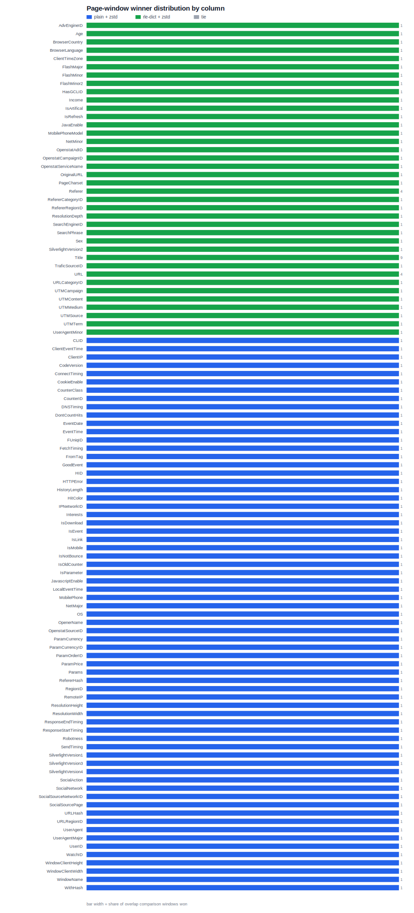

# Page-Level Encoding Distribution

- Started: `2026-07-05T18:26:56-04:00`
- Elapsed: `1.819s`
- Rows: `10000`
- Compared configs: `plain+zstd` vs `rle-dict+zstd`
- ZSTD level: `3`
- Max page size: `256KiB`
- Max dictionary page size: `256KiB`
- Max row group rows: `0`
- Max row group size: `10MiB`
- Max file size: `10MiB`
- TSV: [2026-07-05_rows-10000_plain-zstd_vs_rle-dict-zstd_page-distribution.tsv](../../tsvs/page_encoding_distribution/2026-07-05_rows-10000_plain-zstd_vs_rle-dict-zstd_page-distribution.tsv)
- Plain stats JSON: [plain-zstd_writer-stats.json](stats/plain-zstd_writer-stats.json)
- RLE dict stats JSON: [rle-dict-zstd_writer-stats.json](stats/rle-dict-zstd_writer-stats.json)
- Plain writer elapsed: `647ms`
- RLE dict writer elapsed: `367ms`

## Method

The primary distribution uses overlap windows from the union of page row ranges for each column. For each overlapping row span, the page compressed byte cost is allocated in proportion to row overlap. The RLE dictionary cost uses `compressed_page_bytes_with_amortized_dictionary`, meaning the compressed dictionary page bytes for a column chunk are divided evenly across that chunk's data pages before comparison.

`exact_matched_pages` counts only pages where both runs produced the same absolute row range. Exact matches are useful as a sanity check, but the overlap-window distribution is the full comparison when page boundaries differ.

## Distribution Chart

## Column Distribution

| Column | Type | Windows | Plain wins | RLE dict wins | Ties | Rows compared | Row-weighted plain | Row-weighted RLE dict | Allocated plain bytes | Allocated RLE dict bytes | RLE dict vs plain | Exact matches | Unmatched plain | Unmatched RLE dict |
| --- | --- | ---: | ---: | ---: | ---: | ---: | ---: | ---: | ---: | ---: | ---: | ---: | ---: | ---: |
| `AdvEngineID` | `INT(16,true)` | `1` | `0` (0.00%) | `1` (100.00%) | `0` (0.00%) | `10000` | `0.00%` | `100.00%` | `650 B` | `461 B` | `-29.08%` | `1` | `0` | `0` |
| `Age` | `INT(16,true)` | `1` | `0` (0.00%) | `1` (100.00%) | `0` (0.00%) | `10000` | `0.00%` | `100.00%` | `1.46 KiB` | `1.34 KiB` | `-8.17%` | `1` | `0` | `0` |
| `BrowserCountry` | `STRING` | `1` | `0` (0.00%) | `1` (100.00%) | `0` (0.00%) | `10000` | `0.00%` | `100.00%` | `1.10 KiB` | `653 B` | `-42.26%` | `1` | `0` | `0` |
| `BrowserLanguage` | `STRING` | `1` | `0` (0.00%) | `1` (100.00%) | `0` (0.00%) | `10000` | `0.00%` | `100.00%` | `402 B` | `353 B` | `-12.19%` | `1` | `0` | `0` |
| `ClientTimeZone` | `INT(16,true)` | `1` | `0` (0.00%) | `1` (100.00%) | `0` (0.00%) | `10000` | `0.00%` | `100.00%` | `809 B` | `741 B` | `-8.41%` | `1` | `0` | `0` |
| `FlashMajor` | `INT(16,true)` | `1` | `0` (0.00%) | `1` (100.00%) | `0` (0.00%) | `10000` | `0.00%` | `100.00%` | `791 B` | `720 B` | `-8.98%` | `1` | `0` | `0` |
| `FlashMinor` | `INT(16,true)` | `1` | `0` (0.00%) | `1` (100.00%) | `0` (0.00%) | `10000` | `0.00%` | `100.00%` | `1.21 KiB` | `1.20 KiB` | `-0.81%` | `1` | `0` | `0` |
| `FlashMinor2` | `STRING` | `1` | `0` (0.00%) | `1` (100.00%) | `0` (0.00%) | `10000` | `0.00%` | `100.00%` | `2.62 KiB` | `1.65 KiB` | `-37.01%` | `1` | `0` | `0` |
| `HasGCLID` | `INT(16,true)` | `1` | `0` (0.00%) | `1` (100.00%) | `0` (0.00%) | `10000` | `0.00%` | `100.00%` | `455 B` | `418 B` | `-8.13%` | `1` | `0` | `0` |
| `Income` | `INT(16,true)` | `1` | `0` (0.00%) | `1` (100.00%) | `0` (0.00%) | `10000` | `0.00%` | `100.00%` | `1.24 KiB` | `981 B` | `-22.94%` | `1` | `0` | `0` |
| `IsArtifical` | `INT(16,true)` | `1` | `0` (0.00%) | `1` (100.00%) | `0` (0.00%) | `10000` | `0.00%` | `100.00%` | `2.72 KiB` | `1.34 KiB` | `-50.86%` | `1` | `0` | `0` |
| `IsRefresh` | `INT(16,true)` | `1` | `0` (0.00%) | `1` (100.00%) | `0` (0.00%) | `10000` | `0.00%` | `100.00%` | `3.08 KiB` | `1.34 KiB` | `-56.50%` | `1` | `0` | `0` |
| `JavaEnable` | `INT(16,true)` | `1` | `0` (0.00%) | `1` (100.00%) | `0` (0.00%) | `10000` | `0.00%` | `100.00%` | `705 B` | `585 B` | `-17.02%` | `1` | `0` | `0` |
| `MobilePhoneModel` | `STRING` | `1` | `0` (0.00%) | `1` (100.00%) | `0` (0.00%) | `10000` | `0.00%` | `100.00%` | `242 B` | `234 B` | `-3.31%` | `1` | `0` | `0` |
| `NetMinor` | `INT(16,true)` | `1` | `0` (0.00%) | `1` (100.00%) | `0` (0.00%) | `10000` | `0.00%` | `100.00%` | `354 B` | `334 B` | `-5.65%` | `1` | `0` | `0` |
| `OpenstatAdID` | `STRING` | `1` | `0` (0.00%) | `1` (100.00%) | `0` (0.00%) | `10000` | `0.00%` | `100.00%` | `297 B` | `288 B` | `-3.03%` | `1` | `0` | `0` |
| `OpenstatCampaignID` | `STRING` | `1` | `0` (0.00%) | `1` (100.00%) | `0` (0.00%) | `10000` | `0.00%` | `100.00%` | `239 B` | `231 B` | `-3.35%` | `1` | `0` | `0` |
| `OpenstatServiceName` | `STRING` | `1` | `0` (0.00%) | `1` (100.00%) | `0` (0.00%) | `10000` | `0.00%` | `100.00%` | `239 B` | `220 B` | `-7.95%` | `1` | `0` | `0` |
| `OriginalURL` | `STRING` | `1` | `0` (0.00%) | `1` (100.00%) | `0` (0.00%) | `10000` | `0.00%` | `100.00%` | `9.36 KiB` | `8.75 KiB` | `-6.47%` | `1` | `0` | `0` |
| `PageCharset` | `STRING` | `1` | `0` (0.00%) | `1` (100.00%) | `0` (0.00%) | `10000` | `0.00%` | `100.00%` | `386 B` | `298 B` | `-22.80%` | `1` | `0` | `0` |
| `Referer` | `STRING` | `4` | `0` (0.00%) | `4` (100.00%) | `0` (0.00%) | `10000` | `0.00%` | `100.00%` | `99.46 KiB` | `80.88 KiB` | `-18.68%` | `0` | `4` | `1` |
| `RefererCategoryID` | `INT(16,true)` | `1` | `0` (0.00%) | `1` (100.00%) | `0` (0.00%) | `10000` | `0.00%` | `100.00%` | `2.55 KiB` | `2.15 KiB` | `-15.59%` | `1` | `0` | `0` |
| `RefererRegionID` | `INT(32,true)` | `1` | `0` (0.00%) | `1` (100.00%) | `0` (0.00%) | `10000` | `0.00%` | `100.00%` | `2.59 KiB` | `1.72 KiB` | `-33.58%` | `1` | `0` | `0` |
| `ResolutionDepth` | `INT(16,true)` | `1` | `0` (0.00%) | `1` (100.00%) | `0` (0.00%) | `10000` | `0.00%` | `100.00%` | `907 B` | `734 B` | `-19.07%` | `1` | `0` | `0` |
| `SearchEngineID` | `INT(16,true)` | `1` | `0` (0.00%) | `1` (100.00%) | `0` (0.00%) | `10000` | `0.00%` | `100.00%` | `1.62 KiB` | `1.19 KiB` | `-26.60%` | `1` | `0` | `0` |
| `SearchPhrase` | `STRING` | `1` | `0` (0.00%) | `1` (100.00%) | `0` (0.00%) | `10000` | `0.00%` | `100.00%` | `12.54 KiB` | `11.10 KiB` | `-11.51%` | `1` | `0` | `0` |
| `Sex` | `INT(16,true)` | `1` | `0` (0.00%) | `1` (100.00%) | `0` (0.00%) | `10000` | `0.00%` | `100.00%` | `1.03 KiB` | `935 B` | `-11.12%` | `1` | `0` | `0` |
| `SilverlightVersion2` | `INT(16,true)` | `1` | `0` (0.00%) | `1` (100.00%) | `0` (0.00%) | `10000` | `0.00%` | `100.00%` | `671 B` | `558 B` | `-16.84%` | `1` | `0` | `0` |
| `Title` | `STRING` | `9` | `0` (0.00%) | `9` (100.00%) | `0` (0.00%) | `10000` | `0.00%` | `100.00%` | `227.14 KiB` | `145.32 KiB` | `-36.02%` | `0` | `9` | `1` |
| `TraficSourceID` | `INT(16,true)` | `1` | `0` (0.00%) | `1` (100.00%) | `0` (0.00%) | `10000` | `0.00%` | `100.00%` | `2.53 KiB` | `1.92 KiB` | `-24.17%` | `1` | `0` | `0` |
| `URL` | `STRING` | `4` | `0` (0.00%) | `4` (100.00%) | `0` (0.00%) | `10000` | `0.00%` | `100.00%` | `88.37 KiB` | `71.71 KiB` | `-18.85%` | `0` | `4` | `1` |
| `URLCategoryID` | `INT(16,true)` | `1` | `0` (0.00%) | `1` (100.00%) | `0` (0.00%) | `10000` | `0.00%` | `100.00%` | `430 B` | `418 B` | `-2.79%` | `1` | `0` | `0` |
| `UTMCampaign` | `STRING` | `1` | `0` (0.00%) | `1` (100.00%) | `0` (0.00%) | `10000` | `0.00%` | `100.00%` | `630 B` | `491 B` | `-22.06%` | `1` | `0` | `0` |
| `UTMContent` | `STRING` | `1` | `0` (0.00%) | `1` (100.00%) | `0` (0.00%) | `10000` | `0.00%` | `100.00%` | `264 B` | `221 B` | `-16.29%` | `1` | `0` | `0` |
| `UTMMedium` | `STRING` | `1` | `0` (0.00%) | `1` (100.00%) | `0` (0.00%) | `10000` | `0.00%` | `100.00%` | `414 B` | `307 B` | `-25.85%` | `1` | `0` | `0` |
| `UTMSource` | `STRING` | `1` | `0` (0.00%) | `1` (100.00%) | `0` (0.00%) | `10000` | `0.00%` | `100.00%` | `500 B` | `379 B` | `-24.20%` | `1` | `0` | `0` |
| `UTMTerm` | `STRING` | `1` | `0` (0.00%) | `1` (100.00%) | `0` (0.00%) | `10000` | `0.00%` | `100.00%` | `327 B` | `306 B` | `-6.42%` | `1` | `0` | `0` |
| `UserAgentMinor` | `STRING` | `1` | `0` (0.00%) | `1` (100.00%) | `0` (0.00%) | `10000` | `0.00%` | `100.00%` | `1.76 KiB` | `1.25 KiB` | `-29.08%` | `1` | `0` | `0` |
| `CLID` | `INT(32,true)` | `1` | `1` (100.00%) | `0` (0.00%) | `0` (0.00%) | `10000` | `100.00%` | `0.00%` | `72 B` | `105 B` | `45.83%` | `1` | `0` | `0` |
| `ClientEventTime` | `TIMESTAMP(isAdjustedToUTC=true,unit=MILLIS)` | `1` | `1` (100.00%) | `0` (0.00%) | `0` (0.00%) | `10000` | `100.00%` | `0.00%` | `16.67 KiB` | `31.55 KiB` | `89.28%` | `1` | `0` | `0` |
| `ClientIP` | `INT(32,true)` | `1` | `1` (100.00%) | `0` (0.00%) | `0` (0.00%) | `10000` | `100.00%` | `0.00%` | `3.56 KiB` | `7.06 KiB` | `98.65%` | `1` | `0` | `0` |
| `CodeVersion` | `INT(32,true)` | `1` | `1` (100.00%) | `0` (0.00%) | `0` (0.00%) | `10000` | `100.00%` | `0.00%` | `232 B` | `249 B` | `7.33%` | `1` | `0` | `0` |
| `ConnectTiming` | `INT(32,true)` | `1` | `1` (100.00%) | `0` (0.00%) | `0` (0.00%) | `10000` | `100.00%` | `0.00%` | `1.71 KiB` | `1.95 KiB` | `14.47%` | `1` | `0` | `0` |
| `CookieEnable` | `INT(16,true)` | `1` | `1` (100.00%) | `0` (0.00%) | `0` (0.00%) | `10000` | `100.00%` | `0.00%` | `235 B` | `250 B` | `6.38%` | `1` | `0` | `0` |
| `CounterClass` | `INT(16,true)` | `1` | `1` (100.00%) | `0` (0.00%) | `0` (0.00%) | `10000` | `100.00%` | `0.00%` | `72 B` | `105 B` | `45.83%` | `1` | `0` | `0` |
| `CounterID` | `INT(32,true)` | `1` | `1` (100.00%) | `0` (0.00%) | `0` (0.00%) | `10000` | `100.00%` | `0.00%` | `89 B` | `119 B` | `33.71%` | `1` | `0` | `0` |
| `DNSTiming` | `INT(32,true)` | `1` | `1` (100.00%) | `0` (0.00%) | `0` (0.00%) | `10000` | `100.00%` | `0.00%` | `839 B` | `1.09 KiB` | `32.66%` | `1` | `0` | `0` |
| `DontCountHits` | `INT(16,true)` | `1` | `1` (100.00%) | `0` (0.00%) | `0` (0.00%) | `10000` | `100.00%` | `0.00%` | `176 B` | `212 B` | `20.45%` | `1` | `0` | `0` |
| `EventDate` | `DATE` | `1` | `1` (100.00%) | `0` (0.00%) | `0` (0.00%) | `10000` | `100.00%` | `0.00%` | `85 B` | `105 B` | `23.53%` | `1` | `0` | `0` |
| `EventTime` | `TIMESTAMP(isAdjustedToUTC=true,unit=MILLIS)` | `1` | `1` (100.00%) | `0` (0.00%) | `0` (0.00%) | `10000` | `100.00%` | `0.00%` | `17.81 KiB` | `32.68 KiB` | `83.49%` | `1` | `0` | `0` |
| `FUniqID` | `INT(64,true)` | `1` | `1` (100.00%) | `0` (0.00%) | `0` (0.00%) | `10000` | `100.00%` | `0.00%` | `5.94 KiB` | `9.14 KiB` | `53.96%` | `1` | `0` | `0` |
| `FetchTiming` | `INT(32,true)` | `1` | `1` (100.00%) | `0` (0.00%) | `0` (0.00%) | `10000` | `100.00%` | `0.00%` | `4.62 KiB` | `5.95 KiB` | `28.83%` | `1` | `0` | `0` |
| `FromTag` | `STRING` | `1` | `1` (100.00%) | `0` (0.00%) | `0` (0.00%) | `10000` | `100.00%` | `0.00%` | `48 B` | `89 B` | `85.42%` | `1` | `0` | `0` |
| `GoodEvent` | `INT(16,true)` | `1` | `1` (100.00%) | `0` (0.00%) | `0` (0.00%) | `10000` | `100.00%` | `0.00%` | `85 B` | `105 B` | `23.53%` | `1` | `0` | `0` |
| `HID` | `INT(32,true)` | `1` | `1` (100.00%) | `0` (0.00%) | `0` (0.00%) | `10000` | `100.00%` | `0.00%` | `23.54 KiB` | `35.14 KiB` | `49.28%` | `1` | `0` | `0` |
| `HTTPError` | `INT(16,true)` | `1` | `1` (100.00%) | `0` (0.00%) | `0` (0.00%) | `10000` | `100.00%` | `0.00%` | `72 B` | `105 B` | `45.83%` | `1` | `0` | `0` |
| `HistoryLength` | `INT(16,true)` | `1` | `1` (100.00%) | `0` (0.00%) | `0` (0.00%) | `10000` | `100.00%` | `0.00%` | `95 B` | `117 B` | `23.16%` | `1` | `0` | `0` |
| `HitColor` | `STRING` | `1` | `1` (100.00%) | `0` (0.00%) | `0` (0.00%) | `10000` | `100.00%` | `0.00%` | `126 B` | `139 B` | `10.32%` | `1` | `0` | `0` |
| `IPNetworkID` | `INT(32,true)` | `1` | `1` (100.00%) | `0` (0.00%) | `0` (0.00%) | `10000` | `100.00%` | `0.00%` | `2.88 KiB` | `5.92 KiB` | `105.15%` | `1` | `0` | `0` |
| `Interests` | `INT(16,true)` | `1` | `1` (100.00%) | `0` (0.00%) | `0` (0.00%) | `10000` | `100.00%` | `0.00%` | `1.82 KiB` | `2.82 KiB` | `55.02%` | `1` | `0` | `0` |
| `IsDownload` | `INT(16,true)` | `1` | `1` (100.00%) | `0` (0.00%) | `0` (0.00%) | `10000` | `100.00%` | `0.00%` | `72 B` | `105 B` | `45.83%` | `1` | `0` | `0` |
| `IsEvent` | `INT(16,true)` | `1` | `1` (100.00%) | `0` (0.00%) | `0` (0.00%) | `10000` | `100.00%` | `0.00%` | `72 B` | `105 B` | `45.83%` | `1` | `0` | `0` |
| `IsLink` | `INT(16,true)` | `1` | `1` (100.00%) | `0` (0.00%) | `0` (0.00%) | `10000` | `100.00%` | `0.00%` | `72 B` | `105 B` | `45.83%` | `1` | `0` | `0` |
| `IsMobile` | `INT(16,true)` | `1` | `1` (100.00%) | `0` (0.00%) | `0` (0.00%) | `10000` | `100.00%` | `0.00%` | `296 B` | `323 B` | `9.12%` | `1` | `0` | `0` |
| `IsNotBounce` | `INT(16,true)` | `1` | `1` (100.00%) | `0` (0.00%) | `0` (0.00%) | `10000` | `100.00%` | `0.00%` | `72 B` | `105 B` | `45.83%` | `1` | `0` | `0` |
| `IsOldCounter` | `INT(16,true)` | `1` | `1` (100.00%) | `0` (0.00%) | `0` (0.00%) | `10000` | `100.00%` | `0.00%` | `72 B` | `105 B` | `45.83%` | `1` | `0` | `0` |
| `IsParameter` | `INT(16,true)` | `1` | `1` (100.00%) | `0` (0.00%) | `0` (0.00%) | `10000` | `100.00%` | `0.00%` | `72 B` | `105 B` | `45.83%` | `1` | `0` | `0` |
| `JavascriptEnable` | `INT(16,true)` | `1` | `1` (100.00%) | `0` (0.00%) | `0` (0.00%) | `10000` | `100.00%` | `0.00%` | `202 B` | `249 B` | `23.27%` | `1` | `0` | `0` |
| `LocalEventTime` | `TIMESTAMP(isAdjustedToUTC=true,unit=MILLIS)` | `1` | `1` (100.00%) | `0` (0.00%) | `0` (0.00%) | `10000` | `100.00%` | `0.00%` | `17.93 KiB` | `32.68 KiB` | `82.33%` | `1` | `0` | `0` |
| `MobilePhone` | `INT(16,true)` | `1` | `1` (100.00%) | `0` (0.00%) | `0` (0.00%) | `10000` | `100.00%` | `0.00%` | `278 B` | `290 B` | `4.32%` | `1` | `0` | `0` |
| `NetMajor` | `INT(16,true)` | `1` | `1` (100.00%) | `0` (0.00%) | `0` (0.00%) | `10000` | `100.00%` | `0.00%` | `340 B` | `361 B` | `6.18%` | `1` | `0` | `0` |
| `OS` | `INT(16,true)` | `1` | `1` (100.00%) | `0` (0.00%) | `0` (0.00%) | `10000` | `100.00%` | `0.00%` | `955 B` | `1.32 KiB` | `41.78%` | `1` | `0` | `0` |
| `OpenerName` | `INT(32,true)` | `1` | `1` (100.00%) | `0` (0.00%) | `0` (0.00%) | `10000` | `100.00%` | `0.00%` | `73 B` | `105 B` | `43.84%` | `1` | `0` | `0` |
| `OpenstatSourceID` | `STRING` | `1` | `1` (100.00%) | `0` (0.00%) | `0` (0.00%) | `10000` | `100.00%` | `0.00%` | `267 B` | `268 B` | `0.37%` | `1` | `0` | `0` |
| `ParamCurrency` | `STRING` | `1` | `1` (100.00%) | `0` (0.00%) | `0` (0.00%) | `10000` | `100.00%` | `0.00%` | `86 B` | `104 B` | `20.93%` | `1` | `0` | `0` |
| `ParamCurrencyID` | `INT(16,true)` | `1` | `1` (100.00%) | `0` (0.00%) | `0` (0.00%) | `10000` | `100.00%` | `0.00%` | `72 B` | `105 B` | `45.83%` | `1` | `0` | `0` |
| `ParamOrderID` | `STRING` | `1` | `1` (100.00%) | `0` (0.00%) | `0` (0.00%) | `10000` | `100.00%` | `0.00%` | `48 B` | `89 B` | `85.42%` | `1` | `0` | `0` |
| `ParamPrice` | `INT(64,true)` | `1` | `1` (100.00%) | `0` (0.00%) | `0` (0.00%) | `10000` | `100.00%` | `0.00%` | `91 B` | `125 B` | `37.36%` | `1` | `0` | `0` |
| `Params` | `STRING` | `1` | `1` (100.00%) | `0` (0.00%) | `0` (0.00%) | `10000` | `100.00%` | `0.00%` | `48 B` | `89 B` | `85.42%` | `1` | `0` | `0` |
| `RefererHash` | `INT(64,true)` | `1` | `1` (100.00%) | `0` (0.00%) | `0` (0.00%) | `10000` | `100.00%` | `0.00%` | `23.03 KiB` | `29.12 KiB` | `26.43%` | `1` | `0` | `0` |
| `RegionID` | `INT(32,true)` | `1` | `1` (100.00%) | `0` (0.00%) | `0` (0.00%) | `10000` | `100.00%` | `0.00%` | `1.61 KiB` | `2.55 KiB` | `58.35%` | `1` | `0` | `0` |
| `RemoteIP` | `INT(32,true)` | `1` | `1` (100.00%) | `0` (0.00%) | `0` (0.00%) | `10000` | `100.00%` | `0.00%` | `3.60 KiB` | `7.12 KiB` | `97.86%` | `1` | `0` | `0` |
| `ResolutionHeight` | `INT(16,true)` | `1` | `1` (100.00%) | `0` (0.00%) | `0` (0.00%) | `10000` | `100.00%` | `0.00%` | `1.73 KiB` | `2.04 KiB` | `17.71%` | `1` | `0` | `0` |
| `ResolutionWidth` | `INT(16,true)` | `1` | `1` (100.00%) | `0` (0.00%) | `0` (0.00%) | `10000` | `100.00%` | `0.00%` | `1.78 KiB` | `2.10 KiB` | `18.31%` | `1` | `0` | `0` |
| `ResponseEndTiming` | `INT(32,true)` | `1` | `1` (100.00%) | `0` (0.00%) | `0` (0.00%) | `10000` | `100.00%` | `0.00%` | `6.79 KiB` | `7.73 KiB` | `13.81%` | `1` | `0` | `0` |
| `ResponseStartTiming` | `INT(32,true)` | `1` | `1` (100.00%) | `0` (0.00%) | `0` (0.00%) | `10000` | `100.00%` | `0.00%` | `7.97 KiB` | `9.49 KiB` | `19.14%` | `1` | `0` | `0` |
| `Robotness` | `INT(16,true)` | `1` | `1` (100.00%) | `0` (0.00%) | `0` (0.00%) | `10000` | `100.00%` | `0.00%` | `1.53 KiB` | `2.70 KiB` | `76.26%` | `1` | `0` | `0` |
| `SendTiming` | `INT(32,true)` | `1` | `1` (100.00%) | `0` (0.00%) | `0` (0.00%) | `10000` | `100.00%` | `0.00%` | `72 B` | `105 B` | `45.83%` | `1` | `0` | `0` |
| `SilverlightVersion1` | `INT(16,true)` | `1` | `1` (100.00%) | `0` (0.00%) | `0` (0.00%) | `10000` | `100.00%` | `0.00%` | `611 B` | `840 B` | `37.48%` | `1` | `0` | `0` |
| `SilverlightVersion3` | `INT(32,true)` | `1` | `1` (100.00%) | `0` (0.00%) | `0` (0.00%) | `10000` | `100.00%` | `0.00%` | `1.09 KiB` | `1.21 KiB` | `10.44%` | `1` | `0` | `0` |
| `SilverlightVersion4` | `INT(16,true)` | `1` | `1` (100.00%) | `0` (0.00%) | `0` (0.00%) | `10000` | `100.00%` | `0.00%` | `72 B` | `105 B` | `45.83%` | `1` | `0` | `0` |
| `SocialAction` | `STRING` | `1` | `1` (100.00%) | `0` (0.00%) | `0` (0.00%) | `10000` | `100.00%` | `0.00%` | `48 B` | `89 B` | `85.42%` | `1` | `0` | `0` |
| `SocialNetwork` | `STRING` | `1` | `1` (100.00%) | `0` (0.00%) | `0` (0.00%) | `10000` | `100.00%` | `0.00%` | `48 B` | `89 B` | `85.42%` | `1` | `0` | `0` |
| `SocialSourceNetworkID` | `INT(16,true)` | `1` | `1` (100.00%) | `0` (0.00%) | `0` (0.00%) | `10000` | `100.00%` | `0.00%` | `100 B` | `120 B` | `20.00%` | `1` | `0` | `0` |
| `SocialSourcePage` | `STRING` | `1` | `1` (100.00%) | `0` (0.00%) | `0` (0.00%) | `10000` | `100.00%` | `0.00%` | `98 B` | `120 B` | `22.45%` | `1` | `0` | `0` |
| `URLHash` | `INT(64,true)` | `1` | `1` (100.00%) | `0` (0.00%) | `0` (0.00%) | `10000` | `100.00%` | `0.00%` | `26.55 KiB` | `34.45 KiB` | `29.77%` | `1` | `0` | `0` |
| `URLRegionID` | `INT(32,true)` | `1` | `1` (100.00%) | `0` (0.00%) | `0` (0.00%) | `10000` | `100.00%` | `0.00%` | `445 B` | `448 B` | `0.67%` | `1` | `0` | `0` |
| `UserAgent` | `INT(16,true)` | `1` | `1` (100.00%) | `0` (0.00%) | `0` (0.00%) | `10000` | `100.00%` | `0.00%` | `1.39 KiB` | `1.44 KiB` | `3.45%` | `1` | `0` | `0` |
| `UserAgentMajor` | `INT(16,true)` | `1` | `1` (100.00%) | `0` (0.00%) | `0` (0.00%) | `10000` | `100.00%` | `0.00%` | `1.49 KiB` | `2.05 KiB` | `37.29%` | `1` | `0` | `0` |
| `UserID` | `INT(64,true)` | `1` | `1` (100.00%) | `0` (0.00%) | `0` (0.00%) | `10000` | `100.00%` | `0.00%` | `5.72 KiB` | `9.78 KiB` | `71.01%` | `1` | `0` | `0` |
| `WatchID` | `INT(64,true)` | `1` | `1` (100.00%) | `0` (0.00%) | `0` (0.00%) | `10000` | `100.00%` | `0.00%` | `78.21 KiB` | `95.34 KiB` | `21.90%` | `1` | `0` | `0` |
| `WindowClientHeight` | `INT(16,true)` | `1` | `1` (100.00%) | `0` (0.00%) | `0` (0.00%) | `10000` | `100.00%` | `0.00%` | `2.37 KiB` | `5.84 KiB` | `146.72%` | `1` | `0` | `0` |
| `WindowClientWidth` | `INT(16,true)` | `1` | `1` (100.00%) | `0` (0.00%) | `0` (0.00%) | `10000` | `100.00%` | `0.00%` | `2.92 KiB` | `4.03 KiB` | `38.25%` | `1` | `0` | `0` |
| `WindowName` | `INT(32,true)` | `1` | `1` (100.00%) | `0` (0.00%) | `0` (0.00%) | `10000` | `100.00%` | `0.00%` | `103 B` | `124 B` | `20.39%` | `1` | `0` | `0` |
| `WithHash` | `INT(16,true)` | `1` | `1` (100.00%) | `0` (0.00%) | `0` (0.00%) | `10000` | `100.00%` | `0.00%` | `72 B` | `105 B` | `45.83%` | `1` | `0` | `0` |
